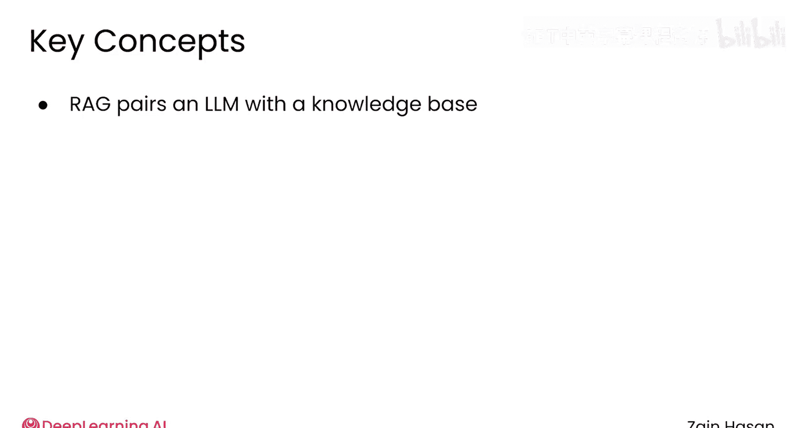
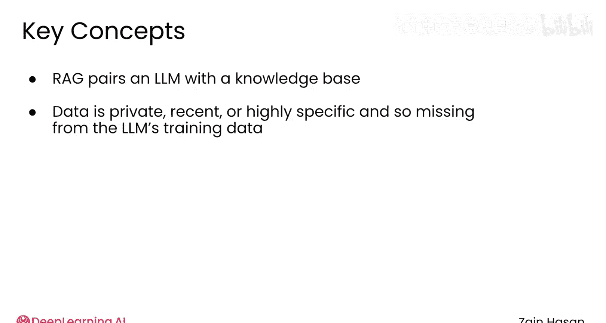
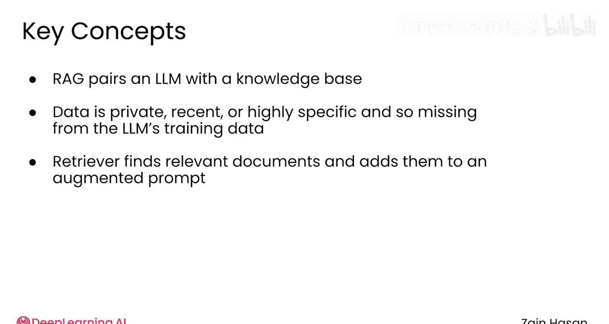
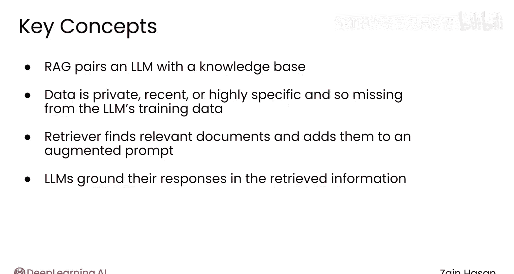

# 008：总结 🎯

在本节课中，我们将对检索增强生成（RAG）的核心概念进行总结，并概述后续课程的学习路径。

通过前面的介绍，检索增强生成技术应该已经显得更加易于理解了。它的目标是通过让大语言模型（LLM）能够访问其在训练时可能没有接触过的信息，从而使它们变得更加有用和准确。

为了实现这一目标，大语言模型需要与一个称为**知识库**的数据集合配对使用。这些数据可能是私有的、近期的，或者仅仅是高度专业化的，因此没有被包含在通用大语言模型的训练数据中。

## RAG 系统的工作流程

上一节我们介绍了RAG的目标和知识库的概念，本节中我们来看看其核心的工作流程。

当用户提交提示词时，系统首先会将它们路由到**检索器**。

检索器会在知识库中搜索相关的文档，并将这些文档中的文本内容添加到用户的原始提示词中。

随后，大语言模型能够将这些从提示词中获取的额外信息整合到它生成的回复中。检索到的信息为最终的回答提供了依据，使其更加准确和相关。

## 后续学习路径

当然，以上只是一个非常高层次的描述。因此，在本课程的剩余部分，我们将深入探讨RAG系统的每一个组成部分。

以下是您将学习到的核心内容：

*   **组件原理**：您将了解每个组件（如检索器、知识库、生成器）的实际工作原理。
*   **优化技术**：您将学习多种用于优化系统性能的技术。
*   **实践考量**：您将了解在根据您的具体项目和数据进行系统调优时需要考虑的重要因素。

本节课中我们一起学习了RAG的基本概念、目标及其核心工作流程。这是一个强大的框架，旨在扩展大语言模型的能力。接下来，请加入下一个模块，让我们正式开始深入探索RAG的旅程。🚀