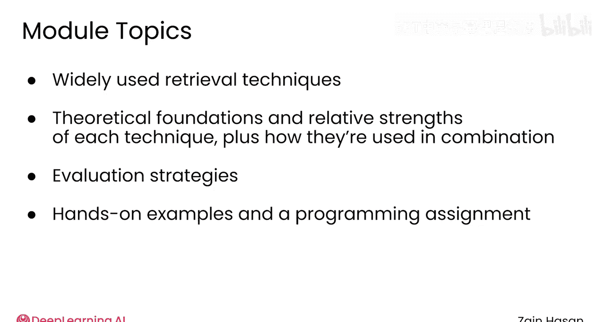

# 009：检索器简介 🎯

在本模块中，我们将要学习检索增强生成（RAG）系统中检索器的核心工作原理。检索器是RAG系统的关键组件，负责从知识库中快速、准确地找到与用户查询最相关的文档，以供大语言模型（LLM）参考并生成回答。

## 检索器的任务与挑战

检索器的工作目标很容易描述。它需要做的就是在知识库中找到能够帮助大语言模型（LLM）响应用户提示（prompt）的文档。

然而，仔细想想，这是一项相当困难的工作。

用户并非向你的RAG系统提交结构良好的SQL查询。他们是以与人交谈的方式在与你的LLM聊天。与此同时，你的知识库中的文档可能五花八门，从个人电子邮件到公司内部备忘录，再到医学期刊文章。

这些文档可能信息丰富，但其结构通常是为了方便人类阅读，而非便于计算机搜索。检索器必须以某种方式处理所有这些结构混乱的信息，并在几分之一秒内快速返回最相关的片段。

## 本模块学习内容

上一节我们了解了检索器任务的复杂性，本节中我们来看看我们将要学习哪些技术来应对这些挑战。

在本模块中，你将学习检索器用于完成这一壮举的主要技术。你将建立对每种技术工作原理的理论理解，探索它们的相对优势和劣势，并了解检索器如何组合使用它们以提供最佳结果。

以下是本模块将涵盖的核心内容：
*   **检索技术**：学习向量搜索、关键词匹配等核心检索方法。
*   **组合策略**：了解如何结合不同技术以提升检索效果。
*   **性能评估**：学习评估检索器性能的策略和指标。

你还将被介绍一些评估检索器性能的策略。并且和往常一样，你将找到一些动手编码练习和一个编程作业，在那里你可以直接应用所学知识。

我相信你会享受这次关于信息检索的深入探讨，所以请在下一个视频中加入我，让我们开始吧。

## 总结

本节课中我们一起学习了RAG系统中检索器的基本职责及其面临的主要挑战——即处理非结构化的用户查询和多样化的知识库文档，并实现快速精准的检索。我们也预览了本模块将深入探讨的检索技术、组合策略以及性能评估方法，为后续的动手实践打下基础。