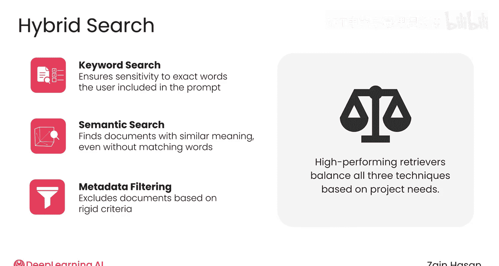

# 010：检索器架构综述 🧠

在本节课中，我们将要学习检索增强生成系统中检索器的整体架构。我们将了解当系统收到用户提示时，检索器如何协同使用多种搜索技术，从知识库中快速找到最相关的文档。

---

当RAG系统收到您的提示时，它首先会被发送给检索器。检索器可以访问知识库，您可以将知识库想象为存储在数据库中的一堆文本文件。

检索器的任务是快速决定哪些文档与提示最相关，并返回它们，以便传递给大语言模型。

大多数现代检索器在此过程中会使用两种不同的搜索技术。

以下是两种核心搜索技术：

1.  **关键词搜索**：这是一种更传统的搜索方式。这意味着检索器会查找包含提示中确切词汇的文档。这种方法久经考验，为信息检索系统提供了数十年的支持。
2.  **语义搜索**：这意味着检索器会查找与提示含义相似的文档。这种方法使检索器更加灵活，因为它允许系统找到与提示相关，但可能不包含用户提示中确切词汇的文档。

---

每种搜索技术都会返回一组文档，可能各自返回20到50个。通常，会有许多文档同时出现在两个列表中，但由于搜索方式不同，同一文档在两个列表中的排名可能不同。

此时，每个列表都会根据其元数据进行过滤。例如，您的知识库中的某些文档可能与工程团队成员相关，而另一些则与人力资源部门的人员更相关。系统会知道用户属于哪个团队，并在此刻应用元数据过滤器，以确保只有与该部门相关的文档才能进入下一阶段。

现在，检索器得到了两个经过过滤的列表：一个由关键词搜索生成，另一个由语义搜索生成。

这两个列表现在被合并，以创建最相关文档的最终排名。检索器从这个最终列表中返回排名最高的文档。至此，检索过程完成。这些文档将被发送出去，添加到增强提示中。

这种搜索风格被称为**混合搜索**，因为它依赖多种技术来生成最终的文档排名。

每种技术都提供了有助于提升检索器整体性能的优势：

*   **关键词搜索**确保系统对用户提示中包含的确切词汇敏感。
*   **语义搜索**赋予系统更大的灵活性，以找到含义与提示相似的文档，即使它们没有使用相同的词汇。
*   **元数据过滤**允许系统根据严格的标准排除文档，这是其他两种方法都无法做到的。

设计一个高性能的检索器意味着理解每种技术的相对优势，然后调整它们之间的平衡，以符合您项目的需求。

---

上一节我们介绍了检索器的整体架构和混合搜索的概念，本节中我们来看看构成混合搜索的三种技术之一：元数据过滤。

---

本节课中我们一起学习了检索器的核心架构。我们了解到，一个高效的检索器通常结合了**关键词搜索**、**语义搜索**和**元数据过滤**这三种技术，通过**混合搜索**策略来确保返回的文档既精确又全面。理解这些组件如何协同工作是优化RAG系统性能的第一步。