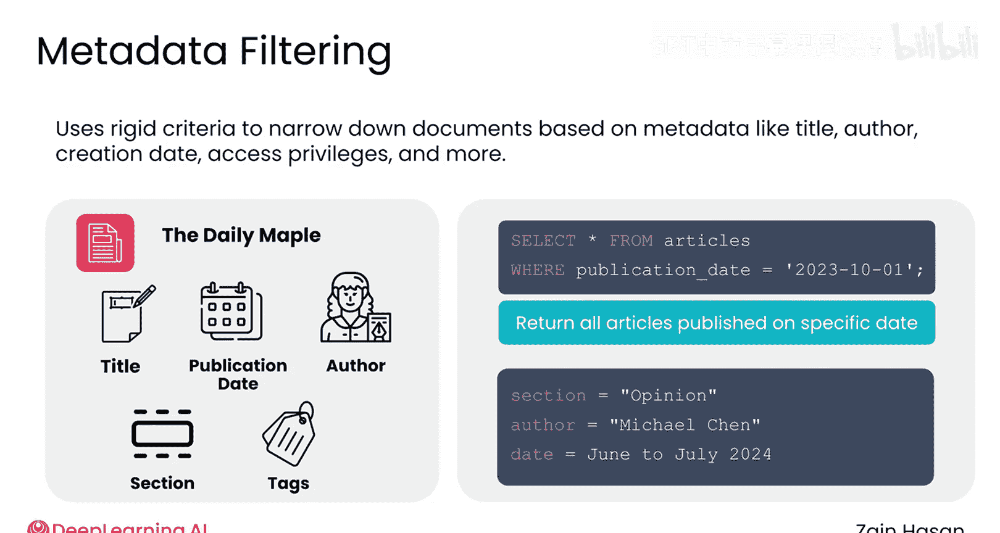
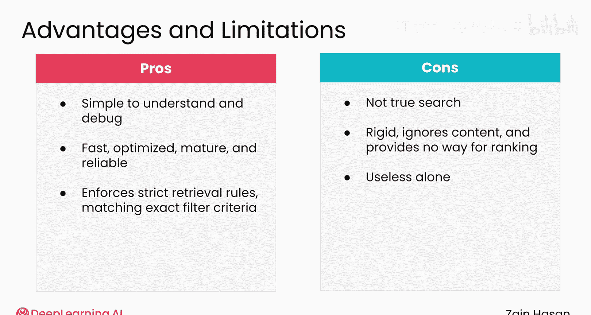

# 011：元数据过滤技术 📁

在本节课中，我们将要学习元数据过滤技术。这是一种在检索器中最直接、也最可能最熟悉的技术。我们将了解它的工作原理、优势以及局限性。

## 概述

元数据过滤使用**刚性标准**来缩小检索器返回的文档范围，其依据是文档的元数据。元数据可能包括文档标题、作者、创建日期、访问权限等信息。

## 元数据过滤的工作原理

元数据过滤的核心是依据预设的、非此即彼的条件来筛选文档。以下是其工作原理的一个简单示例。

假设您在一家报社工作，希望为报社历史上发表过的所有文章构建一个检索器。知识库将包含数千篇不同的文章。每篇文章都附有多个元数据标签，包括其标题、发布日期、作者、文章所属的报纸版面等。

虽然每篇文章的全文都存储在知识库中，但系统只能基于这些元数据进行搜索。查询这类索引很像编写一个SQL查询语句。

**以下是几种过滤方式：**

*   **单一条件过滤**：您可以找到在特定日期发布的每一篇文章，或者由特定作者撰写的每一篇文章。
*   **多条件组合过滤**：您可以编写更复杂的查询，基于多个元数据进行过滤。例如，您可以找到您最喜欢的记者在2024年6月至7月期间为“观点”版面撰写的所有文章。

只有满足所有条件的文章才会被返回，其余文章则会被过滤掉。如果您曾经在电子表格中筛选过表格，那么您已经做过元数据过滤了。您只是使用一套严格的标准来决定要使用大数据集中的哪些成员。

## 在RAG系统中的实际应用

在一个典型的RAG系统中，您不会单独使用元数据过滤来执行检索，而是用它来帮助**缩小**其他检索技术返回的结果范围。

这些过滤器本身通常也不是由用户在提示词中说了什么决定的，而是由**发出请求的用户的其他属性**决定的。

**以下是两个应用示例：**

*   **访问权限控制**：沿用之前的报纸例子，假设您的一些文章免费发布在公开互联网上，而另一些文章只有付费订阅者才能访问。每篇文章可以有一个元数据字段来存储它是免费还是付费文章。当用户搜索数据库时，系统可以检测他们是否以付费订阅者身份登录。如果没有，则会设置一个元数据过滤器，将付费文章排除在搜索结果之外。
*   **区域内容分发**：如果您的报纸在世界许多地区发布文章，每篇文章可以有一个元数据字段来存储文章发布的地区。当读者查询系统时，您可以检测他们所在的地区，并只返回来自他们所在地区的文章。

## 元数据过滤的优势与局限

上一节我们介绍了元数据过滤的基本应用，本节中我们来看看它的优缺点。

**元数据过滤具有以下优势：**

1.  **概念简单**：易于理解系统工作原理和调试问题。
2.  **快速成熟**：这是一种快速、成熟且经过良好优化的方法。
3.  **刚性控制**：最重要的是，它是唯一一种允许您的系统基于**刚性标准**决定是否检索文档的方法。如果您想严格定义哪些类型的文档应该或不应该被包含在检索中，元数据过滤是唯一能提供这种行为的方法。

**然而，元数据过滤也有显著的局限性：**

它并非真正的搜索技术，而更像是一种用于**优化**本模块中您将看到的另外两种技术结果的工具。它过于僵化，忽略了文档的内容，并且一旦文档通过过滤器，就缺乏任何对文档进行排序的方法。

虽然您构建的RAG系统很可能包含某种形式的元数据过滤器，但构建一个完全依赖元数据过滤的检索器基本上是无效的。元数据过滤简单有效，但需要与其他搜索技术**配对使用**才能提供真正的价值。

## 总结

本节课中我们一起学习了元数据过滤技术。我们了解到它是一种基于文档元数据（如标题、作者、日期等）的刚性筛选方法，主要用于控制访问权限或内容分发等场景。它的优点是简单、快速且能实现精确控制，但缺点是无法理解文档内容，且过于僵化。因此，它通常作为辅助工具，与其他能理解语义的检索技术结合使用。

特别地，您需要一种方法来确定文档的内容是否真的与您的提示词相关。所以，请加入下一节视频，看看关键词搜索如何满足其中的一些需求。🔍