# 012：关键词搜索与TF-IDF算法 🔍

在本节课中，我们将要学习关键词搜索技术，这是一种在数据库和搜索引擎中应用了数十年的检索方法。其简洁性和有效性使其成为现代RAG系统中检索流程的关键组成部分。我们将探讨其工作原理以及它为检索器管道带来的优势。

## 概述

关键词搜索是一种根据文档是否与提示词共享共同词汇来进行检索的技术。其基本思想是，包含大量提示词词汇的文档更可能是相关的。

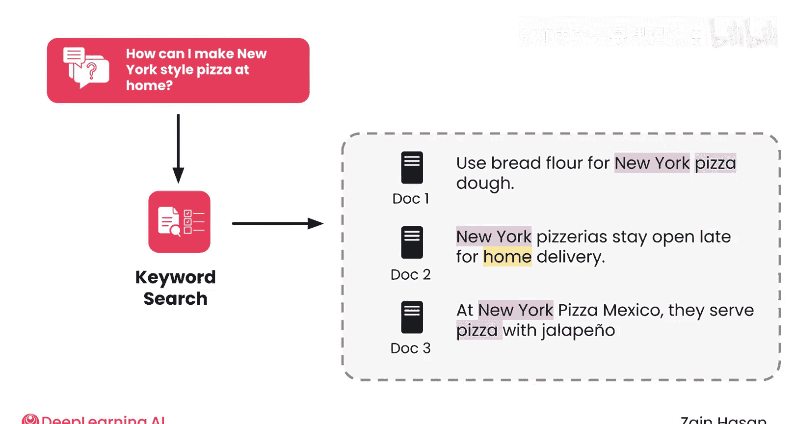

上一节我们介绍了检索增强生成的基本概念，本节中我们来看看最基础的检索方法之一：关键词搜索。

## 关键词搜索的工作原理

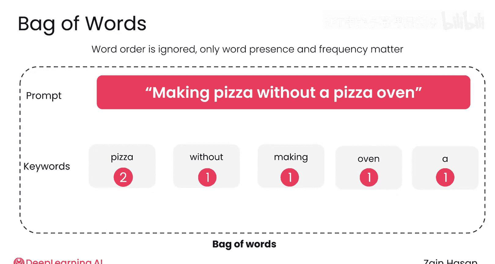

关键词搜索将提示词和每个文档都视为一个“词袋”。这意味着词汇的顺序被完全忽略，唯一重要的是文本中包含哪些词以及它们出现的频率。

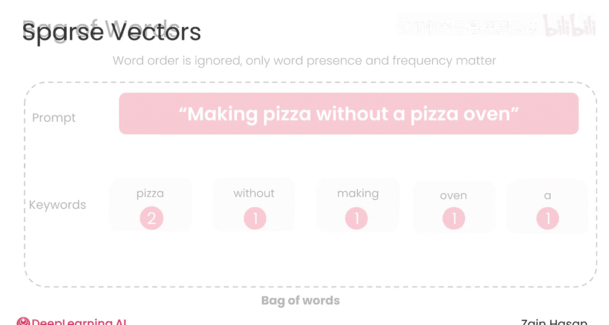

例如，文本 “making pizza without a pizza oven” 包含单词 “pizza” 两次，以及单词 “making”、“without”、“a” 和 “oven” 各一次。

这些词频计数被存储在一个向量中。

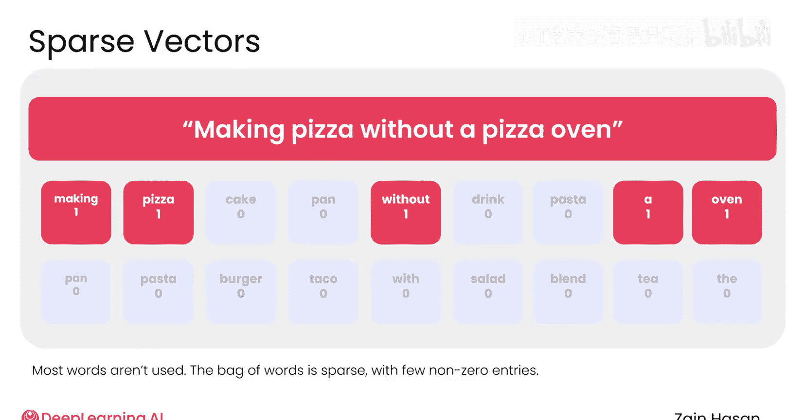

## 构建稀疏向量与倒排索引

该向量为系统词汇表中的每个单词预留一个位置，因此可能包含数万个位置。向量中的每个数字记录了该单词在文本中出现的次数。由于大多数位置的值都是零，这种向量也被称为**稀疏向量**。

为了准备用于检索的知识库，需要为每个文档生成一个稀疏向量。

所有这些向量可以排列在一个网格中，这被称为**词项-文档矩阵**。每一列代表一个不同的文档，每一行代表一个不同的单词。

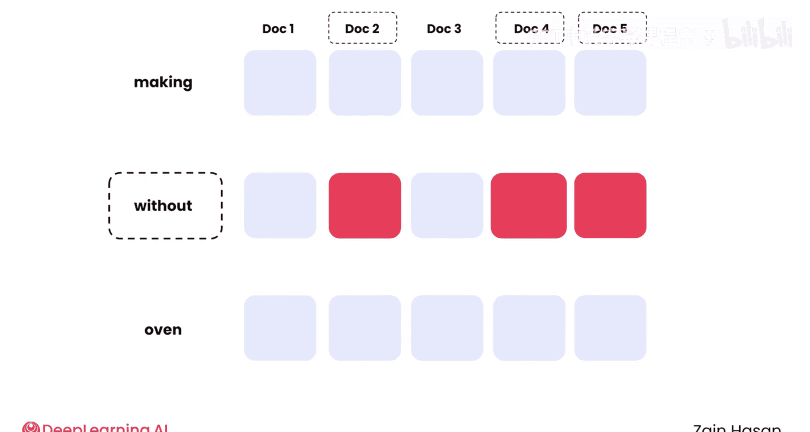

这有时也被称为**倒排索引**。因为它使得从某个单词出发，查找包含该单词的所有文档变得容易。之所以称为“倒排”，是因为通常我们是从文档出发，思考它包含哪些词，而这里是从单词出发，查找包含该单词的文档。

这个倒排索引可以在处理任何搜索之前一次性创建完成。

## 文档评分与排名

当提示词发送给检索器时，会快速为其生成一个稀疏向量。现在，每个文档和提示词都有了稀疏向量，就可以开始对文档进行评分和排名了。

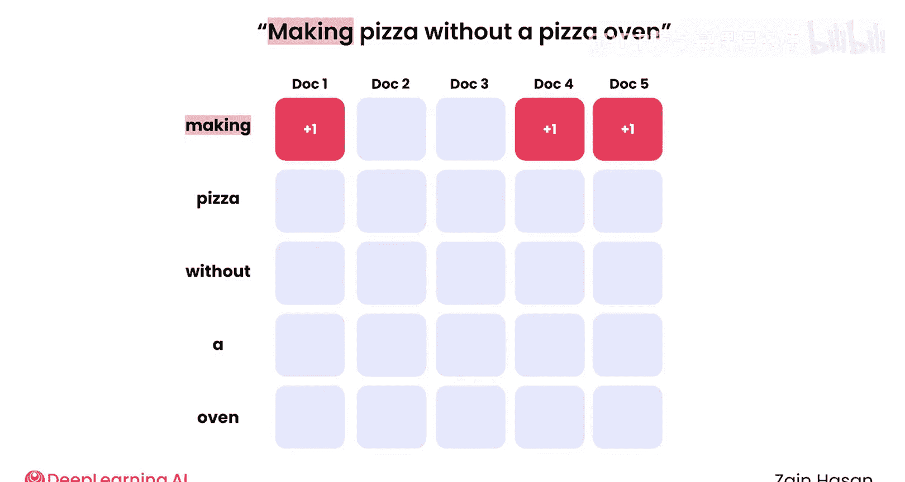

最简单的方法是，当文档包含提示词中的单词时，就给文档加分。提示词中的每个单词被称为一个**关键词**。

以下是评分的基本步骤：

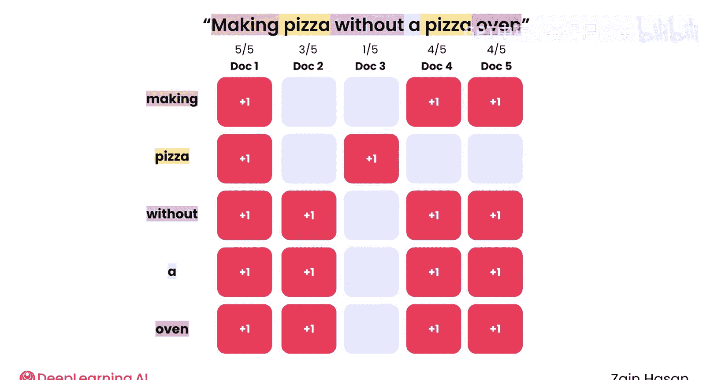

1.  从提示词的第一个关键词开始，在索引中找到其对应的行。
2.  遍历该行，为每个至少包含一个该关键词的文档加一分。
3.  对提示词中的其他每个关键词重复此过程。

如果文档包含关键词，它就得分。提示词包含五个关键词，最高可能得分是5。完成后，总分可用于对文档进行排名，得分最高的文档将被检索出来。

## 改进评分方法：考虑词频

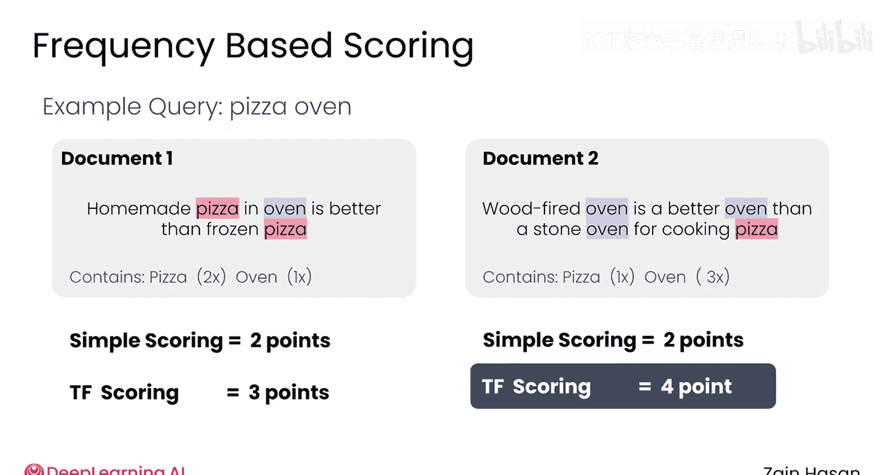

简单评分方法的一个缺点是，它没有捕捉到文档是否多次包含关键词，而多次出现可能表明相关性更高。

一个简单的改进方法是，每次文档包含关键词时都增加其分数，而不仅仅是第一次。现在，你可以找到矩阵中每个关键词所在的行，并直接给予每个文档其在该行对应列中的数值作为分数。

然而，这引入了一个新问题：较长的文档可能仅仅因为篇幅长而多次包含关键词。

为了纠正这一点，可以将每个文档的分数除以其总词数。这种归一化的分数使竞争环境更加公平。它奖励那些关键词在总文本中占比较高的文档，并降低那些仅仅因为篇幅长而多次包含关键词的长文档的权重。

## 引入逆文档频率 (IDF)

上述方法相当不错，但它对所有关键词都给予相同的权重，无论是像 “the” 这样的填充词，还是像 “pizza” 这样不太常见的词，而后者的出现更能表明相关性。

为了纠正这一点，可以再次对词项进行加权，但这次使用一种称为**逆文档频率** 的度量方法。

要使用这种方法，需要为系统词汇表中的每个单词计算一个IDF值。

对于每个单词，你需要计算它出现在多少个文档中，然后除以文档总数。如果你的知识库有100个文档，单词 “pizza” 出现在其中5个里，那么它的文档频率就是 5/100 或 0.05。像 “the” 这样的常见词可能出现在所有100个文档中，因此其文档频率为 100/100 或 1。

由于你想要奖励稀有词汇，现在需要将这个分数倒置（取倒数）。此时，“pizza” 的IDF将是20，而 “the” 的IDF仅为1。此时，稀有词的IDF值显著高于常见词，这可能会过度奖励稀有词。因此，通常使用IDF的对数值。稀有词仍然有更高的权重，但不像之前那么夸张。

最终，每个单词都会得到一个IDF值，它反映了该词在整个知识库中的稀有程度。

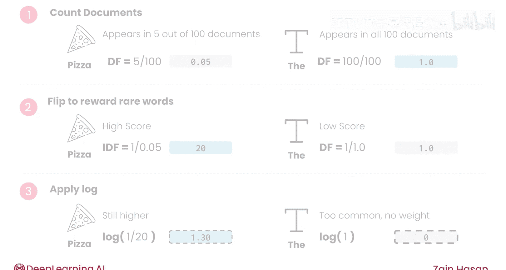

## TF-IDF矩阵与最终评分

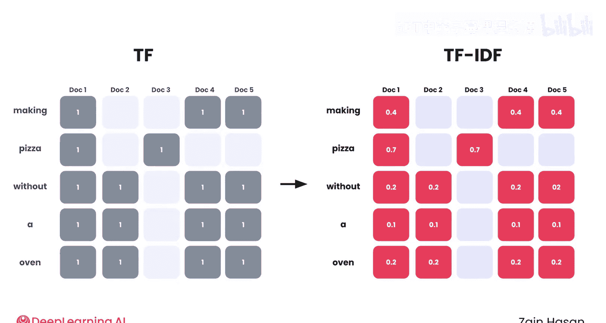

为了在评分中使用这些值，首先需要更新倒排索引中的数值，将每一行的数字乘以该单词的IDF分数。得到的矩阵称为**词频-逆文档频率矩阵**，即 **TF-IDF矩阵**。

为了对知识库中的文档进行评分，只需使用与之前相同的方法：对于提示词中的每个关键词，遍历其所在的行，并给予每个文档该行中对应的TF-IDF分数。

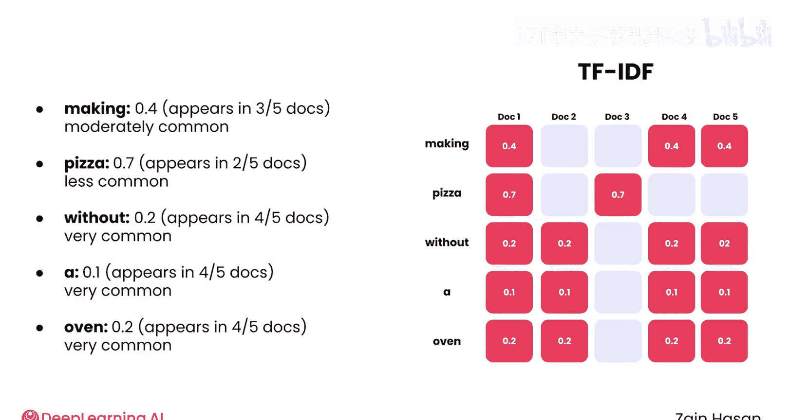

这种方法产生的TF-IDF分数是衡量关键词检索性能的标准基线。得分最高的文档通常会频繁使用关键词，特别是那些在整个知识库中都很少见的关键词。

回顾之前的提示词，包含像 “pizza” 或 “oven” 这样的稀有词的文档，其得分很可能远高于仅包含像 “a” 或 “without” 这样常见词的文档。

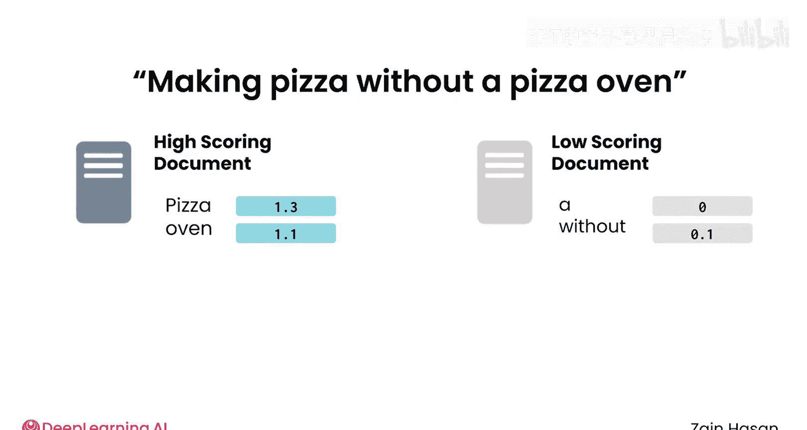

## 总结与展望

本节课中我们一起学习了关键词搜索的基础——TF-IDF算法。这是一种通过统计词频和逆文档频率来评估文档与查询相关性的经典方法。它简单有效，是许多检索系统的基石。

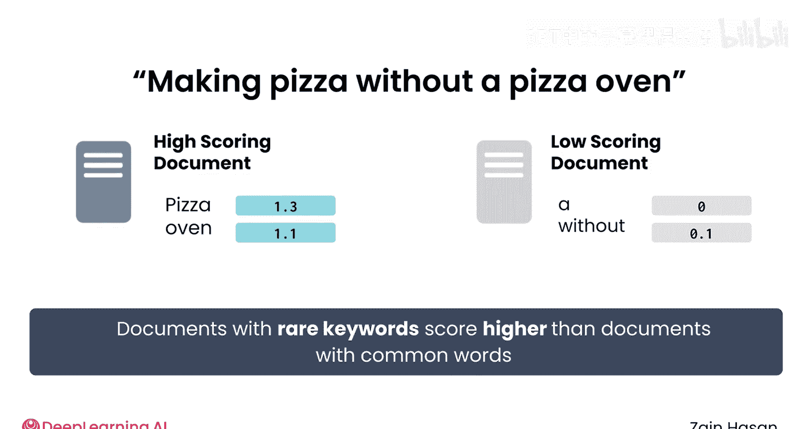

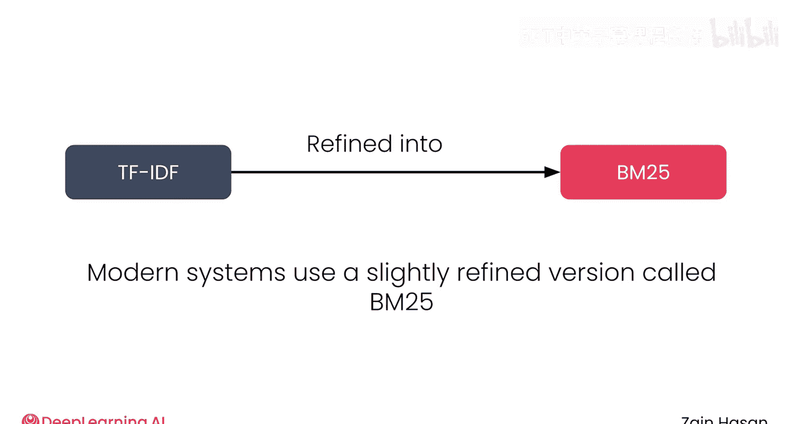

虽然TF-IDF是关键词搜索的基础方法，但现代系统倾向于使用一个略微改进的版本，称为BM25。

在下一个视频中，我们将一起学习BM25是如何工作的，并反思关键词搜索的优势以及它如何融入你的RAG系统。