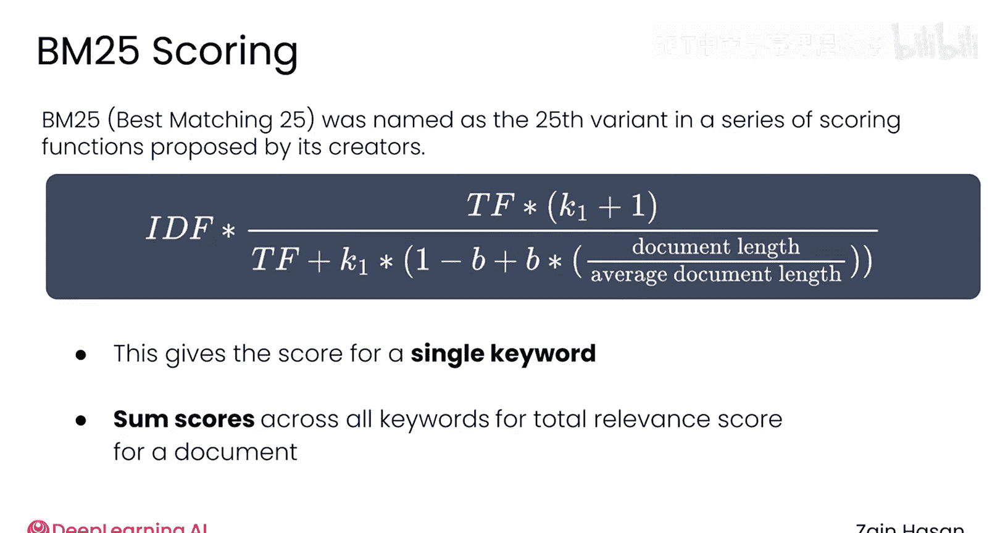
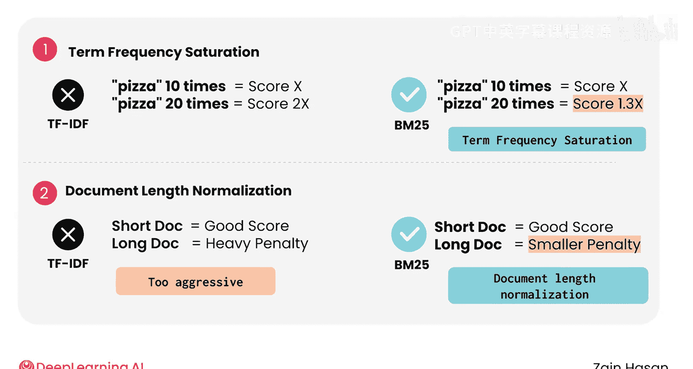
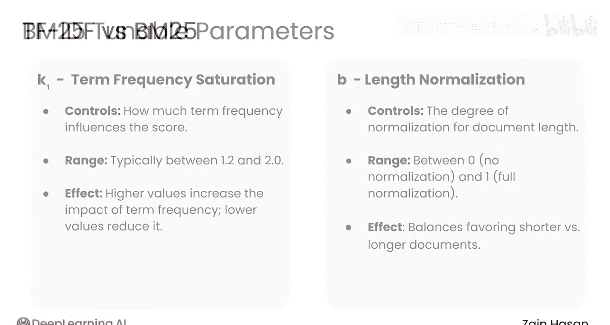
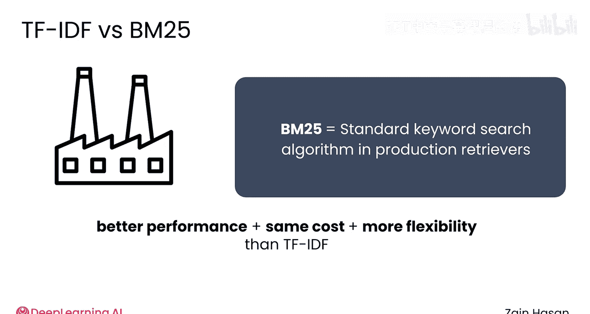
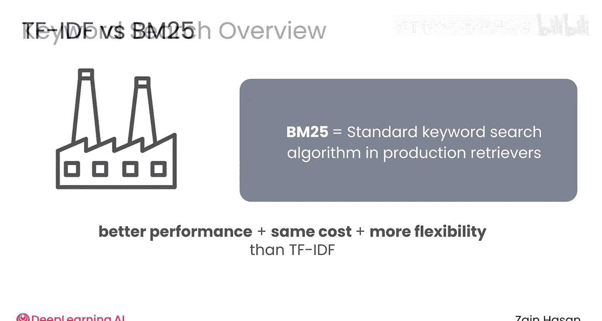
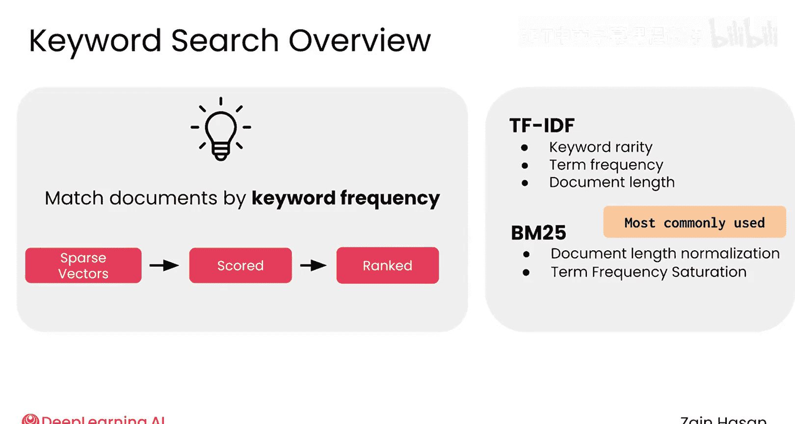

# 013：BM25算法 🧮

在本节课中，我们将要学习关键词搜索领域的一个重要算法——BM25。我们将了解它如何改进经典的TF-IDF算法，其核心公式是什么，以及它在实际检索系统中的优势和应用。

## 概述

上一节我们介绍了TF-IDF这一经典的关键词搜索算法。本节中我们来看看其更先进的继任者——BM25算法。BM25在TF-IDF的基础上进行了关键改进，使其成为现代生产级检索系统中事实上的标准关键词搜索算法。

## BM25算法介绍

虽然TF-IDF仍然是经典的关键词搜索算法，但大多数检索系统中使用的算法被称为“最佳匹配25”，或简称为BM25。它之所以被这样命名，是因为它是其创建者提出的一系列评分函数中的第25个变体。它对TF-IDF做了一些改进，下面我们来探讨这些改进是如何工作的。



以下是BM25的公式。它实际上与TF-IDF的工作原理非常相似，只是增加了一些关键部分，您马上就会看到。

```math
score(D, Q) = \sum_{i=1}^{n} IDF(q_i) \cdot \frac{f(q_i, D) \cdot (k_1 + 1)}{f(q_i, D) + k_1 \cdot (1 - b + b \cdot \frac{|D|}{avgdl})}
```

这个公式为特定文档中的单个关键词生成一个相关性分数。将所有关键词的这些分数相加，就得到了单个文档的总相关性分数，然后可以用于排序。


## BM25的改进之处

现在让我们看看BM25是如何改进TF-IDF的。

以下是BM25相较于TF-IDF的两个主要改进点：



1.  **词频饱和**：随着文档包含更多关键词实例，其得分会呈现收益递减。这里的理念是，一个包含“pizza”这个词20次的文档，其相关性实际上并不是包含10次“pizza”的文档的两倍。这种对关键词额外实例进行折扣的行为被称为“词频饱和”。

2.  **文档长度归一化**：较长的文档仍然会受到惩罚，就像在TF-IDF中一样。但在BM25中，这些惩罚也是递减的。虽然惩罚长文档很重要，但TF-IDF有时惩罚得过于激进，以至于过度折扣了较长的文档。BM25随着文档长度的增加，会施加递减的额外惩罚。结果是，只要长文档具有相当高的关键词频率，它们仍然可以获得高分。这种根据文档长度调整分数的过程被称为“文档长度归一化”。


## BM25的可调参数



BM25与TF-IDF的另一个不同之处在于，它包含了两个可调的超参数。这些参数允许您控制词频饱和和文档长度归一化的程度。换句话说，您可以控制文档因重复关键词而停止获得奖励的速度，以及因长度增加而受到惩罚的速度。在生产级检索器中，您需要调整这些超参数，以形成一个最适合您知识库数据的整体评分系统。

在生产级检索器中，标准的关键词搜索算法是BM25。


## BM25的优势





它在寻找相关文档方面的表现通常显著优于TF-IDF，所需的计算资源大致相当，并且能够根据您的数据集调整其超参数，这使其灵活性大大提高。

让我们简要回顾一下关键词搜索，并讨论其优势如何在典型的检索器管道中使用。


## 关键词搜索的核心思想与BM25的地位

关键词搜索的核心思想是，根据提示中的关键词在每个文档中出现的频率来匹配文档与提示。作为这个过程的一部分，提示和文档都被转换为稀疏向量，用于统计系统词汇表中的每个单词在该文本片段中出现的频率。TF-IDF或BM25只是处理这些稀疏向量以对文档进行评分和排序的不同方法。这些方法还考虑了重要因素，如关键词的稀有度、文档包含关键词的频率以及文档长度。

BM25是最常用的关键词搜索算法，自发明以来经受住了数十年的时间考验。它在实际应用的复杂性和性能之间取得了良好的平衡。




## 关键词搜索的优势

关键词搜索的主要优势在于其简单性。它是一种相对直接的方法，在实践中效果良好，通常能够独立表现良好，并经常设定一个具有竞争力的基准，更先进的技术可能难以超越。它还确保检索到的文档将包含用户提示中的关键词，尤其是在您期望用户使用技术术语或确切产品名称的情况下。这种精确的关键词匹配尤为重要。


## 关键词搜索的局限性与过渡


尽管具有所有优势，关键词搜索确实存在弱点。它最终依赖于查询中包含与文档中单词完全匹配的关键词。如果用户发送的提示与某个文档含义相似，但只是没有包含正确的单词，关键词搜索将无法找到该匹配项。

因此，让我们来看看语义搜索，以及它如何解决这个问题。

## 总结

本节课中我们一起学习了BM25算法。我们了解到BM25是TF-IDF的改进版本，通过引入**词频饱和**和**文档长度归一化**机制，更合理地评估文档相关性。其公式包含可调超参数，使其能灵活适应不同数据集。BM25因其在效果、效率和灵活性上的良好平衡，成为生产环境中关键词搜索的标准算法。然而，它仍依赖于精确的关键词匹配，这引出了对能够理解语义的搜索方法的需求。