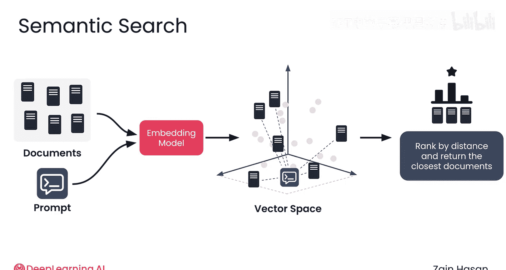

# 014：语义搜索技术入门 🧠

在本节课中，我们将要学习语义搜索技术。与基于关键词匹配的传统搜索不同，语义搜索能够根据文本的**共享含义**来匹配文档与提示，从而捕捉到关键词搜索可能遗漏的细微差别。

## 语义搜索的基本原理

上一节我们介绍了关键词搜索的局限性。本节中我们来看看语义搜索是如何工作的。

从高层次来看，语义搜索的工作流程与关键词搜索类似。每个文档都被映射为一个向量，提示词也是如此。然后通过比较提示向量和文档向量来生成分数，并找到与提示最匹配的文档。

主要区别在于为每个文档和提示分配向量的方式。

*   在**关键词搜索**中，你只需统计每个单词在文本中出现的频率。
*   在**语义搜索**中，你需要通过一个称为**嵌入模型**的特殊数学模型来处理文档或提示，从而生成向量。

## 嵌入模型如何工作

嵌入模型将单词映射到空间中的一个位置。这个位置由一个向量表示。

例如，嵌入模型可能将单词 `pizza` 映射到二维空间中的向量 `[3, 1]`，将单词 `bear` 映射到向量 `[5, 2]`。在二维空间中，这些向量可以表示为 X-Y 轴上的点。

嵌入模型的核心在于，它会将**语义相似**的单词映射到空间中**相近的位置**。

例如，单词 `food` 和 `cuisine` 的嵌入位置会彼此靠近，而单词 `trombone` 和 `cat` 的嵌入位置则会相距较远。相似的含义导致相似的位置。

这里的 X 轴和 Y 轴并没有简单的解释（例如，没有“食物轴”或“动物轴”），至少不容易看出来。你应该将这些点想象成漂浮在二维平面上，含义相似的单词会聚集在一起。

## 从单词到文本

由于单词之间存在许多复杂的关系，仅用两个维度可能无法形成有意义的聚类。如果向量有三个分量，你可以想象将它们嵌入到三维空间中。这样，相关概念就有更多空间形成聚类，并捕捉它们之间微妙的关系。

然而，在大多数嵌入模型中，这些向量拥有数百甚至数千个分量，为每个点的嵌入位置提供了极大的灵活性。我们无法绘制甚至想象这个高维空间，但从数学上讲，所有相同的原理都成立：向量给出了该空间中位置的坐标，相似的概念被嵌入得彼此靠近，不同的概念则被嵌入得相距较远。

尽管前面的例子聚焦于单个单词，但嵌入模型可以处理多种输入数据。以下是几种常见的嵌入模型：

*   针对**单个单词**的嵌入模型。
*   针对**句子**的嵌入模型。
*   针对**整个文档**的嵌入模型。

这些模型接受不同类型的输入，但在每种情况下，都会输出一个指定空间中位置的单一向量。与单个单词一样，如果向量彼此靠近，那么这些文本片段就具有相似的含义。

考虑以下三个句子：
1.  He spoke softly in class.
2.  He whispered quietly during class.
3.  Her daughter brightened the gloomy day.

当投影到向量空间时，前两个句子的向量会更接近，而第三个句子的向量会远离前两个。

## 量化文本相似度

为了量化不同文本片段的相似度，你可以测量它们向量之间的距离。有几种方法可以实现。

例如，**欧几里得距离**（你可能在几何课上学过）通过绘制从一个向量到另一个向量的直线来测量两个向量之间的距离，即它们之间的最短可能距离。计算这个距离的公式本质上是勾股定理，但扩展到更多维度。然而，在非常高维的空间中，每个点往往都与其他点相距甚远。

一种更常用的距离度量是**余弦相似度**，它测量两个向量在方向上的相似性，而不管它们在空间中是否彼此靠近。向量 `[10, 10]` 和 `[100, 100]` 在位置上并不接近，但它们指向相同的方向。

余弦相似度的范围从 **1**（向量方向完全相同）到 **-1**（向量方向完全相反）。

你偶尔也会看到**点积**，它测量一个向量在另一个向量上投影的长度。如果两个向量在长度和方向上相似，投影长度就较大；如果它们成 90 度角，投影长度为 0；如果它们方向相反，点积将为负值。

如果数学不是你的强项，不用担心。你可能永远不需要自己实现这些距离度量，但了解它们的工作原理是有帮助的。例如，对于点积和余弦相似度，**更高的值**都反映了向量更接近，这最终反映了概念更相似。余弦相似度范围在 -1 到 1 之间，而点积可以在负无穷到正无穷之间取任何值。

## 语义搜索的完整流程

了解了距离度量后，让我们看看如何利用它来实现语义搜索。

首先，所有文档都通过嵌入模型投影到向量空间中。得益于嵌入模型的设计，含义相似的文档会彼此靠近，含义不同的文档会彼此远离。

接下来，你对提示词进行嵌入，得到它自己的向量。

现在，你可以测量提示向量与每个文档向量之间的距离。同样得益于嵌入模型的设计，距离最近的文档也将具有最相似的含义。

此时，对文档进行排序就很简单了。你只需按照文档与提示向量的距离进行排序，并返回距离最短的文档。由于嵌入模型的工作原理，你刚刚找到了与你的提示含义最相似的文档。

## 总结

本节课中我们一起学习了语义搜索技术。语义搜索的核心在于使用**嵌入模型**将文本转换为高维空间中的**向量**，并通过计算向量间的**距离**（如余弦相似度）来量化文本的语义相似性，从而找到与查询意图最匹配的文档，克服了传统关键词搜索的局限。理解嵌入模型如何将相似概念映射到邻近位置，是掌握语义搜索的关键。