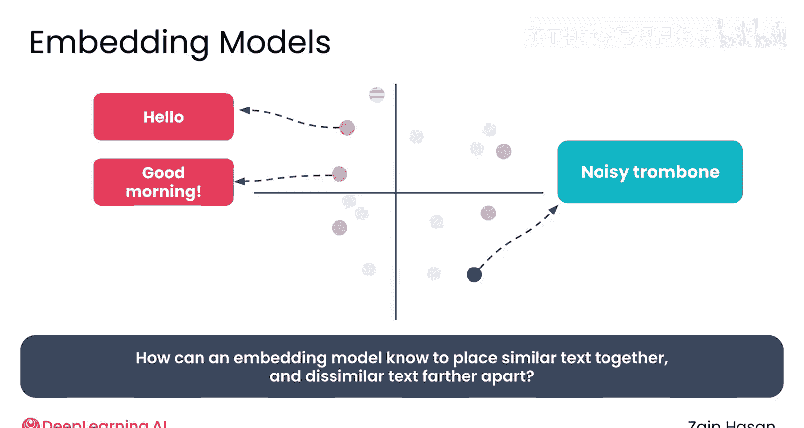
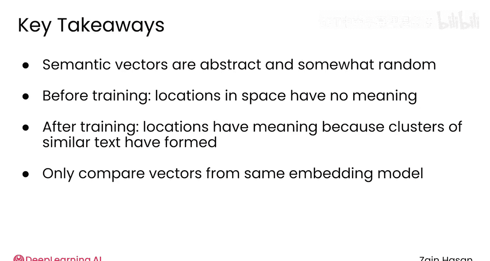

# 015：语义搜索嵌入模型深度解析 🧠

在本节课中，我们将要学习嵌入模型的工作原理。嵌入模型是语义搜索和RAG系统的核心，它能够将文本转换为向量，并让含义相似的文本在向量空间中彼此靠近。

## 概述

嵌入模型的任务描述起来相当简单。它需要将相似的文本嵌入到彼此接近的向量中，并将不相似的文本嵌入到彼此远离的向量中。如果你试图想象嵌入模型是如何做到这一点的，你就会意识到它们需要多么复杂。计算机怎么可能理解一段文本的含义呢？让我们更深入地看看嵌入模型是如何实现这一惊人壮举的。

## 嵌入模型的任务：正负样本对

你可以从正样本对和负样本对的角度来理解嵌入模型的工作。一个正样本对是两段相似的文本，例如“good morning”和“hello”，它们应该被嵌入到彼此接近的位置。

一个负样本对，例如“good morning”和“that's a noisy trombone”，具有不同的含义，应该被嵌入到彼此远离的位置。嵌入模型需要工作，使得正样本对最终更接近，而负样本对最终更远离。

## 训练过程：从随机到有序

训练嵌入模型的第一步是编译一个包含大量正负样本对的集合，在许多系统中这也被称为示例。这意味着真正庞大的数据集合，通常包含数百万对样本。一个单独的单词或文本片段将包含在许多示例中，以捕捉它与各种文本和概念的关系。

一旦这些示例被编译完成，训练就可以开始了。

在训练开始时，嵌入模型将每段文本嵌入到一个随机向量中。这些向量是无意义的，与文本的含义没有任何关系。如果你使用这个未经训练的嵌入模型进行检索，结果将是胡言乱语。

现在，模型查看其训练数据中的所有正负样本对，并询问：我将正样本对放在一起、将负样本对分开的效果如何？由于模型使用正负示例提供的对比来评估其性能，这种技术被称为**对比训练**。

基于其表现，模型更新其内部参数。它使用一种算法，试图将正样本对拉得更近，将负样本对推得更远。

一旦嵌入模型的参数被更新，你只需重复这个过程。使用模型更新后的参数将文本嵌入到新的向量中。再次使用正负样本对评估模型的性能，并根据该性能再次更新其参数。

这个过程重复多次，迭代地更新模型的参数，将样本对拉近或推远。经过多轮训练后，正样本对将被拉得很近，而负样本对应该被推得很远。

## 从单个文本的视角看训练过程

让我们从单个文本片段的视角来看这个过程。以短语“he could smell the roses”为例，我将其称为我们的锚点。它与短语“a field of fragrant flowers”构成一个正样本对，与短语“a lion roared majestically”构成一个负样本对。

在训练开始时，这三个短语被映射到随机位置，没有反映它们的含义。从锚点的角度来看，它希望将正样本拉近，并希望将负样本推远。只有三个文本片段时，这个过程很容易可视化。

经过多轮训练后，锚点希望尽可能地将正样本拉近，并将负样本推得尽可能远。也就是说，你永远不会只用两对样本来训练一个嵌入模型。

当你尝试用数百万个锚点、正样本和负样本来完成这个过程时，情况会变得混乱得多。每个向量同时在许多方向上被推拉。这有助于解释为什么模型使用具有数百甚至数千个维度的向量——高维空间为算法提供了许多选择，可以将向量推拉到何处，以反映训练数据中微妙的关系。

## 训练后的向量空间

训练后，向量能够捕捉含义，因为相似的单词或文本被拉到了向量空间中相似的区域。你不需要为了构建一个RAG系统而去训练一个嵌入模型，但理解它们是如何训练的可以帮助你更好地理解它们生成的向量。

需要了解的主要要点是，语义向量是抽象且有些随机的。在训练之前，空间中的一个位置没有任何意义，向量被随机放置。训练之后，空间中的不同位置确实具有语义含义，但这只是因为在那里形成了一个相似概念的集群。例如，某个地方可能有一个与狮子相关的所有单词的集群，而另一个集群则与长号相关。如果你运行两次训练过程，但使用不同的初始随机向量，这些相同的集群仍然会形成，但它们会位于向量空间中的不同位置。

另一个关键要点是，你只比较由同一个嵌入模型生成的向量。每个模型都是用不同的训练数据、不同的维度数量和不同的随机初始化值训练的。尝试比较来自两个不同模型的向量只会导致无意义的结果。

## 实践与应用

在实践中，你可能会使用现成的嵌入模型，它们会非常出色地将相似的单词、句子或文档放置在向量空间中相似的位置。你可能甚至不需要实现这些向量之间的距离测量。也就是说，更深入地理解它们的工作原理可以帮助你更好地推理如何在你的RAG系统中使用它们。

## 总结

本节课中我们一起学习了嵌入模型的核心工作原理。我们了解到，模型通过对比训练，利用海量的正负样本对，将文本含义编码为高维空间中的向量。相似含义的文本在向量空间中彼此靠近，从而实现了语义搜索。理解这一过程有助于我们更好地选择和使用嵌入模型来构建高效的RAG系统。

接下来，请和我一起进入下一个视频，看看如何将这些密集向量应用到你的检索器中。

