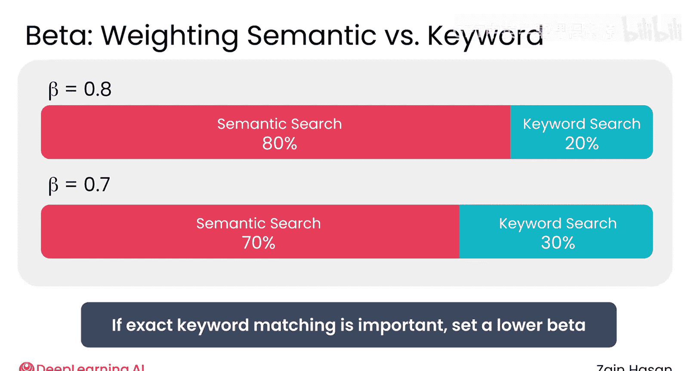
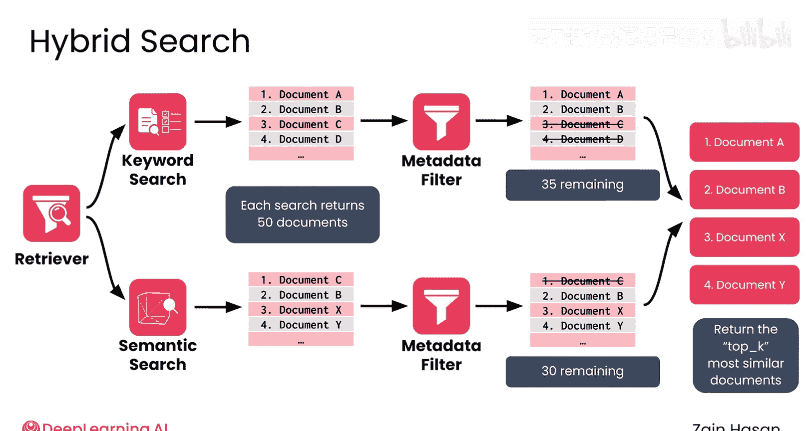

# 016：混合搜索策略 🧩

在本节课中，我们将学习如何将之前介绍的多种搜索与过滤技术结合起来，形成一种混合搜索策略，从而综合发挥它们各自的优势。

上一节我们介绍了检索器中使用的不同搜索和过滤技术。本节中，我们来看看如何将它们结合使用，构成混合搜索技术的一部分，以利用它们各自不同的优势。

## 回顾各搜索技术

首先，让我们回顾每种技术的运作方式及其主要优点。

*   **元数据过滤**：使用存储在文档元数据中的严格标准来缩小搜索结果范围。
    *   **优点**：速度快、易于实现、易于解释。它本身可能不是一个强大的搜索技术，但它提供了一个严格的“是/否”过滤器，这是其他方法无法提供的。
*   **关键词搜索**：根据提示词中找到的相同关键词对文档进行评分和排序。
    *   **优点**：速度仍然很快，易于实现，并且在查找相关文档方面可以做得非常出色。当提示词和文档包含技术关键词或产品名称时，它表现得尤其出色，因为结果将包含这些确切的词语。
    *   **缺点**：关键词搜索依赖于精确匹配，因此无法检索到含义相似但用词不同的文档。
*   **语义搜索**：根据与提示词含义的相似性对文档进行评分和排序。
    *   **原理**：文档和提示词被嵌入为向量，其在高维空间中的位置捕捉了它们的含义。找到与提示词最相似的文档，意味着需要找到向量嵌入与提示词向量最接近的文档。
    *   **优点**：它提供了其他搜索技术无法提供的灵活性。
    *   **缺点**：比关键词搜索速度慢，计算强度更大。

## 构建混合搜索管道

鉴于这三种方法各有相对优势，以下是它们通常如何组合成一个混合搜索管道的。

1.  **接收提示词**：检索器首先接收到一个提示词。
2.  **并行执行搜索**：检索器随后使用该提示词同时执行关键词搜索和语义搜索。
3.  **生成排序列表**：结果是两个已排序的文档列表：一个使用关键词搜索评分和排序，另一个使用语义搜索评分和排序。可以想象每个搜索技术返回50个文档，许多文档会同时出现在两个排名中，但顺序可能不同。
4.  **应用元数据过滤**：接下来，使用元数据过滤器对这两个列表进行过滤，以移除不相关的文档。例如，过滤器可能会移除与工作无关的文档。在这个例子中，关键词搜索列表剩下35个文档，语义搜索列表剩下30个。
5.  **合并排序列表**：现在，需要将这两个排序列表合并成一个单一的排名。

## 合并排名的算法：倒数排名融合 (RRF)

一种常用的合并这些排名的算法称为**倒数排名融合**。该算法奖励在任一列表中排名靠前的文档，同时允许你控制是给予关键词排名还是语义排名更多的权重。

以下是倒数排名融合的公式：

```
score = 1 / (K + rank)
```

文档根据其在每个列表中的排名获得积分。`K` 是一个超参数，但暂时假设它为0。在这种情况下，每个文档获得的积分等于其排名的倒数。

*   第一名得 1 分。
*   第二名得 1/2 分。
*   以此类推。

文档从每个排序列表中获取积分，其总积分用于计算最终排名。对于你的检索器来说，就是两个排名：关键词排名和语义排名。

**示例**：如果一个文档在一个列表中排名第二，在另一个列表中排名第十，那么它将从第一个排名中获得 `1/2 = 0.5` 分，从第二个排名中获得 `1/10 = 0.1` 分，总分为 `0.6` 分。然后使用这些分数对所有文档进行重新排序。

## 调整混合搜索参数

让我们回到那个 `K` 参数。`K` 用于控制最高排名文档的影响。

*   当 `K = 0` 时，任何列表中排名第一的文档都会立即跃升至总排名的顶部，即使它只在一个列表中排名很高。例如，排名第一的文档得1分，排名第十的文档得0.1分，这是10倍的差异。
*   将 `K` 增加到类似 `50` 的值可以平衡这一点。现在，排名第一的文档得 `1/(50+1) ≈ 0.0196` 分，排名第十的文档得 `1/(50+10) ≈ 0.0167` 分，这是一个更温和的分数差异。它仍然可能排名第一，但不会达到主导其他列表排名的程度。

请注意，RRF 只关心文档在每个列表中的**排名**，而不关心导致这些排名的**原始分数**。即使排名第一的文档比第二名的分数高得多，这些信息也不会在 RRF 中被考虑。

检索器混合搜索通常还有第二个超参数，称为 `Beta`。它允许你对语义搜索或关键词搜索产生的排名进行加权。

例如，你可以将 `Beta` 设置为 `0.8`，将 80% 的重要性或权重分配给语义搜索提供的排名，仅将 20% 分配给关键词搜索提供的排名。一个 `70/30` 的分割（70% 语义，30% 关键词）通常是一个很好的起点，你可以针对你的特定系统进行调整，看看哪种效果最好。

*   在精确词语匹配非常重要，但又希望有一些语义相似性的应用中，你会希望给予关键词搜索结果比语义搜索结果更重的权重。
*   在其他情况下，如果语义相似性更重要，而关键词不那么关键，你会希望给予向量搜索结果比关键词搜索结果更重的权重。



## 返回最终结果



至此，你的检索器实际上已经准备好返回其结果了。根据最初请求的文档数量（通常称为 `top K`），检索器会从这个最终的混合排名中返回最相似的 K 个文档。

## 总结与展望

本节课中，我们一起学习了混合搜索策略。混合搜索允许检索器利用关键词搜索、语义搜索和元数据过滤提供的不同优势。关键词搜索提供精确的词语匹配，语义搜索允许基于含义进行模糊匹配，而元数据过滤则使用严格的标准过滤掉文档。

此外，还有充足的机会来改变这个混合系统的工作方式，无论是调整 BM25 算法的参数、选择过滤哪些元数据，还是在倒数排名融合步骤中改变关键词搜索与语义搜索的权重。这种混合方法让你可以发挥每种方法的优势，并根据知识库中的数据或整个项目的需求来调整系统的性能。


然而，要进行这种调整，你需要一种方法来衡量检索器的性能。因此，请加入下一节视频，了解如何评估检索器。