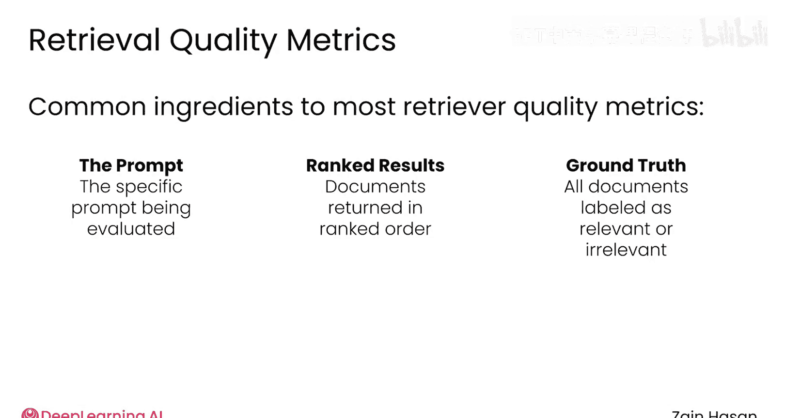
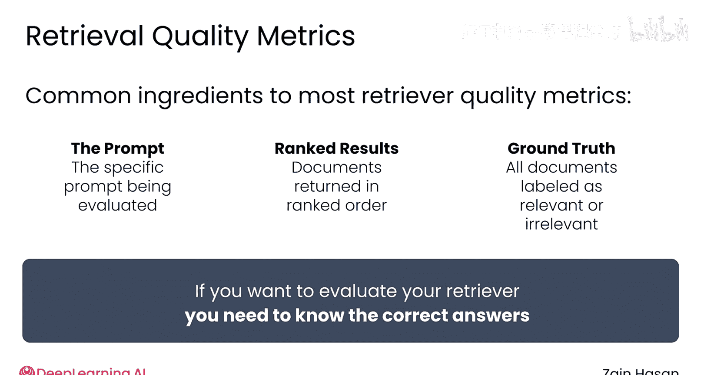
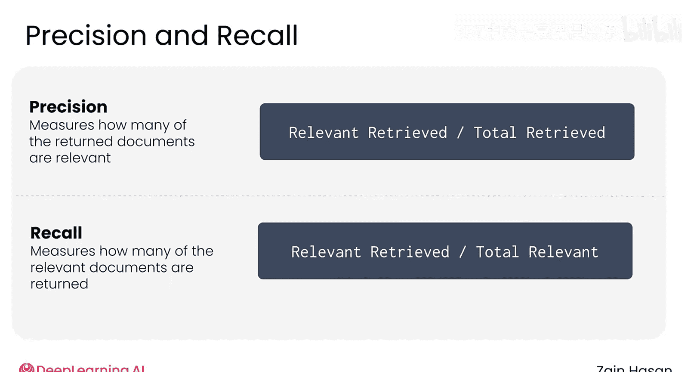
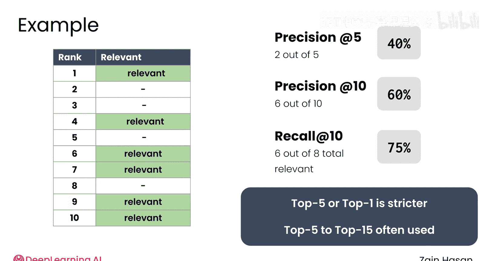
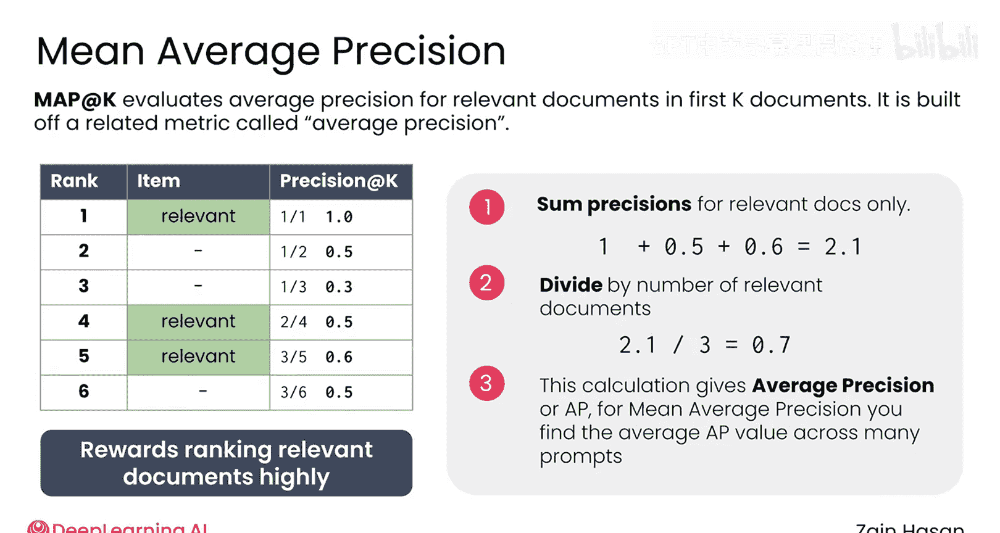
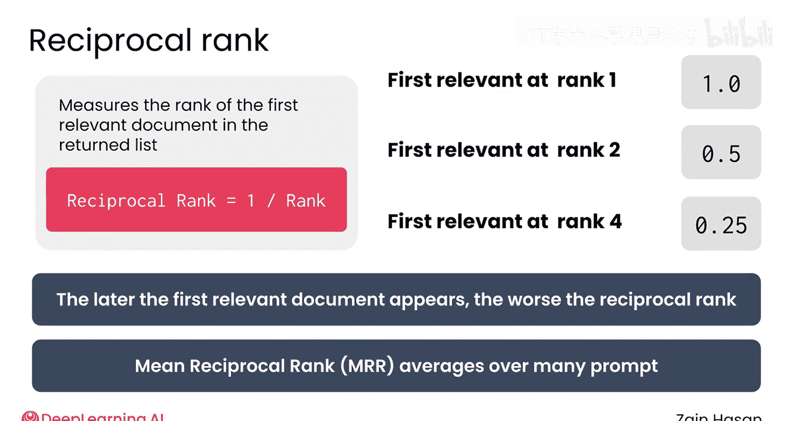
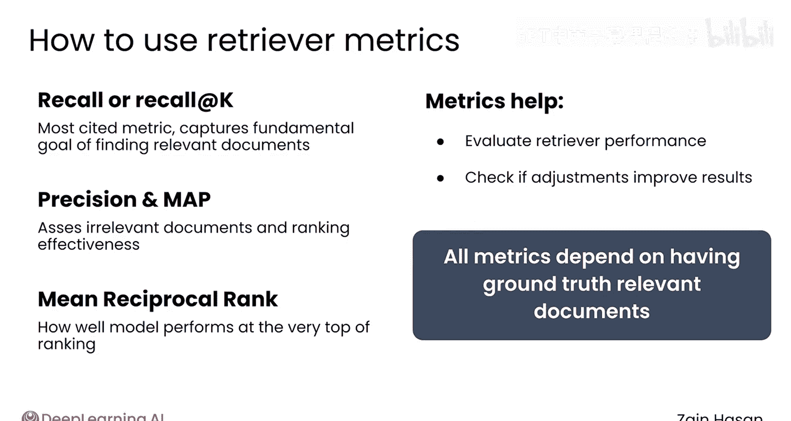

# 017：检索质量评估 📊

在本节课中，我们将学习如何评估检索器的性能。与任何软件一样，一旦检索器开始运行，你需要知道它是否真的有效。虽然你可以从延迟、吞吐量、资源使用等方面评估检索器，但最终重要的是搜索质量。换句话说，它是否找到了相关的文档。让我们看看几种回答这个问题的方法。

## 评估指标的核心要素

大多数检索器质量指标都包含几个共同的要素。

首先，你需要**查询本身**，因为检索器可能在一个查询上表现良好，而在另一个查询上表现不佳。

其次，你需要检索器根据该查询返回的**文档排序列表**。

最后，你需要一个**真实相关文档列表**，即你的知识库中检索器应该返回的所有相关文档。换句话说，如果你想给你的检索器打分，你需要知道正确答案。

## 精确率与召回率

上一节我们介绍了评估所需的核心要素，本节中我们来看看两个最常用的检索器质量指标：精确率和召回率。

精确率的计算方法是：**相关检索到的文档数量**除以**检索到的文档总数**。

召回率的计算方法是：**检索到的相关文档数量**除以**知识库中相关文档的总数**。

以下是帮助你理解两者区别的一个例子。

假设你通过人工标注，知道你的知识库中有10个与某个查询相关的文档。你在该查询上运行检索器，它返回了12个文档，其中8个是相关的。那么精确率是66%（因为12个中有8个相关），召回率是80%（因为10个相关文档中找到了8个）。

现在，你调整检索器设置并再次运行查询。在第二次运行中，它返回了15个文档，其中9个是相关的。你的检索器比上次多返回了3个文档，但只多找到了1个相关文档。精确率下降到60%（15个中有9个），然而召回率增加到90%（因为这次找到了10个相关文档中的9个）。换句话说，你牺牲了一点精确率，换来了更高的召回率。

精确率惩罚检索器返回不相关的文档，可以理解为衡量结果的可信度。召回率惩罚检索器遗漏相关文档，衡量检索器的全面性。要同时获得完美的召回率和精确率，唯一的方法是只返回相关文档，并且将它们排在最高位。否则，你通常需要在两者之间进行权衡。

## Top K 标准化

检索指标受检索器返回的文档数量影响。因此，为了标准化，通常讨论的是**Top K文档**，即检索器排名最高的K个文档。

例如，考虑检索器返回的这个文档排序列表。

在这个例子中，**Top 5的精确率**是40%，因为前5个文档中只有2个是相关的。同时，**Top 10的精确率**上升到60%，因为前10个文档中有6个是相关的。

假设知识库中有8个相关文档。这里的**Top 10召回率**将是6/8，即75%。根据你选择的Top K值，你可以快速生成新的精确率和召回率值。当需要更严格的标准时，可以使用Top 5、Top 2或Top 1指标。不过，通常使用Top 5到Top 15之间稍宽松的范围。

## 平均精确率均值 (MAP)

为了更全面地了解检索器性能，**平均精确率均值 (MAP@K)** 评估了前K个检索到的文档中，相关文档的平均精确率。

首先，让我们为这个例子计算一个相关的指标，称为**平均精确率@6**。

你列出检索器排名最高的6个文档，并为每一行计算精确率@K。接下来，你只对包含相关文档的行（这里是第1、4、5行）的精确率求和，即1 + 0.5 + 0.6。最后，除以Top K中检索到的相关文档数量（本例中为3）。这给出了0.7的平均精确率。

要计算平均精确率均值，你只需计算多个查询及其检索到的文档集的平均精确率，然后对这些值取平均。这告诉你检索器接收到的典型查询的平均精确率会是多少。

MAP奖励将相关文档排在较高位置。如果一个不相关的文档挤进了排名靠前的位置，它会降低其下方每个相关文档所在位置的精确率，从而拉低整体平均值。因此，高MAP值是检索器将其找到的相关文档排在较高位置的良好指标。

## 倒数排名 (MRR)

最后一个常见指标是**倒数排名**，它衡量返回列表中第一个相关对象的排名。

例如，如果第一个相关对象出现在第2位，倒数排名就是1/2，即0.5。如果它在第4位，倒数排名就是0.25。第一个相关文档在列表中出现的越靠后，倒数排名就越差。这通常会在多个查询上执行，以获得**平均倒数排名 (MRR)**。

MRR反映了平均而言，你能多快在检索器的排名中找到相关项目，并强调了在排名中尽可能高地包含至少一个相关文档的重要性。

例如，如果你使用检索器完成了四次搜索，每次排名中第一个相关文档分别出现在第1、3、6和第2位，你可以通过用1除以每个数字来计算平均倒数排名，然后对这些值取平均。这里，这些值是1、1/3、1/6和1/2。将这些值相加并除以4，得到平均倒数排名为0.5。

## 如何综合使用这些指标

有了这么多可用的指标，了解如何最好地结合使用它们很重要。

**召回率**或**召回率@K**是检索器最基本、最常被引用的指标，因为它抓住了检索器最根本的目标：找到相关文档。

**精确率**和**MAP**在此基础上，通过评估检索器是否包含了许多不相关文档，或者检索器对它们的排名有多有效。

**平均倒数排名**更专业一些，但有助于识别你的模型在其排名最顶端的表现如何。

这些指标既可以用来评估检索器的性能，也可以帮助你判断对系统所做的调整是否有效。例如，你可以调整混合检索系统中语义搜索或关键词搜索的权重，然后观察这对你的检索器在一组示例查询上的召回率或精确率有何影响。

如果这些指标有缺点，那就是它们都依赖于拥有一组示例查询的真实相关文档。编译这些数据可能是一个耗时且需要人工操作的过程。然而，最终的结果是一个你可以在开发期间以及上线后都能监控的系统。

## 总结

本节课中，我们一起学习了评估检索器质量的核心方法。我们介绍了评估所需的三个要素：查询、检索结果和真实相关文档。我们深入探讨了精确率和召回率这两个基础指标，理解了它们如何衡量结果的准确性和全面性。接着，我们学习了如何通过Top K进行标准化评估，并引入了更全面的指标——平均精确率均值 (MAP)，它能反映检索器对相关文档的排序质量。最后，我们了解了平均倒数排名 (MRR)，它特别关注第一个相关结果出现的位置。掌握这些指标，你将能够有效地监控和优化检索增强生成系统中的检索组件。