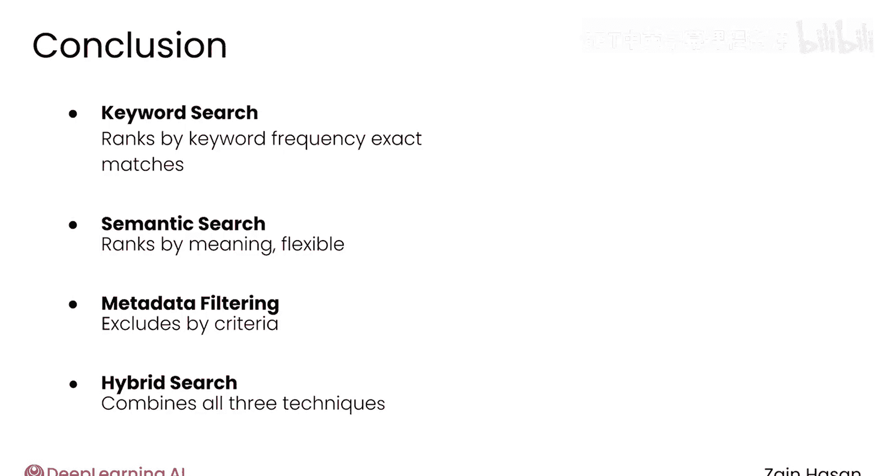
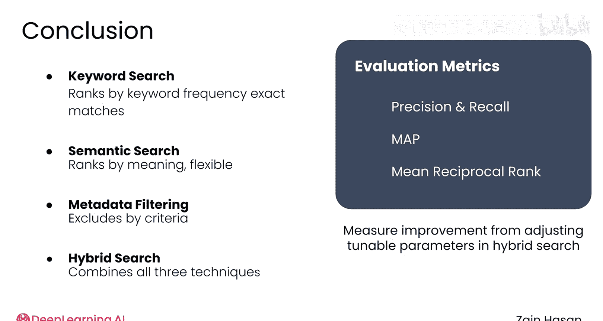

# 018：信息检索原理总结 🎯

在本模块中，我们学习了信息检索的核心原理及其在检索器中的组合应用。现在，让我们回顾一下本模块探讨的主要概念。

上一节我们介绍了检索器的基本构成，本节中我们来总结整个模块的核心内容。

以下是本模块涵盖的主要概念：

1.  **混合检索技术**：检索器通常结合使用三种搜索技术：关键词搜索、语义搜索和元数据过滤。
2.  **关键词搜索**：根据文档包含提示词中关键词的频率对文档进行排序。这是一种成熟的方法，其优势在于能确保返回的文档包含提示词中的确切关键词。
3.  **语义搜索**：根据文档与提示词语义的相似性对文档进行排序。这得益于嵌入模型，该模型能将文本片段转换为数学向量，其特性是语义相似的文本在向量空间中的向量位置也相近。语义搜索提供了关键词搜索所不具备的灵活性。
4.  **元数据过滤**：根据文档元数据中记录的严格标准来排除文档，通常用于确保结果与用户相关。
5.  **混合搜索**：结合上述技术，首先在知识库中并行执行关键词搜索和语义搜索，然后使用元数据过滤器对结果进行过滤，最后将两个列表中的文档合并，形成一个单一的、经过排序的文档列表，从中可以返回最匹配的结果给用户。
6.  **评估指标**：我们了解了几种用于评估检索质量的常见指标，这些指标可用于判断在调整混合搜索流程中的各种可调超参数时，检索质量是提高还是降低。

至此，你已经对典型RAG系统中使用的所有信息检索概念有了扎实的理解。接下来，请与我一起进入下一个模块，看看这些概念是如何在生产级检索器中应用的。