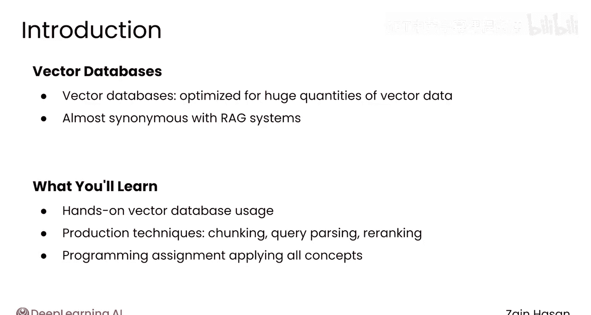

# 019：向量数据库与生产环境优化 🚀

在本模块中，我们将把之前学到的信息检索理论知识应用到生产环境中。我们将探讨为什么传统数据库在处理海量向量数据时会遇到瓶颈，并学习如何使用专为向量优化的数据库——向量数据库。此外，我们还将了解生产级RAG系统中用于提升检索性能的关键技术。

## 从理论到生产 📈

上一节我们建立了坚实的信息检索基础，本节中我们将把所有理论投入生产实践。

你可以使用传统的关系型数据库来实现之前看到的大多数检索技术。然而，一旦需要搜索数百万甚至数十亿份文档，某些操作——特别是作为语义搜索基础的向量运算——性能将显著下降。

此时，你可能需要转向使用向量数据库。向量数据库是专门为存储和搜索海量向量数据而优化的数据库，因此它们几乎已成为RAG系统的代名词。

## 模块学习目标 🎯

在本模块中，你将学习向量数据库为何对向量检索如此优化，并动手使用一个向量数据库来执行多种不同的搜索。

你还将看到生产环境RAG系统中使用的一系列技术，例如文档分块、查询解析和重排序。这些技术在生产环境中用于进一步提升检索器的性能。

与往常一样，本模块最后将有一个编程作业，供你应用所有这些概念。

## 总结

本节课中，我们一起学习了将信息检索理论应用于生产环境的重要性，并介绍了本模块的核心内容：向量数据库的优势及其在生产级RAG系统中的关键优化技术。希望你享受这个能将所有信息检索知识付诸实践的模块。