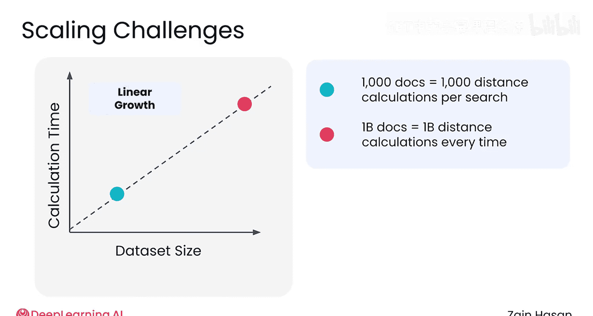
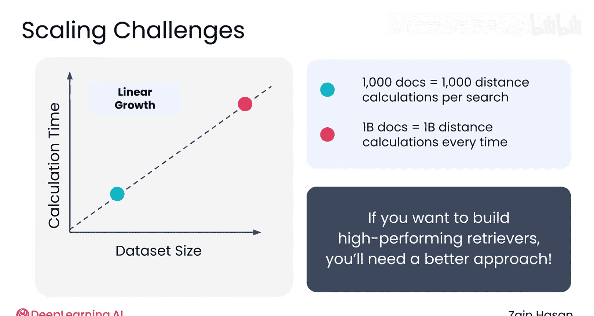
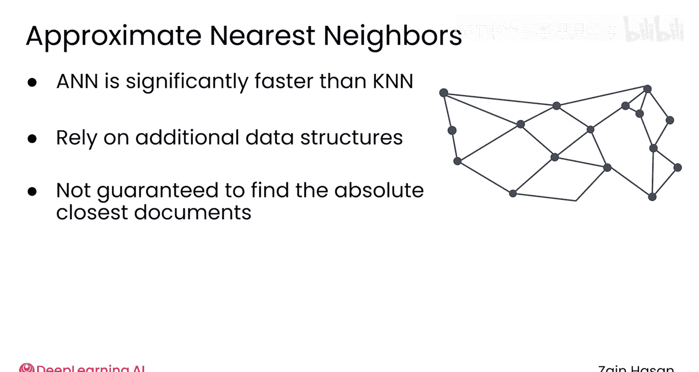
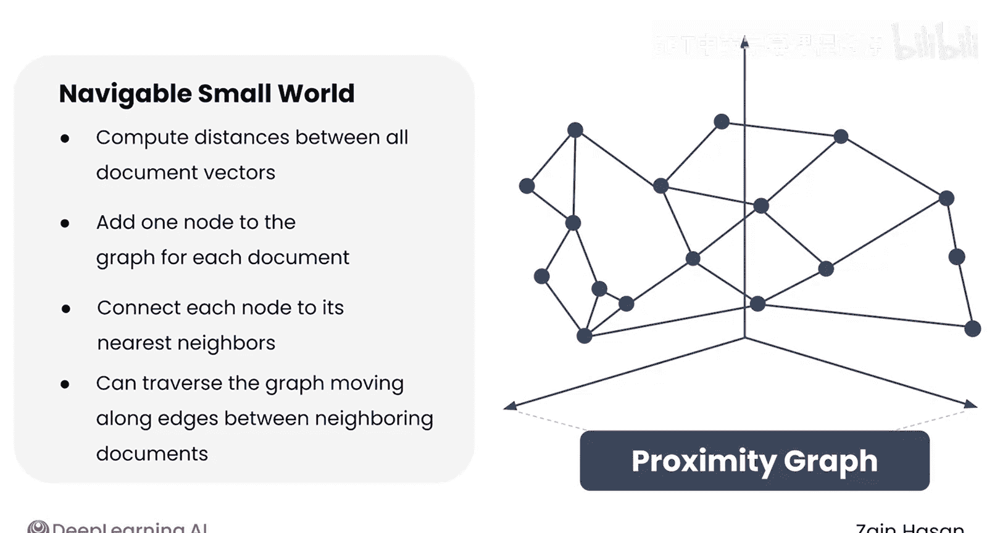
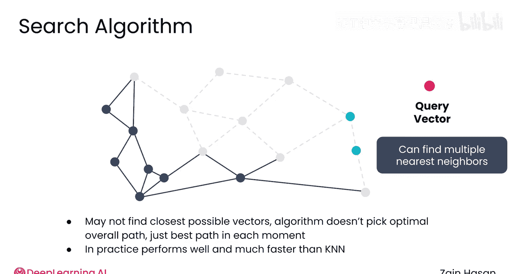
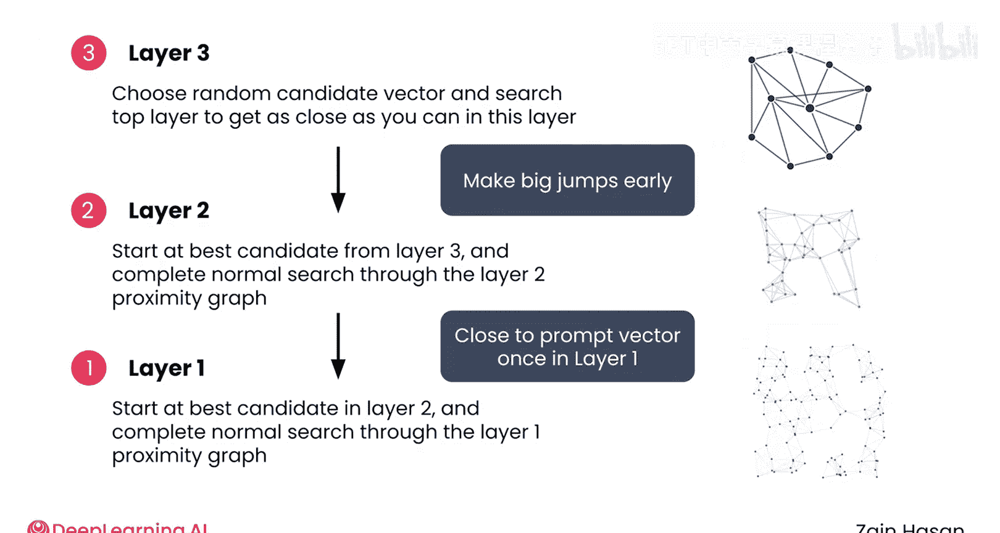
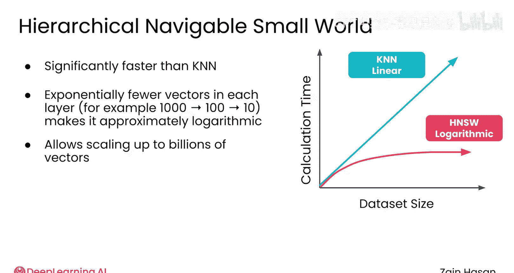
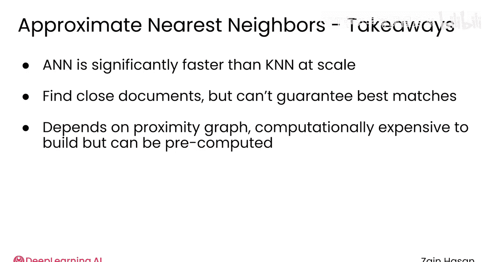

# 020：近似最近邻 (ANN) 算法 🧭

在本节课中，我们将要学习向量检索的核心算法。我们将从最简单的算法开始，分析其局限性，然后探讨如何通过近似最近邻算法来高效地处理大规模数据。

虽然关键词和语义搜索构成了生产级检索器的基础，但随着这些技术的扩展，新的问题会出现。如果实现方式过于简单，向量搜索的性能会尤其低下，需要大量的计算资源并增加系统的延迟。

让我们先看看向量搜索的基础算法，以理解问题的根源，然后再探索如何改进它。

## 向量检索的基础：K最近邻算法

上一节我们介绍了向量检索的基本概念，本节中我们来看看其最直接的实现方式。

最简单的向量检索形式被称为K最近邻搜索。这是你在课程中迄今为止一直看到的算法。首先，为知识库中的每个文档以及你的提示词创建嵌入向量。然后，计算提示词向量与每个文档向量之间的距离。接着，根据文档与提示词向量的距离对文档进行排序。用户可以选择一个数字K，它代表要返回的最近邻文档的数量。

K最近邻算法易于理解且易于实现。问题在于它的扩展性极差。每次搜索所需的计算量随着知识库中文档数量的增加而线性增长。如果你有1000个文档，每次搜索必须计算1000个向量距离。但如果你有10亿个文档，就必须计算10亿个向量距离。第二次搜索将比第一次慢一百万倍。

如果你希望你的检索器在大规模数据上表现良好，就需要一个更好的方法。

## 近似最近邻算法简介

为了改进K最近邻算法，检索器使用了一系列被称为近似最近邻的算法。这些算法使用巧妙的数据结构来实现显著更快的搜索。为了做到这一点，它们在结果质量上做出了一点牺牲，这意味着它们不能保证找到知识库中绝对最接近的文档，但仍然能找到非常接近的文档。

## 可导航小世界算法

让我们看一个典型的近似最近邻算法，称为“可导航小世界”。在进行任何搜索之前，算法会创建一个名为“邻近图”的数据结构。为此，首先计算每个向量与其他每个向量之间的距离。然后，在这个邻近图中，为每个文档添加一个节点。最后，在每个文档与其最接近的几个其他文档之间建立一条边。这就形成了一个网状结构。你可以想象通过沿着连接它们的边从一个文档跳转到其最近邻来遍历邻近图。

现在，让我们看看这个邻近图如何加速搜索。当收到一个提示词时，它被向量化以创建一个查询向量。目标是找到最接近该查询向量的文档。为此，算法随机选择一个称为候选向量的入口点开始。

这只是邻近图中的一个节点。这是一个完全随机的选择，甚至不假设它接近提示词向量。

现在，算法开始遍历图。它查看当前候选向量的每个邻居，并计算其中哪一个最接近提示词向量。由于只需要考虑几个邻居，这是一个非常快的过程。最接近的那个成为新的候选向量。然后，这个过程在每个候选向量处重复：算法查看哪个连接的相邻向量最接近查询向量，该向量就成为新的候选向量。这个过程持续进行，直到没有一个邻居比当前候选向量更接近，此时返回候选向量。通过小的修改，这种方法可以返回多个文档，但核心思想仍然相同：你只是在邻近图上移动，每次都选择能让你更接近提示词的邻居。

这种方法不一定能找到知识图中可能的最佳向量。可能有一个向量更接近提示词向量，但算法无法到达它，因为它无法选择通过邻近图的最佳整体路径，只能选择每个时刻的最佳路径。然而在实践中，这个算法能以比K最近邻快得多的速度找到非常接近的向量。

## 分层可导航小世界算法

虽然这个可导航小世界算法已经比K最近邻更高效，但一个称为分层可导航小世界的变体通过显著加速搜索的早期部分带来了进一步的改进。

分层可导航小世界依赖于一个具有多层的分层邻近图。

以下是一个拥有1000个文档的知识库可能的分层邻近图的样子：
*   **第1层**：包含全部1000个向量，并像通常那样计算邻近图。
*   **第2层**：随机丢弃所有向量，只保留100个，并为这100个向量创建一个新的邻近图。
*   **第3层**：随机丢弃所有向量，只保留10个，并再次为剩余的10个向量创建一个邻近图。

为了搜索这个邻近图，搜索从第3层（顶层）开始。算法在该层随机选择一个入口点，然后像通常那样搜索，以找到第3层中的最佳候选向量。接着，它下降到第2层，从第3层中找到的最佳候选向量开始。由于这里有更多的向量，可能有一个更接近提示词向量。算法像通常那样在第2层中移动，直到找到第2层中的最佳候选向量。此时，它下降到第1层（最底层），该层包含知识库中的每个向量。算法像通常那样遍历这个最底层，而这次找到的最佳候选向量就是算法实际返回的向量。

这种分层方法非常高效，因为在最高层，算法进行大的跳跃以进入提示词向量的近似邻域。当在第1层考虑任何可能的向量时，候选向量应该已经非常接近提示词向量了。

与K最近邻搜索相比，分层可导航小世界算法要快得多。随着层级的上升，需要遍历的向量数量呈指数级减少。因此，分层可导航小世界的运行时间近似为对数级，而K最近邻是线性级。

正是这一点使得向量搜索能够扩展到数十亿个向量，并且仍然只需要几百毫秒的延迟。

## 近似最近邻算法的关键特性

你不需要自己实现这样的近似最近邻算法，但理解它们的一些关键特性仍然很重要。

以下是近似最近邻算法的几个关键特性：
1.  **速度显著更快**：它们比K最近邻算法快得多，使得向量搜索在大规模数据上仍然可行。
2.  **结果近似最优**：虽然它们倾向于找到接近提示词向量的文档，但不能保证找到绝对最佳的匹配。
3.  **依赖预计算的邻近图**：整个过程依赖于构建一个好的邻近图。这是一个计算量相当大的过程，但幸运的是，它可以在收到任何提示词之前进行预计算。

这就是近似最近邻算法如何使向量搜索能够大规模进行的一个很好的总结。

本节课中我们一起学习了向量检索的核心算法。我们从基础的K最近邻算法开始，了解了其计算复杂度高、难以扩展的局限性。为了解决这个问题，我们深入探讨了近似最近邻算法家族，特别是可导航小世界及其更高效的分层变体。这些算法通过构建邻近图数据结构，以牺牲少量精度为代价，换来了对数级的搜索速度，从而使得在海量数据中进行实时向量检索成为可能。理解这些原理，将帮助我们更好地运用后续介绍的实际工具。