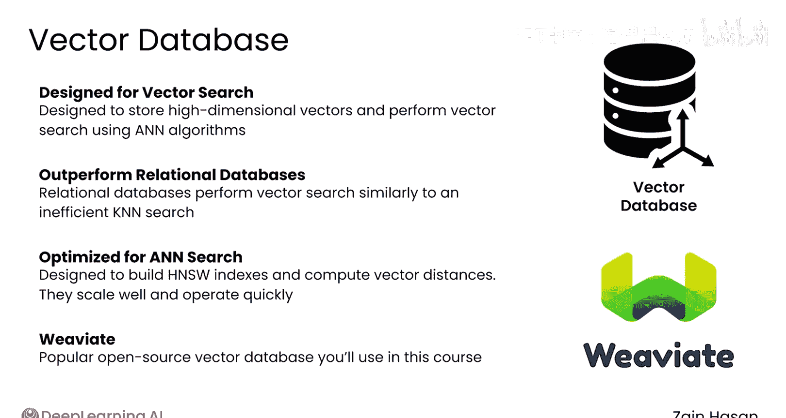
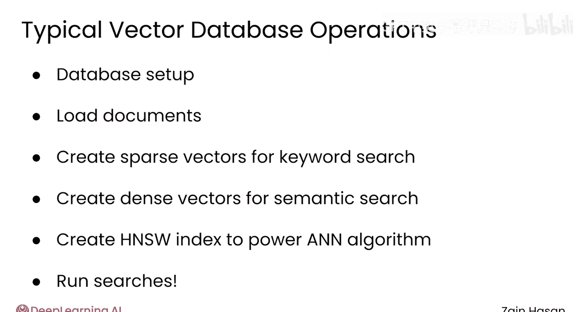
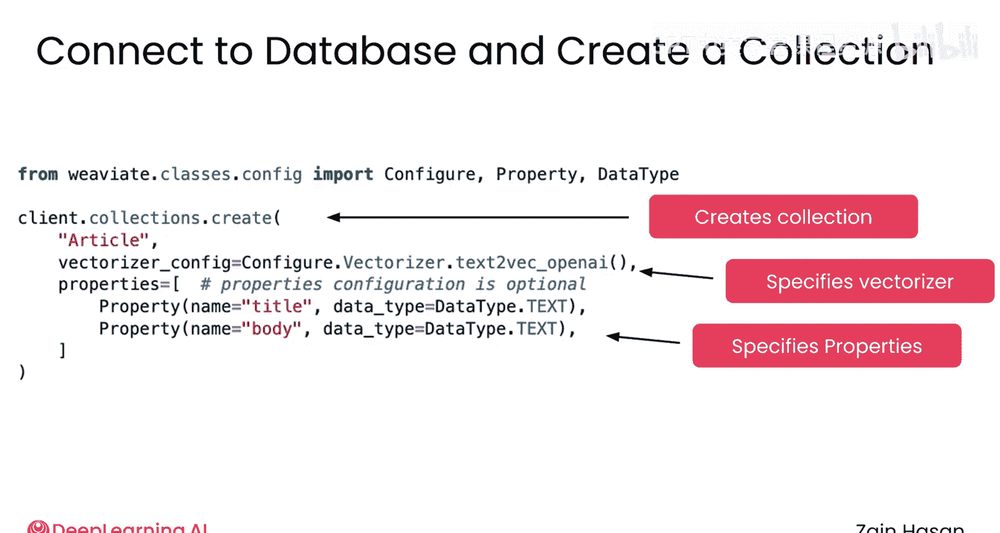
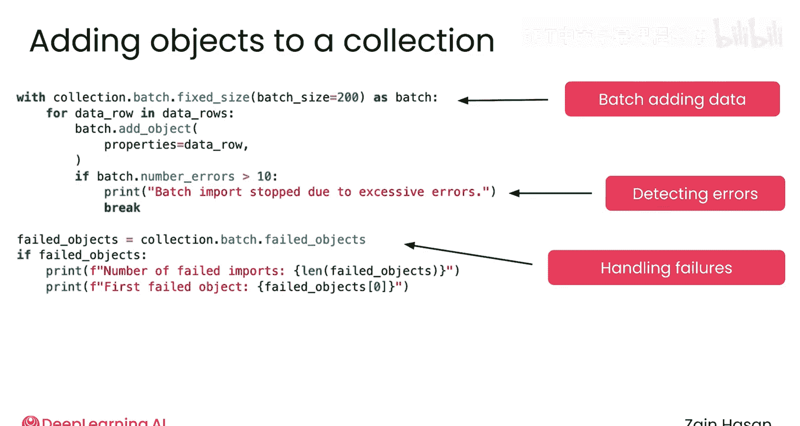
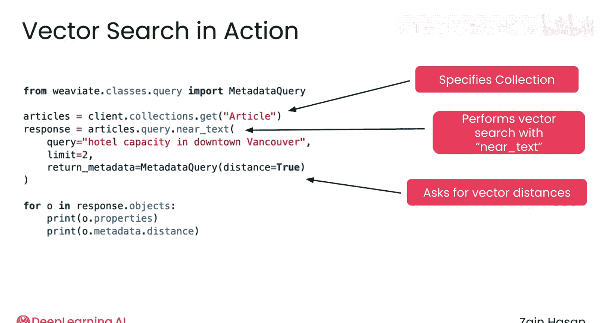
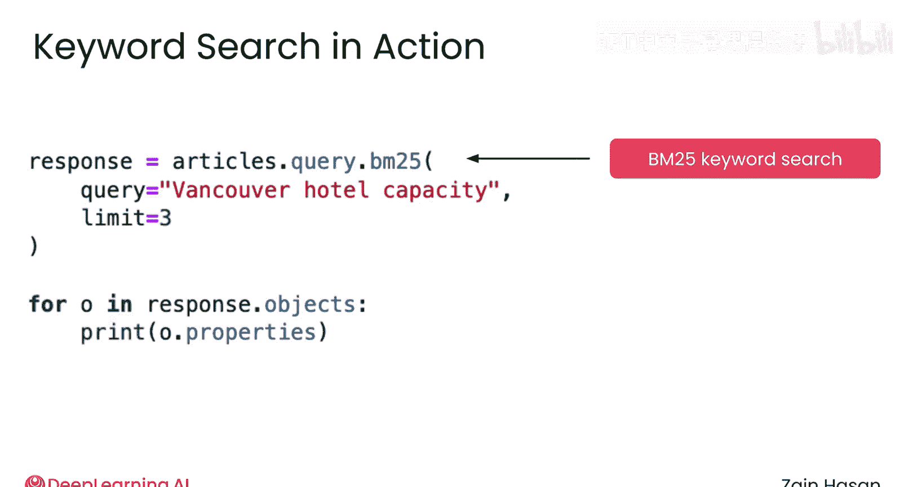
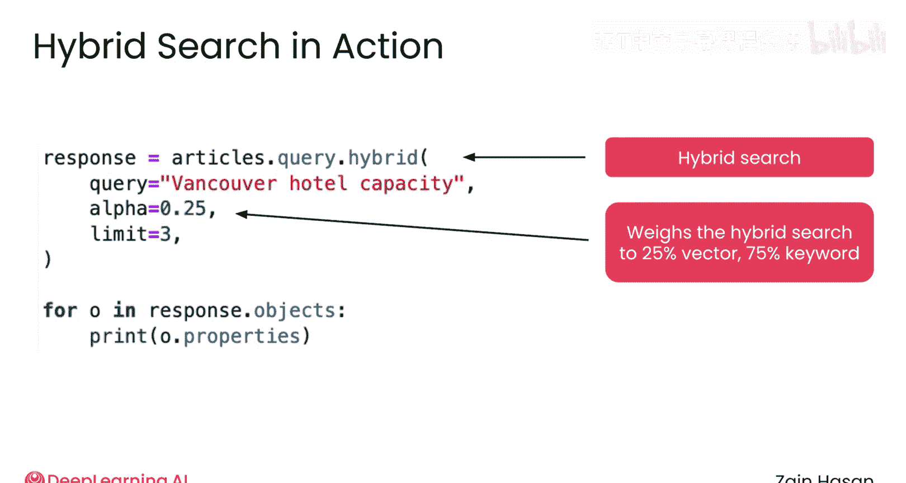
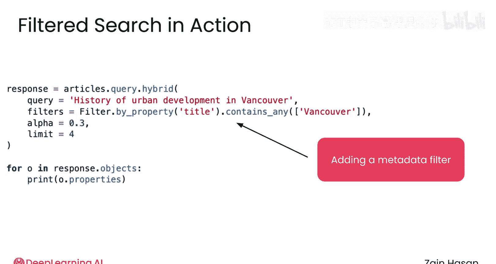
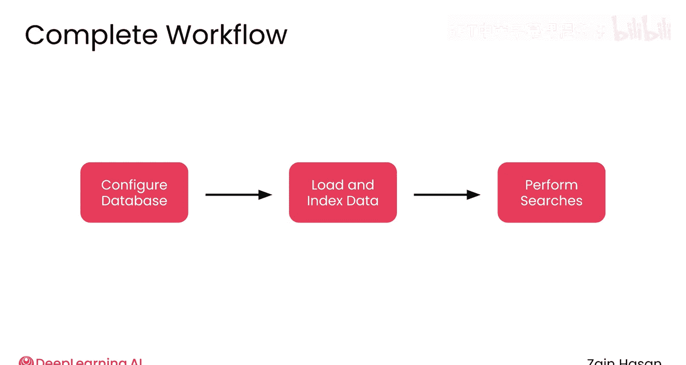

# 021：向量数据库技术 🗄️

在本节课中，我们将要学习向量数据库技术。向量数据库是生产级RAG系统的核心组件，专门用于高效存储和检索高维向量数据。我们将了解其基本操作、工作原理以及如何为RAG应用中的检索任务奠定基础。

## 什么是向量数据库？

上一节我们介绍了近似最近邻搜索算法，本节中我们来看看承载这些算法的专用数据库。

向量数据库是一种从底层设计用于存储高维向量数据并实现向量导向算法（如你刚看到的近似最近邻算法）的数据库。它们在2020年代初因大语言模型的普及和基于向量嵌入的技术（如语义搜索）的爆发而流行起来。

标准的关系型数据库在语义搜索任务上表现不佳，其性能更接近于效率极低的穷举最近邻算法。向量数据库针对构建支持HNSW搜索的邻近图或计算向量距离等任务进行了优化，因此在大多数基于向量的应用中，尤其是在构建RAG系统时，能够实现良好的扩展性和显著更快的运行速度。

## 向量数据库的选择与准备

本课程中你将使用的向量数据库叫做 **Weaviate**。它是一个流行的开源向量数据库，你可以在本地或云端运行。市场上也有多种其他向量数据库可供选择。如果你在未来项目中选择不同的向量数据库，它们几乎肯定会提供与Weaviate非常相似的功能。

这里的目的是让你亲身体验任何RAG项目中常见的一些工作流程。让向量数据库准备好处理搜索涉及几个步骤，其中一些是自动为你处理的。

以下是准备向量数据库以进行搜索的关键步骤：
1.  设置数据库。
2.  加载文档。
3.  创建支持关键词搜索的稀疏向量。
4.  创建支持语义搜索的密集嵌入向量。
5.  最后，创建支持近似最近邻搜索算法（如你刚看到的HNSW索引）的索引。

完成这些步骤后，你就可以运行实际的搜索了。



## Weaviate 操作示例

在接下来的非评分实验中，你将详细看到所有这些步骤。现在，让我们通过几个例子来看看这些步骤在Weaviate中是如何处理的。

### 第一步：创建或连接数据库

使用Weaviate的第一步是创建一个数据库实例或连接到现有的一个。你将在非评分实验中看到如何完成此操作的示例。



### 第二步：创建集合

接下来，你需要创建一个集合来保存数据。这里我创建的集合名为 `article`，用于保存新闻文章的标题和正文。此代码还指定了每种数据类型为文本。更重要的是，这个调用指明了应该使用哪个嵌入模型或向量化器来为添加的每篇文章创建语义向量。

```python
# 示例：在 Weaviate 中创建集合并指定向量化器
client.collections.create(
    name="article",
    properties=[
        Property(name="title", data_type=DataType.TEXT),
        Property(name="body", data_type=DataType.TEXT)
    ],
    vectorizer_config=Configure.Vectorizer.text2vec_openai()  # 指定使用的嵌入模型
)
```

### 第三步：插入数据



配置好集合后，就可以向其中添加数据了。这段代码使用集合的批处理方法添加数据。`batch.add_object` 实际上是将对象添加到集合中，但它也会计数和跟踪错误，从而可以在之后纠正错误，或者在遇到太多错误时中断循环。数据插入后，你就可以执行向量搜索了。

### 第四步：执行搜索

在第一个查询中，我指定了刚刚创建的集合，然后你可以传入一个文本查询。这里还传入了一个特定的元数据请求，它会返回距离。

```python
# 示例：执行向量搜索
response = client.query.get(
    "article",
    ["title", "body"]
).with_near_text({
    "concepts": ["你的查询文本"]
}).with_additional(["distance"]).with_limit(3).do()
```



这个距离将是查询向量与每个对象向量之间的距离。



### 第五步：关键词搜索与混合搜索

你也可以执行关键词搜索。Weaviate会自动为你创建一个倒排索引，它允许你映射每个文档中使用了哪些词以及使用频率。在这里，你可以执行你在上一个模块中学到的简单BM25查询，并要求基于此查询返回排名前三的文档。

你还可以继续以混合搜索的形式将向量搜索与关键词搜索结合起来。使用混合搜索时，关键词搜索和向量搜索将在后台并行执行，然后使用这个 `alpha` 参数（当前设置为0.25）来相应地对向量搜索和关键词搜索的分数进行加权。

因此，当 `alpha` 为0.25时，向量搜索获得25%的权重，另外75%的权重分配给关键词搜索。这些结果会相应地进行重新排名，然后我们得到排名前三的结果。在生产实践中，这是大多数公司使用的方法，因为它允许你平衡向量搜索的语义相似性和关键词搜索的严格匹配相似性。

```python
# 示例：执行混合搜索
response = client.query.get(
    "article",
    ["title", "body"]
).with_hybrid(
    query="你的查询文本",
    alpha=0.25  # 向量搜索权重为25%，关键词搜索权重为75%
).with_limit(3).do()
```



### 第六步：应用过滤器

你还可以在此基础上应用过滤器。例如，这里可以有一个应用于特定属性的过滤器，并检查该属性的值。如果匹配，对象通过过滤器并可以被返回。如果不匹配，则不会被返回。



```python
# 示例：在搜索中应用过滤器
response = client.query.get(
    "article",
    ["title", "body"]
).with_hybrid(
    query="你的查询文本",
    alpha=0.25
).with_where({
    "path": ["category"],  # 属性路径
    "operator": "Equal",
    "valueText": "科技"     # 过滤条件：category 等于 "科技"
}).with_limit(3).do()
```

## 工作流程总结

从开始到结束的整个循环大致如下：你配置数据库，然后加载并索引数据，最后编写一个包含混合搜索和过滤器的特定查询。



这就是如何使用向量数据库的一个很好的概述。请查看非评分实验，亲自动手实践所有这些步骤。

## 课程总结



本节课中我们一起学习了向量数据库技术。我们了解到向量数据库是专为高效处理高维向量和相似性搜索而设计的数据库，是RAG系统的关键基础设施。我们以Weaviate为例，学习了从创建集合、插入数据、生成向量索引，到执行向量搜索、关键词搜索、混合搜索以及应用过滤器的完整工作流程。掌握这些操作是构建高效、可扩展的生产级RAG应用的基础。