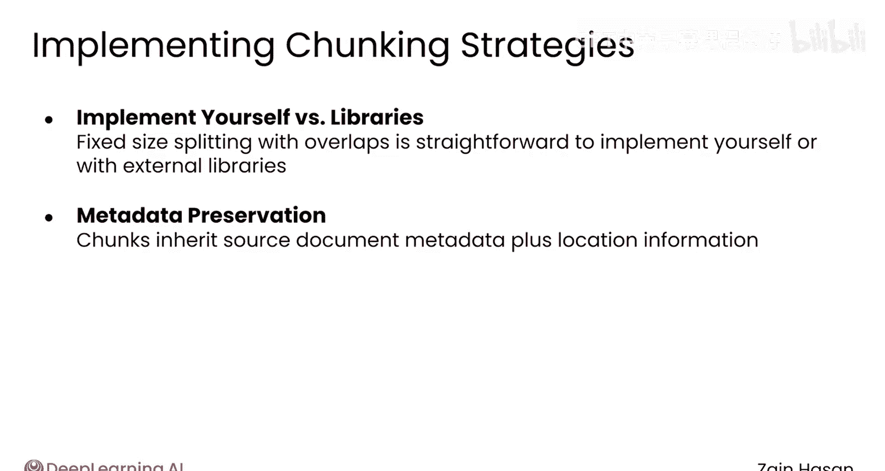

# 022：文本分块技术 🧩

在本节课中，我们将要学习文本分块技术。这是优化检索增强生成系统性能的关键策略之一，旨在将长文档分解为更小、更易于管理的片段，以提升检索的准确性和效率。

## 概述

上一节我们介绍了向量数据库的架构和API。本节中我们来看看如何通过文本分块技术来优化向量检索。简单来说，分块就是将知识库中的较长文本文档拆分为较小的文本块。

## 为何需要分块？

分块的原因主要有三点：
1.  许多嵌入模型对单次可嵌入为向量的文本长度有限制。
2.  分块可以提高检索器的搜索相关性指标。
3.  分块确保只将文档中最相关的文本发送给大语言模型。

为了理解分块的价值，假设你有一个包含一千本书的知识库。如果直接索引，每本书会被嵌入模型向量化，结果是1000个向量，每个向量代表一本书的全部内容。问题在于，你将整本书的含义压缩到了一个向量中。这些向量无法精确表示特定章节或页面中讨论的任何具体主题，而是对所有内容进行了平均。因此，搜索相关性会很差。即使使用这个系统进行检索，每次也会检索整本书，这会迅速填满大语言模型的上下文窗口。

因此，通常需要将书籍分块成更小的片段，例如页面、段落或句子级别。这样，你的知识库可能包含100万个段落，而不是1000本书，但向量数据库可以轻松扩展以存储和搜索所有这些向量。

## 如何选择分块大小？

分块时的首要考虑因素是使用多大的分块尺寸。如果分块太大，例如在章节级别，就会遇到与向量化整本书相同的问题。分块仍然太大，无法用单个向量捕捉细微的含义，并且会迅速填满大语言模型的上下文窗口。

反之，分块也可能太小。考虑极端情况：按单词分块。向量将丢失周围句子和段落的所有上下文，这同样会降低搜索相关性。即使在句子级别分块也可能过于精细。

没有一种适用于所有情况的分块大小，但通常你会在“向量试图一次捕获过多上下文”和“捕获过少上下文”之间找到一个平衡点。

## 分块策略

以下是两种常见的分块策略：

### 固定大小分块

最简单的方法是使用固定大小的分块策略。一开始就确定每个分块大小相同，例如250个字符。
*   字符1到250是分块1。
*   字符251到500是分块2。
*   字符501到750是分块3，依此类推，直到文档结束。

当然，这不能保证分块之间的分割点位于合理的位置。分割通常可能落在一个单词的中间，或者将一个段落中连贯的思想分开。

这通常通过允许分块重叠来解决。例如，分块可能长250个字符，但与前后分块重叠25个字符。
*   分块1是字符1到250。
*   分块2是字符226到475。
*   分块3是字符451到700，依此类推。

通常，这种重叠表示为整个分块的百分比。这里就是10%的重叠。重叠分块可以最大限度地减少单词与其上下文被切断的情况。位于分块中间的单词有其两侧的上下文，位于分块边缘的单词会出现在两个分块中，增加了它们与相关上下文一起出现的几率。

允许更多重叠通常会对搜索相关性产生积极影响，但代价是向数据库中添加了更多包含冗余信息的向量。

### 递归字符文本分割

一种更动态的分块策略称为递归字符文本分割。其思想是选择一个特定的字符进行分割。例如，可以按换行符分割，这通常出现在段落之间。这会产生可变的分块大小，因此根据换行符的位置，你更有可能得到非常大或非常小的分块。

然而，这样做的好处是，你考虑了文档结构，并增加了相关概念被保留在单个分块内的机会。如果你的知识库有各种文档类型，当然可以对不同类型的文档进行不同的分割。例如，可以按段落或标题标签分割HTML，按函数定义分割Python代码，按换行符分割文本文档。

## 实践与工具

固定大小重叠分块或按特定字符分块非常简单，你可以自己实现，但也可以找到专门帮助你完成此任务的外部库。如果你的文档有元数据，你当然会希望分块继承其源文档的元数据，可能还会附带关于其位置的其他信息。你将在本模块的未评分实验中看到如何实现这一点的示例。

## 总结

本节课中我们一起学习了文本分块技术。对文档进行分块对向量检索有多种好处，从提高搜索相关性到最小化大语言模型上下文窗口的使用。如果你在寻找一个好的起点，只需使用大约500个字符的固定大小分块，并设置50到100个字符的重叠。在某些其他情况下，更高级的分块技术可能会有所帮助，所以请继续观看下一个视频，探索其中一些技术的样子。