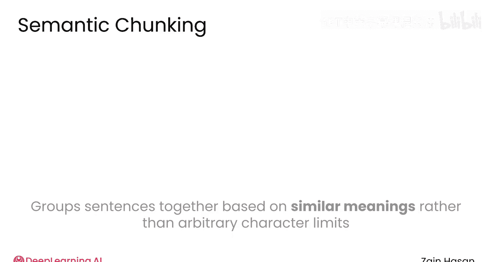
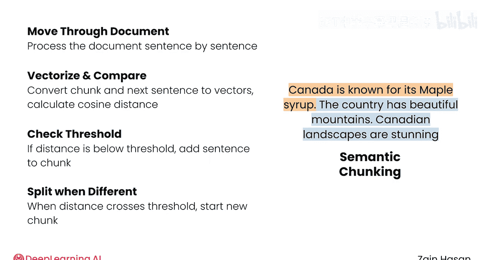
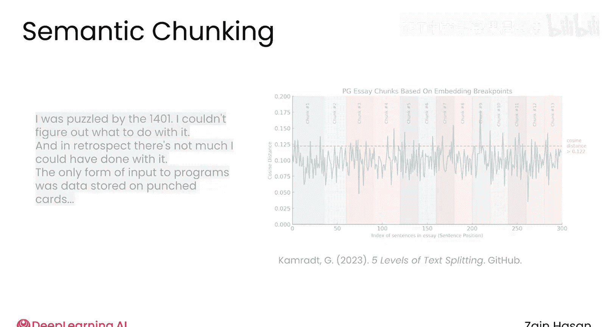
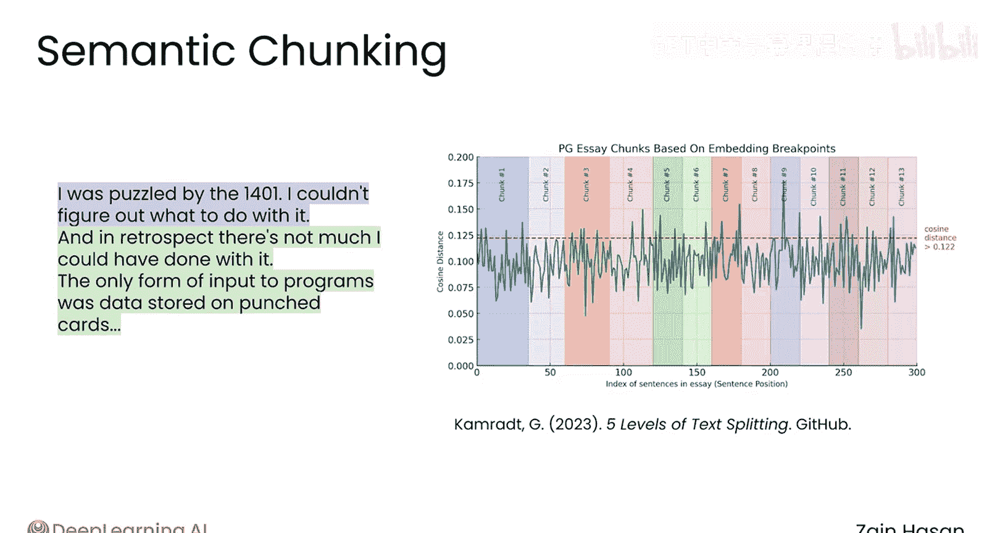
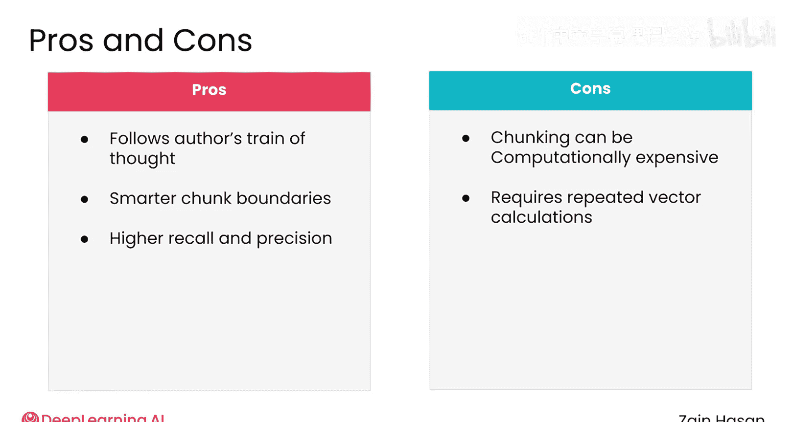
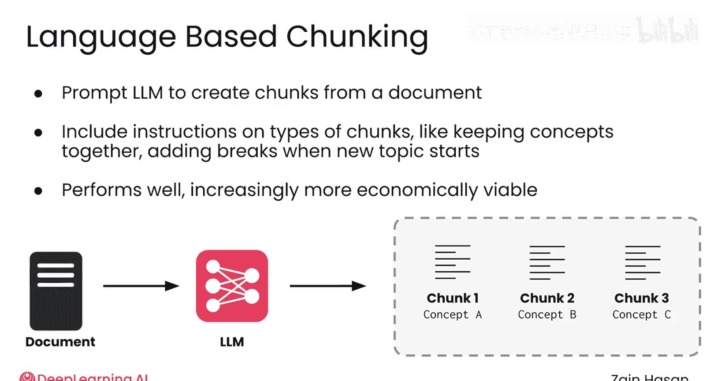
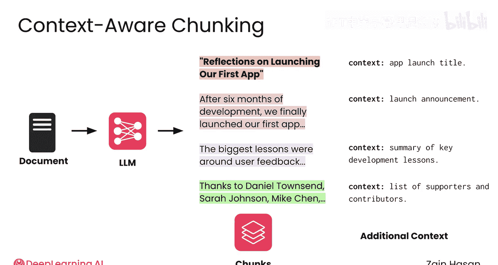
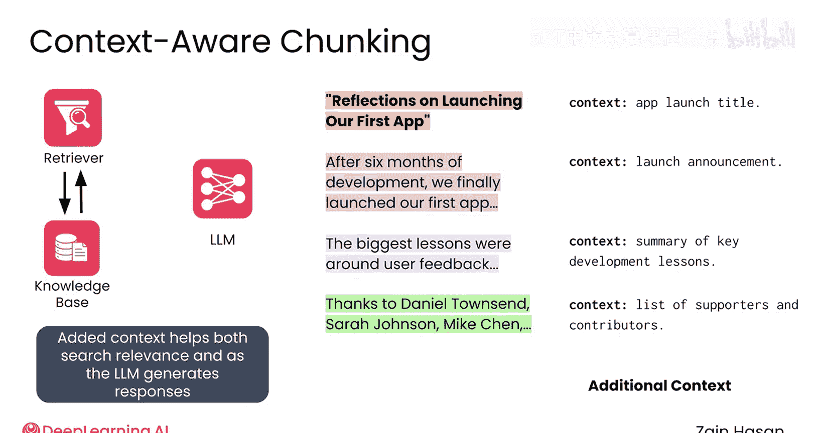
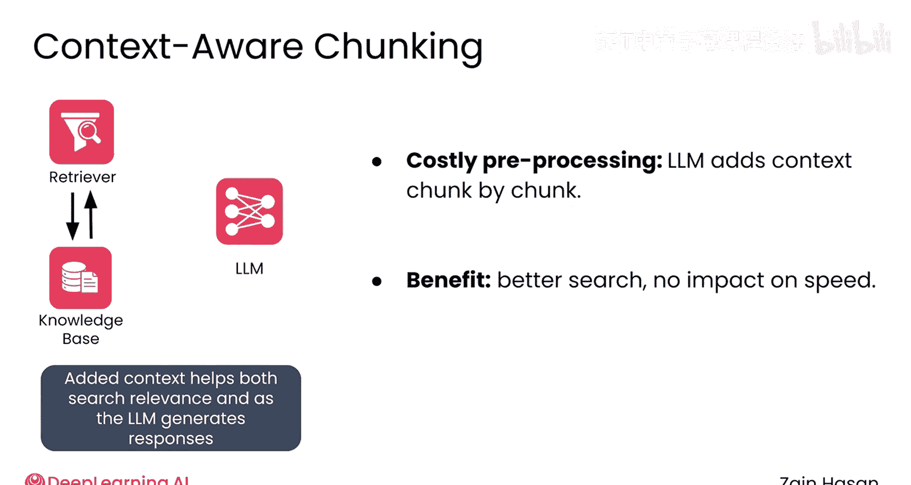
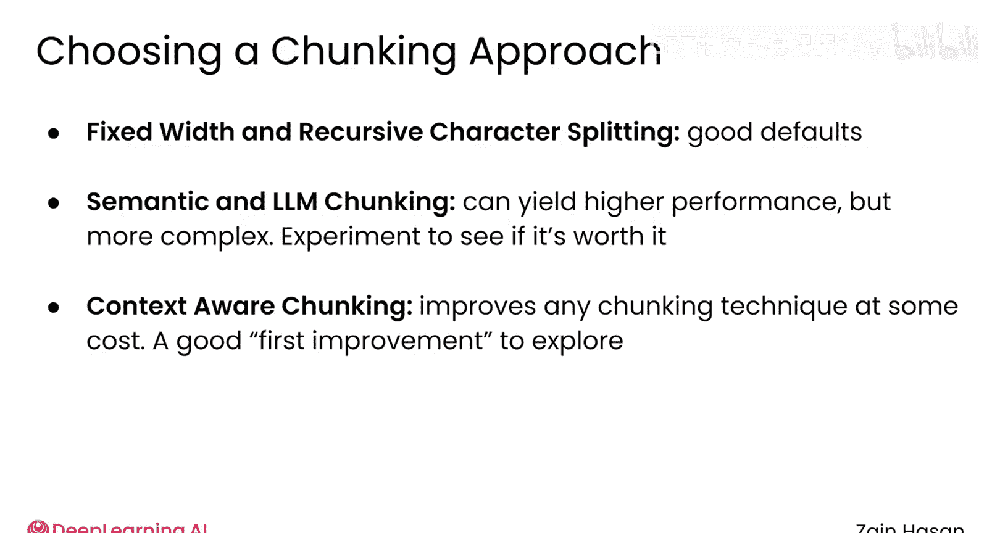

# 023：高级分块方法论 🧩

在本节课中，我们将要学习几种超越固定大小和递归字符分割的高级分块技术。这些方法旨在根据文本的语义来构建分块，从而更好地保留上下文信息，提升检索质量。

分块有多种好处，但将文档分割成较小的块也存在风险，即可能以丢失相关上下文的方式破坏文本的连贯性。

考虑这个句子：“那天晚上，她像往常一样梦到，自己终于成为了奥运冠军。” 根据分割位置的不同，分块可能会让读者误以为做梦者已经是金牌得主，而不是在梦想未来的荣耀。固定大小和递归字符分割无法防止这类问题。因此，让我们来看看一些更高级的技术，它们试图基于文本的含义来智能地构建分块。

## 语义分块

上一节我们介绍了基础分块方法的局限性，本节中我们来看看第一种高级技术：语义分块。这种方法尝试将含义相似的句子放在同一个分块中。

该算法的工作原理是逐句遍历文档。对于每个句子，算法会判断它与之前句子的相似度是否足够高，从而决定它是否属于同一个分块。

以下是算法的核心步骤：
1.  将当前累积分块的内容和下一个待判断的句子分别向量化。
2.  计算两个向量之间的距离。
3.  如果距离低于某个预设的阈值（表示含义相似），则将新句子加入当前分块。
4.  如果距离超过阈值（表示含义不同），则切断当前分块，并从下一个句子开始新的分块过程。

这个过程持续进行，直到遍历完整个文档。当用图表表示时，增长中的分块与后续句子的差异度由峰值线表示，而向量距离或差异度的阈值用红线表示。

最终，分块与下一个句子之间的差距会超过阈值，从而创建一个新的分块。

这个过程的结果是生成大小可变的分块，这些分块遵循作者的思路。例如，如果作者在一个段落中偏离主题进行概念性探讨，或者连续两个段落讨论同一个想法，语义分块都会在合适的位置进行分割。

可以想象，语义分块在计算上可能比较昂贵，因为你需要为知识库中的每个句子反复计算向量。然而，作为交换，你通常会获得更高质量的检索结果，这可以通过精确率和召回率等熟悉指标来衡量。

## 基于大语言模型的分块

为了获得更大的灵活性，你可以尝试基于大语言模型的分块。这种方法将文档连同你希望创建的分块类型的指令一起提供给语言模型。

例如，你可以指示它根据含义来分隔分块，将相似的概念保留在一个分块中，并在讨论新主题时将文本分割成不同的分块。然后，语言模型会像生成任何其他文本一样生成分块输出。

虽然这本质上是一种“黑盒”方法，但它实际上是一种性能非常高的分块策略。随着语言模型成本的下降，基于大语言模型的分块在经济上变得更加可行。

## 上下文感知分块

对任何分块策略的最后一个改进是使用语言模型为每个分块添加上下文。

例如，你可以要求语言模型从文档中创建分块，但同时为每个分块添加总结性文本，解释其在更广泛文档中的上下文。一位作者可能在博客文章的结尾感谢一系列支持者和贡献者。

这意味着在博客文章末尾附近会有一个分块，其中只是一长串名字，使得这个分块本身难以理解。大语言模型可以为该分块添加文本，解释其在整篇博客文章中的上下文。

这些添加的文本在分块被向量化时可用，有助于提高搜索相关性；在分块被检索到时也可用，最终帮助大语言理解分块的整体含义。

上下文感知分块需要计算成本较高的预处理，因为大语言模型需要逐个文档、逐个分块地遍历你的整个知识库来添加上下文。然而，其好处是搜索更相关，并且对搜索速度基本没有影响。

## 如何选择分块策略

大多数RAG系统都会实现某种形式的分块。然而，使用何种复杂程度的方法取决于具体情境。

以下是选择分块策略的考量点：
*   **固定大小或递归字符分割**通常是构建系统原型时的良好起点，也是不错的默认方法。
*   **语义分块和基于大语言模型的分块**可以带来更高的性能，但它们在计算上更昂贵，并且可能难以调整、维护或审计。
*   更合理的做法是使用一小部分数据子集进行实验，看看这些更高级的技术是否真的能提高搜索相关性。
*   由于上下文感知分块可以应用于任何分块策略之上，并且可以同时改善搜索相关性和后续生成效果，它通常是探索固定大小技术之外的首个改进方向。

作为RAG系统的设计者，目标不是实现市场上最前沿的分块技术，而是了解有哪些可用的选项，它们对你的数据有多合适，以及实施的成本和收益是否值得在你的系统中采用。

本节课中我们一起学习了三种高级分块方法论：语义分块、基于大语言模型的分块以及上下文感知分块。希望这次对分块技术的快速概览能为你做出这些决策奠定坚实的基础。