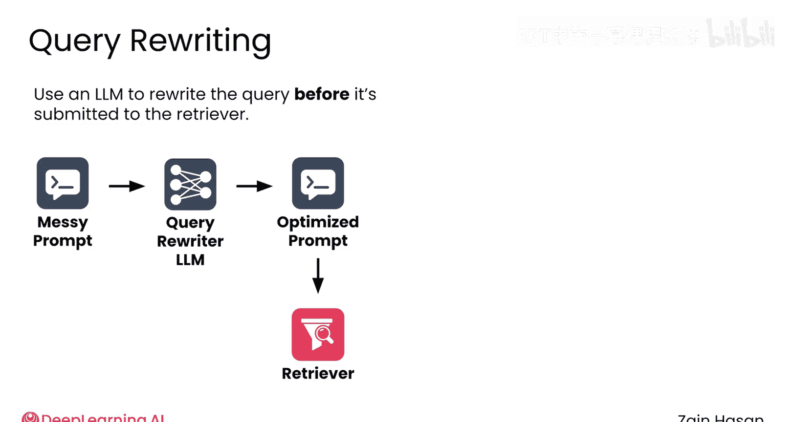
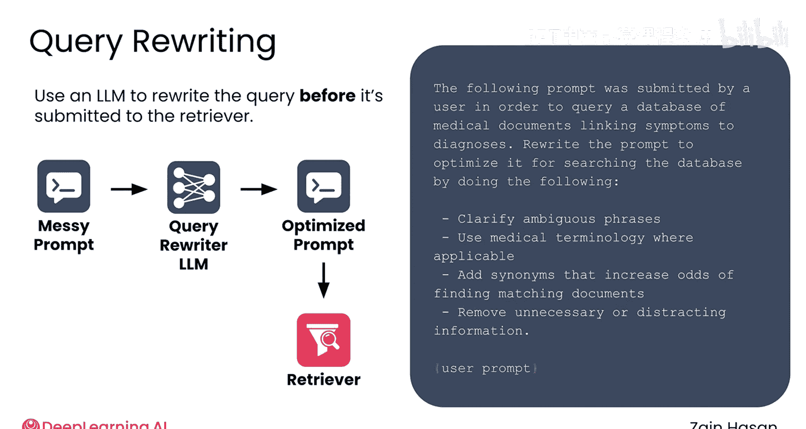
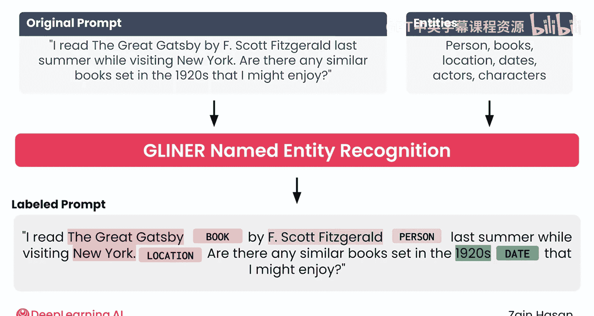
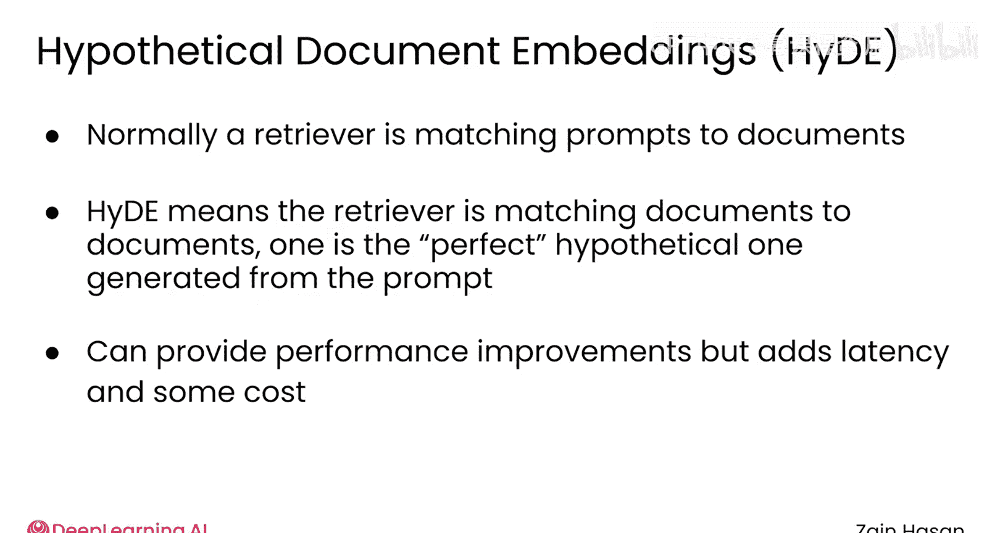

# 024：查询语句解析 🔍

在本节课中，我们将要学习生产级RAG系统中一个至关重要的步骤：清理和优化用户提交的查询提示。用户通常以对话方式与LLM交互，但这些自然语言提示往往不适合直接用于向量数据库检索。我们将探讨如何通过解析查询意图、改写或转换提示来优化检索效果。

## 查询解析的必要性

生产级RAG系统的一个重要步骤是清理用户提交的提示。

RAG系统通常部署在终端用户期望以对话方式与LLM交互的场景中，就像与另一个人聊天一样。因此，人类书写的LLM提示往往不适合作为检索查询。

与其将这些提示直接输入向量数据库，检索器可以解析提示以识别其意图，并编辑、改写或完全转换提示以优化检索效果。

有多种查询解析技术，让我们来看其中几种。

## 基础查询改写

处理杂乱提示最简单且目前应用最广泛的解决方案，是在将查询提交给检索器之前，使用LLM对其进行改写。

例如，考虑一个围绕医学信息知识库构建的RAG系统。

你可以设置一个LLM作为查询改写器，并赋予其如下提示：

> 以下提示由用户提交，用于查询一个链接症状与诊断的医学文档数据库。请通过以下方式改写该提示以优化其数据库搜索效果：澄清模糊短语，在适用时使用医学术语，添加能提高匹配文档几率的同义词，移除不必要或分散注意力的信息。

然后插入用户提示。

用户可能提交如下提示：

> 我出去遛我的狗，一只名叫Poppy的漂亮黑色拉布拉多，她突然从我身边跑开，在我牵着绳子时猛地一拽。😊。三天后，我的肩膀仍然麻木，手指也像针刺一样。这是怎么回事？

这个提示显然没有为检索进行优化。

以下是经过查询改写器处理后的改写提示：

> 肩部经历突然、猛烈的拉扯，导致肩部持续麻木和手指麻木三天。潜在原因或诊断是什么，例如神经病变或神经压迫。

这个新提示移除了不必要的信息，澄清了模糊之处，甚至使用了可能提高知识库匹配几率的医学术语。

虽然你可以并且应该迭代用于查询改写的提示，但从中获得的收益是巨大的，并且很容易证明为清理每个提示所需的额外LLM调用成本是合理的。

## 高级查询解析技术

虽然基础查询改写通常是你唯一需要考虑的查询解析技术，但确实存在更高级的技术。

例如，命名实体识别是一种识别查询中信息类别的技术，如地点、人物、日期、虚构角色等。这些信息随后可用于通知检索器执行的向量搜索，或流程后期的元数据过滤。

这里有一个名为Giner的模型示例，它是一个通用的命名实体识别模型。你可以给它一段文本，以及一个你希望它识别的实体类型列表，比如人物或日期。模型将分析查询并返回一个带有这些类别标识的标记化查询。

在这个特定示例中，我提供了一些输入文本，并告诉Giner模型尝试标记任何提及的人物、书籍、地点、日期、演员和角色。在响应中，你可以看到它标记了每次看到这些不同实体的地方。

这是一个非常高效的模型，我们可以在每次查询到来时运行它。包含这一步会增加一点额外的延迟，但检索质量因此可以得到显著提高。

另一个高级查询解析技术称为假设文档嵌入。

## 假设文档嵌入

这种方法通过生成一个理想的搜索结果——即假设文档——来优化搜索查询。

例如，如果你试图检索关于之前那个医学问题的信息，将使用一个LLM来生成一份关于因快速拉扯导致肩部和手部麻木的假设文档，然后嵌入该假设文档，并使用其向量表示来完成实际搜索。

这里的理念是，你不仅帮助检索器理解提示或问题的意图，还理解高质量结果应该是什么样子。

通常，检索器需要将提示与文档进行匹配。因此，在某种程度上，检索器是在匹配不同类型的文本，或者说是在比较苹果和橘子。

通过生成一个假设文档，检索器现在可以比较更相似的文本：一份假设的完美文档，以及知识库中实际包含的文档。

在实践中，HyDE确实能提供性能改进，代价是搜索中增加了一些延迟，以及运行生成假设文档的LLM所需的一些计算资源。

## 总结与建议

根据我的经验，拥有某种查询解析功能是RAG系统的关键部分。

在几乎所有情况下，基础查询改写——即使用一个精心设计的提示让LLM对用户提交的提示进行基本修饰——是正确的方法。

更高级的技术，如使用命名实体识别、HyDE等，可能会带来额外的好处，但它们运行起来可能更复杂，并且不一定能产生更好的结果。可以尝试这些高级技术，并让结果决定你的项目需要如何发展。

在本节课中，我们一起学习了RAG系统中查询解析的重要性。我们探讨了基础查询改写技术，它通过LLM优化用户提示以提高检索相关性；也介绍了命名实体识别和假设文档嵌入等高级技术，它们能进一步细化搜索意图和提升匹配精度。对于大多数应用，从基础查询改写开始通常是最佳实践。