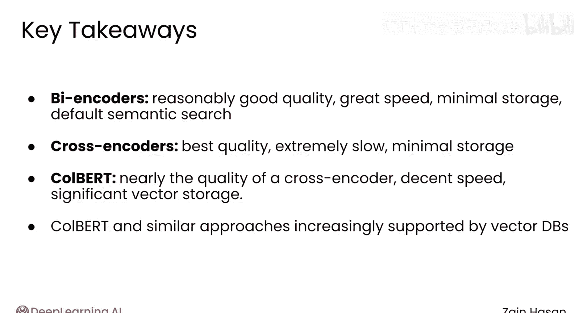

# 025：交叉编码器与ColBERT模型 🧠

在本节课中，我们将要学习两种更先进的语义搜索架构：交叉编码器和ColBERT模型。我们将探讨它们的工作原理、各自的优缺点，以及它们如何在不同场景下提供比基础的双编码器更高质量的检索结果。

## 概述

到目前为止，我们所见的语义搜索技术都使用了基础的架构。每个文档和提示词都被分配一个单一的向量，通过比较这些向量来找到与提示词相似的文档或文本块。虽然这种方法效果很好，但使用更复杂的架构可以实现更高质量的检索。让我们来看看其中的两种：交叉编码器和ColBERT，并考虑它们的优缺点。

## 双编码器架构回顾

本课程中用于驱动语义搜索的架构被称为**双编码器**。文档通过嵌入模型被分配一个语义向量。当收到提示词时，它也会被嵌入成一个向量。然后，向量数据库使用近似最近邻算法来快速识别向量与提示词向量接近的文档。

术语“双编码器”指的是文档和提示词是**分开嵌入**的。这很重要，因为它意味着所有文档都可以提前嵌入，只需要在收到提示词后嵌入提示词本身，从而显著加快了搜索速度。

然而，如果你愿意牺牲一些速度，你可以获得更高质量的搜索结果。

## 交叉编码器：追求最高质量

让我们从**交叉编码器**开始，它可以提供比双编码器质量高得多的文档排序。

为了给文档打分，交叉编码器将文档与提示词**拼接**起来，然后将组合后的文本传递到一个本质上是专门的嵌入模型中。由于提示词和文档都在输入中，这使得模型能够理解提示词和文档文本之间深层的上下文交互，而这些交互可能是双编码器会遗漏的。

交叉编码器被设计为直接输出一个相关性分数，通常是一个介于0和1之间的数字。你可以将这个分数看作是提示词与文档之间匹配为正的概率。

以下是交叉编码器的工作原理。假设你的知识库中有三个文档，并且你收到了提示词：“great places to eat in New York”。

1.  交叉编码器将提示词拼接到每个文档的前面。
2.  每个“提示词-文档”对然后通过交叉编码器。
3.  交叉编码器输出提示词与文档匹配的概率。

如果这是一个训练有素的交叉编码器，你会期望第一个文档得分相当高，比如0.7或70%，因为该文档与提示词相当相关。然后，你对每个文档重复这个过程：将提示词拼接到前面，通过交叉编码器架构传递“提示词-文档”对，并生成一个分数。

与双编码器相比，交叉编码器几乎总是能提供更好的搜索结果，这是通过搜索相关性等常见指标来衡量的。

交叉编码器的主要问题是其**扩展性极差**。你的知识库可能轻松拥有数百万甚至数十亿的文档，这意味着对于每一个提示词，你都需要通过交叉编码器运行数十亿个“文档-提示词”对来生成每个文档的相关性分数。你也不能进行任何预处理来加速，因为交叉编码器是在“提示词-文档”对上运行的，而在用户提交之前你不会有提示词。

因此，交叉编码器效率太低，无法作为默认的搜索技术，但其结果的质量使其成为改进其他搜索技术结果的绝佳工具，这一点你将在本课程稍后部分进行探索。

## ColBERT：速度与质量的折衷

一些技术试图在双编码器的速度和交叉编码器的质量之间取得平衡。让我们来看看一个越来越受欢迎的最终架构，称为**ColBERT**。

ColBERT代表“基于BERT的上下文化后期交互”。ColBERT的理念是，你仍然像在双编码器中一样提前生成文档向量，但试图像交叉编码器一样捕捉提示词文本与每个文档之间更深层的交互。

以下是其工作原理：

1.  首先，对知识库中的每个文档进行嵌入。但不是为整个文档生成一个语义向量，而是为文档中的**每个词元**生成一个语义向量。因此，一个包含1000个词元的文档需要被转换成1000个密集向量。
2.  当提示词传入时，它以同样的方式被嵌入，为提示词中的每个词元生成一个密集向量。

现在，ColBERT中打分的核心理念是，提示词中的每个词元都试图在文档中找到与其最相似的词元。

让我们看一个例子来了解它是如何工作的。我们使用之前相同的四个文档和提示词“Great places to eat in New York”，看看第一个文档是如何被打分的。

首先，算法找到文档和提示词中每对词元之间的向量距离，或者说相似度分数。如果提示词有10个词元，文档有100个，结果就是一个包含1000对相似度分数的网格。

这创建了一个网格，显示每个文档词元与提示词词元的相关程度。例如，提示词中的词元“New”和“York”会与文档中的“New”、“York”和“city”匹配得很好，而“eat”会与“cuisine”匹配良好。

每个提示词词元都会有一个与其具有最高相关性分数的文档词元。这些最高分数被**求和**，以得到整个文档的一个相关性分数。这被称为**最大相似度分数**。

对知识库中的每个文档重复此过程，可以对所有文档进行评分并检索最相关的文档。

ColBERT既提供了双编码器的可扩展性，又提供了交叉编码器中发现的提示词与文档之间的大部分丰富交互。虽然对每个“文档-提示词”对进行评分所需的计算量比双编码器更大，但它仍然相当快，可以在需要实时或接近实时搜索的上下文中使用。

ColBERT架构的最大缺点是，你需要存储的向量数量与提示词和文档中的词元数量成比例增加。如果你有一个2000个词元的文档，你需要存储2000个向量。而在双编码器中，你只需要存储一个密集向量。

## 架构对比与总结

在本节课中，我们一起学习了三种主要的语义搜索架构：

*   **标准双编码器模型**提供了相当好的质量、极快的速度，并且需要最少的向量存储空间。这组特性使其成为语义搜索的默认架构。
*   **交叉编码器**在搜索质量方面提供了黄金标准，但它们速度太慢，以至于无法作为默认搜索技术使用。
*   **ColBERT**提供了接近交叉编码器的质量，但速度更接近双编码器。这种权衡的代价是它需要存储数量级更多的向量数据。

越来越多的向量数据库开始提供对ColBERT或类似方法的支持，特别是对于需要精确性和深度上下文理解的项目。例如，在法律或医学领域，为了搜索质量而显著增加向量存储内存占用可能是值得的。

交叉编码器本身用于搜索的计算成本太高，但幸运的是，它们并不需要单独使用。在下一个视频中，我们将一起看看交叉编码器是如何被集成到生产检索系统中的，尽管它们效率低下。