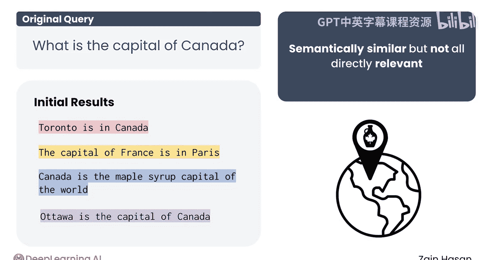
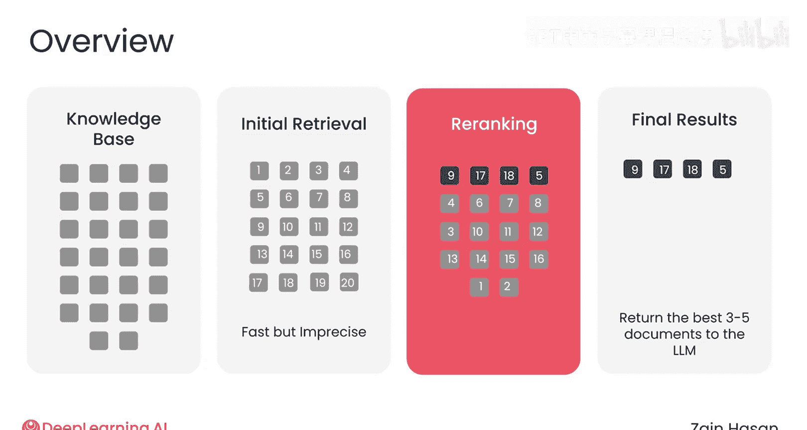
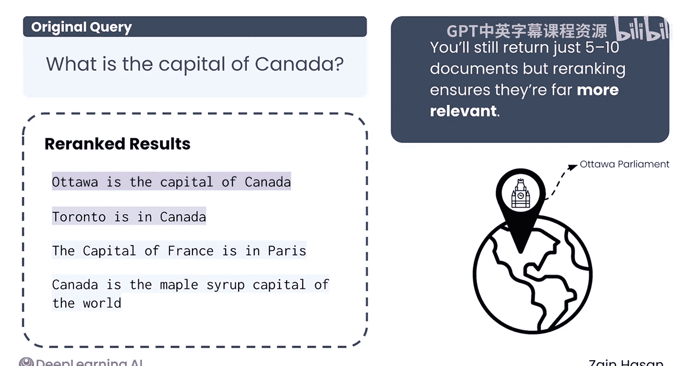
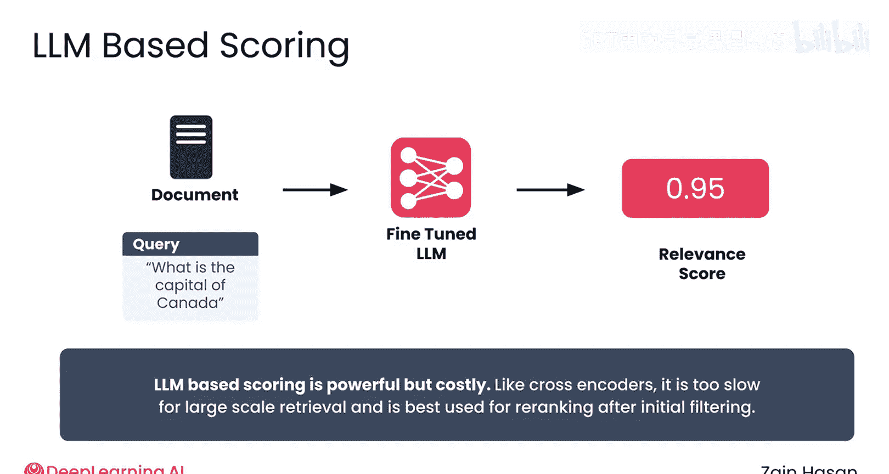

# 026：结果重排序技术 🎯

在本节课中，我们将要学习一种结合多种搜索技术优势的方法——结果重排序。这是一种在向量数据库初步检索之后，使用更强大但成本较高的模型对文档进行重新评分和排序的技术，旨在确保返回最相关的文档。

## 概述

上一节我们介绍了混合搜索，本节中我们来看看如何通过“重排序”技术进一步提升检索质量。重排序是在向量数据库返回初始结果集之后、将结果发送给大语言模型之前的一个后处理步骤。其核心在于利用更强大的模型对已检索到的文档进行重新评分和排序。

## 重排序的工作原理

重排序旨在改善已检索到的文档或文本块集合的质量。一旦向量数据库返回结果，重排序器便会介入，使用性能更强但成本更高的模型对这些检索到的文档进行重新评分和排序。

由于只需要对少量文档进行重评分和重排序，因此可以使用那些在搜索整个知识库时因成本过高而不切实际的高性能模型。

让我们看一个简化的例子。如果用户提问是“加拿大的首都是什么？”，你的向量数据库可能会检索到语义相关但并未直接回答问题的文档。

例如：
*   “多伦多在加拿大。”
*   “法国的首都是巴黎。”
*   “加拿大是世界枫糖浆之都。”

这些句子都与提问有某种语义关联，但最终都没有回答问题。这时，重排序器就可以介入，对这些结果进行重新评分和排序，从而最终只返回真正相关的文档。

## 重排序的实施流程

在使用了重排序器的系统中，你通常会在初始的向量数据库检索中“过量获取”文档。

以下是典型的实施步骤：
1.  **初始检索**：使用混合搜索等方法，检索出较多数量的文档（例如20到100个）。
2.  **重排序**：重排序器对这些文档进行重新评分，生成最终的排名。

最终，你仍然只返回向量搜索检索到的文档中的一个子集（例如，得益于重排序器，返回5到10个）。然而，这些经过重排序的文档将比仅进行简单混合搜索得到的结果相关性高得多。

## 重排序模型架构

通常，重排序器采用**交叉编码器**架构。

正如之前所见，交叉编码器比标准的**双编码器**能提供更好的结果，但速度明显更慢，对于数百万或数十亿的文档来说不切实际。然而，如果双编码器已经缩小了需要考虑的文档列表范围，那么在质量与时间之间的权衡就变得合理得多。

即使只对通常的20到100个文档进行重排序，交叉编码器也会给整个系统增加一点延迟。但这种权衡几乎总是值得的。

## 基于大语言模型的重排序

目前，基于大语言模型的重排序也越来越被使用。其思路与交叉编码器相当类似，但不是将“提示-文档”对提供给交叉编码器进行重排序，而是直接提供给一个大语言模型。专门为此任务设计的大语言模型能够分析这对信息，评估其相关性，并返回一个数值化的相关性分数。

虽然前景看好，但这种方法本质上和交叉编码器一样低效。在两种情况下，都必须等到收到提示后才能开始评分，并且对单个文档进行评分仍然是一个相对昂贵的操作。因此，基于大语言模型的评分方法可能会进一步改进，但它将始终是一种重排序技术，只能在典型的向量搜索缩小了需要重排序的文档列表之后使用。

## 重排序的优势与实现

虽然RAG系统并不严格要求使用重排序，但它通常很容易实现，并且能为许多向量数据库带来更好的性能。实现起来可以像在你的搜索查询中添加一行代码一样简单，表明你想要使用重排序器。

因此，当试图提高搜索相关性时，使用重排序器是你应该首先考虑添加到RAG流程中的技术之一。通常，你可以过量获取15到25个文档，然后在它们之间进行重排序，从而以增加少量延迟为代价，显著提升相关性。

## 总结

本节课中我们一起学习了结果重排序技术。我们了解到，重排序是一种在初步向量检索之后，使用高性能模型（如交叉编码器或专用大语言模型）对结果进行二次评分和排序的后处理步骤。它通过“过量获取再精筛”的策略，有效提升了最终返回给大语言模型的文档的相关性，是优化RAG系统检索质量的一个简单而强大的工具。