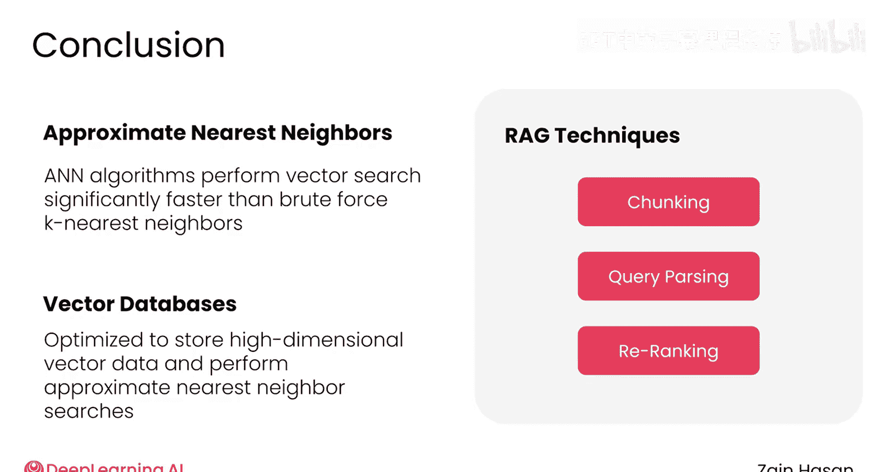

# 027：总结 🎯

在本模块中，我们一起学习了构建高效检索器的核心技术与方法。现在，让我们对所学内容进行回顾与总结。

## 模块回顾 📋

以下是本模块涵盖的主要知识点：

首先，我们介绍了**近似最近邻算法**。该算法执行向量搜索的速度远快于暴力最近邻搜索，其代价是可能无法在知识库中找到绝对最佳匹配的文档。

接下来，我们认识了**向量数据库**。这类数据库专为存储高维向量数据和执行近似最近邻搜索而优化，使其成为扩展RAG系统时的首选数据库。

之后，我们探讨了生产级RAG系统中常用于提升检索效果的几种技术。**文档分块**将文档分割成更小的片段，使向量能更精确地捕捉文本片段的含义，并减少在大型语言模型上下文窗口中的占用空间。**查询解析**优化用户提交的提示词，使其更适合检索。最后，**重排序**利用高性能架构，在向量数据库通过标准混合搜索检索到的文档集合中，更好地识别相关文档。

对于上述每种技术，我们既学习了适用于大多数项目的标准方法，也了解了一些有时能进一步提升检索器性能的高级技巧。

最后，在模块末的实践项目中，我们亲手应用了这些概念，在一个功能性的RAG系统中实现了它们。

## 技能掌握 ✅

现在，你已经掌握了建立强大检索器所需的所有技能。

## 后续展望 🚀

接下来，是时候将注意力转向RAG系统的另一个主要组件了——那个将实际处理所有检索到的文档并生成响应的大型语言模型。

所以，请加入下一个模块，让我们一起深入探索如何最大限度地发挥大型语言模型的潜力。