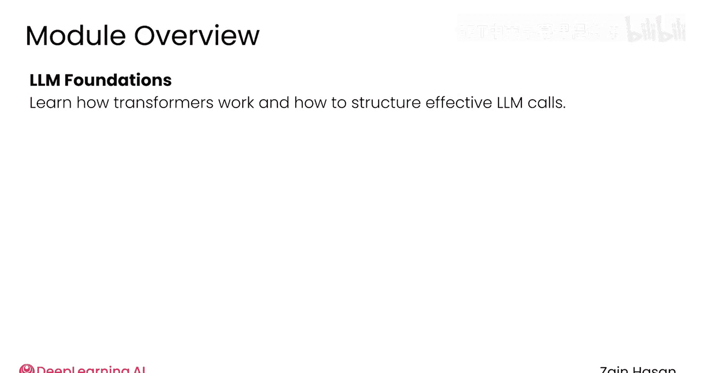
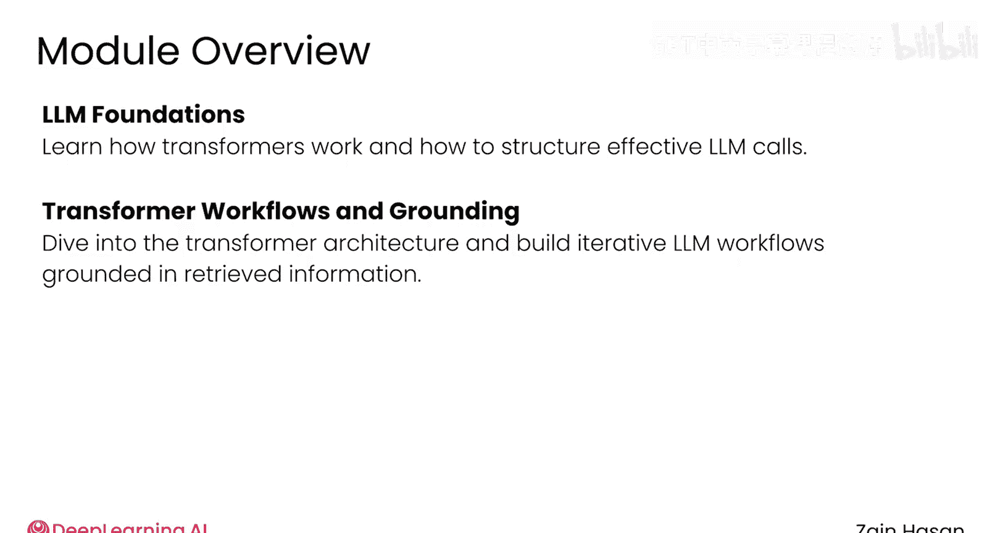
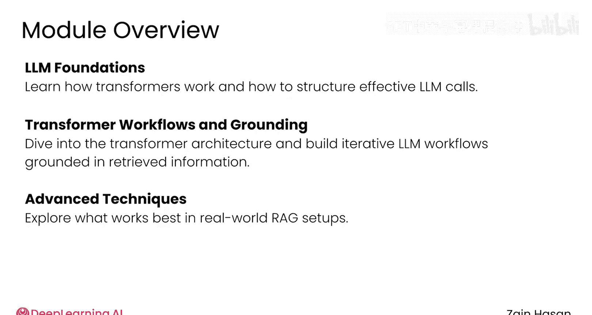
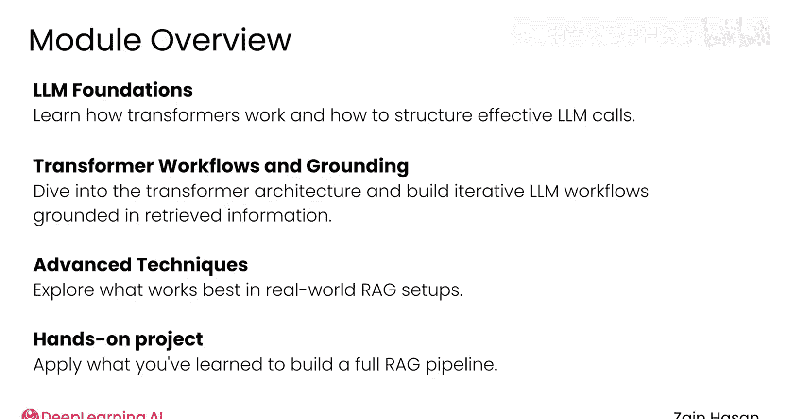

# 028：大语言模型简介 🧠

在本模块中，我们将要学习大语言模型（LLM）在检索增强生成（RAG）系统中的核心作用。我们将了解其工作原理，并学习提升其在RAG系统中表现的具体技术。

检索器是RAG系统的关键部分，但大语言模型才是整个操作的核心大脑。检索器能够查找并准备有用的信息，但最终需要由大语言模型来实际使用这些信息，以生成高质量的回应。

## 学习内容概览

以下是本模块将要深入探讨的核心内容。

*   **深入理解架构**：我们将深入探讨大语言模型所基于的**Transformer架构**。
*   **构建LLM调用**：学习如何在代码中构建对大语言模型的调用。
*   **迭代优化工作流**：在基础工作流之上进行迭代，确保大语言模型能够基于检索器提供的信息，生成高质量且有理有据的回应。

## 技术与实践

上一节我们介绍了本模块的学习框架，本节中我们来看看具体会涉及哪些技术与实践。

*   **高级技术**：我们将看到一些能够突破大语言模型性能极限的先进技术。
*   **实用建议**：同时，我们也会获得关于在典型RAG项目中哪些方法往往行之有效的实用建议。

## 动手实践环节

与往常一样，在本模块的最后，你将找到一个动手编程作业。你将有机会基于本模块所涵盖的主题，亲手构建一个RAG系统。

我希望你能享受动手实践大语言模型的乐趣。请加入下一节视频，让我们正式开始学习。