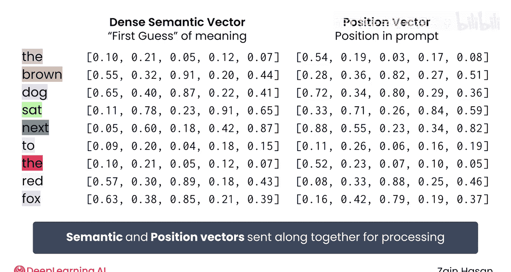
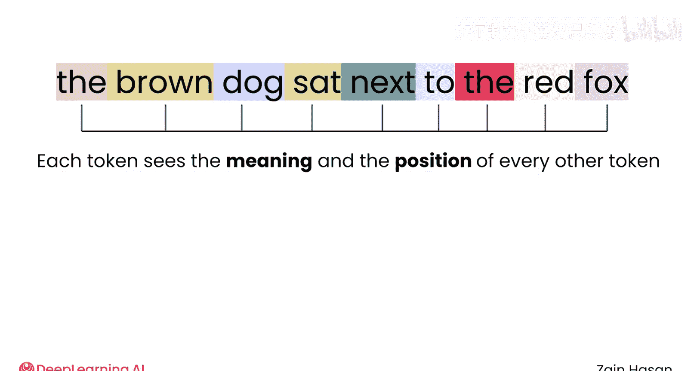
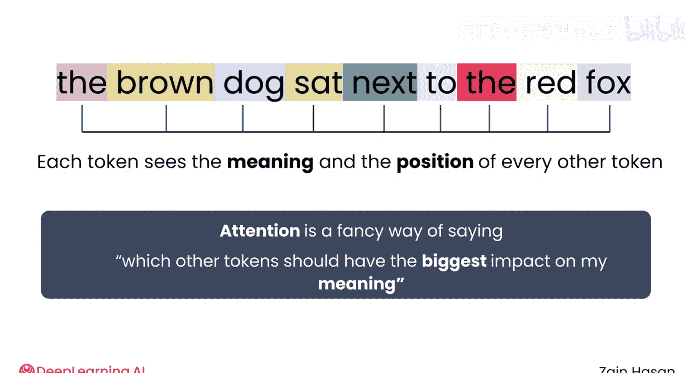
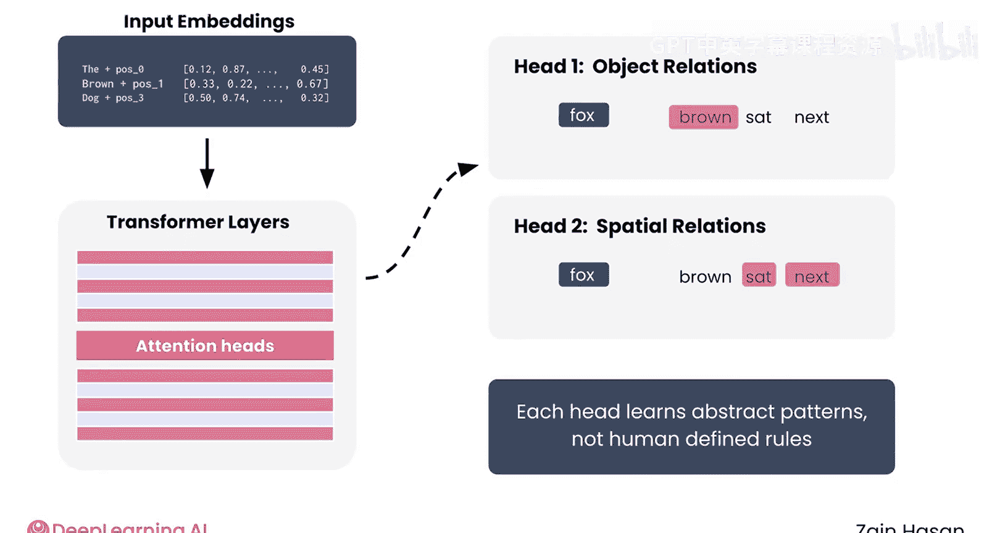
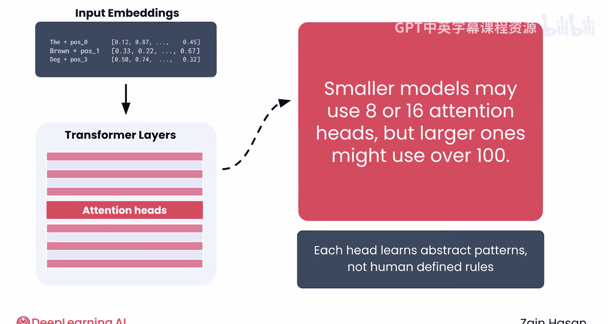
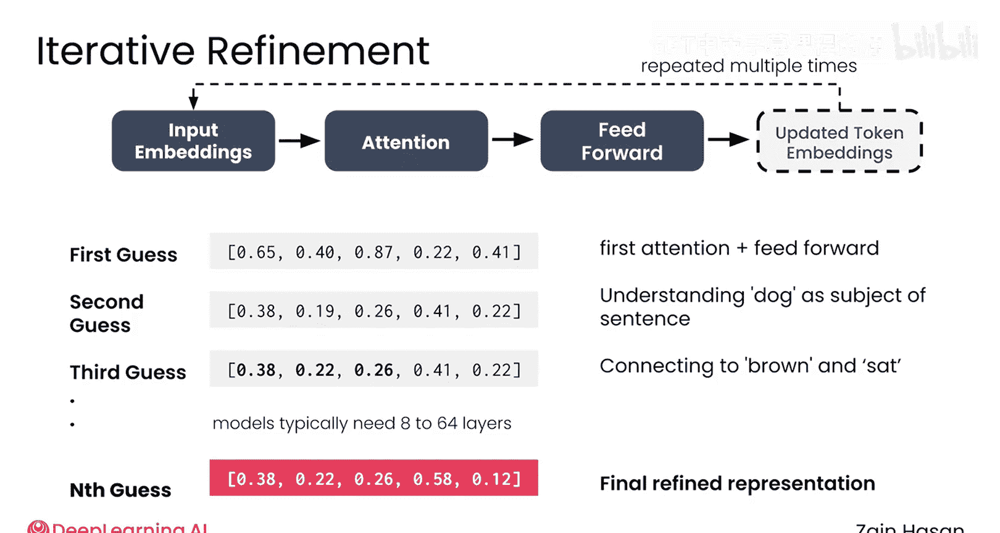
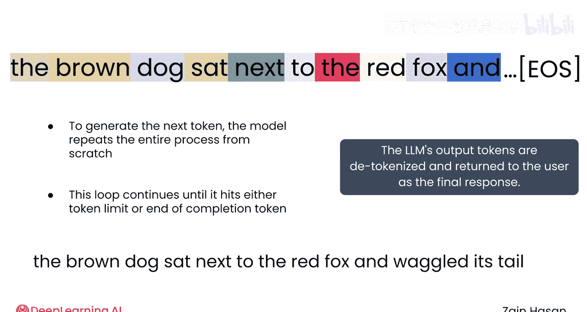
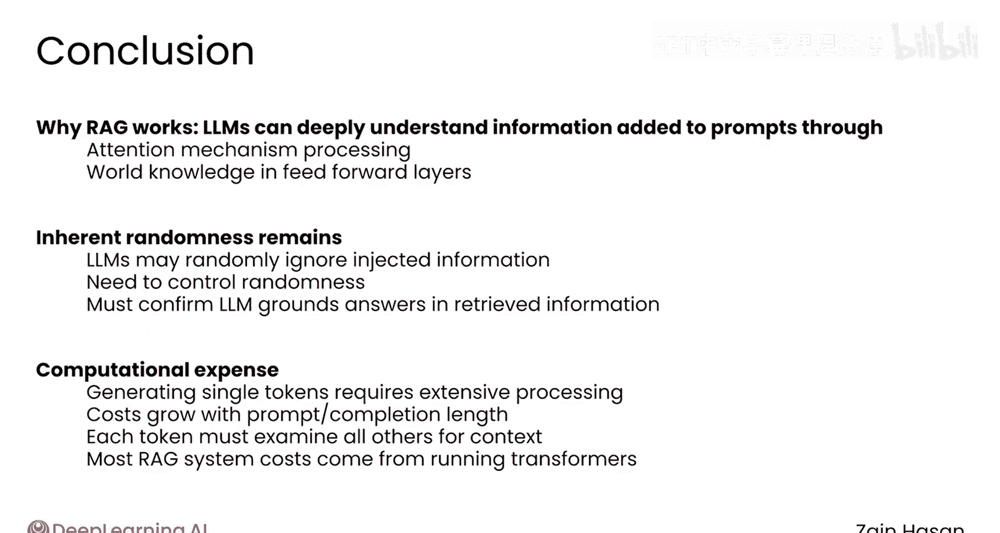

# 029：Transformer架构解析 🧠

在本节课中，我们将要学习Transformer架构的核心工作原理。理解这一架构是理解大语言模型（LLM）如何工作，以及为何检索增强生成（RAG）系统能够有效的基础。

上一节我们介绍了如何将检索到的文档构建成增强提示。本节中，我们将深入一层，探讨大语言模型为何能够理解这些检索到的信息。

## 为什么需要了解Transformer？

你的检索器返回了一系列相关文档，你已准备好构建增强提示。将其发送给大语言模型，就能得到基于检索信息的回答。在本课程中，你已多次见过这个过程。现在是时候深入一步，问一问：这为什么能行得通？大语言模型是如何理解那些检索到的信息的？更重要的是，你如何利用这些知识来构建更强大的RAG系统？为了解答这些问题，我们需要深入了解大语言模型所基于的Transformer架构。

## Transformer的起源与构成

Transformer架构由2017年一篇名为《Attention is All You Need》的开创性论文提出，该论文主要聚焦于机器翻译问题。Transformer包含两个主要组件：一个编码器和一个解码器。编码器会处理原始文本（例如一段德语段落），形成对段落含义的深度上下文理解。解码器则会利用对德语段落的这种深度理解，生成其对应的英语版本。

大多数大语言模型只包含第二个组件，即解码器，因为它们只关心文本生成。而编码器则通常用于嵌入模型内部，因为其目标是生成丰富的文本语义表示。

## 提示词在大语言模型中的旅程

让我们追踪一个提示词在大语言模型（也就是Transformer的解码器组件）中的旅程。

### 第一步：分词与初始嵌入

首先，你的提示词会被分割成一个个词元。文本被分词后，每个词元会被分配一个初始的密集向量表示。这个向量基本上是对该词元含义的“第一猜测”。这些猜测是静态的，因此每次你向大语言模型输入相同的词元，它都会被分配相同的“第一猜测”向量。

接下来，每个词元会被赋予一个位置向量，用于捕捉它在提示词中的位置。一旦这些“第一猜测”嵌入向量和位置向量被创建出来，它们就会被送去进行下一步处理。

### 第二步：注意力机制

现在，词元们进入了Transformer的注意力机制。每个词元本质上都会“看”提示词中的其他每一个词元，并能看到它们的含义和位置。

然后，每个词元会决定它应该最关注哪些其他词元。

注意力本质上是一种花哨的说法，指的是“哪些其他词元应该对我的含义产生最大影响”。

在一个句子中，例如“The brown dog sat next to the red fox.”，单词“dog”可能会最关注“brown”和“sat”，因为这些词与“狗”直接相关。你可以认为“dog”将其70%的注意力分配给“brown”，20%给“sat”，剩下的10%分配给所有其他词元。

用于分配这种注意力的机制被称为一个“注意力头”。实际上，大多数模型包含许多注意力头，它们专门处理词语之间不同类型的关系。你可以这样理解：一个注意力头专门处理对象与其描述之间的关系（因此单词“fox”可能会将其所有注意力集中在“brown”上）。另一个注意力头可能专门处理对象之间的空间关系（因此在该注意力头中，“fox”可能会更多地关注“sat”和“next”）。

实际上，每个注意力头捕获的关系并非由人类分配的一套整齐的关系，而是在模型训练过程中学习到的一套复杂而抽象的关系集合。

较小的模型可能使用8到16个注意力头，但较大的模型可能使用超过100个。这一点之所以重要，是因为不仅每个词元都在追踪它与文本中其他每个词元的关系，而且它们会以许多不同的视角或焦点多次进行这种追踪。结果是，注意力机制对文本中所有词元之间的关系形成了非常详细的表示。

### 第三步：前馈网络

一旦每个词元都分配了其所有的注意力分数，信息就进入了前馈阶段。这是迄今为止大语言模型中最大的部分。这意味着，它包含了迄今为止最多的参数。

基于每个词元的原始嵌入、位置和注意力信息，它为每个词元分配更新后的向量嵌入。这些新向量基本上是对每个词元真实含义的“第二猜测”，但现在这个猜测受到了文本中其他词元上下文的影响。

大多数大语言模型会重复整个过程。“第二猜测”向量被反馈到注意力和前馈机制中，生成新的、更精细的关于每个词元含义的“第三猜测”向量。一个典型的大语言模型实际上可能会将这些向量通过这些层传递8到64次，在每个阶段逐步完善其理解。

### 第四步：生成与采样

现在，大语言模型准备基于其生成的高度精细的向量嵌入开始生成内容。模型会问：根据我的训练数据，接下来可能出现哪些词元？这被计算为模型词汇表中所有词元的概率分布。

通常，少数几个词元具有较高的出现概率。但如果你的模型识别10万个词元，每个词元都会被分配一个概率，即使绝大多数概率基本上为零。

最后，大语言模型从这个分布中挑选一个词元，选择时会根据每个词元被分配的概率进行加权。概率高的词元被选中的频率更高，但从理论上讲，任何词元都至少有一点点被选中的机会。你将在本模块后面学习如何调整这些概率，从而影响大语言模型选择新词元的方式。

被选中的词元会被附加到提示词的末尾。经过所有这些工作，大语言模型生成了一个额外的词元。如果你想生成第二个词元，模型必须重复整个过程，只是这次需要考虑原始词元以及它自己添加的那个词元。这确保了新词元在原始词元及其自身生成的词元的上下文中都是有意义的。这也意味着早期随机的词元选择也会影响后期被选中的词元。

为了生成一个完整的补全内容，模型会一遍又一遍地重复这个过程，直到达到你为该补全设置的词元限制，或者它选择生成一个特殊的“补全结束”词元，表明它已完成。

大语言模型生成的词元可能完成一个短语，或回答一个问题。但无论其目的是什么，它们都可以被反分词成纯文本并返回给用户。

## Transformer架构对RAG系统设计的启示

我们刚刚经历了一次大语言模型的内部旅程。现在，让我们看看Transformer架构的哪些部分启发了RAG系统的许多设计元素。

以下是Transformer架构对RAG设计的几点关键启示：

**第一，它有助于解释RAG为何有效。** 大语言模型能够深刻理解添加到提示词中的信息的含义和相关性。这要归功于注意力机制所做的处理以及前馈层中包含的世界知识。

**第二，它强调了大语言模型本质上仍然是随机的。** 即使你在提示词中注入了有意义的信息，大语言模型也可能随机地选择不基于该信息生成文本。😊 控制这种随机性，并确保你的大语言模型将其答案建立在检索到的信息之上，仍然是必要且重要的。

**第三，它凸显了大语言模型的计算成本有多高。** 😡 生成单个词元需要大量处理，而且这个成本实际上会随着提示词或补全内容的长度增加而增长。毕竟，每个词元都需要“看”其他每一个词元，以充分理解自身的含义。正如你稍后将探索的，运行RAG系统的大部分成本来自于运行这些强大但昂贵的Transformer模型。

## 总结

本节课中，我们一起深入探讨了大语言模型内部的工作原理，特别是其核心的Transformer架构。我们了解了提示词从分词、嵌入，到经过注意力机制和前馈网络的多层处理，最终生成新词元的完整过程。更重要的是，我们看到了这种架构如何解释了RAG系统有效的原因，并指出了大语言模型固有的随机性和高昂的计算成本，这些都是在设计和优化RAG系统时必须考虑的关键因素。

现在，让我们将注意力（无意双关）转向如何在RAG系统中优化大语言模型的行为。