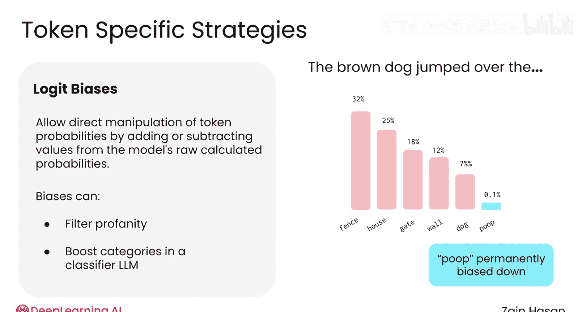
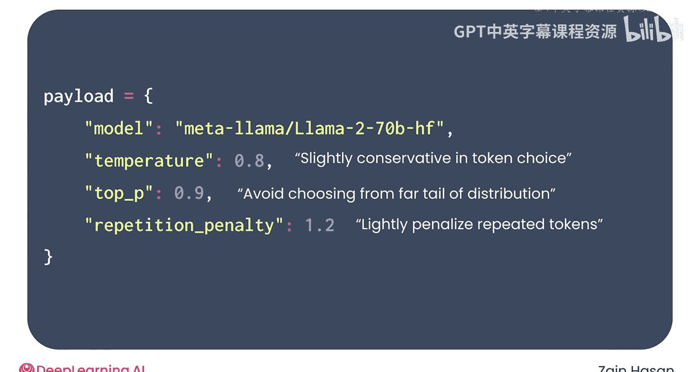
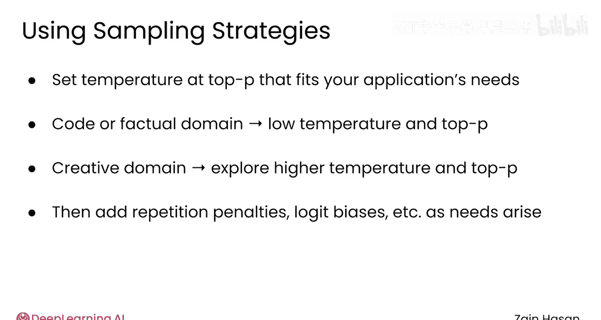

# 030：LLM采样策略 🎯

在本节课中，我们将要学习如何理解和控制大型语言模型生成文本时的随机性。理解并调整LLM的采样策略，是优化其输出行为、使其更符合应用需求的关键。

## 概述

与大型语言模型合作的一个重要部分是理解并控制其运行核心的随机性。本节我们将通过一个典型的LLM API，探索其提供的不同选项，以控制LLM选择下一个标记的方式。

## 理解LLM的随机选择

大型语言模型为你的补全内容添加的每一个标记，都是一个加权的随机选择。

如果你使用开源的语言模型，你可以看到这个选择是如何做出的。这些模型允许你查看每一步生成的标记概率分布，这个分布被用来选择下一个标记。

例如，对于提示词 “the sky is”，其概率分布可能如下所示：“blue”有50%的概率成为下一个词，“bright”有25%的概率，其他所有标记的概率都在10%或以下，并迅速降至1%以下。

以下是该分布的可视化表示。

当曲线在左侧有一个高耸的尖峰时，可以说模型对其选择非常有信心，只有一两个其他标记有被选中的真实机会。

另一方面，像这样平坦的分布可以被解释为模型的不确定性。模型有许多可能的方向可以选择，没有明确的胜出者。

理解和控制这个分布曲线，是调整LLM行为的重要部分。接下来，我们来看看几种实现此目标的策略。

## 采样策略详解

以下是几种控制LLM输出随机性的核心策略。

### 贪婪解码

一种简单的方法是指导LLM不进行随机选择，而总是选择概率最高的标记。这被称为**贪婪解码**。

贪婪解码的主要优点是它使LLM具有确定性。如果你给模型相同的提示，它总是会生成相同的响应。

贪婪解码的主要缺点是它可能导致文本过于可预测。最终生成的文本可能感觉平淡甚至生硬。

贪婪解码的另一个问题是，语言模型有时会陷入重复生成相同单词序列的循环。LLM实际上并不关心整体补全内容是否有意义，它只是不断选择可能性最高的下一个标记。一旦模型陷入重复循环，就没有机制可以摆脱它。

尽管存在这些潜在的缺点，在需要高度可预测和确定性输出的场景中，贪婪解码是有意义的，例如代码补全，或者作为调试系统的临时设置。

### 温度参数

在大多数情况下，你并不想完全消除随机性，只是想控制它。控制LLM随机性最广泛使用的参数叫做**温度**。

你可以将温度想象成一个旋钮，它可以改变你的语言模型生成的概率分布形状。默认温度值1会给出原始分布。较低的温度会导致分布更加尖锐，只有最有可能的标记才有机会被生成。

标记的排序不会改变，但它们被选中的概率会改变。将温度一直调到0，会使模型执行贪婪解码，只有单个最可能的标记拥有100%的概率。

将温度调高一点，比如在1.1到1.3的范围内，会使概率分布变得平坦，给不太可能的标记多一点被选中的机会。这会导致更多样化，有时甚至是更有趣或听起来更有创造性的文本。

将温度设置得太高，会导致非常平坦的概率分布。所有标记被选中的机会大致相等，即使它们可能不太合理。

### Top-K 与 Top-P 采样

无论你将LLM的温度设置为多少，分布曲线仍然会有一条向右延伸的长尾，充满了无意义的标记。你的LLM仍有很小的可能性选择它们。为了帮助控制这一点，会使用一些额外的采样技术。

**Top-K采样**是最简单的，它将LLM的选择限制在概率最高的前K个标记中。例如，你可以将温度设置为1.1，但同时限制LLM只能从前五个最可能的下一个标记中选择。

**Top-P采样**是一种类似的方法，它将语言模型的选择限制在累积概率低于某个阈值的标记中。例如，你可以将Top-P设置为85%。你会从分布的左侧开始，不断累加每个标记的概率，直到总和大于85%。

Top-P往往是这两种方法中反应更灵敏或更动态的一种。在Top-K中，LLM总是从相同数量的标记池中选择，而不考虑分布的形状。而在Top-P中，如果LLM相当确定（意味着少数标记具有非常高的概率），LLM会将其选择限制在最有可能的几个标记内。相反，如果LLM更不确定（意味着分布平坦，没有明确的最佳选择），则允许LLM从更大的潜在标记池中进行选择。

### 针对特定标记的策略

一些技术也针对单个单词的概率，而不是分布的整体形状。

例如，大型语言模型可能倾向于重复使用相同的单词或短语，这听起来可能不自然。许多LLM允许你应用**重复惩罚**，这会降低已经出现在补全内容中的单词的概率。这可以使生成的文本听起来更自然、更多样。

大多数LLM还允许你增加或减少特定标记的概率，这通常被称为**对数偏置**。这种偏置会永久性地向上或向下调整这些标记被选中的概率。

如果你不希望你的RAG系统生成亵渎语言，你可以将某些词的权重调低。另一方面，如果你的RAG系统是一个旨在输出少数几个类别之一的分类器，你可以提高这些类别的概率，以确保LLM总是在它们之间进行选择。

## 参数组合示例

以下是一个结合了本视频中介绍的多种技术的API调用示例。

这是一个相当合理、通用的参数组合：温度设为0.8，Top-P设为0.9，重复惩罚设为1.2。这个LLM在标记选择上会稍微保守一些，避免从分布的长尾部分选择，并轻微惩罚重复的标记。

通过试验每个参数，你可以根据应用程序的上下文，精确调整LLM的行为。

## 总结与建议

本节课中，我们一起学习了控制LLM固有随机性的多种技术，本视频仅涵盖了最常见的一部分。

总的来说，我建议设置最适合你需求的温度和Top-P值。如果你正在生成代码或回答事实性问题，较低的温度和较低的Top-P是有意义的。如果你在更具创造性的领域工作，较高的温度和Top-P可以给你的LLM带来更有趣和探索性的语气。

之后，可以考虑引入重复惩罚、对数偏置或你研究的其他采样技术，以应对你在LLM性能表现中发现的具体问题。

最终，理解有多种方法可以调整LLM的随机选择，并迭代找到适合你项目的设置，将使你获得所需的性能。