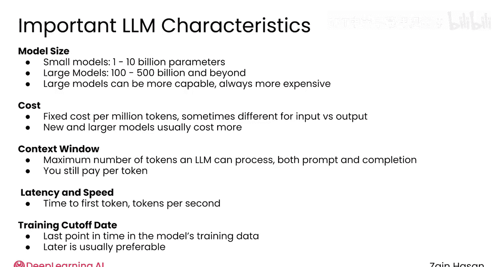
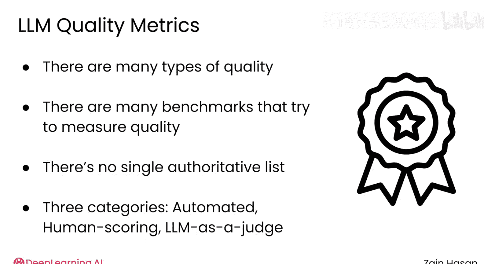
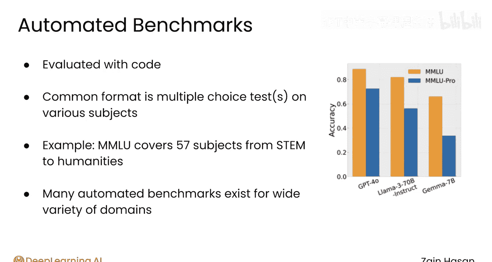
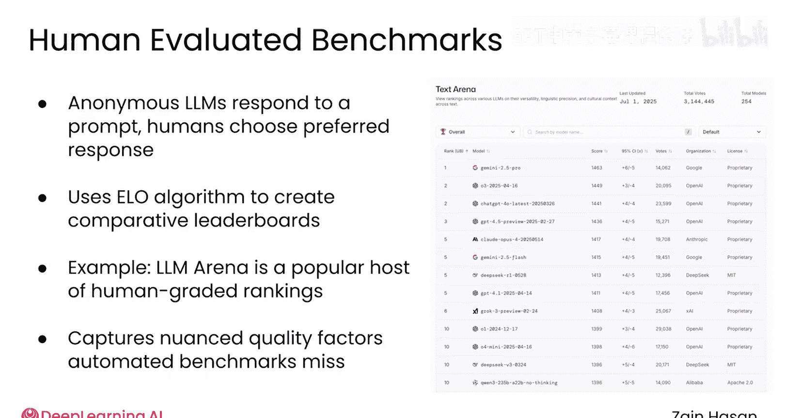
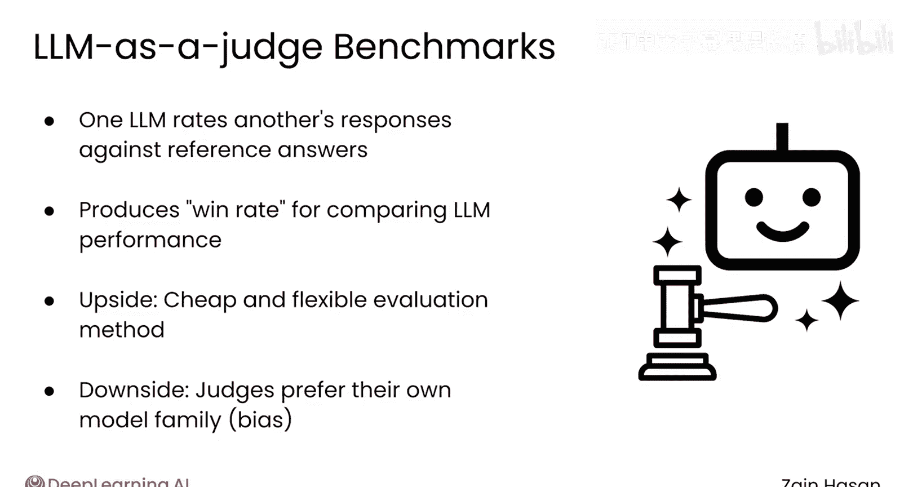
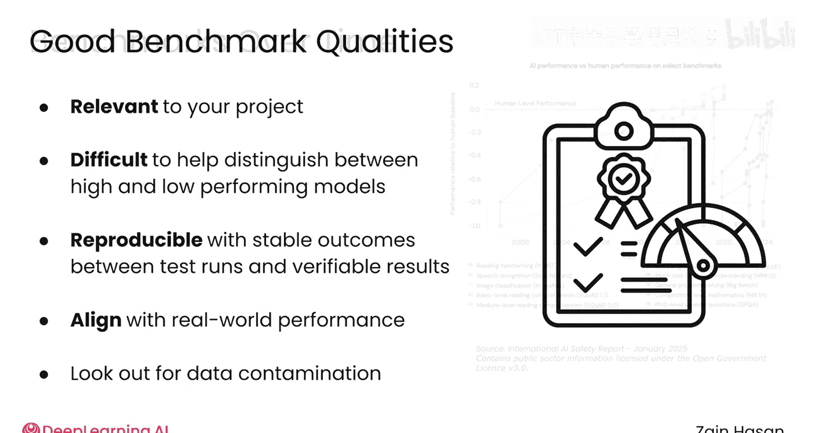
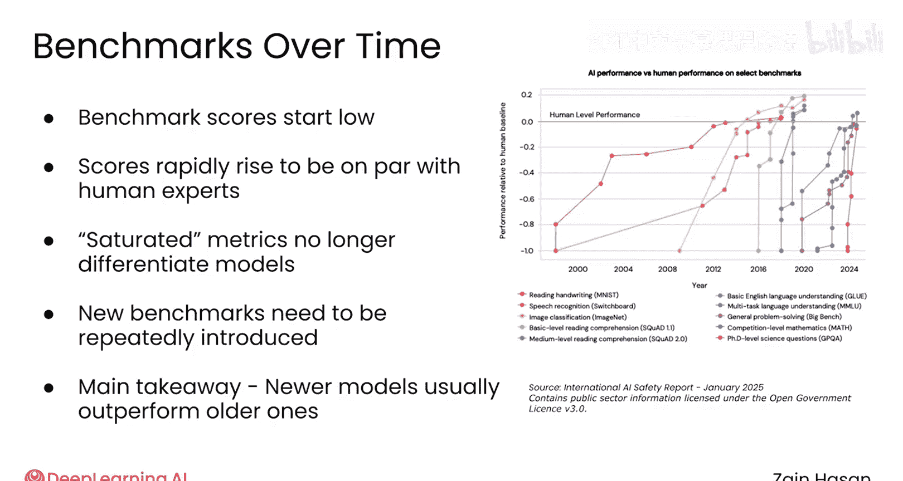

# 031：大模型选择方法论 🧠

在本节课中，我们将要学习如何为你的RAG应用选择合适的大语言模型。这是一个关键决策，会直接影响应用的性能、质量和成本。

构建RAG应用时，一个主要的决策是选择使用哪个大语言模型。市面上有大量不同性能水平、独特能力和成本结构的大语言模型可供选择。选择正确的模型对你的应用速度、质量和预算都有重大影响。因此，让我们来看看如何做出最适合你项目的选择。

## 可量化的差异

上一节我们介绍了选择模型的重要性，本节中我们来看看一些易于量化的模型差异。

模型大小是一个经常被引用的指标，通常以模型拥有的参数数量（以十亿计）来衡量。小型模型可能拥有**1到100亿**个参数，而大型模型则拥有**1000到5000亿**甚至更多。大型模型通常（但不总是）比小型模型能力更强，但运行成本也总是更高。

成本当然是一个重要因素。模型提供商通常按每百万个令牌的固定价格收费，有时输入和输出令牌的价格不同。通常，更新、更大、能力更强的模型成本更高。

模型的上下文窗口告诉你一个模型能处理的最大令牌数，这些令牌在提示词和生成内容之间分配。虽然大的限制提供了处理长提示词和长回复的灵活性，但你仍需为每个令牌付费。

首令牌生成时间和速度（以每秒令牌数表示）是另一个重要因素。如果你的RAG系统依赖于实时交互，你可能愿意为了一个快速、低延迟的模型而容忍其他方面稍差的性能。

模型的训练截止日期或知识截止日期告诉你模型训练数据所代表的最新时间点。即使在RAG系统中，较晚的截止日期通常也被认为是更可取的，尤其是在模型需要回答近期事件相关问题的场景下。

## 模型质量评估

虽然易于量化的指标可以帮助缩小模型选择范围，但你通常最关心的是模型的质量，而质量则更难量化。这里的“质量”涵盖了一切，从大语言模型解决复杂数学问题的推理能力，到仅仅生成可读性强的文本。

为了帮助在所有这些不同的质量维度上比较模型，存在大量令人眼花缭乱的大语言模型基准测试，试图对模型进行评分和比较。没有一个单一的权威基准测试列表可供参考，但了解可用的各种选项可以帮助你选择最适合你项目的基准测试。

以下是三种主要的基准测试类型：

*   **自动化基准测试**：这类基准测试通过代码可评估的任务来给大语言模型打分。一个经典的格式可能是针对特定兴趣领域的多项选择题测试，或一系列数学或编程挑战，其中模型的回答可以由计算机轻松验证。一个很好的例子是**MMLU**，它使用多项选择题涵盖了从STEM到人文再到法律的57个学科。
*   **人工评分基准测试**：这类基准测试通常让两个匿名的大语言模型回答同一个提示词，然后请人类评估者选择他们更喜欢的回答。这些结果被输入用于国际象棋选手排名的**Elo算法**，从而生成大语言模型的比较排行榜。一个流行的此类评级系统是**LMS Arena**，其排名是被引用最广泛的大语言模型基准之一。
*   **大语言模型作为评委的基准测试**：这类基准测试使用一个大语言模型来评判另一个大语言模型对一系列测试问题的回答。作为评委的大语言模型可以访问一组参考答案，本质上只是判断被评估的大语言模型提供的答案有多接近正确答案。这为你提供了一个胜率，可用于比较不同的大语言模型。

## 优秀基准测试的特征

上一节我们介绍了不同类型的基准测试，本节中我们来看看一个好的基准测试应具备哪些特征。

好的基准测试有几个特征。首先，它们与你的项目相关。如果你的应用永远不会生成代码，那么在大语言模型的代码生成基准测试上进行比较就没有多大帮助。

其次，基准测试需要足够困难，才能很好地区分高性能和低性能模型。如果每个模型在某个基准测试上得分都很高，那么这个基准测试就没那么有用。

基准测试应该是可复现的，这意味着分数本身在不同测试运行之间不会发生剧烈变化，并且模型提供商引用的结果应该是可验证的。

基准测试还应与实际性能保持一致。一个在编程基准测试上表现良好的大语言模型，在实践中也应该能写出好代码。在这里，你可能需要阅读一些开发者论坛，以确保基准测试分数能很好地反映实际性能。

这个问题可能出现的一个原因是**数据污染**。大语言模型是在从互联网抓取的数十亿甚至数万亿令牌上训练的。基准测试使用的数据集有可能被包含在这些训练数据中。在这种情况下，语言模型可能在该基准测试上表现过好，因为它已经在训练中见过完全相同的问题和答案。

## 基准测试的演变

虽然基准测试可以帮助你区分模型，但它们也突显了整个领域的发展速度有多快。

以下是大多数人工智能模型评估中会重复出现的普遍模式。起初，每个基准测试的平均分数相当低。然后，仅仅几年时间，模型的表现与人类专家持平就变得司空见惯。这些基准测试被称为**饱和**，意味着它们不再有助于区分模型，因为几乎所有先进模型的得分都接近最大值。在这一点上，需要引入新的、更具挑战性的基准测试来有意义地衡量性能的改进。然而，这些新的评估本身也会迅速饱和，甚至需要引入更新的评估。

这里的主要启示是，今天发布的模型通常比几年前发布的模型要好得多。而且，你今天选择的任何模型，随着更强大的模型快速推出，很可能都需要被替换。

## 总结

本节课中我们一起学习了如何为RAG系统选择大语言模型。选择合适的大语言模型是设计RAG系统的一个重要但暂时的决策。像成本或延迟这样的易于量化的因素可以帮助缩小选择范围，而各种各样的质量指标可以指引你找到最适合你用例的最佳模型。由于模型改进的速度很快，你应该计划最终换入适合你RAG系统的新发布模型。