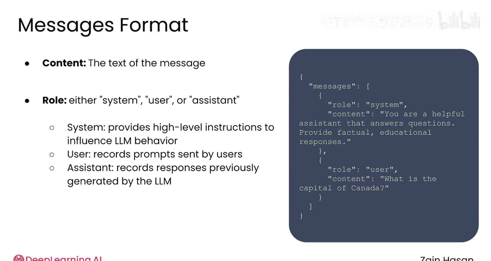
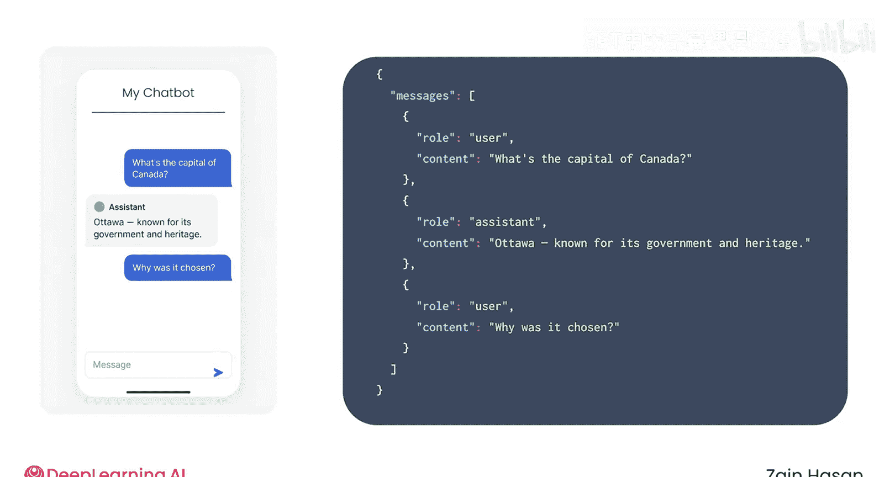
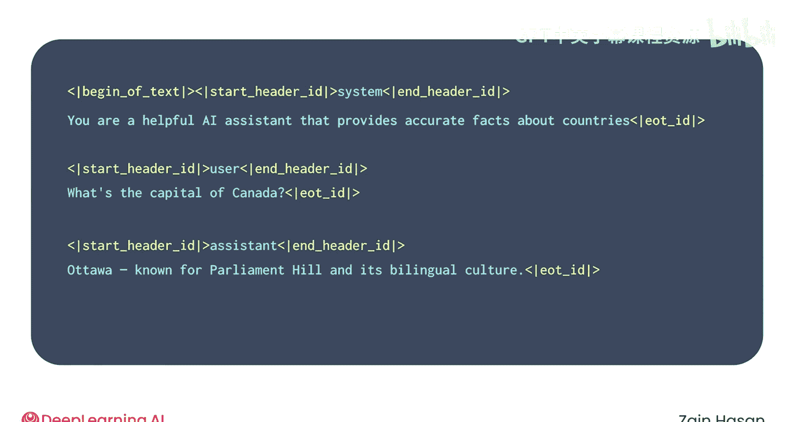
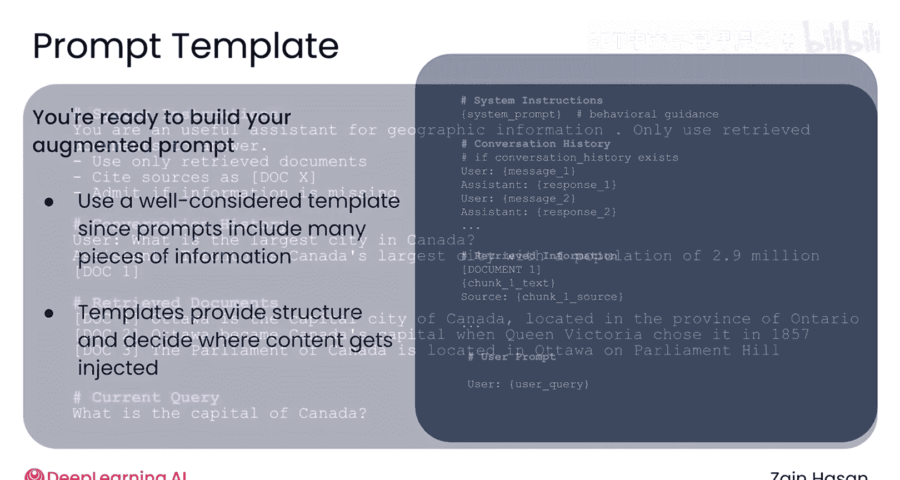

# 032：增强指令构建 🧠

在本节课中，我们将学习如何通过提示工程技术，构建高质量的指令来充分发挥大型语言模型的潜力，从而提升RAG系统的整体性能。

## 理解提示构建格式

为了有效地构建提示，首先需要了解在代码中实现它的常见格式。最常用的格式是OpenAI的消息格式。

该格式使用简单的JSON结构，将提示组织为一系列消息。每条消息包含`content`（消息的文本内容）和`role`（角色）。角色可以是`system`、`user`或`assistant`。

*   **系统消息**：提供给LLM，用于影响其整体行为，通常包含高级指令。
*   **用户消息**：记录系统用户已发送的提示。
*   **助理消息**：记录LLM先前生成的回复。

当您与LLM进行多轮对话时，LLM并不会“记住”之前的对话。实际上，整个对话会在后台被转换成这种消息格式，您的新用户消息会附加在末尾。然后，每次提交新的用户提示时，整个对话历史都会连同新消息一起提交给LLM处理。

JSON消息对象随后会被转换成一个单一的文本字符串供LLM处理。这个聊天模板字符串使用特殊的文本标签（如尖括号或竖线）来指示每条消息的开始和结束。LLM经过训练，能够识别这些标签并理解系统、用户和助理消息之间的区别。

这种格式非常灵活，允许您向提示中添加各种上下文信息，以帮助控制LLM的响应方式。接下来，我们看看几种具体的应用方法。

## 编写系统提示

为您的RAG系统构建提示时，首先要做的是编写系统提示。这为您的LLM提供了关于其应如何行为的高级指令。

如果您希望LLM始终以特定的语气说话或遵循某些流程，这些信息就应该放在系统提示中。为了了解系统提示可以包含哪些内容，可以看看一个流行的LLM聊天机器人的系统提示示例。

首先引人注目的是它的长度——非常长。虽然您不一定总是需要编写多段式的系统提示，但知道您有这种灵活性是很好的提醒。在提示的开头部分，包含了模型训练数据的知识截止日期以及当前日期等信息。这类信息帮助LLM判断其信息有多过时，以及它是否有能力回答某些问题。

后面的部分则指导LLM响应提示时应遵循的流程和语气。例如，它要求模型逐步推理答案、不协助可能有害的请求，并以Markdown格式回复。系统提示还告诉LLM，它具有求知欲，喜欢听取人类对问题的看法，并乐于就广泛的话题进行讨论，这可以说是赋予了LLM一种特定的“个性”。

您可以运用相同的原则来构建自己的系统提示。例如，您可以指示LLM详细回答或简洁回答问题。鉴于您正在为RAG应用程序构建系统提示，您可以告诉语言模型仅使用检索到的文档来回答问题，或判断文档是否相关，或在回复中引用来源。

系统提示通常会被添加到LLM将要处理的每一个提示中，因此花时间优化系统提示是提升RAG系统最终生成结果的风格和质量的有效方法。

## 构建增强提示模板

此时，您已准备好构建增强提示。这个提示可能包含许多信息片段，因此构建一个经过深思熟虑的提示模板会很有帮助。模板设定了提示的高级结构，并有助于决定某些内容片段将被插入的位置。

例如，您可以始终以一个高级系统提示开始，为系统提供关于其应如何行为的高级指导。如果您的系统支持多轮对话，您可以包含用户和LLM之间先前发送的消息。接下来，您可以添加检索器检索到的前5个或前10个文本块，以及任何关于如何处理它们的说明。最后，您可以附上LLM需要回应的最新用户提示。

以下是一个根据此模板构建的提示可能的样子。使用这样的模板的好处在于，它使得尝试不同的提示结构变得容易。您可以修改整体提示的各个组成部分，并观察这如何影响最终生成的响应。

## 总结与展望

本节课中，我们一起学习了如何为RAG系统构建高质量的提示。我们首先了解了OpenAI消息格式这一核心构建方式，它通过`system`、`user`、`assistant`三种角色组织对话。接着，我们重点探讨了编写系统提示的重要性，它可以设定LLM的行为准则、知识范围和回复风格。最后，我们介绍了如何利用提示模板来系统性地组织系统指令、检索到的上下文、历史对话和当前用户问题，从而构成一个完整的增强提示。

这就是在RAG系统中构建典型提示的过程：结合精心编写的系统提示、检索到的上下文、先前的对话细节，当然还有最新的用户提示。在下一个视频中，让我们一起来看一些进一步改进LLM性能的高级技术。