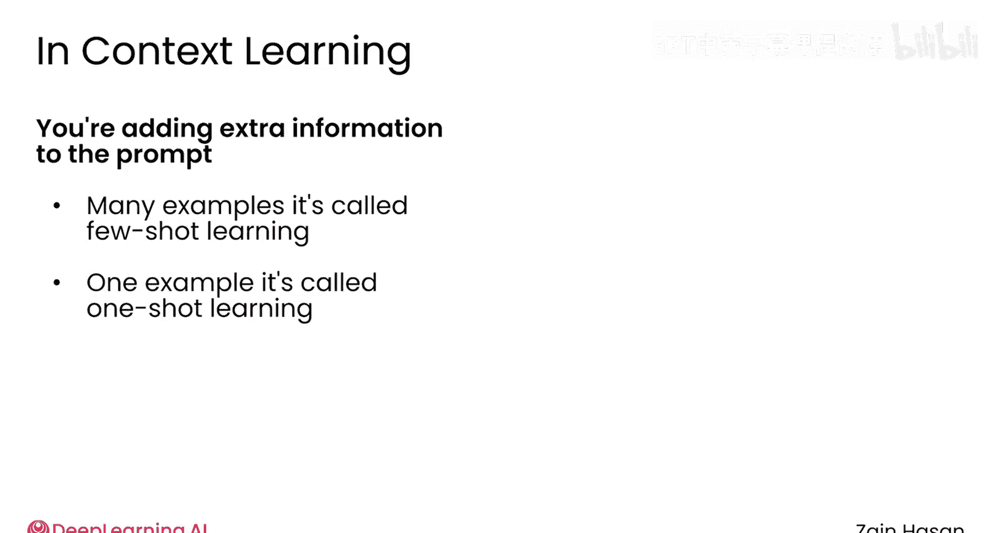
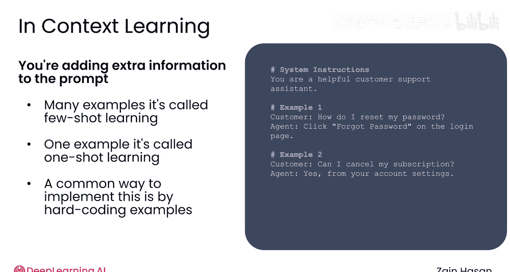
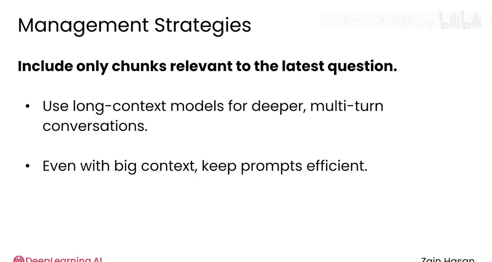

# 033：高级提示工程技术 🧠

在本节课中，我们将学习如何为你的RAG系统应用更高级的提示工程技术，以提升大语言模型（LLM）的响应质量。我们将探讨上下文学习、思维链提示等核心方法，并了解如何管理日益增长的上下文窗口。

---

一旦你为RAG系统设置了基础的提示模板，就可以开始尝试更高级的提示工程技术。让我们看看其中几种技术以及它们的使用场景。

## 上下文学习

上下文学习是一种技术，它允许你通过向提示中添加示例，来帮助LLM学习你期望生成的输出类型。

例如，如果你正在构建一个客户服务聊天机器人，你的提示可以包含过往客户请求的示例，以及对这些请求的高质量回复。这些示例帮助LLM学习在生成新回复时应使用的结构和语气。就像在RAG中一样，你是在向提示中添加额外信息，以“锚定”LLM的响应方式。

如果你包含多个示例，这种方法被称为**少样本学习**。如果只包含一个示例，则被称为**单样本学习**。

实现上下文学习有几种方式。在需要稳定LLM行为的情况下，你可以直接将一个或多个示例问题和回复硬编码到提示中。仅此一项就可能有助于提高响应质量。然而，如果你想每次更换示例，则可以使用RAG从你的知识库中检索示例问题和回复。

例如，如果你正在处理同一个客户服务聊天机器人，你可以将成功的客户聊天记录索引到向量数据库中。当新客户就某个特定主题发来消息时，你可以检索关于该主题的过往对话文本，并将其注入到你的提示中。

在许多方面，这只是普通的RAG。但你专门检索示例回复这一事实，可以进一步帮助提高LLM响应的质量。

## 引导推理的提示技术

上一节我们介绍了如何通过示例引导模型，本节中我们来看看另一类强大的提示工程技术集合，它们本质上鼓励LLM以逐步推理的方式处理提示。

例如，你可以告诉LLM在提供最终答案之前，先“大声思考”或“逐步思考”解决问题的最佳方法。其理念是，你本质上为语言模型提供了一个“草稿纸”，让它在回答前组织思路。

一种常见的方法是告诉LLM，位于 `scratchpad` 标签之间的标记被视为思考和头脑风暴的空间，不属于其最终答案的一部分。

类似的方法被称为**思维链提示**。在这种方法中，LLM被指示以逐步的方式处理问题，而不是立即回答。LLM可能被指示先生成回答问题所需的步骤，然后遵循这些步骤。

鼓励LLM进行规划和采取这种渐进式方法，可以增加最终响应更准确的可能性。由于LLM会“展示其工作过程”，因此当LLM的推理出现问题时，也更容易追踪问题所在。

像这样的面向推理的策略非常成功，以至于现在许多LLM在设计时就是开箱即用的推理模型。推理模型擅长复杂的推理任务，例如编码、数学、规划、谜题以及需要多个步骤的复杂工作流。

在内部，这些推理模型首先生成**推理标记**，它们可能在其中提前计划和考虑选项，很像之前看到的草稿纸。然后，它们输出**响应标记**，其中包含给用户的预期最终响应。

一些推理模型的提供商只允许访问那些最终的响应标记，而另一些则允许你同时访问推理标记。这些推理标记是使这些模型比非推理模型更准确的部分原因，但它们仍然只是常规标记，生成它们会产生所有相关的成本。因此，运行推理模型通常更慢且更昂贵。

根据你的具体情况，围绕推理模型构建RAG系统可能非常值得付出每次LLM调用更高的成本。例如，推理模型可能特别擅长评估检索文档的相关性，并且可能更擅长决定如何最好地将这些信息整合到响应中，尤其是需要更复杂推理步骤的响应。

有趣的是，许多提示工程技术对推理模型效果不佳。例如，你不需要要求它们逐步思考，因为这是它们已经训练过要做的事情。它们也可能不擅长上下文学习，因为它们会尝试将提供的示例回复整合到当前正在回答的问题中。它们往往在你有明确希望它们达成的具体目标，以及你希望它们遵循的非常具体的回答格式信息时，表现更好。

你仍然可以提供高层次的指导原则，并明确说明你希望模型采取或避免的方法。之后，你可以直接将从RAG系统检索到的整个文档上下文“倾倒”给它们。

包括推理模型在内的新模型不断发布，大多数LLM提供商会包含关于如何最好地提示它们的信息。

## 上下文窗口管理

随着你开始采用更多的提示工程技术，上下文窗口管理将变得重要。请记住，初始提示和LLM为补全生成的任何标记，都会占用其上下文窗口的一部分。

无论你是从检索器中注入文档、向每个提示添加上下文学习示例，还是让推理模型在回答问题前规划其响应，所有这些高级技术都会增加你的提示长度、生成的响应长度或两者兼而有之。如果你不注意，很容易迅速填满你的上下文窗口。

对于单轮对话，最好的解决方法是验证你的提示工程技术是否带来了价值。如果思维链提示或上下文学习没有带来更好的性能，最好将这些组件从你的系统中移除。

多轮对话会迅速消耗你的上下文窗口，因为每次来回的消息都需要包含在提示中。一系列统称为**上下文修剪**的方法可以解决这个问题。

以下是几种上下文修剪的方法：

*   **简单方案**：在提示中只保留固定数量的最近消息。例如，用户和LLM发送的最后五条消息。
*   **更复杂的方法**：使用一个单独的LLM来总结较早的消息，缩小其大小，但保留其关键点。

如果你在多轮对话中使用推理模型，几乎肯定需要从聊天历史中删除推理标记，只保留响应标记。同样，在RAG系统中，通常只希望包含为支持回答最近问题而检索到的文本块，而不是之前所有问题的文本块。

当然，如果你的应用程序需要具有深入丰富上下文的多轮对话，你总是可以切换到使用具有更长上下文窗口的模型。即便如此，你仍然需要仔细考虑如何设计提示，因为即使在具有较长上下文窗口的模型上，长提示运行起来也慢且昂贵。

## 总结与实践建议

本节课中我们一起学习了多种高级提示工程技术，包括上下文学习和引导推理的方法，并了解了管理上下文窗口的重要性。

提示工程技术可以提高LLM的性能，但你的RAG系统不一定需要采用它们。一个简单的提示模板和一个精心编写的系统提示可能就是你项目所需的全部。

当涉及到更高级的技术时，我建议你只有在明确需要它们之后，才将其添加到你的项目中。总的来说，提示工程更像是一门艺术而非精确的科学。因此，无论你使用什么策略，都要尝试不同的提示，找到最适合你系统的那些。

