# 034：幻觉处理机制 🧠

在本节课中，我们将要学习大型语言模型（LLM）中一个关键问题——幻觉，并探讨如何在检索增强生成（RAG）系统中检测和减少幻觉，以确保生成内容的准确性和可信度。

## 什么是幻觉？

幻觉是使用LLM时一个持续存在的问题。即使是一个设计良好的RAG系统，仍然可能产生幻觉。因此，检测幻觉、减少幻觉并确保LLM准确引用来源，是构建RAG流程中最重要的部分。

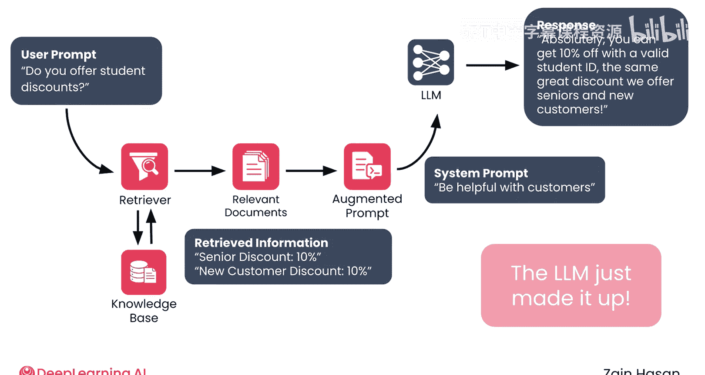

## 为什么会产生幻觉？

理解LLM产生幻觉的根本原因很重要。语言模型的设计目标是生成**概率上可能的文本序列**，并加入一些随机性以增加多样性。概率上可能的文本序列通常是事实准确的，但并非总是如此。语言模型的设计并非为了区分真假，而只是区分可能和不可能。

## 幻觉带来的问题

幻觉之所以成问题，有几个原因。第一个原因显而易见：你不希望语言模型向用户提供不准确的信息。第二个原因是，幻觉听起来通常是合理的，因此比完全无意义的内容更难检测。最后，随着时间的推移，偶尔的幻觉会导致用户对你的RAG系统失去信任，即使生成的大部分内容是准确的。

## RAG如何帮助减少幻觉？

当然，构建RAG流程的一个重要原因就是为了减少幻觉。从知识库中检索到的信息可以帮助“锚定”LLM的回应，并可能提供模型训练数据中缺失的信息。即便如此，RAG系统仍然容易出现幻觉，因此需要额外的步骤来防止它们。

## 幻觉的类型

幻觉有多种类型和程度。回到折扣的例子，LLM可能准确地描述了真实存在的老年人折扣及其获取方式，但错误地将折扣说成5%而不是10%。在更极端的情况下，LLM可能错误地声称不存在老年人折扣，而实际上存在；或者如之前所见，编造出公司根本不提供的新折扣。这意味着，如果你希望对其准确性有信心，就需要从多个层面评估LLM生成的文本。

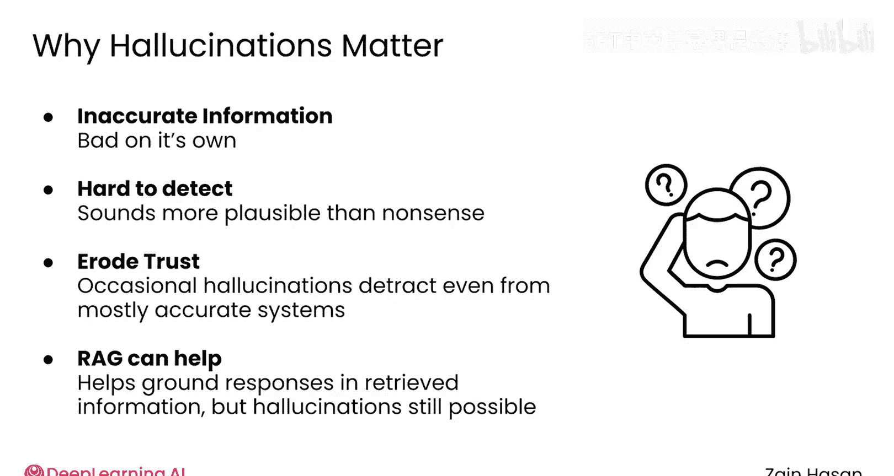

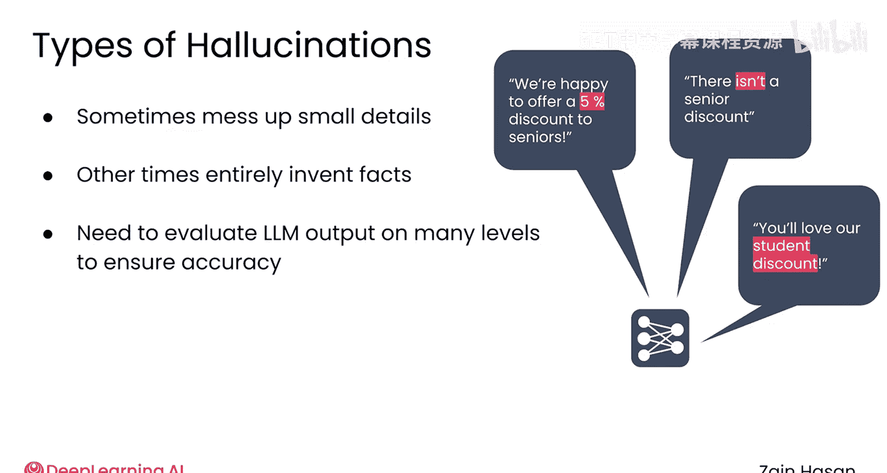

## 处理幻觉的挑战

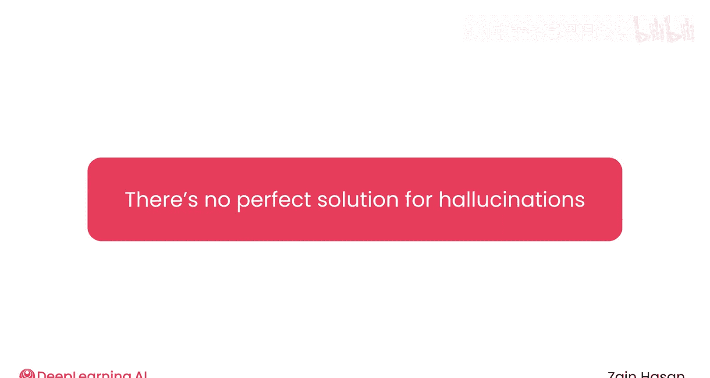

现在，需要面对一个冷酷而严峻的事实：目前没有完美的解决方案来完全消除幻觉。或者至少目前还没有。然而，幸运的是，RAG是目前可用的最佳方法之一，并且有方法可以优化RAG系统，以进一步降低幻觉发生的频率。

## 检测幻觉的方法

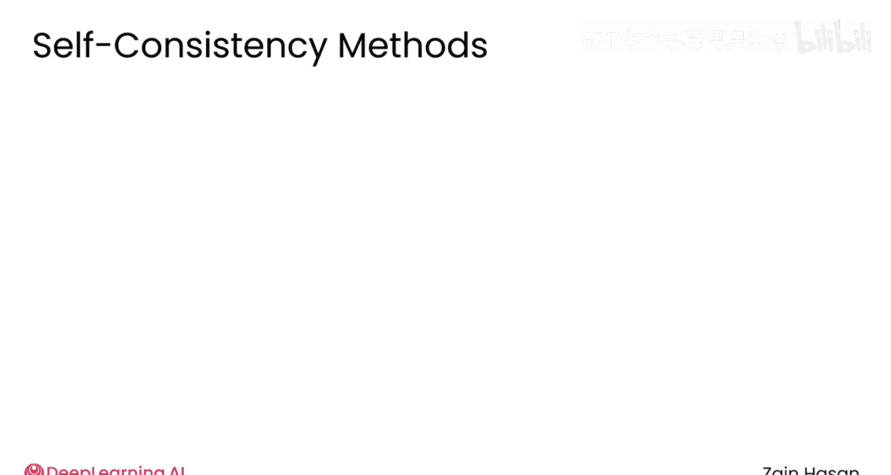

首先，思考一下如果没有知识库，如何检测LLM输出中的幻觉。如果没有一个可信的外部事实来源来比较输出，你的选择将非常有限。然而，一种方法是**自洽性检查**，即让模型为同一个提示词重复生成补全内容，并检查其中包含的事实信息是否一致。

其基本理念是，如果语言模型在编造信息，它会不一致地编造，并且不同补全内容之间的事实差异是可以被检测到的。然而，在实践中，这种方法可能成本高昂且不可靠。如果你有知识库可以参考，那是最好的起点。

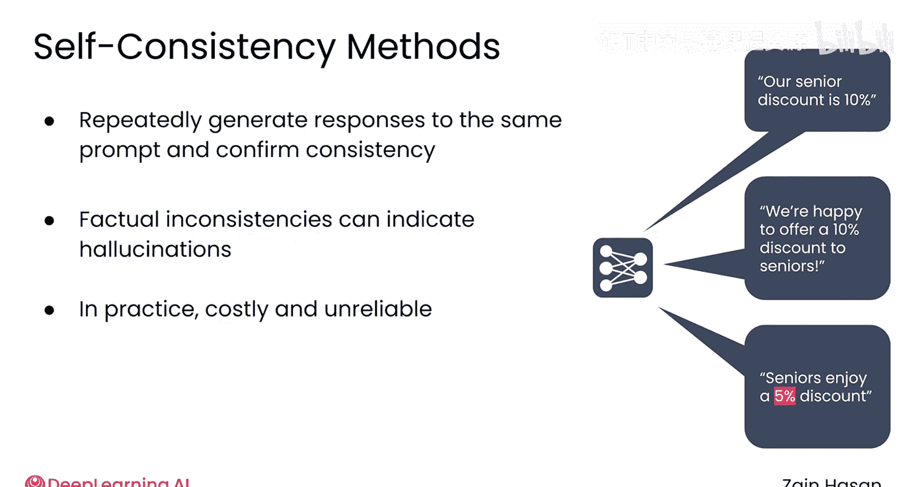

## 在RAG系统中减少幻觉

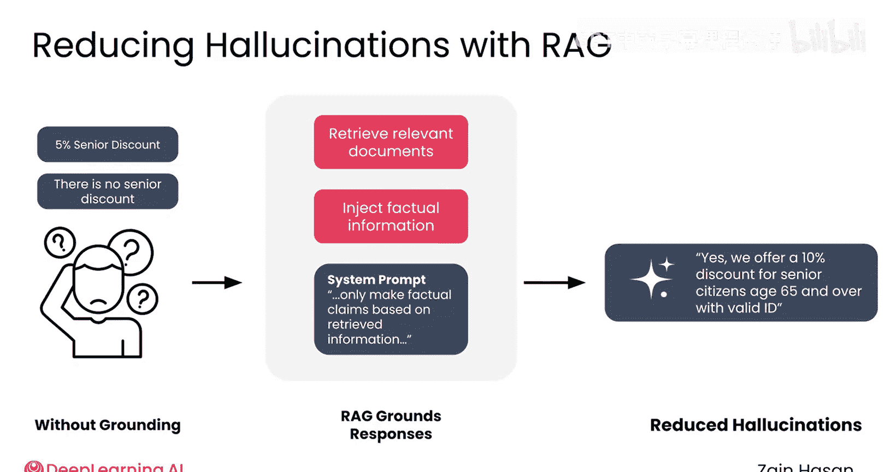

由于在RAG系统中，你可以访问知识库，减少幻觉的最佳方法是确保回应基于检索到的信息。

例如，你可以修改系统提示词，规定LLM只能基于检索到的信息做出事实性声明。

## 要求引用来源

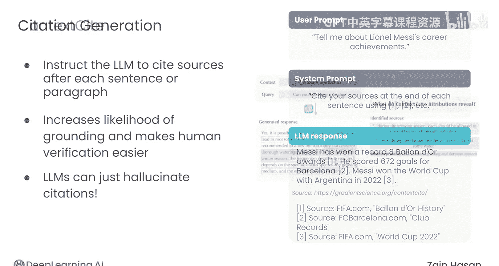

如果你希望进一步确信LLM的回应是基于检索到的文档，你可以进一步要求LLM引用其来源。有时，这仅仅意味着提示模型在每个句子或段落的末尾引用来源。这可以进一步增加LLM将其回应锚定在检索到的来源中的可能性，并且引用也使得人类读者更容易验证回应中的主张。

然而，这种方法的一个风险是，LLM可能会编造引用。一些经过微调以引用来源的模型会更可靠地生成有效的引用，但如果你希望对引用有更高的信心，就需要使用外部系统。

## 使用外部系统验证

例如，**Context Site** 是一个评估回应在一组源材料中锚定程度的系统。该模型逐句处理回应，并将每个句子归因于检索到并提供给LLM的上下文文档之一。然后，Context Site为每个句子生成标签，注明哪个文档是该句子的来源。对于没有支持材料的陈述，则标记为“无来源”。一些实现甚至可能提供句子与已识别源文档之间的相似度分数。

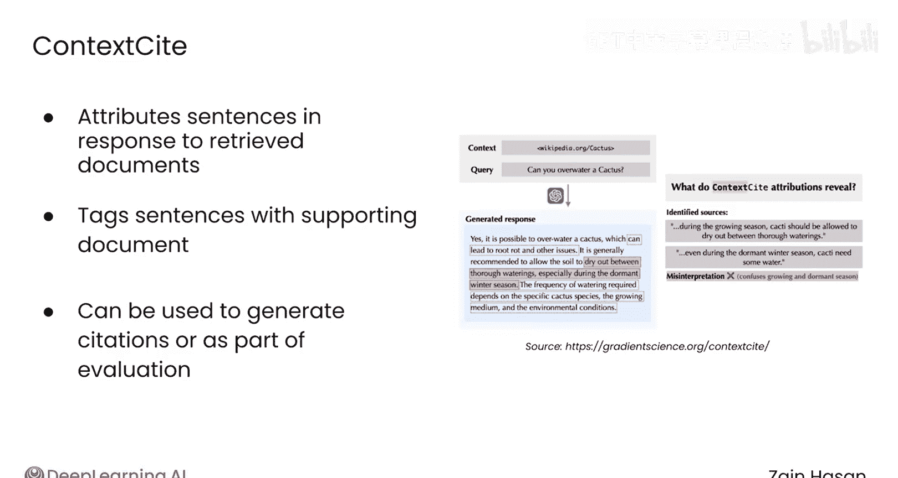

这些标签既可以用于在最终生成的LLM输出中生成来源引用，也可以作为评估LLM将其回应锚定在RAG系统检索到的文档中的频率的一部分。

## 评估基准

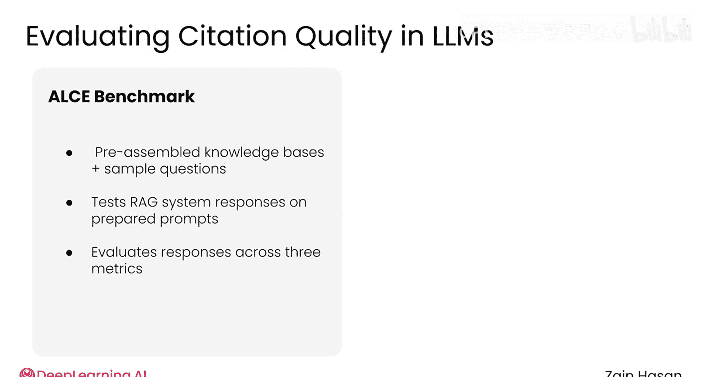

最近的努力，例如**ALCE基准**，旨在衡量系统在生成回应时引用和标注来源的能力。该系统提供预组装的知识库和示例问题，然后你可以在这些提示上使用你的RAG系统，并要求ALCE系统评估生成的回应。该基准为三个关键指标生成分数：流畅度、正确性和引用质量。换句话说，就是最终文本有多清晰，事实有多准确，以及提供的引用与应引用的正确来源的匹配程度。

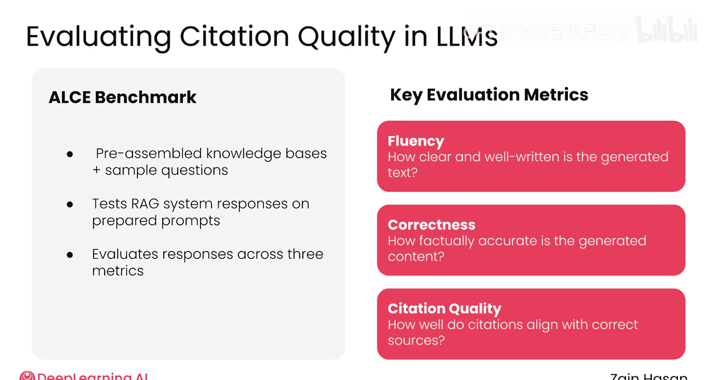

这些基准并不能控制你生产系统中的幻觉，但它们确实能让你了解你的系统在避免幻觉和引用来源方面的表现如何。

## 总结

幻觉检测是基于LLM的系统中的一个持续挑战。尽管如此，通过构建RAG系统，你已经采取了最有效的一步来最小化幻觉。之后，将精力集中在通过优化系统提示词来确保LLM将其答案锚定在检索到的信息上。最后，使用专注于幻觉的基准测试你的系统，以确保你的系统提供有根据、引用良好的回应。综合运用这些方法，可以显著减少幻觉，并帮助你构建一个提供可信回应的系统。