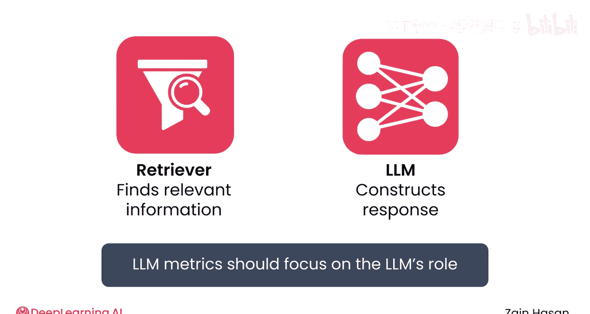
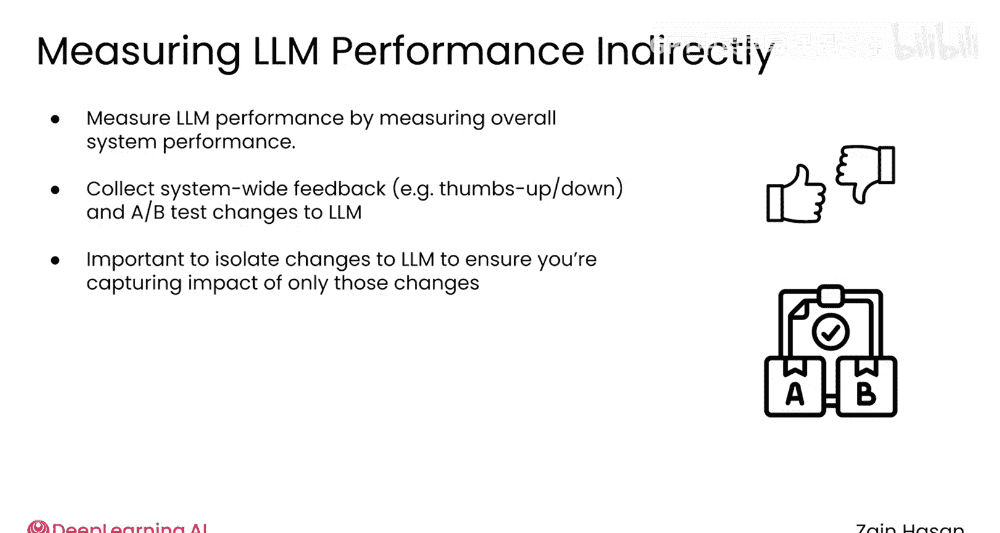

# 035：大模型性能评估 🧪

在本节课中，我们将学习如何评估检索增强生成 (RAG) 系统中大型语言模型 (LLM) 的性能。无论你是刚刚构建了第一个概念验证系统，还是在迭代一个已上线的系统，了解 LLM 的表现都至关重要。我们将探讨一些常见的评估方法，帮助你量化模型调整或更换所带来的影响。

## 明确评估目标 🎯

上一节我们介绍了 RAG 系统的整体架构，本节中我们来看看如何评估其中的核心组件——大型语言模型。首先，需要明确 LLM 在 RAG 流水线中的具体职责。

你的检索器负责从知识库中查找相关信息，而 LLM 的任务是利用这些信息构建高质量的回复。这意味着，当你考虑调整 LLM 甚至完全替换底层模型时，所使用的评估指标应聚焦于 LLM 的角色和整个 RAG 流水线的表现。如果问题根源在于检索器，那么花时间重写系统提示词将是徒劳的。

假设你的检索器运行良好，它应该能找到大部分相关信息，可能附带少量无关文档。此时，LLM 的职责是响应用户提示，将相关信息整合到回复中，适当地引用来源，并抵制被检索到的任何无关信息所干扰。

需要注意的是，LLM 的这些行为大多具有一定的主观性。如何定量地判断一个回复是否很好地回答了用户的原始问题，或者是否忽略了无关信息？因此，大多数针对 LLM 的评估指标都依赖于使用其他 LLM 来评判回复的质量，将 LLM 纳入评估过程，可以在可扩展的范围内引入一定程度的灵活性或主观性。

## 使用 RAG 专用评估指标 📊

开源库 Ragas 是获取 RAG 专用评估指标的良好来源。以下是它提供的一些关键指标：

**回复相关性 (Response Relevancy)**
此指标衡量回复是否与用户提示真正相关。它检查回复是否与原始提示相关，而不考虑其事实准确性。其工作原理如下：
1.  首先，将你的 RAG 系统生成的回复输入给一个新的 LLM，该 LLM 会生成几个它认为可能导致该回复的示例提示。
2.  然后，将原始用户提示和这些示例提示都嵌入到语义向量空间中。
3.  接着，计算实际用户提示与每个示例提示之间的余弦相似度。
4.  最后，对这些相似度分数进行平均，得出最终的回复相关性度量。

> 注意：此指标不一定能确保回复提供的是事实信息，但它会检查你是否能从 LLM 给出的回复合理地回溯到它最初收到的提示。

**忠实度 (Faithfulness)**
为了衡量 LLM 是否真正使用了检索到的信息，可以使用忠实度指标。此指标使用一个语言模型来识别回复中做出的所有事实性主张。然后，它使用更多的语言模型调用来确定这些主张中有多少能得到从知识库检索到的某条信息的支持。被支持的主张所占的百分比，就是该特定提示、检索和回复的忠实度。

Ragas 库中包含的其他指标也采用类似的方法来评估 LLM 对知识库中检索到的无关信息的敏感性，或准确引用来源的能力。然而，所有这些指标的一个共同模式是，在评估过程的某个环节都依赖于 LLM 的调用，甚至可能依赖于真实正确答案的示例。这说明了 RAG 系统中 LLM 的角色是复杂的，难以用更简单的自动化指标来评估。

## 结合系统级指标进行评估 🔄

除了这些针对 LLM 的特定评估外，你还可以使用贯穿整个系统的指标来评估 LLM 的性能。

例如，如果你的用户可以对 RAG 系统的回复进行“点赞”或“点踩”评分，那么你可以对系统提示词的更改进行 A/B 测试，观察这种改变对整体用户满意度的影响。这里的思路是，你测量的是系统级的性能，但将改动隔离在 LLM 的设置上，从而能够将整体性能的变化归因于 LLM 的更改。

## 总结 📝

本节课中我们一起学习了如何评估 RAG 系统中大型语言模型的性能。LLM 性能指标是决定调整 LLM 设置甚至切换到新模型的有用工具。由于 LLM 回复的质量具有一定的主观性，你应该计划使用基于“LLM 作为裁判”的评估方法或人工反馈来评估 LLM 的质量。结合这些技术，你将能够自信地评估你的 LLM 运行得如何。