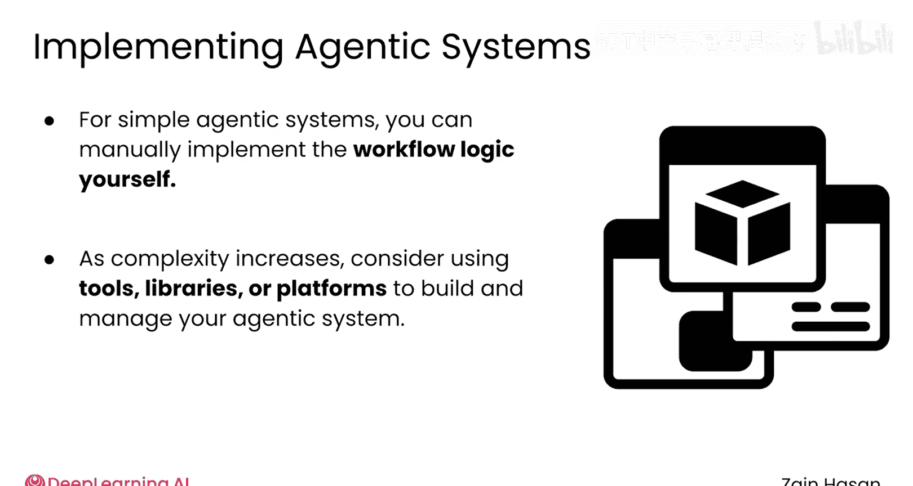

# 036：自主式RAG系统 🧠

在本节课中，我们将要学习如何通过引入自主式工作流来提升RAG系统的性能。我们将探讨自主式系统的核心概念、常见工作流模式以及它们如何使系统变得更强大和高效。

随着RAG系统的成熟，一个提升其性能的有效方法是开始引入自主式工作流。

自主式工作流意味着在整个RAG系统中使用多个大语言模型，每个模型负责整个流程中的一个独立步骤。

---

## 什么是自主式系统？

上一节我们提到了自主式工作流的概念，本节中我们来看看它与传统使用方式的区别。

通常，使用语言模型的方式是输入一个提示词，然后它直接输出一个简单的响应。在自主式系统中，这个过程有两个主要变化。

首先，任务被视为一系列步骤和决策，每一步都可以通过调用不同的大语言模型来完成。其次，大语言模型被赋予了使用更广泛工具的能力，例如代码解释器、网络浏览器，或者在RAG的情况下，一个用于参考信息的向量数据库。

---

## 一个自主式RAG工作流示例

以下是自主式RAG系统的一个可能工作流程：

1.  **路由决策**：用户向系统提交提示词，首先由一个轻量级的“路由”大语言模型处理。该模型的任务是判断提示词是否需要调用向量数据库。它经过专门调优，只会输出“是”（需要检索）或“否”（无需检索）。
2.  **条件分支**：根据路由模型的决策，提示词要么被发送到向量数据库进行检索，要么跳过该步骤。
3.  **直接响应**：如果无需检索，提示词将直接发送给另一个独立的大语言模型来生成响应。
4.  **检索与评估**：如果需要检索，系统会使用一个独立的“评估”大语言模型来判断检索到的文档是否足以回答问题。
5.  **迭代检索**：根据评估模型的判断，可能会向向量数据库请求额外的检索，直到获取足够的信息。
6.  **生成响应**：一旦检索到足够信息，系统会构建一个增强提示词，并交给大语言模型生成最终响应。
7.  **添加引用**：最后，再由一个大语言模型检查响应并添加引用。

这只是一个可能的自主式RAG系统，但它突出了任何自主式系统都具备的几个关键点。

首先，设计一个自主式系统本质上就像绘制一个流程图。图中的每个大语言模型仍然只是接收文本输入并生成文本输出，但系统的设置使得每个模型只负责提示词在RAG系统中旅程的一个任务。

其次，工作流中的每一步不需要使用相同的大语言模型。例如，路由和评估模型可以是轻量级、运行快速且成本低廉的模型，因为它们任务单一且相对简单。然后，可以使用一个更大的模型来生成草稿响应，并为添加引用这一步选择一个专门擅长此任务的模型。

---

## 常见的自主式工作流模式

在考虑为RAG应用添加自主式工作流时，以下是几种常见的模式。

**顺序工作流**：这种模式以线性方式将输出通过一系列大语言模型。这意味着发送到系统的每个提示词都可能依次经过基于大语言模型的查询解析器、查询改写器和引用生成器。每个大语言模型只专注于整体流程中的一个步骤，因此可以在该步骤上做到专业化。

**条件工作流**：这种模式使用一个大语言模型来决定提示词应遵循多条路径中的哪一条。你刚刚看到的“路由”大语言模型就实现了这种工作流，用于决定是否需要检索来响应提示词。你也可以使用路由来决定应该使用多个具有不同优势和专长的大语言模型中的哪一个来生成响应。

**迭代工作流**：这种模式与条件工作流类似，但它会将提示词路由回系统流程中更早的节点，形成一个循环。例如，如果你的RAG系统旨在生成与现有代码库集成的代码，系统可能需要多次尝试才能编写出有效的代码。一个“评估”大语言模型可以用来评估每个草稿（可能借助代码解释器），并提供反馈，直到它认为解决方案合适为止。

**并行工作流**：在这种模式中，一个“协调器”语言模型将一个提示词分解为多个不同的子任务，并将每个子任务分配给独立的大语言模型。在另一端，一个“合成器”语言模型将他们的工作重新组合。如果你的应用是比较两篇研究论文的关键见解，你可能希望两个不同的大语言模型分别总结和评估每一篇，然后由协调器合并他们的发现。

---

## 工具与思维转变

对于简单的自主式系统，你可以自己实现所需工作流的逻辑。然而，随着系统变得复杂，市面上有各种各样的工具、库和平台旨在帮助你构建和管理自主式系统。构建自主式系统的创意可能性是无穷无尽的。

这里还涉及一个重要的思维转变：大语言模型开始看起来不那么像独立的解决方案，而更像是可以嵌入到更大工作流中的模块化组件。突然间，你会更乐意使用较小的模型或只擅长少数任务的模型，因为它们的能力与其负责的工作流部分高度契合。添加自主式组件可以让你灵活地构建能力更强大的RAG系统。

---

本节课中我们一起学习了自主式RAG系统的构建方法。我们了解了如何将单一任务分解为由多个专业化大语言模型协同完成的步骤，探讨了顺序、条件、迭代和并行四种常见的工作流模式，并认识到这种模块化设计带来的灵活性与性能提升。通过引入自主式思维，你可以将RAG系统从简单的问答工具转变为更智能、更强大的信息处理管道。