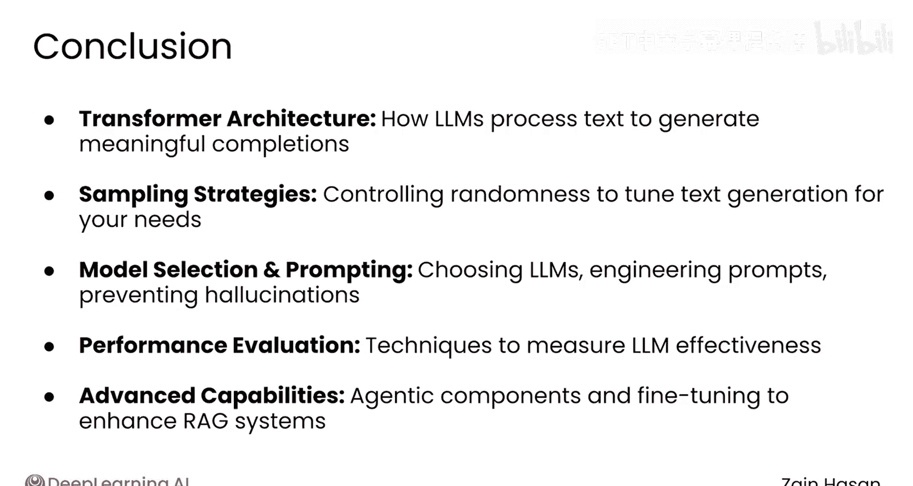

# 038：总结 🎯

在本模块中，我们深入探讨了大型语言模型（LLM）的核心概念与应用技术。从理解其内部工作原理到掌握如何评估与优化其性能，我们为构建一个强大的RAG系统奠定了坚实的基础。

## 模块内容回顾 📚

上一节我们完成了模块四的学习，现在让我们快速回顾一下本模块涵盖的所有关键主题。

### 核心概念与技术

以下是本模块学习的主要内容：

1.  **Transformer架构深入**：在模块开始时，我们深入探讨了Transformer模型的核心。理解了它如何处理文本，以深入理解其含义并生成相关的补全内容。其核心注意力机制可以用公式表示为：**Attention(Q, K, V) = softmax(QK^T / √d_k) V**。

2.  **采样策略**：随后，我们学习了如何使用各种采样策略来调整语言模型生成文本时固有的随机性，以适应应用程序的需求。例如，在代码中可以通过设置 `temperature` 参数来控制随机性：`model.generate(input_ids, temperature=0.7)`。

3.  **模型选择与提示工程**：接下来，我们学习了如何使用基准测试来选择LLM，掌握了多种提示工程技术，并了解了如何检测和防止模型产生“幻觉”（即生成不准确或虚构的信息）。

4.  **性能评估**：然后，我们学习了一系列用于评估LLM性能的技术。

5.  **系统能力扩展**：最后，我们探讨了如何通过添加智能体组件或对模型进行微调，来突破RAG系统能力的极限。

## 总结与展望 🚀

至此，您已经对LLM概念有了扎实的理解，并掌握了构建第一个RAG系统所需的所有工具。

在本节课中，我们一起学习了从Transformer内部机制到高级应用策略的完整知识链。您现在具备了评估、优化和扩展LLM应用的能力。

请加入本课程的最后一个模块，共同探索如何将您的RAG应用程序从一个简单的原型，发展为可用于生产环境的成熟系统。

