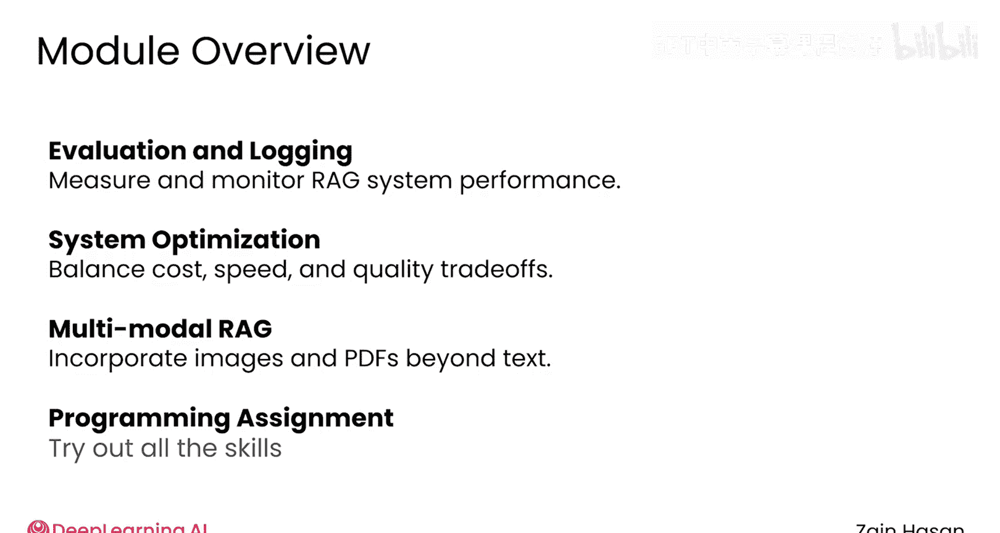

# 039：生产就绪 🚀

在本模块中，我们将学习如何将设计好的RAG系统投入生产环境。我们将探讨系统评估、性能权衡以及集成多模态数据等关键主题，以确保系统的高性能和可靠性。

## 模块5简介 📋

上一模块我们掌握了设计和构建RAG系统所需的核心技能。然而，当准备将应用部署到生产环境时，会出现一系列新的考量因素。

在本模块中，你将学习如何使你的RAG系统达到生产就绪状态。

## 系统评估与监控 🔍

首先，我们将回顾针对RAG系统的多种评估策略以及运行这些评估的平台。

无论你是评估单个组件还是整个系统，都需要具备观察系统性能的能力。

以下是评估RAG系统时需要考虑的几个方面：
*   **组件级评估**：分别评估检索器和生成器的性能。
*   **端到端评估**：评估整个系统对用户查询的最终响应质量。
*   **评估平台**：利用工具和平台自动化运行评估。

你还会探索日志记录如何帮助你追踪对RAG系统的每一次调用，并识别低质量响应的根源。

在结束关于评估的探讨前，你将学习如何从应用程序的流量中构建自定义数据集，以便使用真实的客户数据来测试对RAG系统的更改。

## 性能权衡与优化 ⚖️

上一节我们介绍了系统评估，本节中我们来看看在设计和调整RAG系统时经常遇到的各种权衡。

无论你是希望控制成本、内存占用还是延迟，你都将研究一些策略，帮助RAG系统在不显著损失响应质量的前提下，满足项目的特定需求。

以下是常见的权衡领域及应对策略：
*   **成本控制**：优化嵌入模型和LLM的调用次数，例如通过缓存或使用更经济的模型。
*   **内存与速度**：在索引大小（影响召回率）和检索速度之间取得平衡。
*   **质量与延迟**：调整检索文档的数量（`k`值）以平衡答案的准确性和响应时间。

## 集成多模态数据 🌐

最后，你将探索一些前沿方法，将多模态数据集成到RAG系统中。

这将允许你的系统从一个不仅包含文本，还包含图像或PDF等数据的知识库中提取信息。

## 实践与总结 🎯

与往常一样，本模块以一个编程作业结束，你可以在此尝试运用所学的所有技能。

我相信你会喜欢这个专注于让你的生产级RAG系统表现更出色的最终模块。

在下一个视频中与我一起，让我们开始吧。

---

**本节课中我们一起学习了**如何为RAG系统的生产部署做准备，涵盖了从评估策略、性能监控、成本与质量的权衡，到集成多模态数据等关键生产环境考量。这些知识将帮助你构建出更健壮、高效且实用的RAG应用。