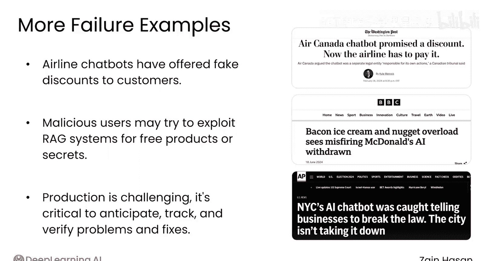

# 040：生产化部署的挑战 😰

在本节课中，我们将探讨当RAG系统从原型阶段迈向实际生产环境时所面临的一系列全新挑战。理解这些挑战是构建稳定、可靠且高效的生产级应用的关键第一步。

上一节我们介绍了RAG的基本原理和构建流程，本节中我们来看看当系统真正面对用户和真实世界数据时，会遇到哪些棘手的问题。

## 挑战一：系统扩展性

生产环境首先带来的挑战是规模扩大。更多的用户会给系统带来压力，主要体现在以下方面：

以下是系统扩展性带来的具体问题：

*   **吞吐量与延迟**：系统需要处理更多的并发请求，同时要保证请求接收与回复之间的延迟保持在较低水平。
*   **资源消耗与成本**：更多的请求意味着更高的内存和计算资源使用量，最终导致运营成本上升。
*   **性能维持**：在规模扩大时，维持系统的基础性能表现是一项挑战。

## 挑战二：用户请求的多样性与不可预测性

一旦系统交到用户手中，你将面临请求的多样性和不可预测性。即使经过严格测试，也难以预测RAG系统会收到的每一种请求类型。

以下是这方面的具体表现：

*   **未知请求的挑战**：你可能会发现系统在某些新类型的请求上表现不佳，即使它在发布前的测试中表现良好。
*   **真实世界数据的复杂性**：生产环境的另一个挑战在于，真实世界的数据通常很混乱。数据常常是碎片化的、格式不佳的、缺少元数据的，等等。

## 挑战三：多模态数据与安全隐私

许多数据甚至根本不是文本格式，而是存在于图像、PDF文件和幻灯片中。如果你想将这些数据纳入知识库，就需要有访问它们的方法。

此外，安全和隐私问题也值得关注。许多RAG系统的部署正是因为知识库中的数据是私有的或专有的。

以下是相关的核心要求：

*   **数据访问**：需要一种方法来处理非文本格式的数据，例如使用 `extract_text_from_pdf(pdf_file)` 这样的函数或专用库。
*   **安全与隐私**：在允许授权用户使用RAG系统访问数据的同时，确保数据保持私有是一项重要的功能需求。

## 挑战四：错误的实际影响

在所有这些挑战之上，生产环境最大的问题是：错误可能产生真实的业务影响，无论是财务上的还是声誉上的。

以下是几个著名的案例：

*   **谷歌的“吃石头”事件**：谷歌首次推出AI搜索摘要功能时，曾回应某些提示，建议用户“为了营养益处而吃石头”。经调查，问题源于一个用户提问“我应该吃多少石头”，这是一个看似愚蠢且难以预测的问题。系统在检索相关信息时，找到了许多滑稽的文章或论坛对话，但未能识别出这些内容的荒谬性。
*   **航空聊天机器人的“虚假折扣”**：航空公司的聊天机器人曾向善意的顾客承诺实际上并不存在的折扣。
*   **恶意攻击风险**：恶意行为者会试图欺骗你的RAG系统，例如让其免费出售产品或泄露机密信息。

## 应对策略与总结

总而言之，生产环境对RAG系统的运行而言是一个充满挑战的领域。因此，建立一套系统来预测问题、在问题发生时追踪根源，并验证你所做的更改是否带来了真正的改进，是至关重要的。

有多种技术可用于应对所有这些生产挑战。在下一节视频中，我们将一起探讨第一个关键策略：构建一个健壮的可观测性系统。

本节课中我们一起学习了RAG系统在生产化部署时面临的四大类核心挑战：系统扩展性压力、用户请求的不可预测性、多模态数据与安全隐私处理，以及错误可能带来的真实业务风险。理解这些挑战是设计稳健生产流程的基础。