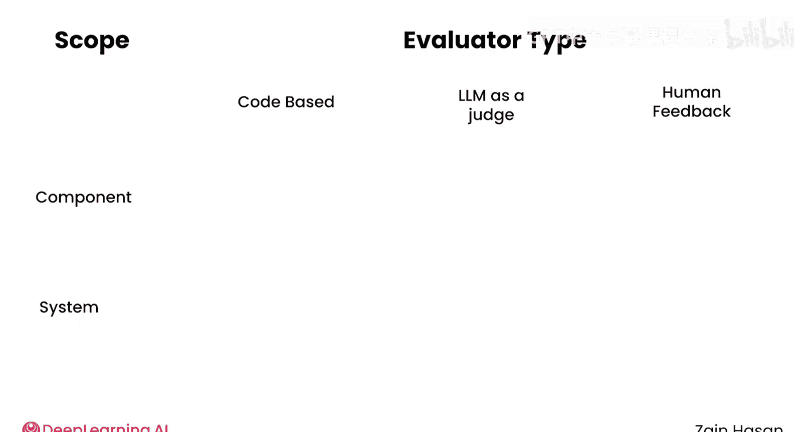
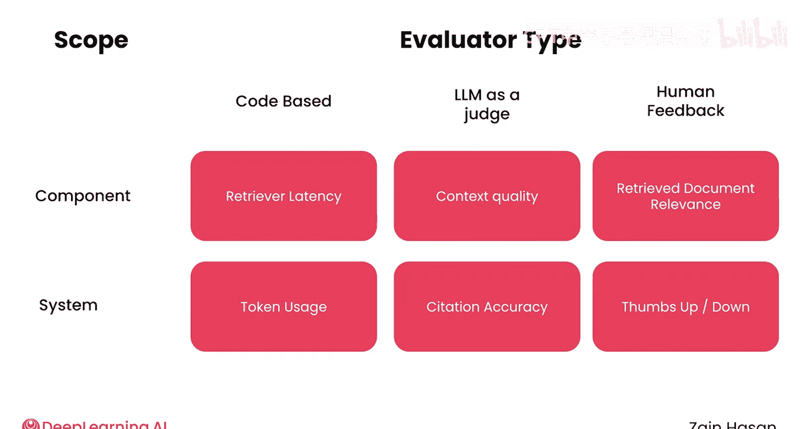
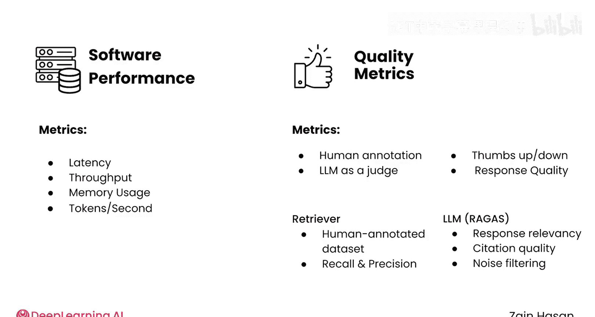

# 041：RAG评估策略实施 🧪

在本节课中，我们将学习如何为生产环境中的RAG系统构建一个健壮的可观测性系统。我们将探讨该系统应包含的组件、需要追踪的各类指标，以及不同评估方法之间的权衡。

## 概述：构建RAG可观测性系统

处理生产环境挑战的一个良好开端是构建一个健壮的可观测性系统。首先，让我们看看它应该包含哪些不同的组件。

一个可观测性平台需要追踪几种不同类型的信息。

## 可观测性系统的核心组件

以下是构建可观测性系统时需要考虑的几个关键方面。

**1. 软件性能指标**

与几乎任何生产软件系统一样，你需要了解系统处理的请求数量、处理所需时间以及消耗的资源量。因此，系统需要追踪常见的软件性能指标，例如**延迟**、**吞吐量**、**内存**和**计算资源使用率**。

**2. 质量指标**

除了了解系统运行的速度或效率，你还需要知道最终结果是否达到你设定的质量标准。这里的“质量”可能涵盖从用户对最终回复的满意度，到检索器的**召回率**等各个方面。

**3. 数据收集与报告方式**

信息如何被收集和报告也很重要。你的系统应该捕获随时间推移的聚合统计数据，以帮助你跟踪性能的高层趋势，并快速识别性能退化。同时，系统还应记录详细的日志。这些日志能让你追踪单个提示词在RAG管道中的完整旅程，这在试图理解性能不佳的响应来源时特别有用。

**4. 实验支持能力**

理想情况下，你的评估系统应该支持实验。如果你考虑切换到新的语言模型、添加系统提示词或调整检索器的设置，你需要在安全环境中运行定制化实验，或在生产环境中对用户进行A/B测试。监控这些变更对性能和质量指标的影响，最终将帮助你决定是否将这些实验成果部署到生产系统中。

## 评估指标的框架：范围与评估者类型

了解了高层结构后，我们来看看需要追踪的具体指标。一个思考所有这些指标的良好框架是**范围**和**评估者类型**。

*   **范围**：指评估是针对RAG系统的某个组件，还是针对整个系统。
*   **评估者类型**：指评估是基于代码、使用LLM作为评判者，还是依赖人工反馈。

你可以将这两个维度想象成一个网格，你选择的评估方法就位于其中一个方格内。让我们先探讨每个维度，然后看看一些常见的评估方法在这个网格中的位置。

### 评估范围：系统级与组件级

上一节我们介绍了评估框架的两个维度，本节中我们先来看看**评估范围**。

*   **系统级评估**：通常用于总结整体系统性能，或提供系统运行状况的高层视图。
*   **组件级评估**：帮助你调试单个问题的根源。例如，你可能会追踪整个系统的延迟，并发现它过高。然而，为了追踪该问题的根源，你需要组件级评估来确定是检索器、你的大语言模型，还是其他组件最终导致了问题。

### 评估者类型：代码、人工与LLM

了解了评估范围，接下来我们看看**评估者类型**，它关注评估是如何生成的。

*   **基于代码的评估**：这是成本最低、最简单、最直接的实现方式。这可以是从记录系统每秒处理的提示词数量，到运行单元测试以确保LLM输出有效的JSON等一切操作。关键在于这些评估可以自动运行、是确定性的，并且运行成本几乎为零。
*   **人工反馈与评估**：这是成本较高的一种方法，但它能捕获基于代码的评估会遗漏的信息。一个常见的例子是应用程序的用户用“点赞”或“点踩”来标记响应。即使这不能提供很多详细信息，但更多用户给你的响应点“踩”这一事实，就是一个需要解决问题的有用信号。你也可以给用户一个文本框来提供更详细的反馈。其他一些评估可以自动运行，但最初依赖于人工输入。例如，你可以让人工预先编译一个包含提示词和应被检索的相关文档的数据集。一旦该数据集编译完成，你就可以快速计算**精确率**和**召回率**等常见指标。但值得记住的是，在某个时间点，需要人工来编译那个初始的测试数据集。
*   **LLM作为评判者**：这种方法试图通过使用语言模型来给你的系统各个组件的表现打分，从而在成本和灵活性上取得平衡。例如，LLM可以判断检索器检索到的文档是否真的与用户的提示词相关。LLM作为评判者比基于代码的评估更灵活，又比人工反馈更便宜。然而，LLM作为评判者仍然需要仔细调整。模型可能存在偏见，并倾向于由它们自己家族模型生成的响应。它们还需要清晰的评分标准，并且通常在像“相关”或“不相关”这样的离散标准上表现最佳，而不是在0到100的评分尺度上。

## 构建初始评估指标集

现在，让我们看看如何将所有这些不同的评估概念整合成一个简单但全面的指标集，作为你开始收集数据的起点。

一个好的开始思路是为每个主要组件以及整个系统收集**软件性能指标**和**质量指标**。

*   **系统性能指标**：如**延迟**、**吞吐量**、**内存使用率**或每秒生成的**令牌数**，这些都是基于代码的评估，使得它们成本低廉且易于收集。你可以在组件级别和系统级别轻松捕获这些数据。
*   **质量指标**：对于质量指标，你通常需要依赖使用人工标注或LLM作为评判者的技术。

以下是针对不同范围和质量维度的具体评估方法：

**系统级质量评估**

你可以允许用户对生成的回复进行“点赞”或“点踩”，为你提供关于整体回复质量的反馈。

**检索器评估**

你可以花时间编译一个由人工标注的测试数据集，包含提示词和期望检索到的文档，从而允许你计算**召回率**和**精确率**等常见指标。

**LLM质量评估**

你通常会使用基于LLM的评估，例如Ragas库中提供的那些，来评估诸如**回复相关性**、**引用质量**或LLM忽略不相关检索信息的能力等方面。

像这样的方法让你既能了解整个系统的性能和品质，也能洞察各个组件的状况。它还在廉价的评估（如延迟）和依赖人工标注或LLM调用的更昂贵指标之间取得了良好的平衡。在此基础上，你可以决定希望更仔细地关注哪些额外的领域。

## 总结

本节课中，我们一起学习了RAG可观测性系统应包含的组件，以及在设计它时需要考虑的权衡。我们对系统级与组件级评估、基于代码、人工和LLM的评估方法有了一个快速的高层概览。在下一个视频中，我们将更深入地探讨实际实施这个系统时出现的一些具体考虑因素。

