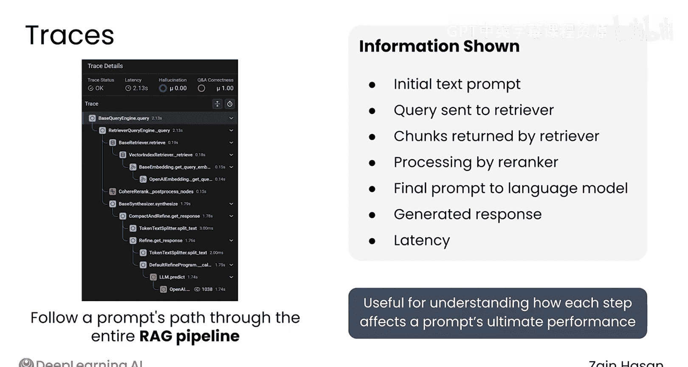
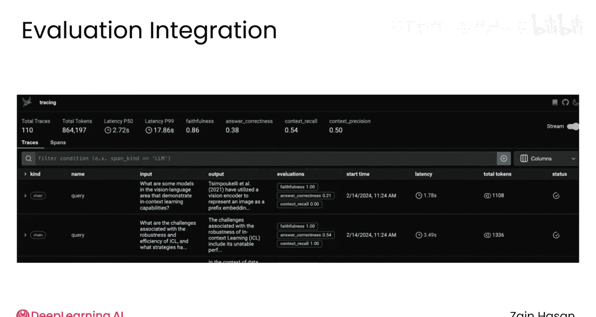
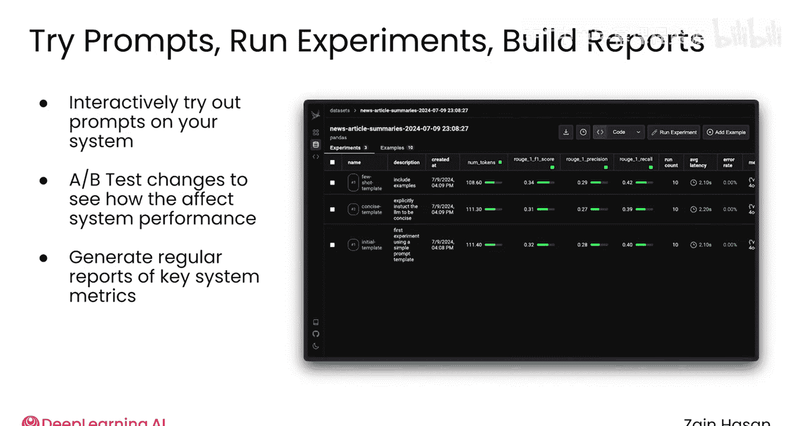
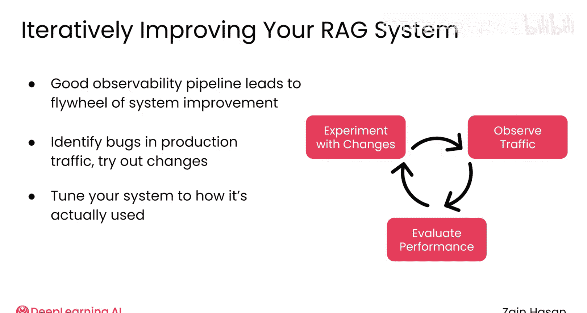

# 042：日志监控与可观测性

在本节课中，我们将学习如何为你的RAG系统构建一个可观测性系统，以收集和分析性能数据。我们将了解可用的工具平台，并探讨如何利用它们来监控、评估和持续改进你的RAG应用。

## 可观测性平台概述

上一节我们讨论了需要收集哪些指标，本节中我们来看看如何构建系统来收集这些数据。

市面上有许多专为基于大语言模型（LLM）的应用设计的可观测性平台。这些平台旨在执行常见的评估任务，例如捕获系统级或组件级的指标、帮助记录系统流量，以及支持使用新系统设置进行实验。使用这类平台意味着你可以减少设计和实现可观测性系统的时间，从而将更多精力投入到监控RAG系统性能和探索改进方法上。

## 平台工具示例：Phoenix

作为一个例子，我们来看一个名为Phoenix的开源可观测性和评估平台。它由Arize公司构建，提供了多种工具来帮助你评估RAG系统的性能。

以下是Phoenix平台提供的一些核心工具：

### 追踪 (Traces)

追踪工具允许你跟踪一个提示（prompt）在整个RAG管道中的流转路径。你可以看到它如何被系统中的每个组件修改。

例如，你可以看到：
*   初始的文本提示。
*   发送给检索器的查询。
*   检索器返回的文本块。
*   这些文本块如何被你的重排序器处理。
*   最终发送给核心语言模型的提示。
*   生成的最终响应。

此外，像每一步的延迟（latency）这类有用信息也可以被记录下来。追踪是评估RAG系统的常用工具，无论它是早期原型还是已投入生产。例如，如果你知道某个提示在你的RAG系统中表现不佳，你可以追踪它的路径，并尝试确定哪一步是错误来源。

### 集成评估指标

Phoenix平台还便于收集你在本模块中已经见过的许多评估指标。例如，它与Ragas库集成，该库用于计算不同的评估指标。因此，如果你想计算检索器的搜索相关性，或者判断你的LLM是否准确地引用了检索到的来源，可以轻松添加这些评估步骤。

### 实验与A/B测试

一旦你建立了一个基本的评估管道，就可以开始运行简单的实验。例如，你可以迭代式地尝试自己的提示，并观察它们会如何被你的RAG管道处理。你还可以对系统更改进行A/B测试，以观察它们如何影响系统性能。这类功能帮助你决定一个新的系统提示是否真的提高了响应质量，或者观察添加一个重排序器能带来何种性能提升。

### 聚合统计与报告

虽然追踪让你能访问底层信息，但你通常也需要高级的聚合统计数据来跟踪系统性能。Phoenix能够提供关键指标的每日报告，从检索器的准确性到你模型的幻觉率。

## 补充工具与持续改进循环

虽然Phoenix和其他LLM可观测性平台覆盖了你想要为RAG系统收集的大部分评估指标，但仍会存在一些空白。例如，它并不是监控向量数据库计算和内存使用情况的理想工具。在这些情况下，你可以使用更经典的监控和可观测性工具，如Datadog和Grafana。

一个良好的可观测性管道最终会形成一个系统改进的飞轮。通过观察你的系统如何处理真实的生产流量，你能够识别错误或确定需要改进的目标领域，然后观察你所做更改的影响。随着时间的推移，这使你能够调整系统中的每个组件，以最好地匹配用户实际使用它的方式。

在这个过程中，一个宝贵的工具是能够创建由RAG系统先前处理过的提示的自定义数据集。通过保存这些提示，然后在你的系统中重新运行它们，你可以看到系统更改对你的应用实际接收到的提示所产生的影响。

本节课中我们一起学习了如何利用可观测性平台（如Phoenix）来构建RAG系统的监控与评估体系。我们探讨了追踪、指标集成、实验测试和聚合报告等关键功能，并了解了如何结合传统工具填补监控空白，最终形成一个持续改进的系统优化循环。