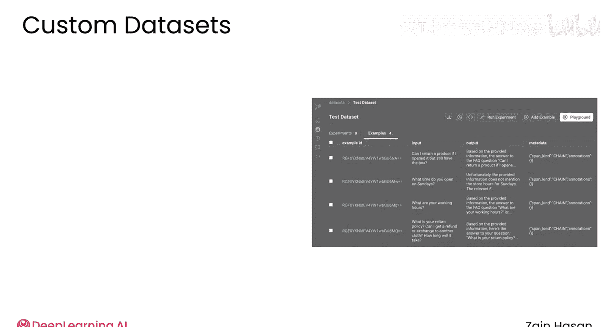
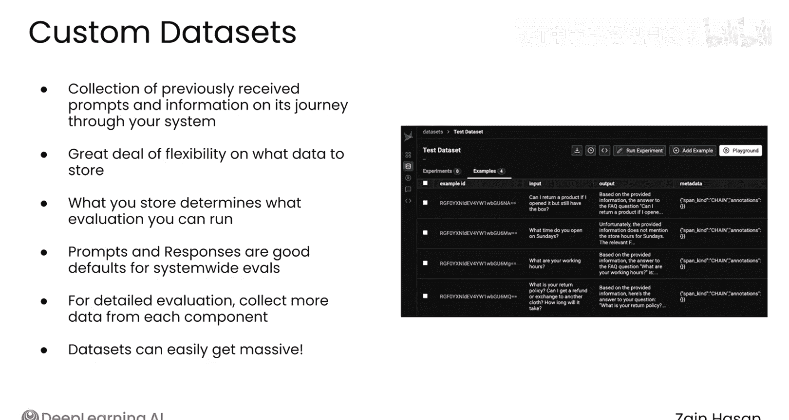
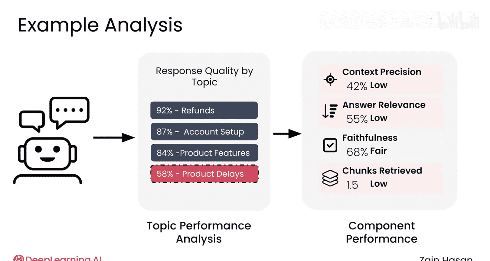
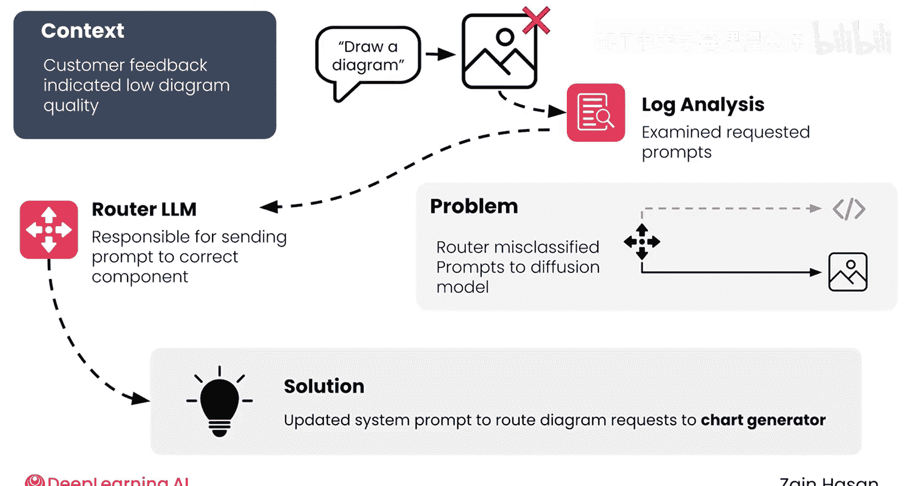
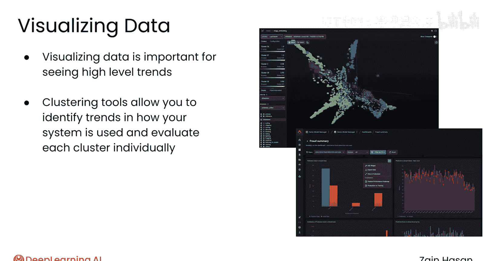

# 043：定制化评估体系 📊

在本节课中，我们将学习如何为你的RAG系统构建一个定制化的数据集。这个数据集不仅能帮助你深入理解系统过去的表现，还能让你通过实验来验证系统设计的改进如何影响其在真实世界提示上的性能。

## 构建定制化数据集

上一节我们介绍了评估的重要性，本节中我们来看看如何具体构建一个用于评估的定制化数据集。

一个定制化数据集，本质上是你系统先前处理过的提示集合，以及你选择收集的关于该提示在系统中流转过程的任何信息。

你可以选择只保存初始提示和最终响应，也可以向你的定制化数据中添加大量信息。

例如，你的向量数据库检索到了哪些文档、这些文档在你的重排序器处理前后的排名情况、你的查询重写器的输出等等。拥有如此大的灵活性，构建定制化数据集时的一个重要决策是：**我应该存储哪些数据？**

简单的答案是：**你想评估什么，就存储什么。**

例如，你几乎肯定需要保存用户提交的输入提示和你的RAG系统生成的最终响应。这两个基本数据点能让你对系统性能有一个初步了解，并可以追踪随着提示的编辑，响应是如何变化的。

然而，这些信息实际上只对端到端的评估有帮助。如果你想进行组件级别的评估，以了解你的检索器、重排序器或查询重写器的表现如何，那么就需要保存这些组件各自使用的输入和输出数据。

通常，你会希望记录这些详细的组件级步骤。因此，用于记录RAG系统调用的表格很容易就有几十列。

以下是可能存储的数据类型示例：
*   发起调用的客户ID
*   你的重排序器筛选过的文本块
*   你的智能体工作流中每个路由语言模型的输出

😡

存储这样多样化的数据，使你能够单独分析系统的每个组件，并从多个维度检查性能。

例如，如果你正在构建一个客户服务聊天机器人，你可以按问题主题进行筛选，从而发现关于“退款”的问题收到了高质量的响应，但关于“产品延迟”的问题表现却很差。

当你去调查为什么这些与产品延迟相关的提示导致了低质量的响应时，你或许可以通过分析日志发现，你的检索器无法为这些提示找到很多相关文档。这可能意味着你需要向知识库中添加更多相关信息。

如果你构建了合适的可观测性系统，你将能够发现问题、精确定位其根源，并对解决方案的有效性充满信心。

## 案例分析：问题诊断与解决

让我们通过一个来自我职业生涯的真实例子，看看定制化数据集和日志如何帮助诊断和解决问题。

我曾在一个专业的RAG系统上工作，该系统能够生成文本、图像，以及使用Mermaid JS生成代码支持的图表和示意图。

我们开始收到投诉，称系统生成的一些图表质量很低。通过回溯我们的日志，我们意识到许多问题出现在用户要求系统“绘制一个图表”时。路由语言模型误解了这个提示，因此将其发送给了用于图像生成的文生图模型。这些模型在生成人物或事物的图像方面相当不错，但在生成图表方面却很差。

一旦我们找到了问题的根源，我们就能够更新路由LLM的系统提示，使得这类提示会创建代码支持的图表，而不是生成图像。得益于一个健壮的监控和日志系统，在我们收到客户的问题报告后，就能直接追踪到其源头，并迅速将修复方案投入生产。

## 数据可视化与趋势分析

虽然有时你会想像上面那样追踪表现不佳的单个提示，但一旦你记录了大量数据，你通常会希望将其可视化。

这可以让你识别整个系统或每个组件性能的高层趋势。例如，你可以将系统中所有输入提示进行可视化，并使用某种聚类算法来识别客户询问的高层主题，比如“产品发布”或“故障排除问题”。

如果你能区分所有这些不同的提示，那么你就可以仅针对该类型的提示运行你的评估流程，看看你的系统是否在某些类型的问题上表现不佳。

## 总结

本节课中我们一起学习了定制化评估体系的核心——构建定制化数据集。定制化数据集是使你的RAG应用程序适应其处理的真实请求的重要工具。将其纳入你的系统评估方式中，是改进系统响应用户实际提示和问题的最佳途径。通过记录详细的日志、进行组件级分析、可视化数据趋势，你可以系统地诊断问题、优化性能，从而构建出更强大、更可靠的RAG系统。