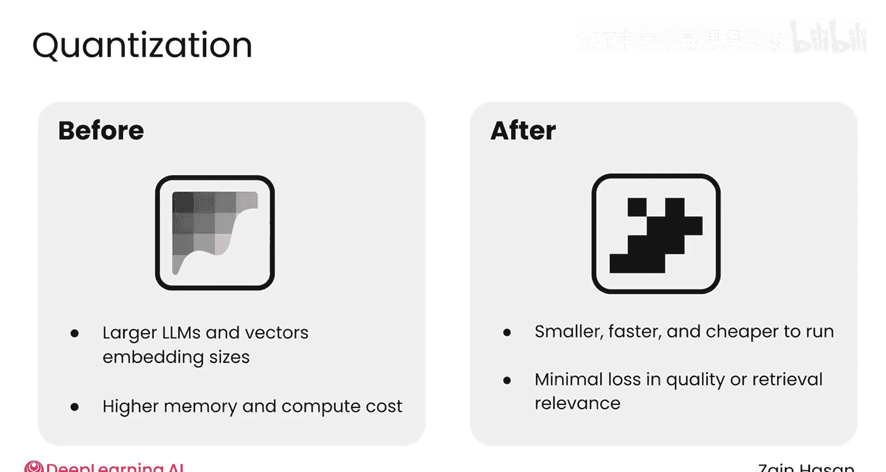
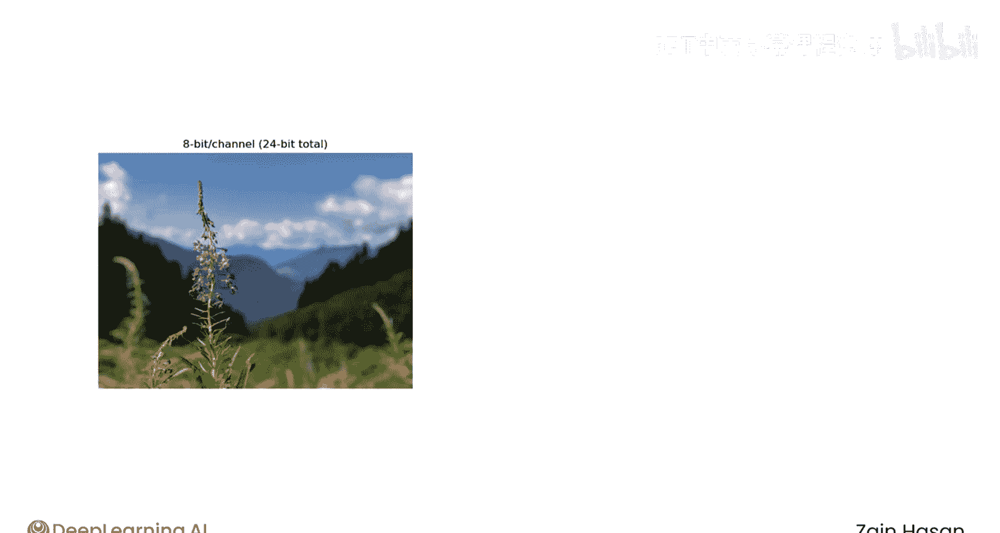
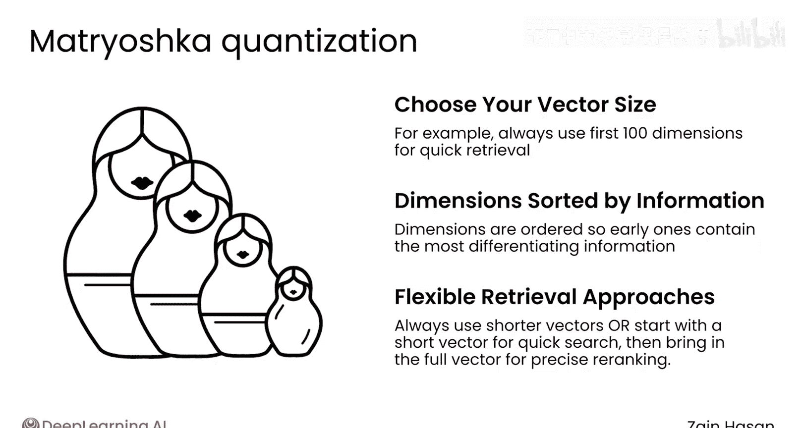

# 044：模型量化技术 🧮

在本节课中，我们将要学习一个重要的概念——模型量化。量化是一种用于压缩大型语言模型和嵌入向量的技术，它能在成本、速度和质量之间取得平衡。我们将探讨量化的工作原理、不同类型及其在RAG系统中的应用。

## 概述

当你能够评估RAG系统并尝试不同配置后，你将面临许多软件项目中常见的权衡：成本、速度和质量。在接下来的视频中，你将探索这些权衡。首先，让我们介绍一个重要概念：量化。

## 什么是量化？

简而言之，量化是针对LLM和嵌入模型生成的向量的压缩技术。量化将LLM内部的模型权重或嵌入向量的值，替换为压缩后的低精度数据类型。

这使得模型或向量变得更小、运行成本更低、速度更快，通常在检索相关性或响应质量方面不会有太大牺牲。

## 量化的工作原理

一个很好的类比是图像压缩。一张高质量图像使用24位数据来表示每个像素的颜色。颜色看起来很棒，但它确实使用了大量数据来存储所有信息。你可以通过为每个像素使用12位甚至6位来压缩图像。

压缩后的图像大小分别是原始图像的一半和四分之一，这是显著的内存节省。然而，12位图像看起来已经不那么好了，而在6位图像中，有许多可见的颜色伪影。不过，根据你使用图像的场景，这种质量下降可能值得换取大量的内存节省。

量化对LLM和嵌入向量采用相同的方法，以牺牲一些质量损失为代价来缩小它们的大小。

## 大型语言模型的量化

典型语言模型中的每个参数使用16位内存，现代模型的参数数量大约在10亿到1万亿之间。这些模型非常庞大，需要大量内存来存储它们，并需要强大的GPU来运行它们。

量化模型将这些16位参数压缩到8位甚至4位的等效值。这显著减少了运行模型所需的GPU内存，代价是模型性能和质量略有下降。

## 嵌入向量的量化

量化嵌入向量的工作原理类似。一个相当典型的768维向量将使用768个32位浮点数。这意味着你的知识库中每个向量都有3KB的数据。更高维度的模型很容易需要数倍于此的数据量。一旦你存储了数百万甚至数十亿个这样的向量，你将面临海量的向量数据需要处理。

这些向量需要存储在某个地方才能使用，特别是如果你想在快速向量搜索中使用它们，它们需要加载到昂贵的RAM中。整数量化是缩小这些向量的常用方法。

它将32位浮点数替换为小得多的整数，例如一个8位整数。这意味着你的向量现在立即变为原始大小的四分之一，这是巨大的空间节省。这些整数值也非常容易计算。

以下是该过程的运作方式：
1.  为你的向量数据，找出每个维度中出现的最小值和最大值。这将定义该维度中数值的分布范围。
2.  然后将该范围划分为256个等大小的区间（这是8位可以表示的独特值的数量）。
3.  这些区间被编号为0, 1, 2, 3，依此类推，直到255。
4.  然后，原始向量中的每个浮点数都被分配一个整数值，该值等于它落入的区间编号。

如果你还存储了最小值和每个区间的宽度，你就拥有了计算原始32位浮点数近似值所需的所有信息，但只使用了8位数据。

尽管只使用了四分之一的数据，并且采用了看似简单的压缩算法，但8位整数量化在诸如召回率@K等基准测试中表现非常出色。使用8位量化时，你可能只会看到几个百分点的下降。

这些量化后的嵌入向量意味着你的向量数据库中需要存储的数据更少，同时由于所需的计算被简化，还能实现更快的搜索。

## 量化模型的性能与权衡

量化模型在使用常用基准测试进行测量时，通常性能下降幅度很小。同时，它们使用更少的GPU内存，并且可以更快地生成文本。换句话说，这是以微小的质量下降为代价，换取了巨大的内存和性能提升。

虽然8位整数量化向量被广泛使用，但1位或二进制量化向量也越来越受欢迎。这种方法将向量的大小压缩了32倍（从每个维度32位压缩到仅1位），这是巨大的节省。在这种压缩级别下，向量中的每个值要么是1，要么是0，仅表示该维度上的值是正数还是负数。

正如你可能想象的那样，在这种极端的压缩级别下，基于嵌入模型的检索性能可能会明显下降。尽管如此，1位量化能带来显著更小、更快的基于向量的检索。它也可以与其他技术结合使用，例如，基于1位量化嵌入模型执行快速检索，然后使用完整的原始32位向量进行重新评分。

## 嵌套娃娃嵌入模型

另一种缩小向量大小的方法是使用嵌套娃娃嵌入模型。这些向量的设计使得你在进行相似性比较等操作时，可以选择只使用向量维度的一个子集。

例如，如果完整向量有1000个维度，你可以选择只使用前500个或前100个维度来实现这一行为。嵌套娃娃嵌入模型有一个特殊属性：它们的维度是根据信息密度排序的。这里的“信息”指的是在嵌入大量文本时，你预期在该维度中看到的统计方差量。

在典型的嵌入模型中，每个维度都有大致相同的方差或信息量。在嵌套娃娃模型中，由于所使用的训练过程，较早的维度会有更多的方差，这意味着更高的信息含量。较晚的维度方差较小，意味着它们提供的信息相对较少，因此排除它们所付出的代价也更小。

有几种使用嵌套娃娃向量的方法：
*   你可以选择只使用前100个维度，在保存尽可能多信息的同时节省空间并实现更快的计算。
*   或者，你可以始终使用前100个维度执行初始检索，然后从速度较慢、成本较低的内存中提取剩余的900个维度，使用完整的1000个维度来帮助重新评分初始检索到的文档集。

嵌套娃娃模型的灵活特性使其最适合动态环境，在这种环境中，你可能希望快速从低保真度向量表示切换到高保真度向量表示。

## 核心要点与实验建议

虽然这些先进技术展示了量化前沿的可能性，但核心要点是：你应该尝试使用整数量化的LLM和嵌入模型。

大多数LLM和嵌入模型提供商都会在其基础模型旁边提供8位或4位量化模型。它们提供的空间和成本节省可能是显著的，而质量下降则相当小。

## 总结

本节课中，我们一起学习了模型量化技术。我们了解到量化是一种通过降低数据精度来压缩LLM和嵌入向量的方法，它能在成本、速度和质量之间取得平衡。我们探讨了整数量化、二进制量化以及嵌套娃娃嵌入模型等具体技术。对于构建高效的RAG系统，尝试使用量化模型通常是降低成本和提升速度的有效策略，同时质量损失可控。