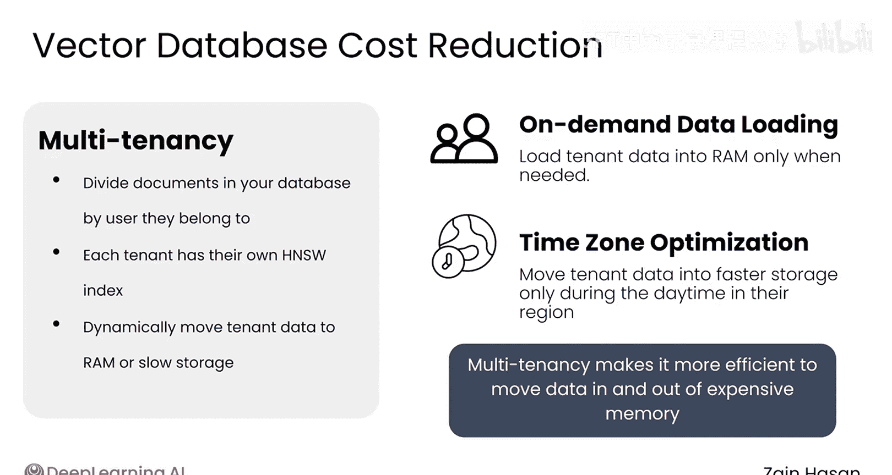

# 045：成本与响应质量的平衡 💰⚖️

在本节课中，我们将探讨在构建和扩展RAG系统时，如何平衡成本与响应质量。我们将分析系统的主要成本来源，并学习一系列策略来有效控制成本，同时尽可能维持高质量的输出。

## 成本构成分析

上一节我们介绍了RAG系统的核心组件，本节中我们来看看其主要的成本构成。在一个典型的RAG应用中，最大的两项成本通常来自向量数据库和大语言模型。

## 管理LLM成本的策略

为了控制大语言模型的成本，我们可以采取以下几种方法。

### 1. 尝试使用更小的模型
无论是负责生成最终响应的核心LLM，还是智能体系统中的路由LLM，你都有可能通过使用更小、更便宜的模型来达到相似的整体质量。模型更小可能有两种原因：一是模型参数总量更少；二是模型参数被量化为更低精度的格式（例如8位）。在这两种情况下，小模型的表现常常会带来惊喜，尤其是在LLM执行的任务数量有限时。对小模型进行微调，可以以较低成本获得良好结果。

### 2. 限制输入与输出令牌数量
RAG提示词的大小会迅速膨胀，特别是当每次提示都检索许多冗长的文档块时。可以尝试检索更少的文档，即减少 `top K` 的值。许多LLM的回复可能比较冗长，请记住，你需要为它们生成的每一个令牌付费。更新系统提示词以鼓励简洁的回复，甚至设置严格的令牌数量限制，是另一种直接降低成本的方法。

### 3. 在专用硬件上托管LLM
像Together AI、AWS和Google这样的云LLM提供商提供了便捷的推理端点，在构建原型时使用它们通常很合理。然而，当你的项目扩展到处理成千上万甚至数百万个请求时，通过在这些公司租用专用硬件来运行模型，可能会节省大量成本。专用端点的额外好处是更好的可靠性，因为该硬件只服务于你的用户流量。

以下是使用专用硬件时成本计算方式的对比：
*   **云推理端点**：通常按使用量（如每百万令牌）付费。
*   **专用硬件**：按小时为你模型所需的GPU付费。

在规模较大时，按小时付费相比按令牌付费，可能带来非常显著的成本节约。

## 管理向量数据库成本的策略

在向量数据库方面，了解其存储架构是控制成本的关键。大多数数据库提供多种类型的内存，通常需要考虑以下三种：RAM（内存）、磁盘存储和云对象存储。RAM速度最快但最昂贵，云对象存储最慢但最便宜，磁盘存储则介于两者之间。

如果你想节省成本，就需要确保只有那些真正能提升系统性能的信息才被存放在快速且昂贵的存储中。例如，HNSW索引应保存在RAM中，以确保向量搜索尽可能快地运行。然而，你的文档内容可能不需要存储在RAM中。你可以决定将最常访问的文档放在磁盘存储中，而将很少访问的对象放在云对象存储中。

许多向量数据库包含帮助你监控这种权衡的功能，甚至可以根据应用程序的需求动态地将数据移动到不同类型的存储中。

### 多租户架构
这种方法的一个典型例子是多租户架构，即按用户或所属组织来划分向量数据库中的所有文档。例如，你的向量数据库中可能有100万个文档，分属于1000个不同的用户。每个用户只能访问自己的文档，因此每个用户实际上都有自己独立的HNSW索引来关联其文档。

这种系统使得仅在必要时将租户的数据快速加载到昂贵的高速内存中变得容易。例如，你可以等到客户实际登录你的网站时，才将其向量加载到RAM中；或者，你可以默认在夜间将欧洲租户的数据保留在存储中。在这两种情况下，你都是在将数据移入或移出昂贵的内存，但按租户组织信息使得能够更高效地执行此任务。

## 实验与监控

无论是减小模型规模还是缩短提示词长度，建立一个健壮的可观测性管道，将允许你评估这些更改的影响，并判断成本节约与响应质量下降之间的权衡是否真的值得。

## 总结

本节课中我们一起学习了RAG系统成本优化的核心策略。所有优化的核心思想是，作为一名工程师，你需要理解成本的来源，并确保它们被性能提升所证明。对于LLM，通常的方法是使用更小的模型和更短的提示词。对于向量数据库，主要节省成本的方法是在昂贵存储中存储更少的数据，并在RAM、磁盘和对象存储之间灵活迁移数据。通过实验并监控这些更改对性能的影响，你将能够判断它们带来的成本节约是否值得。