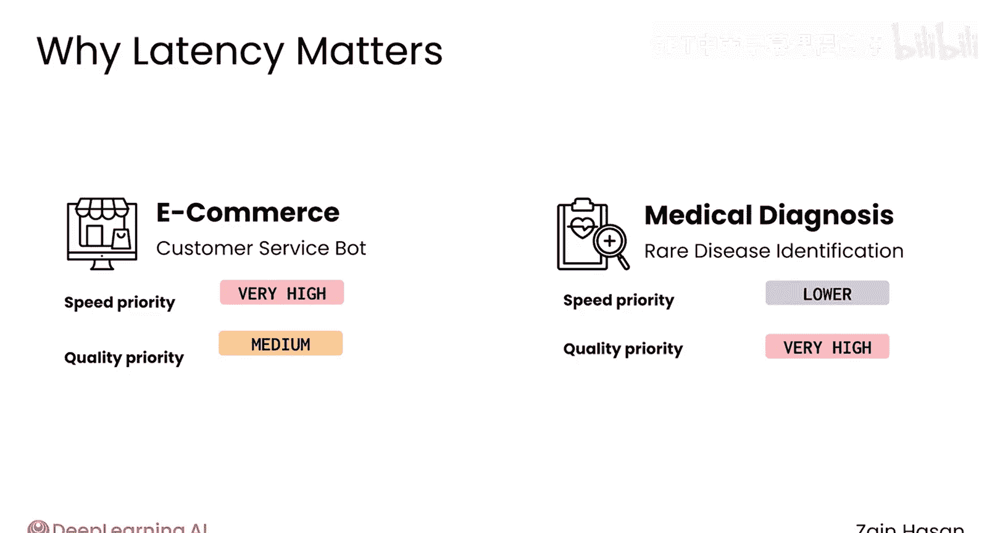
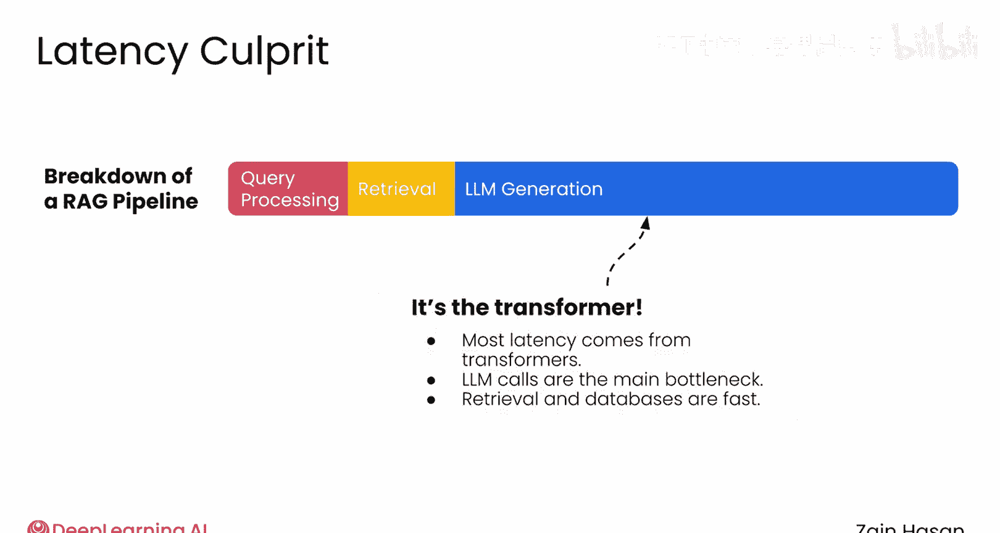
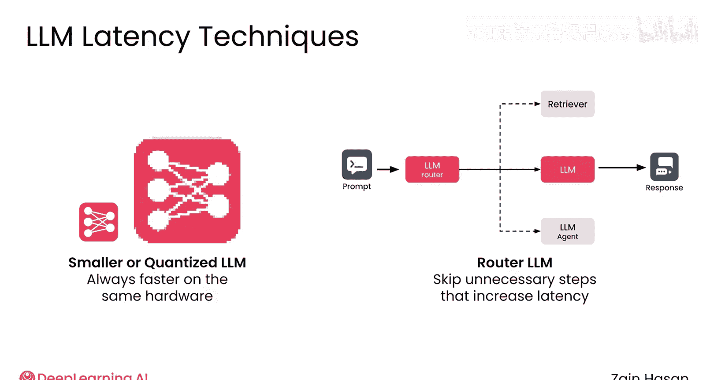
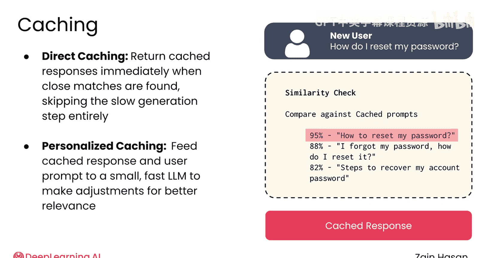
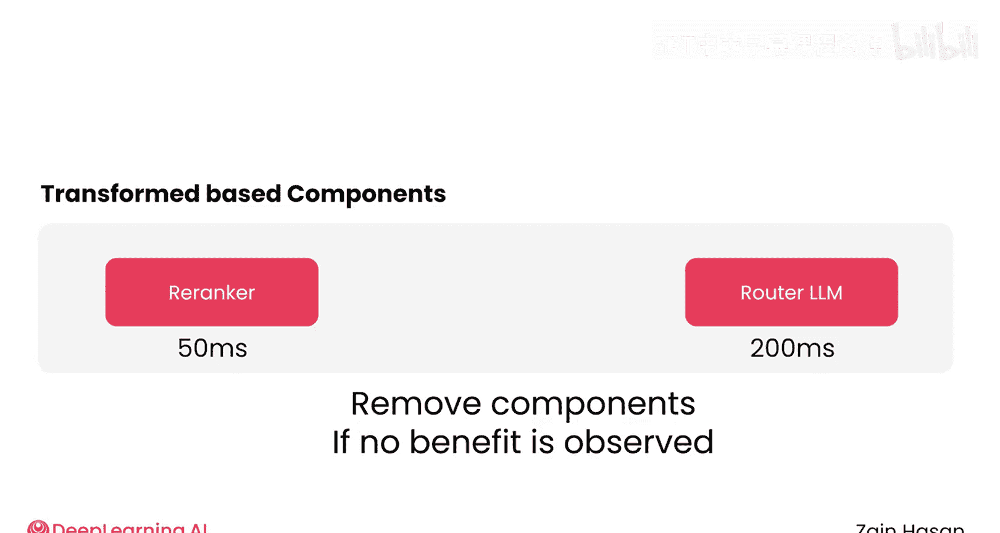
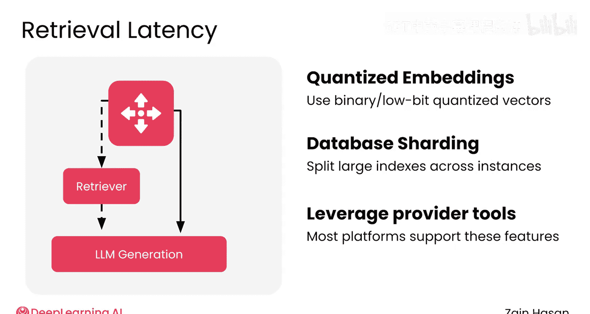

# 046：时延与响应质量的权衡 ⚖️

在本节课中，我们将探讨在生产环境中部署RAG应用时一个至关重要的平衡点：查询时延与响应质量之间的权衡。我们将分析时延的主要来源，并提供一系列优化策略，帮助您根据应用场景找到合适的平衡。

## 概述：时延与质量的固有矛盾

在RAG系统中，时延与响应质量之间通常存在此消彼长的关系。简单地向系统中添加检索器就会增加时延。当您为了提升响应质量而引入更多组件时，例如重排序器或构建更复杂的智能体系统，时延可能会进一步增加。因此，我们需要仔细审视这种权衡，并为您的系统找到合适的平衡点。

## 时延的重要性取决于应用场景

时延对您系统的重要性，很大程度上取决于其使用场景。例如，浏览电子商务网站的用户通常对缓慢的响应时间容忍度极低。因此，您可能需要优化商品推荐服务，使其具有极低的时延，即使这可能意味着无法从商品目录中推荐出最完美的商品。

另一方面，一个旨在帮助医生诊断罕见疾病的RAG系统，则很可能优先优化响应质量，即使这意味着生成响应需要更长的时间。

## 时延的主要来源：Transformer模型

在处理时延问题时，一个简单的准则是：几乎所有的时延都源于运行Transformer模型。因此，最大的“元凶”将是您的大型语言模型调用。

虽然检索过程确实会增加一些时延，但许多数据库，特别是向量数据库，速度非常快且扩展性良好。然而，一些基于Transformer的重排序技术除外。

## 优化策略一：从核心语言模型入手

如果您想降低时延，最佳的起点是您的核心语言模型。

以下是几种有效的优化方法：

*   **使用更小的语言模型**：在相同硬件和内存条件下，更小的LLM或量化模型总是运行得更快。
*   **使用路由LLM**：部署一个较小的路由LLM，其职责是分析提示词，并决定使用更小还是更大的LLM来处理任务。对于需要复杂推理的查询，可以路由到更大、更强大的模型；而对于简单查询，则路由到更小、更快的模型。这有助于为简单提示保持低时延，同时仅在需要时为复杂提示增加时延。
*   **利用缓存**：对于经常收到相似提示的系统，缓存可以显著降低时延。具体做法是维护一个常用提示及其响应的缓存库。当收到新提示时，快速计算新提示与缓存中提示的相似度得分。

如果找到足够接近的匹配项，您可以立即返回缓存的响应，完全跳过相对缓慢的生成过程。经过精心调优，这种方法可以极大地改善许多提示的系统时延。

如果您仍想利用缓存，但又希望获得一定程度的个性化响应，可以先检索缓存响应，然后将缓存响应和用户提示一起输入到一个更小、更快的LLM中，对响应进行微调，使其更贴合当前提示。

## 优化策略二：处理其他基于Transformer的组件

在优化了核心LLM的时延之后，下一步是处理流程中其他基于Transformer的组件。

这些组件可能是查询改写器、重排序器或路由LLM等。它们各自扮演着重要角色，但同时也增加了时延。

这里的建议是：**测量每个组件为系统增加的时延，以及它们提供的增量响应质量**。例如，您可能会发现查询改写器带来的收益不大，从而选择移除该组件。

## 优化策略三：优化检索器时延

虽然生成过程通常是时延的最大来源，但仍有一些方法可以减少检索器引起的时延。

*   **使用二进制量化嵌入**：在向量数据库中使用经过二进制量化的嵌入向量。

这简化了底层的向量距离计算，有助于加速检索。

*   **数据库分片**：将大型数据库分片到不同的实例中，尤其是在数据库变得相当庞大时，这也有助于减少搜索时延。这些是改善任何数据库时延的常用方法，大多数向量数据库提供商都包含帮助您实施这些方法的工具。

## 总结与行动指南

在您的RAG系统中，时延与质量之间几乎总是存在某种权衡。首先，您应该了解系统能够容忍多少时延。

如果您需要降低时延，请遵循以下步骤：
1.  **从核心LLM入手**，考虑使用更小、更快的模型或引入路由和缓存机制。
2.  **转向其他基于Transformer或LLM的功能组件**，评估其性价比，必要时进行精简。
3.  **如果时延仍是问题**，再着手处理流程中的其他组件，例如优化检索器。

通过建立一个健壮的可观测性系统，您应该能够看到每次更改的影响，并迭代地将时延降低到项目所需的水平。

本节课中，我们一起学习了RAG系统中时延与响应质量的权衡关系，识别了时延的主要来源，并掌握了一系列从核心LLM到其他组件的优化策略。理解并管理这种权衡，是构建高效、实用RAG应用的关键。