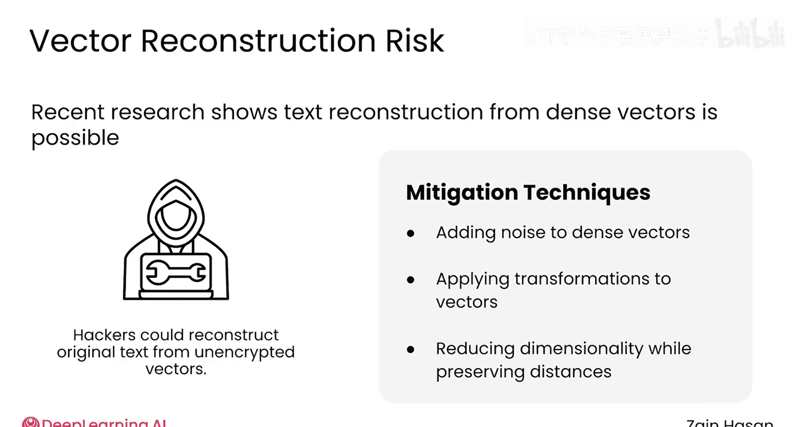

# 047：安全防护机制 🔒

在本节课中，我们将探讨如何为你的RAG应用构建安全防护机制。网络安全是一个深奥且不断发展的领域，我们无法覆盖所有可能的风险。因此，我们将重点关注RAG系统特有的一些安全挑战与应对策略。

## 概述

构建RAG系统的一个常见原因是处理私有或专有信息。这些信息通常被刻意排除在公开网络之外，以避免被大型语言模型（LLM）训练时使用。即使在构建了RAG系统之后，你通常仍希望保持这些数据的私密性。本节将介绍保护知识库信息安全的几种方法。

## 知识库信息泄露的途径

你的知识库信息可能通过几种方式泄露。以下是几种主要的风险场景。

### 1. 用户通过提示词直接请求

一个精心设计的提示词可能会说服LLM直接引用从你知识库中检索到的文本块内容。即使有防护措施，一个合理的假设是：你的应用用户至少可以间接访问知识库的内容。

针对此风险，有以下几种直接的解决方案：

*   **用户身份验证**：根据用户被允许访问的信息级别，采用适当的身份验证方式。例如，如果你的知识库包含公司私有数据，确保只有登录的员工才能向你的RAG系统提交提示词是一个良好的开端。
*   **基于角色的数据隔离**：确保数据根据基于角色的访问控制（RBAC）权限，被分割存储在多个独立的“租户”中。理论上，当用户提示触发向量数据库检索时，用户应只能访问与其角色和权限级别相匹配的文档。

虽然理论上你可以将所有文档存储在单一租户中，并使用元数据过滤器来决定用户应访问哪些文档，但在实践中，这种方法太容易出错。元数据过滤最适合用于个性化推荐，而非安全防护。为了安全，将数据存储在多个独立的租户中是更可靠的方法。

### 2. 向LLM提供商发送提示词

当你将增强后的提示词发送给LLM提供商以生成补全内容时，知识库数据也可能泄露。这个增强提示词包含了从你知识库中检索到的文档或文本块。此时，你便失去了对安全性的控制。根据知识库信息的安全级别，这可能是一个无法容忍的风险。

幸运的是，在这种情况下，你可以选择完全在本地或内部部署环境中运行RAG系统。这意味着在你自己的硬件上托管LLM和向量数据库。虽然这可能会为你的项目增加额外的复杂性和成本开销，但你现在可以控制整个RAG流程中知识库内容的访问。

### 3. 知识库被直接攻击

你的知识库也可能像任何传统数据库一样，被直接黑客攻击。传统数据库防御未授权访问的一种方式是对其内容进行加密。这意味着即使黑客获得了数据库的访问权限，也无法轻易读取加密信息。

然而，向量数据库对这种攻击向量提出了一些独特的挑战。为了使AI算法能够运行，至少你的文档的密集向量表示需要以解密的形式存储在内存中。文本块本身可以以加密形式存储和检索，然后在构建增强提示词时再解密。

一些向量数据库提供商现在提供这项服务，或者你也可以选择自己加密和解密文本块。这为系统增加了额外的复杂性和可能的延迟，但提供了额外的安全层级。不幸的是，那些需要保持未加密状态的密集向量本身仍然可能构成安全风险。研究表明，存在从其密集向量表示中重建原始文本的可能性。

目前正在探索一些技术来解决这个安全问题，例如向密集向量添加噪声、对它们进行变换，或者以保留距离但模糊语义的方式降低维度。然而，这些技术都会增加检索器的复杂性，并倾向于降低系统性能。向量数据库这种特有的潜在安全漏洞是一个持续研究的课题，但值得了解。这种攻击要求黑客既能直接访问你的数据库，又能使用实验性技术从密集向量中重建文本，但这确实是一个可能的安全隐患。

## 总结

本节课我们一起学习了保护RAG系统知识库安全的核心策略。我们探讨了信息可能泄露的几种途径：用户直接请求、向外部LLM发送数据以及数据库被直接攻击。针对这些风险，我们介绍了相应的防护措施，包括用户身份验证、基于角色的数据隔离、本地化部署以及对存储内容的加密。

主要收获是，请记住你的知识库很可能包含私有信息，你应该理解并控制这些信息如何被访问。将本视频中的技术与更广泛的网络安全预防措施结合使用，将有助于提高你生产环境RAG系统的安全性。