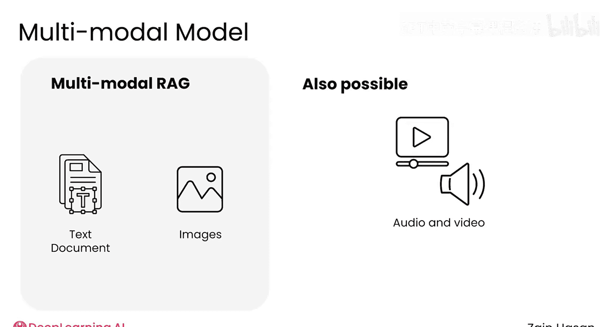
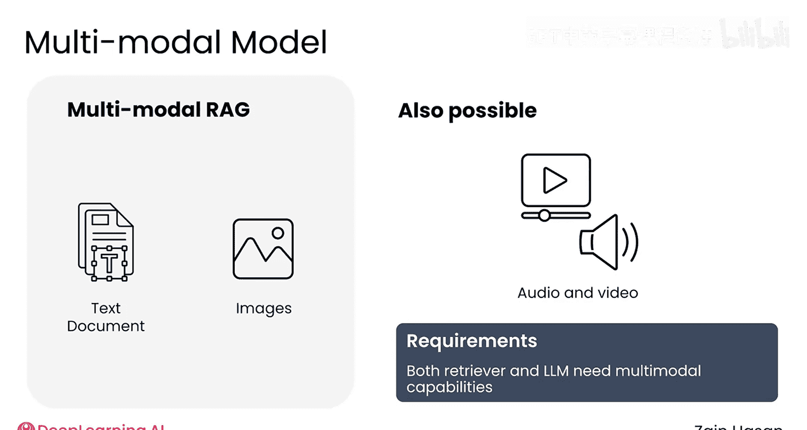
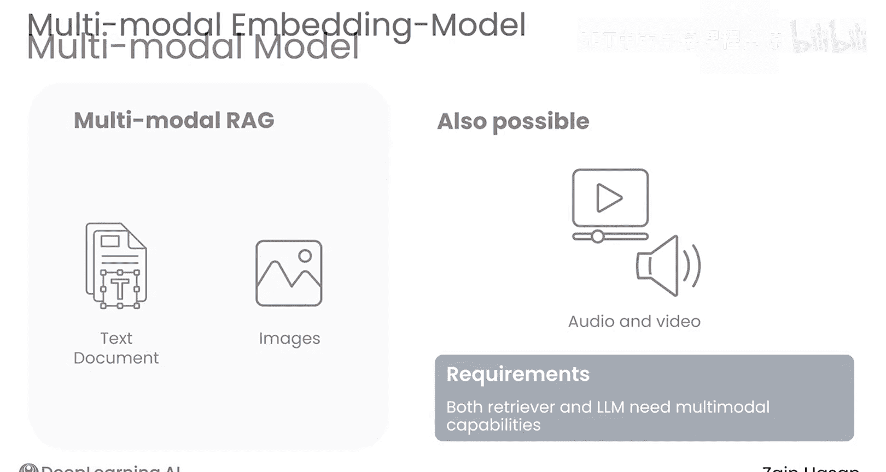
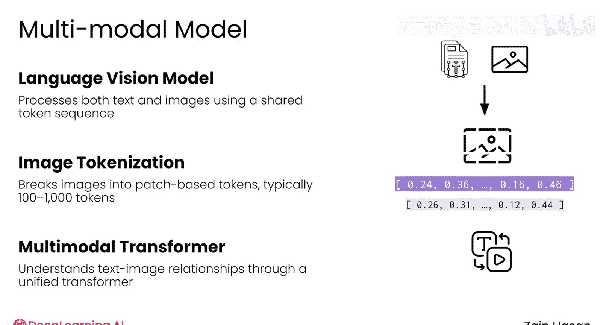
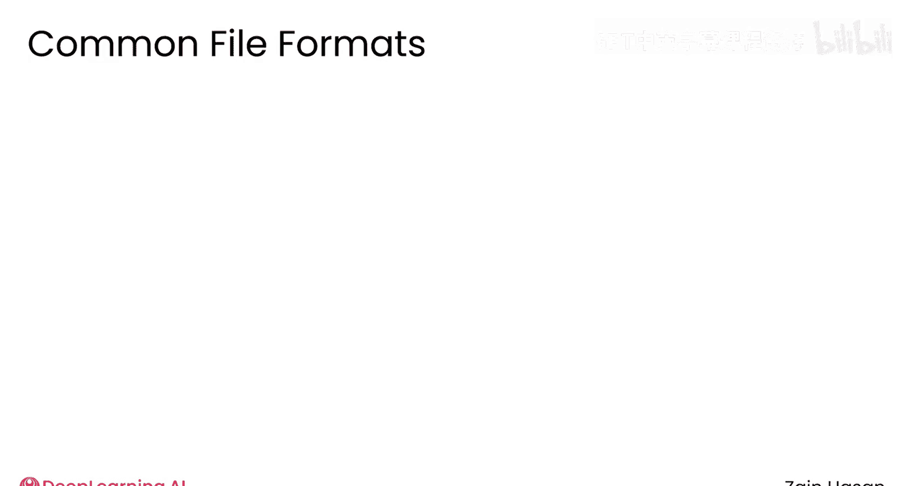
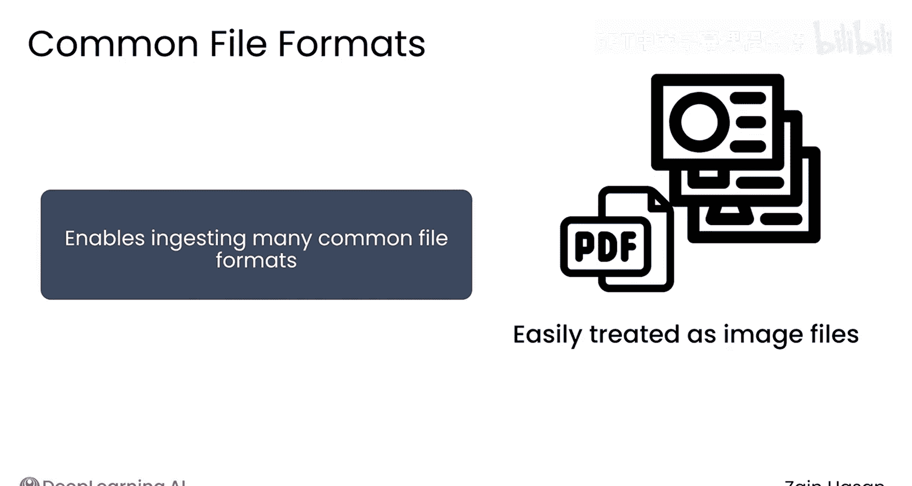
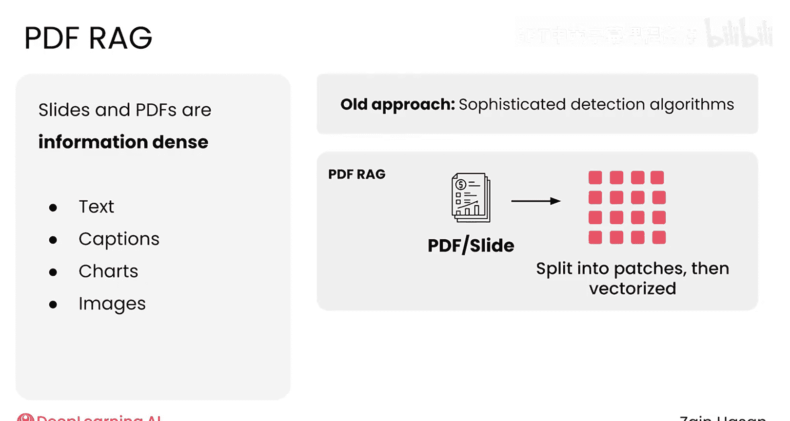
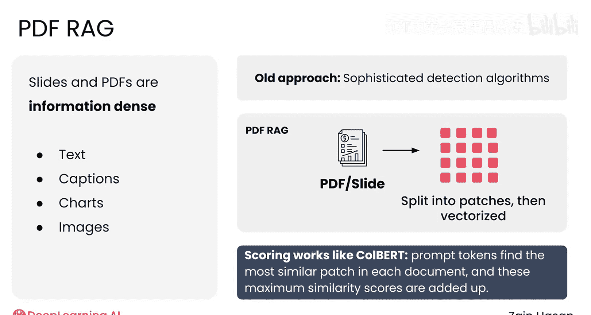
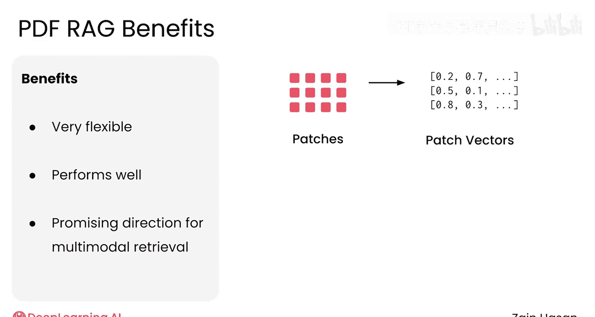
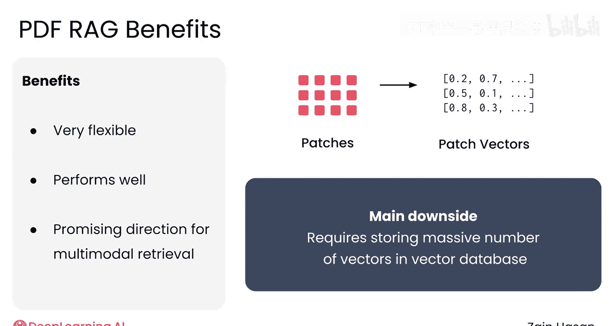

# 048：多模态RAG系统 🖼️📄

在本节课中，我们将要学习如何构建能够处理多种数据类型的检索增强生成系统。我们将探讨多模态模型如何工作，以及如何将它们集成到RAG架构中，使其能够理解和利用图像、幻灯片、PDF等非文本信息。

---

在本课程中，你已经看到了基于文本数据构建的RAG系统。然而，如今信息以多种多样的格式存储。幻灯片、PDF或图像也包含有价值的信息，理想情况下，你希望将这些信息纳入知识库，并供你的大语言模型使用。

得益于多模态模型的前沿发展，构建能够处理多种数据类型的RAG系统变得越来越可行。让我们来看看它们是如何工作的。

## 什么是多模态模型？

一个多模态模型被设计用于处理多种数据类型。最常见的组合是文本和图像，但音频和视频也是可能的。一个典型的多模态RAG系统可以接受文本和图像作为提示，在知识库中存储文本和图像文件，并最终生成文本响应。

为了支持这些新功能，检索器和LLM都需要更新以具备多模态能力。让我们看看每个组件需要如何改变。

## 多模态嵌入模型

第一个需要实现多模态的组件是向量数据库使用的嵌入模型。多模态嵌入模型能够将多种格式的数据嵌入到同一个向量空间中。

如果你使用这种模型来嵌入单词“狗”和“小狗”，你会期望它们的向量彼此相当接近，这与纯文本嵌入模型类似。然而，如果你给同一个模型一张狗的图片，该图片的向量最终也会位于向量空间中相近的区域。

如果你嵌入一张树的图片和单词“树”，这两个对象也会被嵌入到彼此接近的位置，但在向量空间的不同区域。换句话说，多模态嵌入模型的工作原理与文本嵌入模型非常相似，将含义相近的项目放置得更近。然而，由于其设计，它们可以对多种类型或模态的数据执行相同的功能。

一旦你有了多模态嵌入模型，基于向量的检索工作方式就非常熟悉了。

## 多模态检索过程

上一节我们介绍了多模态嵌入模型，本节中我们来看看如何利用它进行检索。

知识库中的图像和文本都可以嵌入到同一个向量空间中。当收到提示时，无论它是图像还是文本，都使用同一个多模态模型来嵌入该提示。然后像往常一样完成向量搜索，返回其向量最接近提示向量的图像或文档。从知识库中检索到的文本和图像随后可以像往常一样添加到增强提示中，并发送给语言模型。

## 语言视觉模型

为了让语言模型处理文本和图像，你需要使用语言视觉模型。这种模型的工作原理与纯文本LLM非常相似，但具有处理同样被分词化的图像的能力。

为了做到这一点，图像必须被分词化。分词化图像的典型过程是将图像分割成单独的图像块，每个块表示为一个标记。根据分辨率，图像可能由低端约100个标记到高端接近1000个标记来表示。

这里重要的不是使用了多少标记，而是这些模型的设计使得图像和文本都可以像纯文本模型一样被转换成标记序列。

语言视觉模型的工作方式与标准LLM非常相似，将这个多模态标记序列通过一个转换器，该转换器可以对提示中的文本和图像及其关系形成细致的理解。然后，模型通常会生成文本标记作为输出，以响应初始提示。

## 升级RAG系统架构

一旦你拥有了多模态嵌入模型和语言视觉模型，将你的RAG系统升级为在知识库中存储图像和文本就相当简单了。

高层架构基本上相同，但它现在可以处理文本和图像。

## 处理幻灯片和PDF

更新RAG系统以处理图像的一个好处是，这使你的系统能够摄取许多容易转换为图像的常见文件格式。例如，幻灯片和PDF很容易被视为图像文件。

然而，这些格式面临的一个挑战是幻灯片和PDF的信息密度可能非常高。一页或一张幻灯片可以包含文本、图表、标题和图像。单个向量很难捕捉PDF一页上的所有细微差别。换句话说，你需要像分割文本一样分割你的图像。

## 图像分块与PDF Rag方法

最初，这是通过相当复杂的技术来检测PDF页面的不同部分。这些算法试图确定页面的哪一部分是图表，哪一部分是图像，哪一部分是文本等等。然而在实践中，这些技术仍然容易出错且难以处理。

一种称为PDF Rag的新方法只是将每一页分割成网格状的正方形，而不担心这些边界是否落在合理的位置。然后，每个正方形通过多模态嵌入模型嵌入到一个密集向量中。这意味着你的页面由，比如说，1000个向量而不是一个向量来表示。

然后，向量搜索的工作方式与Colbert非常相似。提示中的每个单词在给定页面上寻找其最佳匹配的正方形。然后将这些分数相加，以得出文档整体页面的分数。

这种方法非常灵活，因为任何图像都可以分割成网格状的正方形。在实践中，它在检索任务上也表现良好。这种方法如此灵活且性能良好的事实意味着它是支持多模态检索的一个有前景的方向。

它的主要缺点是要求你的向量数据库存储大量的向量。尽管如此，向量数据库提供商正在越来越多地实施工具来支持这种多模态检索，你应该可以预期围绕多模态知识库构建RAG系统会继续变得更加容易。

## 总结与展望

本节课中我们一起学习了多模态RAG系统。多模态RAG仍然是一项前沿技术，正在快速积极地发展。大多数AI提供商都提供语言视觉模型，而多模态嵌入模型则是相对更实验性的产品。也就是说，当你希望突破RAG系统能力的前沿时，可以期待在多模态RAG领域看到令人兴奋且持续的进展。

