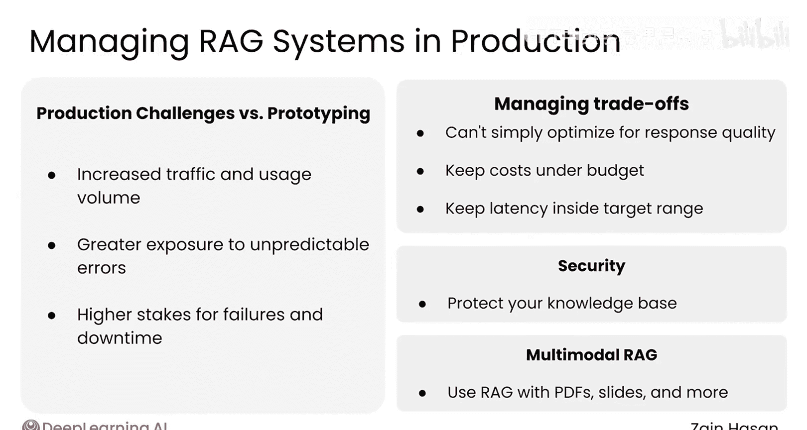

# 049：总结

在本模块中，我们学习了如何将RAG系统从原型阶段部署到生产环境，并应对随之而来的新挑战。现在，让我们对整个模块的内容进行回顾和总结。

## 模块回顾

上一节我们介绍了RAG系统的安全挑战与多模态扩展，本节我们将对整个模块的核心内容进行梳理。

以下是本模块涵盖的主要主题：

1.  **生产环境与原型阶段的差异**：生产环境面临更高流量、不可预测的错误以及更严重的错误后果。
2.  **评估系统的重要性**：一个精心设计的评估系统对于确保系统平稳运行和排查问题至关重要。
3.  **评估策略的平衡**：结合**组件级评估**和**端到端评估**，以及传统软件性能指标与RAG特有的质量指标，可以全面了解系统在真实流量下的表现。
4.  **权衡管理**：在实际操作中，通常无法仅优化响应质量，还需考虑系统成本（如 `cost < budget`）和延迟（如 `latency < target_range`）。需要策略来应对这些权衡。
5.  **安全与多模态挑战**：探索了RAG系统特有的安全挑战，以及多模态RAG如何拓展RAG系统的能力边界。

## 课程总结

本节课中，我们一起学习了管理生产环境RAG系统的核心知识。你已掌握了从设计到构建自有生产级RAG系统所需的所有独特基础。

希望你喜欢从原理开始深入了解RAG如何运作的过程，并希望你在离开本课程时，对下一步想要构建的项目有了新的想法。

非常感谢你参与这门课程的学习，并祝愿你在接下来的AI探索之旅中一切顺利。