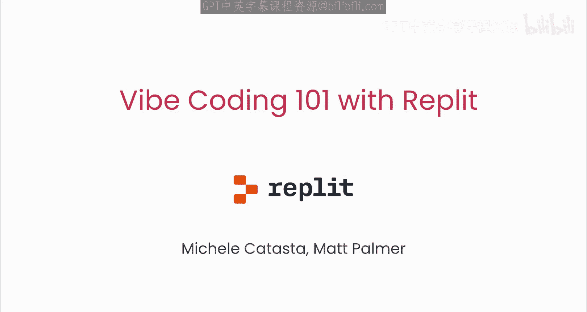
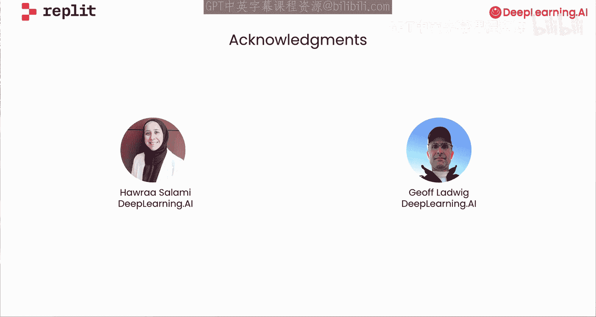

# 001：课程介绍

欢迎来到与Replit合作推出的《氛围编码101》课程。在本课程中，你将学习如何使用Replit的AI智能体进行编码。

Replit提供了一个云端环境，允许你构建、托管和分享应用程序。Replit最近增加了一个非常受欢迎的编码智能体，它能快速生成和托管基于Web的应用程序。

编码智能体正在改变我们编写代码的方式。我本人仍然进行相当多的软件开发，但现在我发现我可以依赖大型语言模型为我编写大部分代码。我会将一个问题分解成可管理的模块，然后花时间创建提示词来描述我想要什么，并使用模型一次生成一个模块的代码。这种流程让我和许多其他人成为了更高效、当然也更快速的开发者。

需要说明的是，由于Replit是一个云端托管环境，我们无法在我们通常的平台上呈现本课程，因此这是一个纯视频课程。如果你只观看视频，你将学习使用编码智能体的核心概念，以及使用大型语言模型编写代码的流程。有时你几乎不需要看代码本身，这种模式现在有些人称之为“氛围编码”。

除了观看视频，如果你想使用Replit，你需要在Replit上创建一个用户账户。

我很高兴本课程的讲师是Replit的产品副总裁Michaela Catasta，以及开发者关系主管Matt Palmer。谢谢，Andrew。我们非常兴奋能呈现这门课程。那么，Michaela，告诉我，你如何看待AI编码智能体的兴起对开发带来的改变？

AI消除了许多阻碍用户构建和部署应用程序的障碍。首先，Replit提供了一个强大的代码编辑器和一个通用的包管理器，因此你无需费力安装Python和JavaScript包。源代码控制由Git驱动，但我们为用户尽可能地简化了它。此外，Replit还提供15种存储、数据库和部署解决方案。但现在有了Replit智能体，任何没有编码经验的人都可以创建应用程序并将其公开部署。整个过程可能只需要几分钟。即使你不了解我刚才提到的许多术语，你仍然可以构建一个应用程序。Matt将在本课程中展示具体如何操作。

如今一个流行的术语是“氛围编码”，即你倾向于让编码智能体承担大部分繁重的工作。我们将最大化智能体的能力，但同时也会展示一些规划如何能在此过程中改善你的结果。你将学习一些技巧和窍门，以从我们的智能体中获得最佳效果。

我们将从构建一个搜索引擎优化分析器开始。这是一个基础应用程序，将帮助我们入门并介绍一些关键概念。然后，你将构建一个“一对一投票”应用程序，它将展示整个课程中的数据提取和存储。我们将学习Web应用程序的基本构建模块。我想你会惊讶于你能构建多少东西，我自己就深有体会。

为了培养你使用编码智能体的直觉，Michaela还将分享一些关于Replit智能体如何构建的细节。我希望他们在构建Replit（它本身就是一个复杂的智能体工作流）过程中学到的一些经验，也能为你如何构建其他智能体AI应用程序提供有用的见解。是的，我们在过去一年中学到了很多，我很高兴能分享这些。许多人已经完成了这门课程。我要感谢来自DeepLearning.AI的Blanca Li、Harrison Salami和Jeff Laway。

好的，让我们在下一个视频中开始第一课。