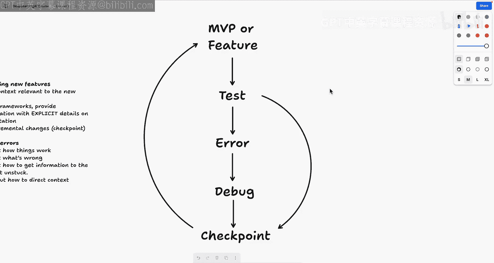
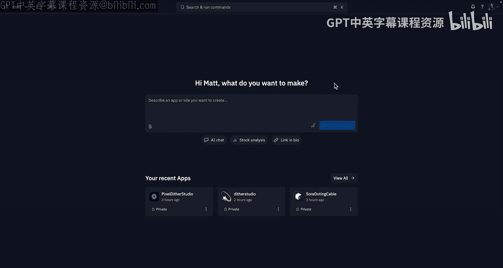

# 002：课程概述与核心原则

在本节课中，我们将学习如何利用Replit平台及其AI工具进行高效的“氛围编码”。我们将探讨与AI协作的核心概念、关键策略，并熟悉Replit的基本操作。

## 概述

氛围编码的核心是借助AI代理和工具来编写代码，而非完全手动编写。这能极大提升生产力，帮助你将脑海中的想法转化为部署在互联网上的真实应用。然而，这种开发方式受限于开发者体验，即开发应用所使用的工具、技术和环境。本课程旨在帮助你克服这些工具的复杂性，充分利用它们来构建最佳应用。

## 核心原则

在开始之前，了解一些与Replit AI代理成功协作的核心原则至关重要。以下是构建应用时需要牢记的关键策略。

### 精确与分解

首先，务必保持精确。确保一次只给Replit Agent一个任务。如果你有一个复杂的任务，请将其分解为更小的部分。同时向AI代理发出多个复杂指令，对当前的编码代理来说极具挑战性。

### 明确与详细

其次，确保你的提示词具体且详细。与人类开发者类似，编码AI代理在接收到清晰、明确的指令时表现最佳。

### 有条不紊

保持项目尽可能稳定。逐步添加功能，每次编辑后彻底测试，并在出现问题时毫不犹豫地回退版本。

### 使用新会话

为每个新功能开启一个新的会话。这样，如果需要，你可以更容易地回退到之前运行良好的版本。

### 及时回退

不要犹豫，及时回退到上一个可工作的版本。如果你不断在不稳定的代码功能上打补丁，最终很可能会陷入混乱，阻碍你取得稳定的进展。

### 保持耐心

最重要的建议是保持耐心。即使你不具备技术背景，也要尽力在过程中理解应用及其组件。Replit Agent会详细解释其每个操作背后的原理，描述其思考过程以及对代码所做的更改。通过仔细阅读Replit Agent的输出，你将快速了解你正在创建的应用的一切。

### 审慎采纳

因此，自然地，在采纳建议之前，请花点时间进行审查。一方面，质疑那些不合理的事情；但另一方面，也要相信Replit Agent，它常常能为你面临的问题提供有效的解决方案，让你感到惊喜。

### 耐心调试

调试时保持耐心，这一点再怎么强调都不为过。这是开发复杂功能过程中的一部分。即使是最好的软件开发人员，大部分时间也花在调试上。Replit Agent每天都在进步，但仍不完美。因此，给予它时间，让它尝试不同的调试策略，这将使你取得超出预期的成功。

---

上一节我们介绍了与AI协作的核心原则，本节中我们来看看Replit平台及其AI工具如何融入开发流程。

## Replit平台与AI工具

你可以将Replit视为开发环境，而在此之上，我们拥有Agent（我们的自动化开发者）和Assistant（用于快速编辑和聊天的工具）。

### Replit环境

Replit是一个独特的环境，它与你过去可能使用的其他工具不同。如果你曾需要编写代码或安装代码编辑器，就会知道这需要大量的设置工作：下载软件、在电脑上安装，这还不包括安装包、配置语言和环境。这可能会非常令人头疼。

Replit无需安装，完全在浏览器的一个标签页中运行，并且为每一步都提供了AI工具。更重要的是，它不仅仅是处理包和语言、实现零配置，它还拥有构建全栈应用所需的一切，包括数据库、对象存储、身份验证以及许多其他工具和服务。从这里，你只需点击几下即可部署应用。

Replit之所以强大，是因为你不必花费时间担心设置问题，这将使我们能够在本课程中快速推进。

### Replit Agent

在Replit之上，我们构建了Agent（或称Replit Agent），这是我们的自动化开发者。它允许你仅用语音就能从头开始构建和配置整个项目，为你的项目生成和制定计划（正如我们今天将看到的），并对你的代码进行复杂的多步骤更改。

### Replit Assistant

不能不提的是Replit Assistant，这是我们用于聊天和快速编辑的更轻量级工具。通过Assistant，你可以与AI就任何主题进行聊天，请求对代码进行快速的一次性编辑，并询问关于你项目的问题。

我们今天将看到一个相当常见的模式：使用Agent来搭建项目框架，使其达到最小可行产品状态并开始运行，然后切换到Assistant来精确调整功能并构建项目的其余部分。

在进入白板讨论环节并探讨一些提示词和氛围编码的基础知识之前，还有一点需要说明。Replit提供免费套餐，本课程的大部分（如果不是全部）内容都可以使用免费套餐完成。你可以在Replit上免费注册，你的第一个项目（在Replit上最多可有三个免费项目）属于免费套餐，并且你会获得一定数量的积分和检查点来使用Agent和Assistant，无需额外付费。

此外，本课程中的所有概念不仅适用于Replit，也适用于任何你使用AI和这些新工具进行构建的场景。

---

现在，我们将进入白板讨论环节，分解一些我认为对AI和Replit构建特别有用的概念。

## 氛围编码五大技能

接下来，我们将介绍我在氛围编码中深入思考并真正帮助我将应用提升到新水平的五项技能：思维框架、检查点、调试和上下文。我们将保持简短直接。

我希望你在开始构建这些项目时，将这些技能记在脑海深处，并开始注意其中的一些模式和概念，以便未来能够真正完善你的应用。我认为使用AI进行氛围编码是一个全新的概念，学习它的最佳方式就是动手实践，参加像这样的课程，并进行自己的实验。

### 1. 思维层次

现在我们来谈谈思维。希望这是你一生中大部分时间都在做的事情。我们可以将思维分解为一定的层次结构。逻辑思维非常重要。我们可以将其比作国际象棋游戏。逻辑思维可能像是问“国际象棋是什么？”这样的问题，而实际下棋则更多地涉及分析性思维。你们大多数人可能都熟悉分析性思维：分解游戏、学习如何玩好、分解问题并学习如何解决它们。

但在谈论使用AI构建时，我想介绍的两种思维是**计算思维**和**过程思维**。计算思维的一个例子可能是“国际象棋游戏背后的模式是什么？”，这可能会引导你去做一些事情，比如编写程序来强制执行国际象棋规则。当我们构建AI应用时，我们不仅仅是在逻辑思考，实际上是在创造性或计算性地思考如何将一套逻辑（实际上是一个应用）适配到一个复杂的问题中。

更高层次的思维是过程思维，这可能是编写一个程序让计算机进行竞技性国际象棋对弈。这不仅要求我们理解国际象棋的规则以及如何编程让计算机执行这些规则，还要求我们理解如何编程让计算机在高级别上进行竞技性游戏。因此，这确实要求我们思考：我如何在这个游戏中表现出色？游戏的边界是什么？为了构建这个东西，我需要考虑哪些边界情况？最后，我如何将这些转化为代码，或者转化为自然语言供AI实现？

### 2. 框架思维

接下来，我想谈谈框架。如果你对框架（无论是语言还是包）没有高层次的理解，不用担心，因为这更多是概念性的。重要的是开始思考你的应用如何工作，这延续了我们刚才在“思维”部分讨论的内容。开始思考你的应用如何工作，我们如何为这些问题实现解决方案，然后思考已经存在的解决方案，因为人们已经编写了大量代码。AI能为你编写代码的原因，正是因为它理解人们编写的代码。

因此，如果你能理解一个问题领域，并开始思考你不知道的事情——也许这意味着询问AI：“解决这个问题的常见方案有哪些？”或者询问AI：“有哪些非常好的包可以帮助我解决这个问题？”——那么你就能理解如何做你想做的事情，或者在这个问题领域中定位自己。

这可能意味着向AI提出这样的问题：“哪些框架允许我做那件事？”例如，如果你想在你的一个应用中实现拖放界面，你可以说：“帮我找出用于在此应用中实现拖放的React框架，然后实现一个。”

以这种方式与AI互动，不仅是学习框架如何工作以及这些东西如何融入语言、包和所有其他结构的绝佳方式，也是更快完成任务的绝佳方式。这就是我完全通过AI学习前端开发的方式：我提出很多问题，试图理解它正在构建的东西，并且在核心上，我试图理解我不知道的东西。这涉及到一个询问AI问题和迭代的反馈过程。

### 3. 利用检查点

接下来，让我们谈谈检查点。构建中的一个不幸事实是：东西会坏掉。无论有没有AI，这都是事实。事实上，当我们使用AI构建时，这种情况更常见。所以在本课程中，东西很可能会出问题。但一个非常重要的概念叫做**版本控制**，Replit中的每个项目默认都有版本控制。你无需设置，也无需担心。

正因为如此，我们在使用AI构建时会有检查点。我们将把要构建的内容分块，将其分解为逻辑步骤，然后在短周期内快速推进，并在出现任何问题时利用这些检查点。这意味着，即使我们想尝试一个新功能，即使我们想提示AI、学习或尝试新事物，如果我们的应用中某些东西不能正常工作，我们可以回到旧状态并从上次离开的地方继续。

更广泛的意义在于，这是一种非常棒的构建和开发方式：利用检查点，测试你正在构建的东西，如果可行就继续，如果不行就返回重试。

### 4. 调试方法

好了，这里还有几个概念要讨论，然后我们就开始构建。首先是调试。正如我提到的，东西往往会坏掉。调试的过程就是找出东西为什么坏掉的过程。这可能看起来有点过于直白，但我保证值得仔细探讨。

如果你有一盏不亮的台灯，你可能会先问：“台灯插电了吗？”如果没有，你就插上电源。如果这不是问题所在，你可能会问：“嘿，灯泡烧坏了吗？”如果是，你就更换灯泡。如果不是，你需要继续调试或寻找其他修理台灯的方法。这与我们构建应用程序时要经历的过程完全相同。

你可能会说：“嘿，这其实有点无聊。”但你可以让任何事情变得有趣。对我来说，当我构建一些让我兴奋或我知道会产生非常酷结果的东西时，调试真的很有趣。因此，最好的调试是**有条不紊**、**彻底**，并且**从第一性原理出发**。

调试的目标是：首先理解我们的应用如何工作，然后理解错误在哪里，接着问自己：“嘿，我们如何才能找到这个问题的根源？”最后一步（这有点跳跃，对吧）是：我们如何告诉大语言模型（LLM）问题所在，以便它修复我们的问题？我们如何告诉Agent问题所在，以便它理解问题？这就是上下文发挥作用的地方。

### 5. 上下文管理

如果你一直在使用AI或LLM进行构建，你可能听说过“上下文窗口”或“上下文”这个术语。当我们说“上下文”时，我们指的是什么？上下文窗口是LLM在给定时间内可以处理的令牌数量。可以把它想象成你能提供给我们的Agent或模型的单词数量或信息量，它可以在任何一个聊天实例中思考。

我喜欢把它想象成多任务处理。作为人类，如果你让我做一大堆事情，我可能会开始忘记你要求我的一些事情。因此，当我们与LLM聊天时，一个持续的主题是：我们需要确保**上下文与我们试图做的事情相关**。

上下文可以是我们提供给LLM的提示词，也可以是图像（例如你提供的文档），我们今天将看一些这方面的例子。它还可以是错误、关于你的应用环境的详细信息或偏好设置。这正是我们刚才在调试中讨论的。当我们遇到错误时，我们将不得不尝试将这些错误纳入我们与LLM通信的上下文中，以便我们能克服这些问题，理解问题所在并继续前进，或者让LLM修复它正在做的工作。

非常重要的一点是，因为这些AI模型——为Replit Agent提供动力的底层模型——可能拥有过时的训练数据，或者它们可能是几个月甚至几年前构建的，我们可能需要提供额外的上下文，特别是当我们做一些新的、前所未有的事情时，或者当我们使用一个模型不熟悉的包、库或框架时。

---

上一节我们详细探讨了氛围编码的五大核心技能，本节中我们将把这些概念整合起来，看看它们如何指导我们使用AI构建最小可行产品。

## 构建MVP的实践循环

那么，将所有内容整合起来，这对于我们使用AI构建MVP意味着什么？我们将只向AI提供与MVP相关的信息。我们将从小处着手，正如Mackalay所提到的，逐步构建出功能齐全的产品。在构思第一个提示词时，我们将提供基础性的上下文和重要细节。

从那里，我们将开始实现新功能。我们将提供与新功能相关的上下文，提及框架，并提供关于实现的明确细节文档，以确保Agent理解我们想要做什么。我们将进行增量更改，利用检查点，并在出现任何问题或状况时回退版本。

在调试错误、遇到小障碍时，我们将弄清楚事情是如何运作的，找出问题所在，并找出如何将信息传递给LLM以摆脱困境，以及如何引导上下文来解决我们的问题。记住，它们不是错误，只是“快乐的小意外”——如果我能成为氛围编码界的鲍勃·罗斯，我会非常乐意。

这是我们开始构建之前的最后一点内容。在构建时，无论是考虑我们的最小可行产品（MVP）还是向该MVP添加新功能，我们都会从提示AI开始。然后我们将测试我们的应用程序，可能会尝试破坏它，可能会遇到错误，并不得不调试该应用。但一旦我们完成并拥有一个可工作的版本，我们就会到达一个检查点。也许我们不会遇到任何错误，可以直接从测试进入检查点。

但下一步是重复这一切。所以看起来我们通过提示获得MVP或功能，然后进行测试，遇到错误，调试，修复，或者没有错误，然后我们继续下一个MVP或功能。这种反馈循环，这种周期，很大程度上是我在使用AI构建时所遵循的模式。

---

现在，让我们直接开始吧。我们将快速浏览一下Replit，并开始我们的第一个项目。

## 快速入门Replit

在进入我们的应用程序之前，我只想快速介绍一下如何进入这个界面。为了看到这个页面（主页），你只需要在 `replit.co` 上创建一个账户。你可以使用Gmail，可以使用其他账户，也可以使用邮箱和密码，非常简单，然后你就会直接进入这里。这是我们的主页，是我们的概览页面。你可以看到它非常注重聊天，所以这是我们输入提示词与Agent交互的地方。任何时候你想管理你的应用程序，我们都有一个侧边栏，你可以看到你制作的所有应用、已部署的应用，查看使用情况，编辑设置或以其他方式管理你的账户。

但是，让我们开始构建吧。

---

## 总结

在本节课中，我们一起学习了氛围编码的核心原则与Replit平台的基础。我们明确了与AI协作时需要保持**精确、明确、有条不紊**，并善用**检查点**和**耐心调试**。我们探讨了**计算思维**与**过程思维**在AI辅助开发中的重要性，以及如何通过理解**框架**和有效管理**上下文**来提升构建效率。最后，我们介绍了Replit的**Agent**和**Assistant**工具，并概述了从提示到测试、调试、建立检查点的**MVP构建循环**。接下来，我们将动手开始我们的第一个项目。