# 003：规划与构建SEO分析器

在本节课中，我们将构建一个网站性能分析器。你将学习如何检查HTML内容并理解网站结构，也就是我们将要自动化的核心概念。

在利用Replit的Agent构建第一个原型之前，我们将创建一个产品需求文档和线框图。

## 规划我们的应用

上一节我们介绍了要构建一个SEO分析器，本节我们来看看如何具体规划它。

我们将构建一个SEO分析器，你可以输入任何网站URL，查看网站的加载时间和标签。我们还将具体解释这些是什么，以及它们为何重要。这使我们能够检查网站是否正确实施，并获得关于SEO最佳实践的见解。

当我们谈论构建PRD或线框图时，指的就是这个。接下来，我们将详细讲解我面前的内容。这是使用一个在线白板工具，我认为它很重要。

以下是应用的核心功能：
*   它是一个交互式工具，允许你输入网站URL。
*   查看网站加载时间和标签的可视化表示。
*   确保我们构建的内容配置正确。
*   检查网站是否正确实施。
*   作为延伸目标，我们可能会将最近分析的网站存储在数据库中。

涉及的技能包括：
*   提示、处理和分析HTML内容。
*   创建直观的数据可视化。
*   处理错误和边缘情况。
*   存储。

## 可视化线框图

在左侧，我花时间草拟了我们将要构建的模型。

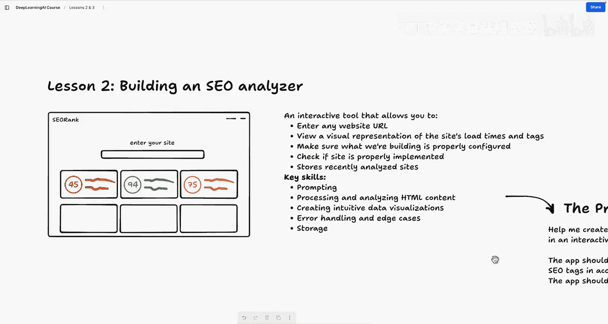

用户交互的主要入口是一个简单的文本框，你可以在其中输入URL。输入URL后，我们希望应用返回关于我们输入网站的建议。例如：“你没有为你的网站设置标题”或“你没有为你的网站设置描述”。这会使谷歌难以找到你的网站，或让人们难以了解你的网站内容。

这些元标签嵌入在每个网站中。因此，当你构建网站或部署应用程序时，考虑这些事情实际上很重要。考虑当人们搜索时你的网站如何显示预览很重要。这就是我们的应用将允许我们做的事情。它将允许我们分析任何网站并访问这些信息。

当我们谈论氛围编码或顺其自然时，进行这个练习并分解我们想要的东西通常更有帮助。将其概念化、可视化，这样我们就不会在没有任何概念的情况下进入工具，或者至少我们能更好地理解我们想要达到的目标。

## 构建初始提示

接下来，我们看看这如何转化为给Replit Agent的初始提示。

我的提示是：“帮我创建一个交互式应用，以交互和可视化的方式显示任何网站的SEO或元标签，以检查它们是否正确实施。”

请注意第一句话中的领域特定知识。你可能不知道SEO标签是什么，也可能不知道元标签是什么。但AI知道。通过使用这些术语，通过理解框架或理解我们可能不了解的这个领域，我们能够引导Replit Agent构建我们想要的东西。

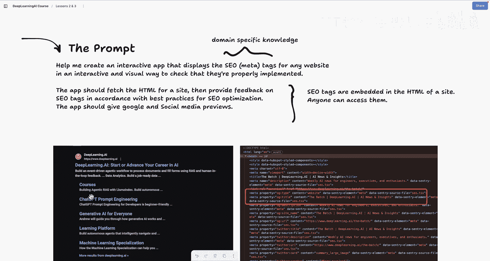

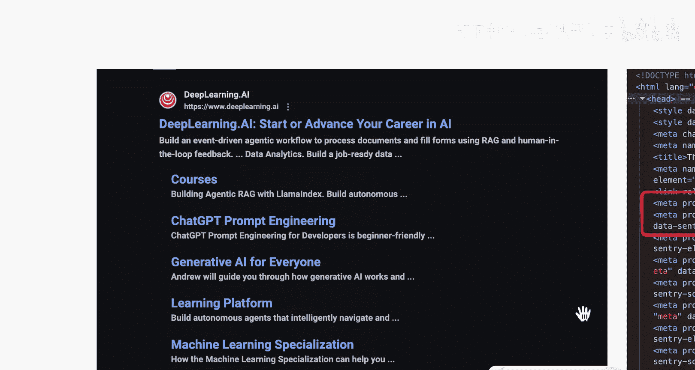

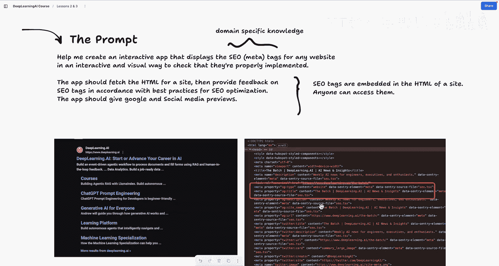

我们提示的下一部分是：“应用应首先获取HTML，然后根据SEO优化的最佳实践提供关于SEO标签的反馈。应用应提供谷歌和社交媒体预览。”

我认为最后一点很重要，因为我在SEO优化方面做过一些工作。这是我特别想要可视化的东西，因为它可以非常直观。但请注意，我们要求应用获取网站的HTML。这本质上是抓取网站。所以我们要做的是，对于任何网站，我们将抓取它，然后获取其内容。我们希望我们的应用返回反馈，即我们希望获得关于我们所做事情的可操作见解。

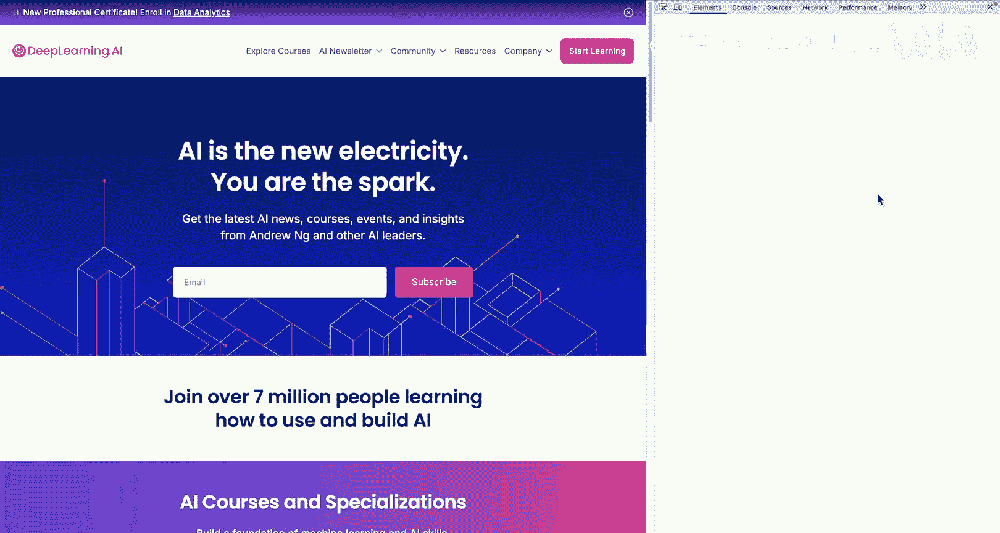

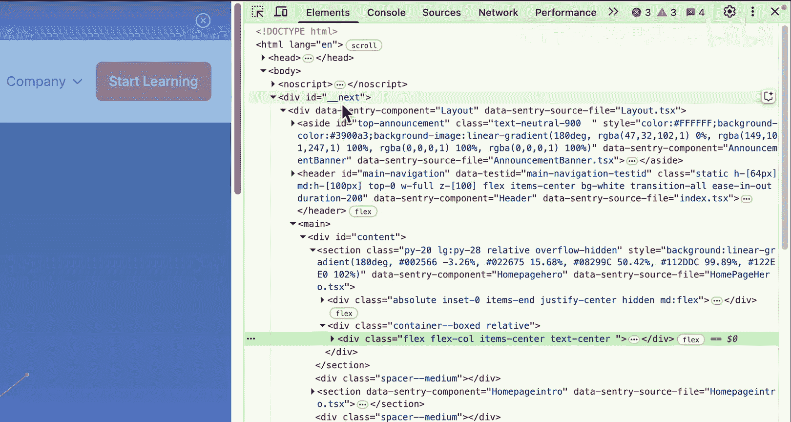

因此，我们正在思考我们可以提供给Agent的语言和措辞，以获得这些结果。重要的是要注意，我知道SEO标签嵌入在网站的HTML中。任何人都可以访问它们。这就是我知道这个应用有很大可能成功的原因。

## 理解SEO标签

为了更清晰地展示我们正在构建的内容，当我们搜索“深度学习”时，谷歌返回的结果实际上是网站的SEO标题。

描述列在下方，我们可以在控制台或页面的实际底层HTML中看到这一点。

如果我点击页面，然后右键单击并选择“检查”，我们将访问所谓的浏览器控制台（或开发者工具）。这看起来可能有点吓人，但这只是网站的底层HTML。

如果你进入HTML的`<head>`部分，你会看到一大堆东西。你实际上可以看到称为元标签的东西，其中之一是标题：“DeepLearning.AI - 在AI领域开始或推进你的职业生涯”，以及描述：“加入超过700万人，通过我们的在线课程学习如何使用和构建AI”。这些就是我们将要提取的标签，以了解我们的网站是否正确实施。

## 启动Agent构建

我们已经讨论了我们的提示，回顾了线框图和PRD。现在，我们将在Replit中输入我们的提示，然后点击“开始构建”。

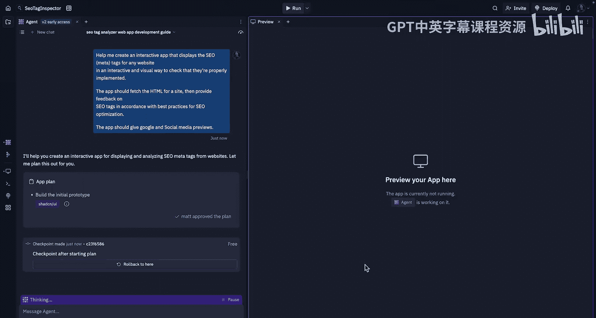

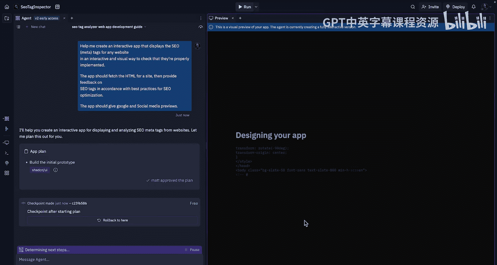

我们将看到一些事情开始发生。因为是我们的第一课，我将讲解Agent如何构建这些应用程序。

从根本上说，Agent与其他类型的氛围编码应用不同，因为Agent会生成一个计划。该计划将帮助我们理解我们正在构建什么，并确认我们正在采取正确的行动，或者我们正在接近我们实际想要的东西。

因此，Agent将分析该提示，并向我们展示一个计划。它将构建初始原型，并询问我们是否希望在初始原型中添加任何后续功能。它还会提及是否使用了任何框架或集成。

我将批准这个计划并开始，然后多谈一点。

需要提到的是，Agent确实附带大量集成。例如，如果你说“为我构建一个使用Anthropic API的应用”或“为我构建一个具有Stripe支付功能的应用”，我们原生支持这些集成，Agent应该在应用计划中提到这一点。

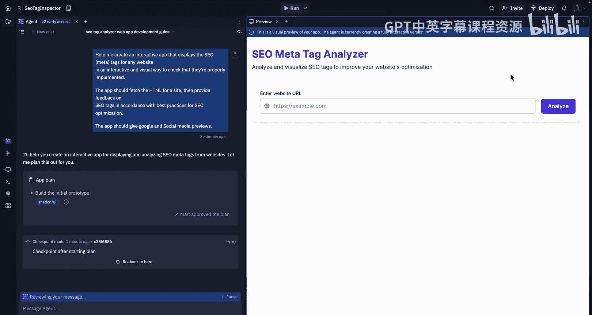

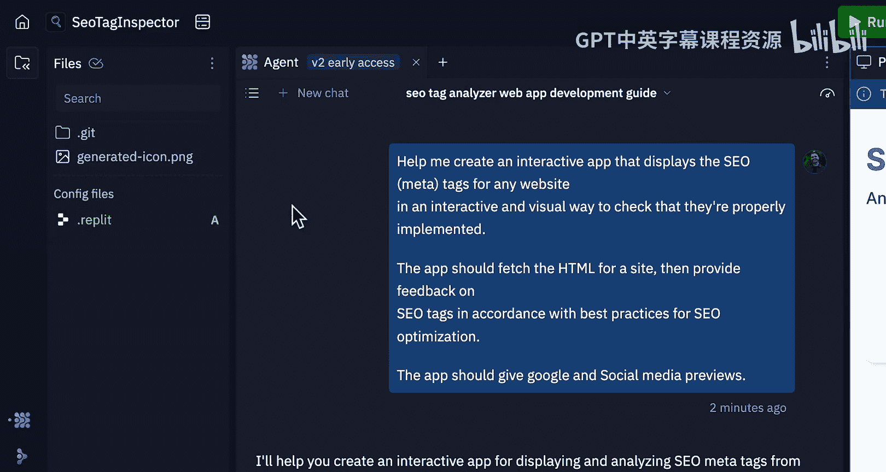

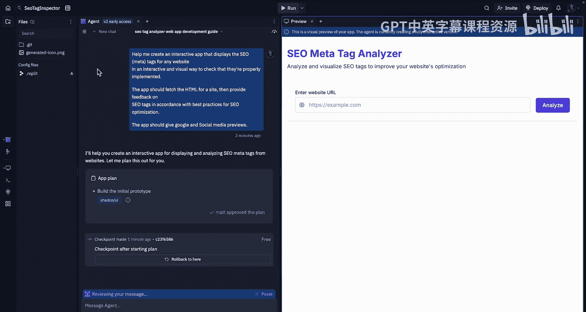

现在，右侧正在实时发生的是，Agent正在设计我们应用的视觉预览。其目标是尽快让你获得可以使用的或可以可视化的东西。

需要注意的是，这不是实际的应用。我们可以看到，它更接近我们的线框图。主要入口点就是这个网站URL。从那里我们将能够分析它。

一旦Agent完成视觉预览，它实际上会在这里告诉我们，它正在创建我们应用的完全交互式版本。在幕后，Agent正在搭建项目结构、安装包、配置你的环境。这就是我们一开始谈到的，Replit不仅仅是Agent和助手，它实际上是一个完整的环境、一个完整的工作空间。

## 探索工作空间

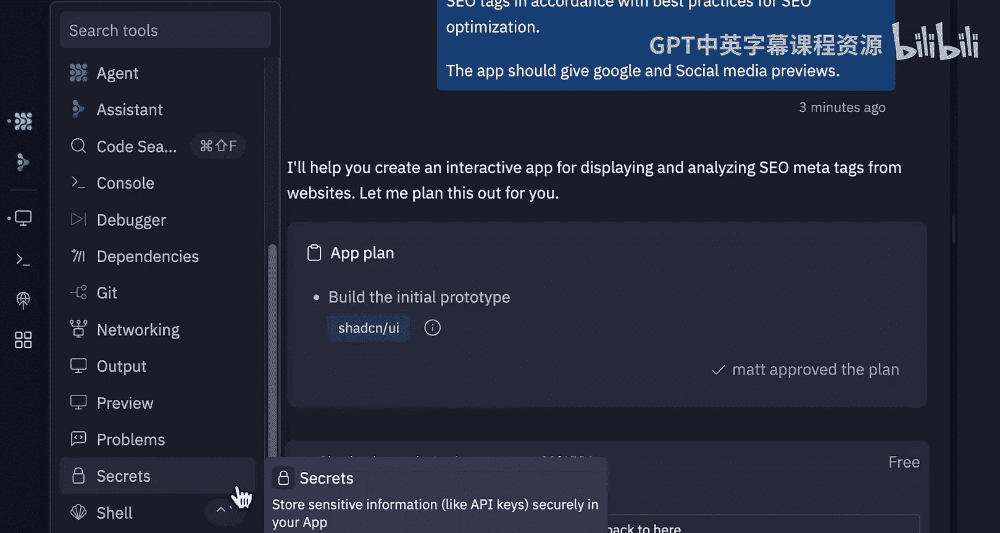

在Agent继续设置的同时，我将带大家浏览一下工作空间。如果你去左上角，可以查看工作空间中存在的文件。随着Agent继续构建，这些文件将被项目包含的文件夹和目录填充。

再次强调，这很重要，这确实是一个完整的云端交互式工作空间。任何时候，如果你熟悉编程概念，如果你想打开类似Shell或控制台的东西，你可以这样做。我们有权访问它。

如果你不熟悉编程，你也不必做这些事情。我们将完全使用自然语言构建。但需要提到的是，通过顶部的新标签界面或左侧的“所有工具”部分，你可以访问工作空间中可用的所有服务和工具，包括集成Git、安装依赖项、查看输出（我们将详细介绍这是什么）、存储密钥（密钥基本上是一种非常安全的方式来存储无需配置的环境变量）等等。

回到我们的应用，Agent仍在处理完全功能版本，这可能需要5到10分钟。这是我们在构建此应用程序时要指出的另一个重要事项。Agent的设计方式是从头开始构建这些应用到MVP（最小可行产品）。这就是为什么我们保持高层次，并保持提示简单。这些运行可能需要两分钟，也可能需要5或10分钟。

但对于第一次实现，你可以期待一个功能齐全的应用。正如你在左侧看到的，Agent刚刚创建了一个客户端、一个服务器和一大堆其他配置文件。

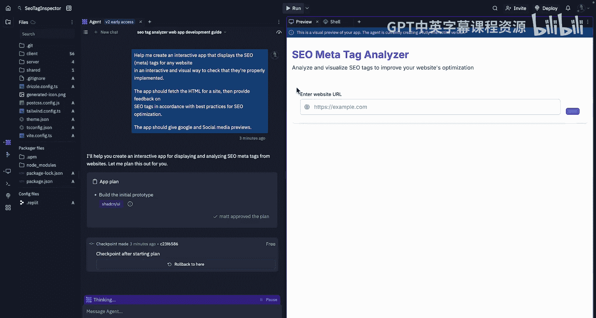

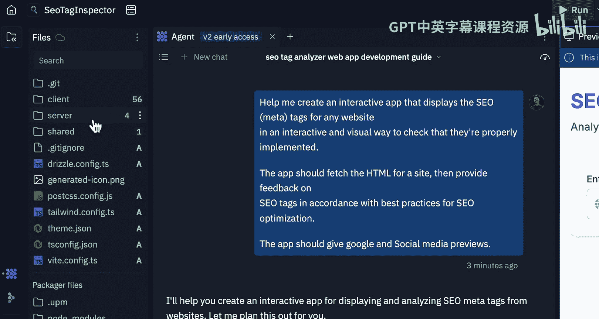

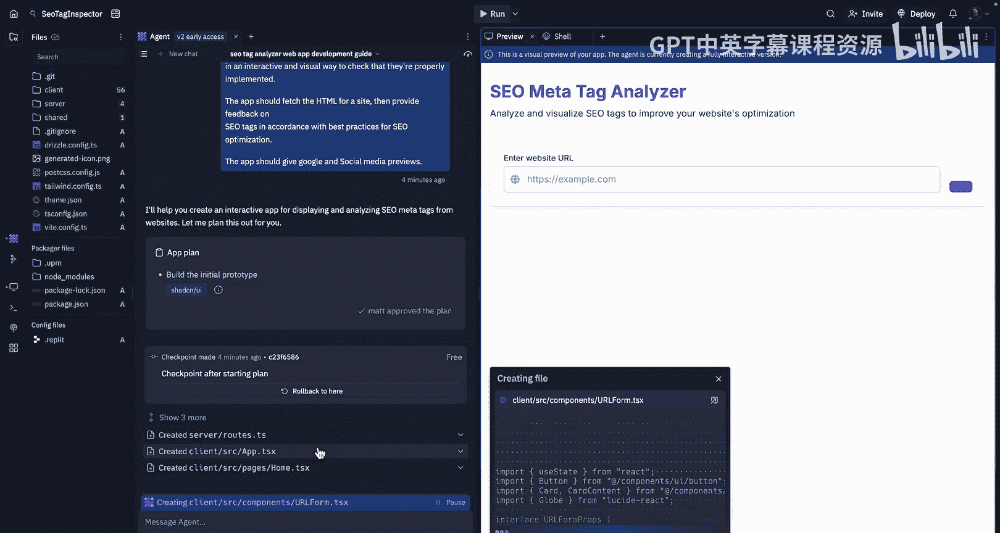

现在我们看到Agent实际上正在这个交互式窗格中编写和创建文件。我们这样做的部分原因是我们希望尽快让你达到MVP。因此，与Replit Agent的来回交流更少，但在此过程中，Agent将向你展示它正在做什么。

我们可以看到它正在编写这个文件`server/routes`，它已经编写了我们的客户端`index`和其他一些东西。现在，深入研究所有这些如何工作并不重要。但可能有用的是开始注意Agent如何创建这些应用，并开始逆向工程这些应用程序的工作原理，因为它可以教你很多关于编程的知识，可以教你很多关于构建的知识。

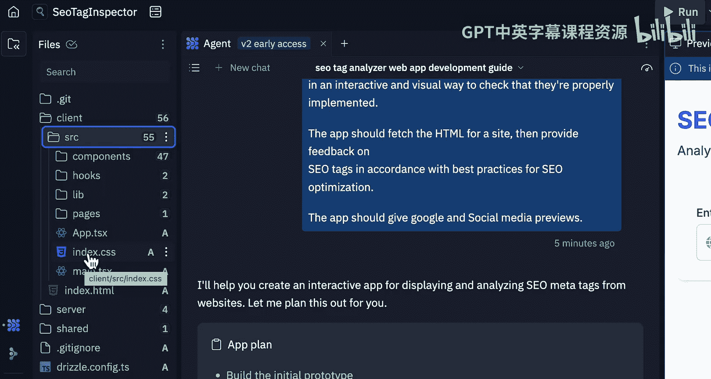

例如，我看到这里有文件夹：`client`、`server`和`shared`。如果你不熟悉，`client`通常是前端，`server`通常是后端。所以点击`server`会暴露像`routes`这样的东西是有道理的。如果你不熟悉API，这是一种应用程序进行通信的编程方式，这发生在我们的后端。但在`client`中，我们可能会看到这个源文件，注意有一个`index.html`文件，像`app.tsx`这样的东西可能是我们应用的主要入口点，或者`index.css`定义了应用的样式。

我想强调的是，你真的不需要看任何这些。如果这对你来说很吓人，就关掉它，别看它。我们将继续进行氛围编码。但如果你在构建这些东西时试图学习和跟随，你可以开始四处看看，开始注意。哦，嘿，Agent定义了这个叫做“社交媒体预览”的组件。我敢打赌，如果我们进入`components`文件夹，看看里面的东西，`GooglePreview`可能定义了会向我们展示它在谷歌上可能看起来像什么的预览。

所以，再次强调，Agent将在第一次运行时从头开始创建这个应用，将实现前端和后端。是的，这说了很多，但当Agent运行完毕时，我们将拥有一个可以开始迭代的MVP。它这样做是为了交付一个可以工作的东西，一旦我们的应用程序建立起来，我们可以继续推进或迭代。

这就是我们的工作空间概述。我们将让Agent继续构建，你将能够看到它所做的所有事情，然后一旦我们有了MVP，我们将回来开始迭代。这通常是我使用Replit Agent构建第一个原型时的开发方式。

## 审查构建结果

很好，现在你会在右侧注意到，我们有了一个已实现版本的应用。我想花点时间深入了解一下Agent的历史记录，看看发生了什么。

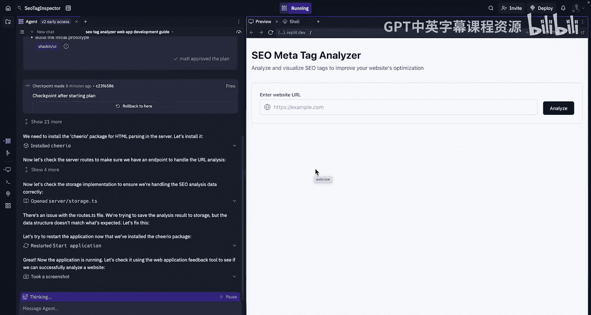

正如你在编写应用程序时看到的，发生了一堆文件编辑。任何时候你都可以深入研究这些，甚至可以点击下拉菜单查看具体创建了什么或具体更改了什么。

然后Agent继续并实际安装了我们的应用程序所需的依赖项，以及我在第一次传递时可能错过的一些辅助依赖项。

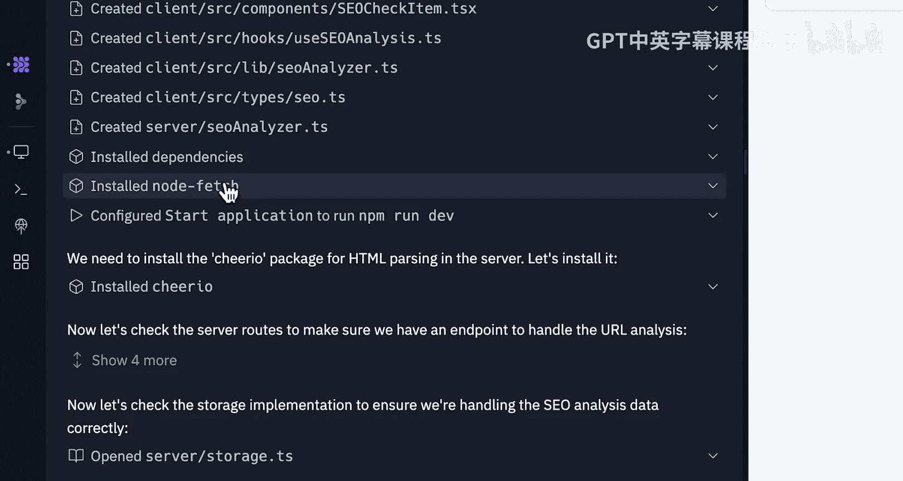

然后它配置了顶部的运行按钮来执行我们的应用，并循环检查，实际上识别出：“嘿，我们错过了一个包，除非我们安装它，否则这个东西无法工作。”

然后它做了一些最终检查，对我们的存储实现进行了编辑，没问题，重新启动了应用程序并修复了那个问题。

因此，使用Replit Agent构建的一个好处是，你不必担心一些启动时的麻烦，你可以让Agent接手，并从那里实现一些功能。

然后它确认了它具体做了什么和创建了什么。现在，这是了解我们正在构建什么的另一个好方法。嘿，我们创建了一个用于存储和分析这些标签的完整数据模型，我们构建了后端API端点，我们用URL输入、结果概览和可视化实现了我们的前端。我们还做了一堆其他事情。

## 测试应用

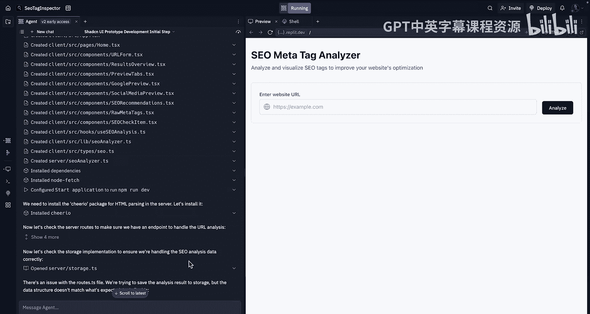

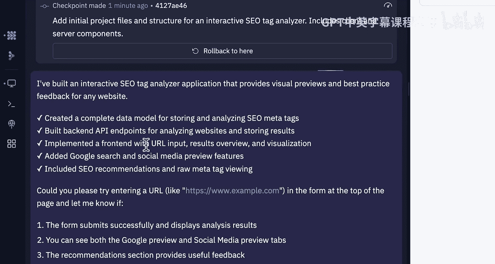

现在我们可以看看它是否有效。我们可以开始调试，开始测试我们的应用。我们在右侧有我们的Web视图，它将向我们显示应用的预览。

需要注意的是，如果你曾经编写过代码，如果你曾经使用过其他工具构建，你可能是在本地主机上做的，这基本上是在你的本地机器上运行东西。这个Web视图看起来会相似，但从根本上说，这个应用，这个Replit应用，运行在一个URL上。所以你可以从任何地方实际访问它。如果我点击这个，它会在新标签页中打开这个Web视图，你可以扫描它并在手机上实时访问它，你的朋友可以在你构建时访问它。

需要提到的是，一旦你离开这个应用，一旦你关闭这个页面，这个URL将进入休眠状态。这不是部署，但从技术上讲，它是一个在互联网上实时存在的开发环境。所以从根本上说，我们正在处理一个真实的网页。

让我们测试一下，看看它是如何工作的。我将输入我的博客网址，看看会发生什么。

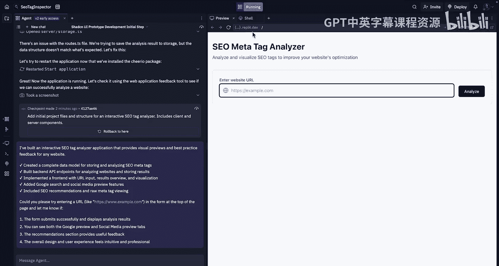

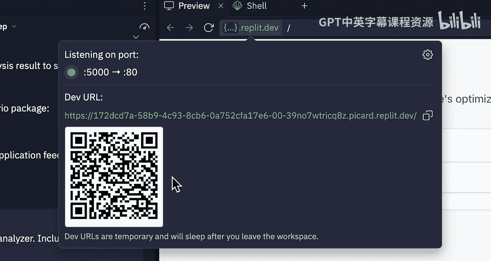

我点击“分析”。我们得到一个SEO摘要，86分（满分100分）。我想这还不错。可能像B+或A-。我不抱怨，看起来我们有一些分数。让我们看看这里发生了什么。“Matt Palmer”，没错。“开发者营销简化”，没错。看起来有一个警告：我们的标题标签太短。描述：描述有点短。细节在那里。看起来我们得到了一些最佳实践。所以这和我们想要的非常相似。

我们还有一些关键词建议。我们在那里算是通过了。以及其他一些建议。所以我们的分析器告诉我们的是：嘿，如果我们希望我们的网站在谷歌搜索中显示，甚至可能被LLM索引，我们可以优化我们的标题。我们可以改进描述，让它更长一点。

这真的很棒。我想说它接近我们想要的。看起来我们还有一些社交媒体预览。让我们去看看那里发生了什么。我们有一个Facebook预览，它正在正确加载图像。我们有一个Twitter预览，它也在那里正确加载图像。

我们在这里实现的是这个工具，然后检查以确保我们的网站在社交媒体上正确显示，并且被SEO正确索引。这是一次性完成的，我们所做的就是输入那个初始提示。

让我们用另一个网站试试。输入“DeepLearning.AI”，看看我们得到什么。

好吧，我只想指出我的网站得分更高。我确信在我录制完这个之后，Andrew的网站会有更高的分数。我毫不怀疑他会处理好这个。但只是为了看看一切是否正常，我们确实得到了我们的社交媒体预览，我们也得到了我们的Twitter卡片预览和其他一切。

## 迭代与改进

这就是我们正在谈论的部分，现在我只是在测试应用，看看它是否做了我期望它做的事情。氛围编码的很大一部分是注重细节，并拥有真正敏锐的产品感。

例如，我不太喜欢这里的间距，83看起来在100上面。那不够好。我们要修复它。我们要让它变得更好。下面的一些其他元素。这看起来不错，但这些没有对齐，“通过”不在这个药丸的中间。

我认为这个网站的其他许多视觉表现真的很好，但使用AI构建的一部分是详细描述什么有效、什么无效以及你想要改变什么。

另一个例子，这个的填充，可能甚至可以有更多的填充，让它看起来更好。关于Web开发的一件有趣的事情是，你希望你的应用具有响应性。所以你可以看到，如果我们把它变宽，填充实际上看起来好一点。

所以这里发生的情况可能是，这没有针对小屏幕进行优化。我们可以通过调整Web视图的大小，或者通过这个方便的小屏幕尺寸切换按钮，看看它在iPhone上的样子，来看到这一点。

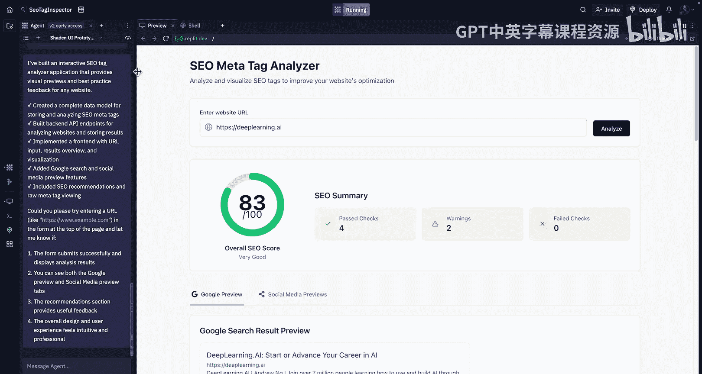

也许我们想为iPhone构建这个。所以检查一下很重要，比如，嘿，这些药丸，它们没有按照我想要的方式展开，这些标签页，它们可能看起来有点压缩，所以图标可能没有正确对齐。然后这些图像没有得到相同的宽高比。

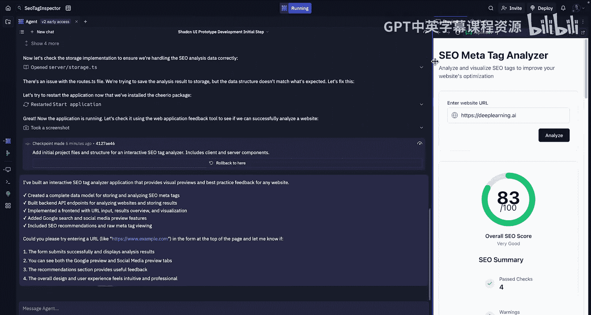

再次强调，这可能看起来微不足道，但深入研究细节真的很重要，文本在这里重叠了。

考虑到所有这些，我们有了一个MVP。我们有了一个可以工作的东西。我认为Agent一次性完成它令人印象深刻。

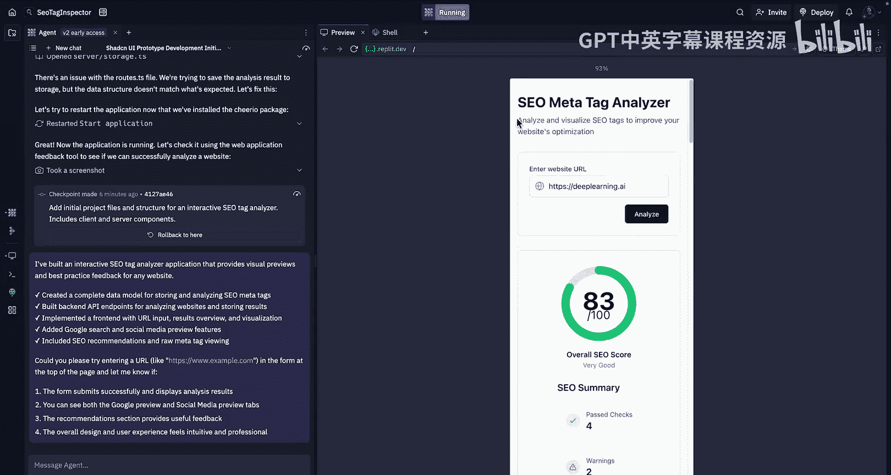

所以现在我们要跟进，修复其中的一些特性。我要说：“让我的应用完全响应。”

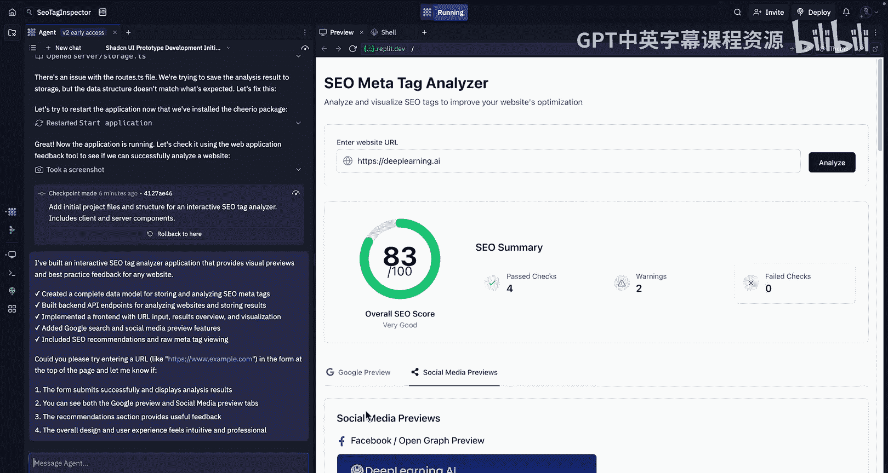

这个提示很重要。“响应式”是什么意思？在Web开发中，它实际上意味着你的应用能够响应屏幕尺寸的调整。这将使它移动设备友好。所以说“让我的应用完全响应和移动设备友好”，我们正在使用与Web开发技术同义的关键术语，AI将很好地理解和实现。

所以我要说：“让我的应用完全响应和移动设备友好，并修复一些对齐和填充问题。具体来说，修复整体SEO分数的居中问题，并移除‘/100’。” 我在这里非常具体地描述了我想要编辑的内容。

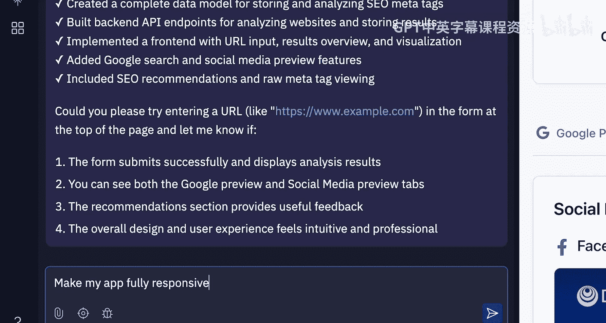

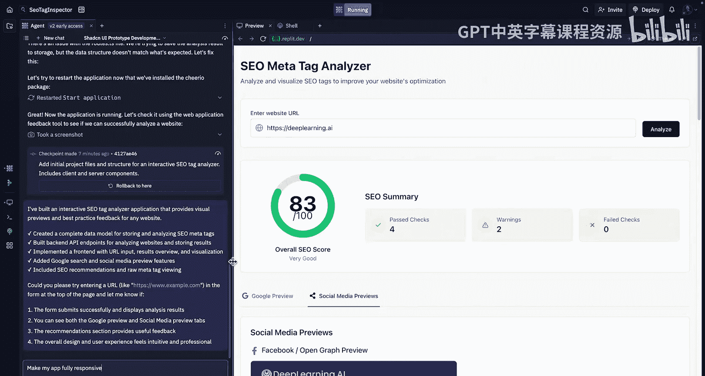

你可能注意到我要求了几件事。正如我们讨论过的，我们希望这些编辑简洁。但根据我使用AI构建的经验，我们可以这样做：嘿，我想让应用响应式和移动设备友好，我想修复一些其他东西。然后我们可以按回车键，用Agent运行它。

## 再次运行Agent

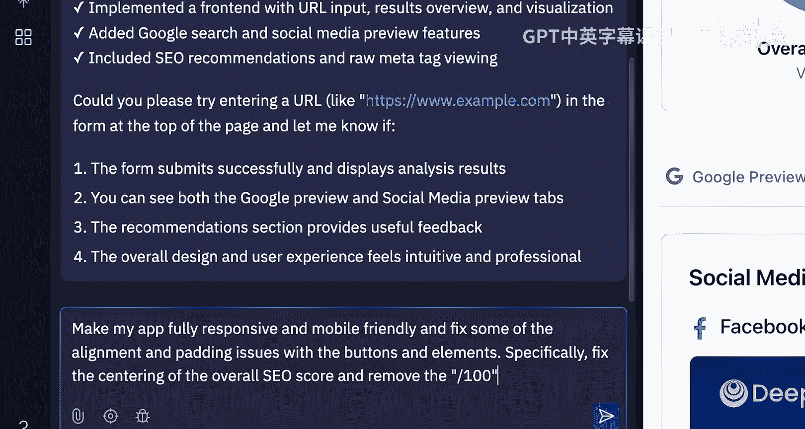

我们将再次启动一个Agent运行，我认为你可以期待这个运行得更快一些，因为编辑更小。我将稍微谈谈我们在这里做什么，然后让它完成，一旦完成我们就跳回来。

再次强调，使用AI进行氛围编码，就像要求一个初级开发人员或从未见过你项目的人进行更改。你必须非常具体地描述你想要什么。也许“完全响应和移动设备友好”。修复一些对齐和填充问题，特别是我看到的这个。如果你能做到这一点，Agent拥有所有工具来访问你工作空间上下文中的文件，以理解问题所在并修复它们。

所以你可以看到，嘿，我正在查看`Home`组件。我正在编辑客户端中的`URLForm`。我将开始更新`ResultsOverview`以修复SEO显示并使其更具响应性。

就像这样，我们正在针对其中一些编辑，我们可以希望，这将贯彻并做我们想让它做的事情。

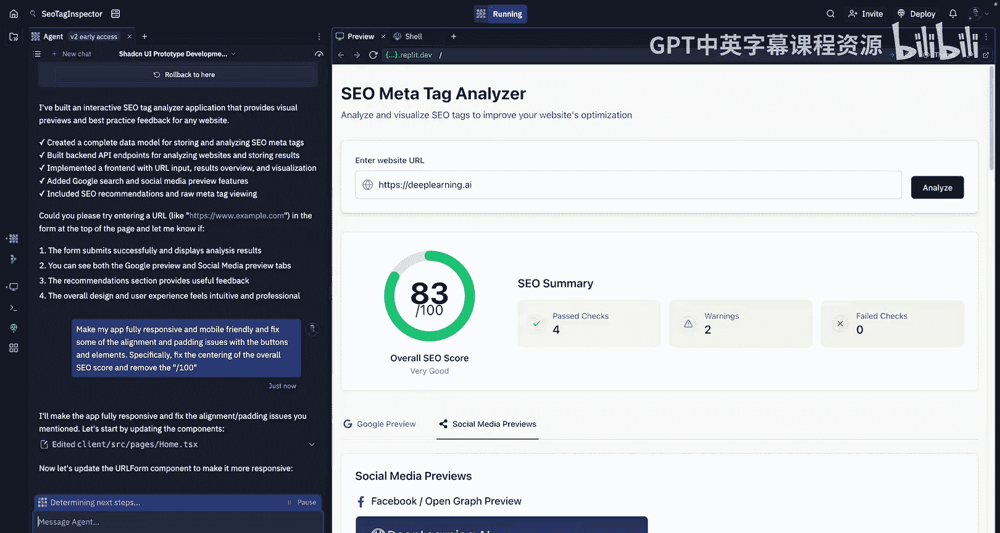

另一个需要提及的重要事情是，当我们要求Agent做这些事情时，它拥有这些文件和目录的所有上下文。因此，它将能够搜索文件，能够准确理解正在发生的事情。

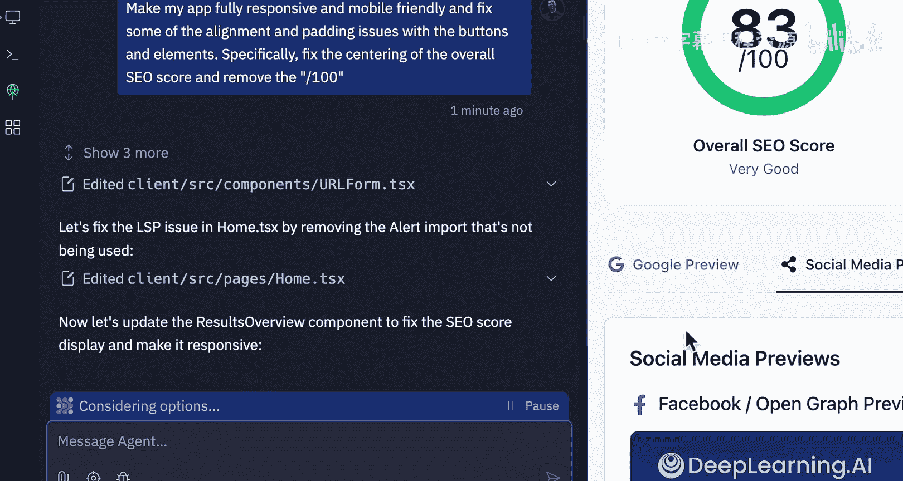

最后一点，你可以实时看到其中一些东西被更新，这很酷。我们现在正在做的是与Agent进行聊天。所以当我谈到上下文，当我谈到与AI交谈并告诉它所有这些不同的事情时，这个聊天中的所有内容都在Agent的上下文窗口中。它拥有所有已完成事情的历史记录。随着这个变得越来越长，你可能会想象AI变得更慢或反应更迟钝。

因此，当我们在处理不同的事情时，创建新的聊天很重要，这基本上会清除上下文或定位Agent的响应。As As的工作方式也非常相似。

所以我们正在做的是创建这个初始聊天，我们得到了一个原型，然后我们从那里进行一点迭代。对于我们的下一个功能，我们可能会切换到一个新的聊天，但这就是我想谈的全部。我们将让这个运行，一旦我们有了结果，我们就跳回来。

## 审查改进结果

看起来我们已经完成了那次运行。在我们深入研究之前，我只想指出，如果你相对较早地学习这门课程，你可能会看到这个“V2早期访问”的小药丸。我们正在开发Agent的新版本。当你学习时，希望这已经向所有人发布了。你可能看不到这个，你可以假设你拥有最新最好的Agent版本，并且一切都会以同样的方式运行。

现在，我们在这里看到的界面与我们刚才所做的非常相似。Agent改进了应用，返回了它所做的报告，并在过程中设置了一些检查点。

所以注意这些检查点是免费的，你应该在你的那边看到同样的东西。它修复了SEO分数显示，通过响应式布局改善了移动视图，添加了阴影效果和圆角以增强视觉层次感。我甚至没有要求那个，但你可以知道。那实际上看起来很不错。我非常喜欢。

因此，当我们思考框架和设计美丽、引人入胜、有趣的应用程序的方法时，我们可以把它作为一个提示：嘿，这看起来真的很酷。它使所有UI组件适应不同的屏幕尺寸。

## 测试改进版

那么我们现在做什么？我们要测试它。让我们做同样的事情，输入我们的网站。

好的，第一件事，这很好。它没有在开头添加“https://”，我想要一个网站。所以马上跟进：“让我不必每次都输入‘https://’。” 这是一个非常好的后续操作。我们将把它作为下一个提示的一部分发送。

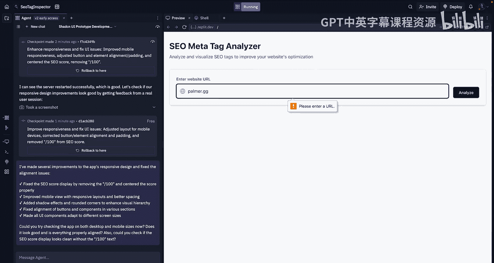

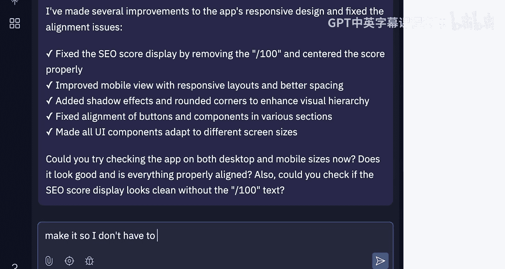

现在，我将输入我的URL，看看会出现什么。这个对齐得更好，我认为它仍然可以居中。另外，我在右下角得到了一个不错的小提示弹出。

这些药丸现在实际上是对齐和居中的，所以我们修复了那个，这很酷。我真的很喜欢这个的大部分外观。看起来一切都正常，所以我检查社交媒体预览。这些，让我们看看这些看起来更好。如果我在这里调整屏幕大小会怎样？

所以，调整大小。看起来这些是响应式的，宽度显示得更好一些。如果你还记得，这些图标之前有点挤在一起。如果我们回到宽屏这里，我们将选择iPhone 14 Max，我们有点老派了，我们现在用的是16，但这看起来更好，对吧？我们有了一个更具响应性的布局。如果我在我的iPhone上做这个，这更友好。

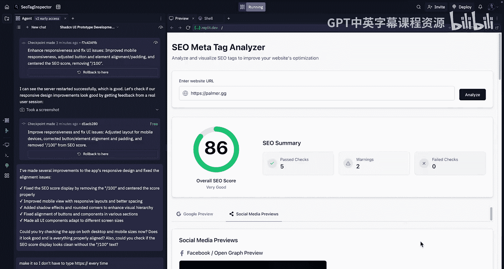

我开始得到一个看起来设计更好、移动设备友好的应用程序。这真的很酷。我们正在构建工具，构建任何人都可以使用的工具，我们可以用来分析自己的网站，并且它们可以工作，这真的很有趣。

## 总结与展望

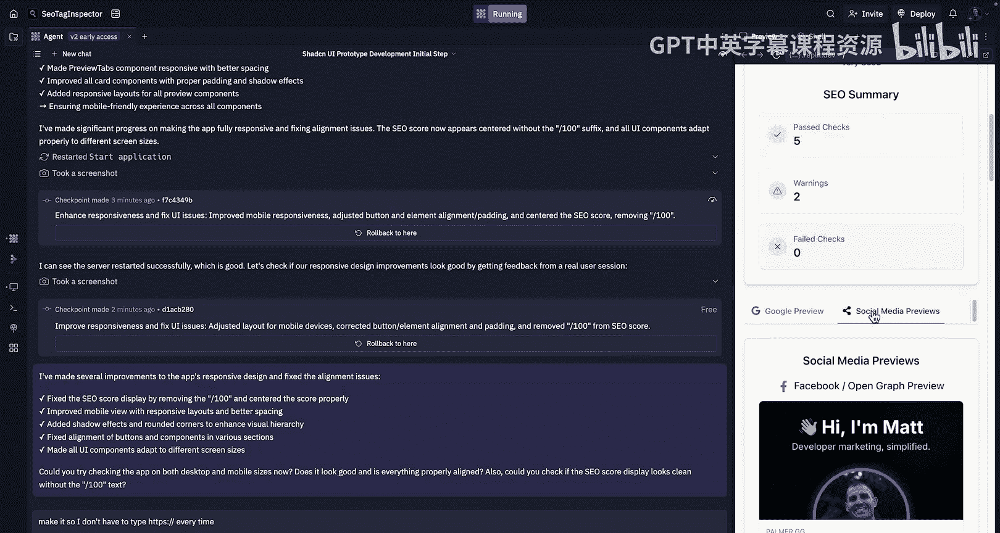

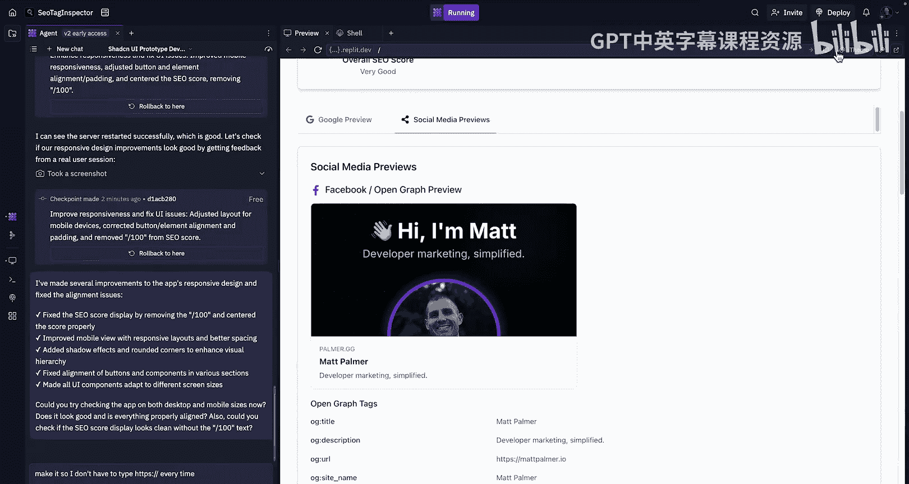

所以我们将这个称为我们应用的V1，在下一课中，我们将为它添加一些润色。我们将通过助手进行一些编辑，真正将我们的应用提升到一个新的水平，也许添加一些高级功能，然后进行部署。下一课见。

---

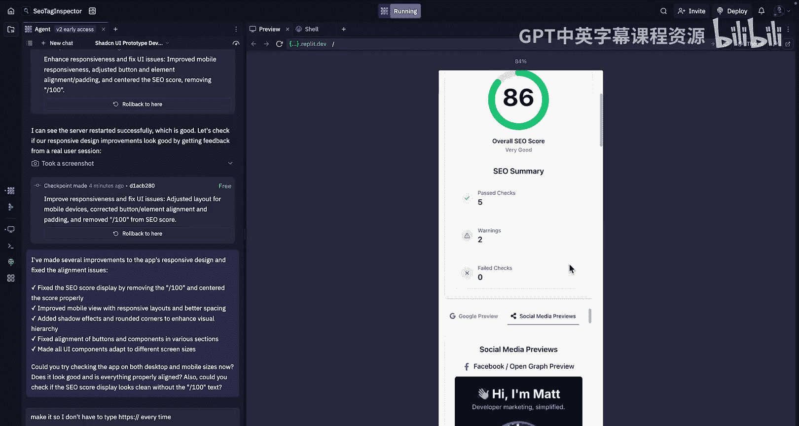

**本节课总结：**
在本节课中，我们一起学习了如何规划和构建一个SEO分析器。我们从定义产品需求文档和线框图开始，然后使用自然语言提示引导Replit Agent构建了第一个功能原型