# 004：实现SEO分析功能

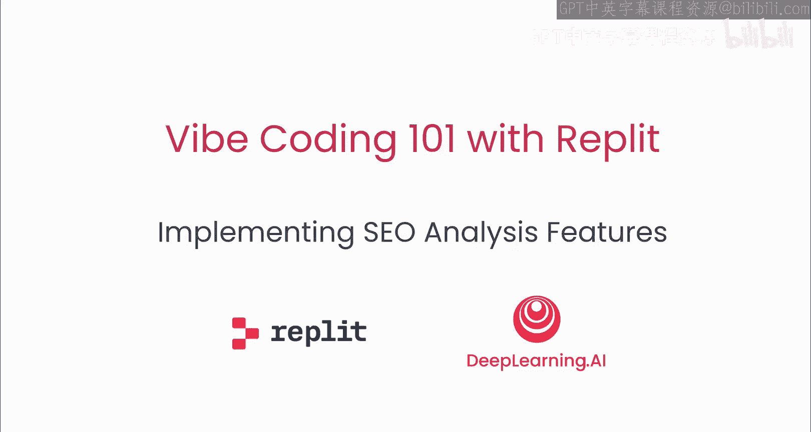

## 概述

在本节课中，我们将增强搜索引擎优化（SEO）分析器原型的功能。我们将使用Agent添加核心功能，然后切换到Assistant进行定制和功能扩展。最后，我们将部署应用程序，以便其他人可以在线访问。

---

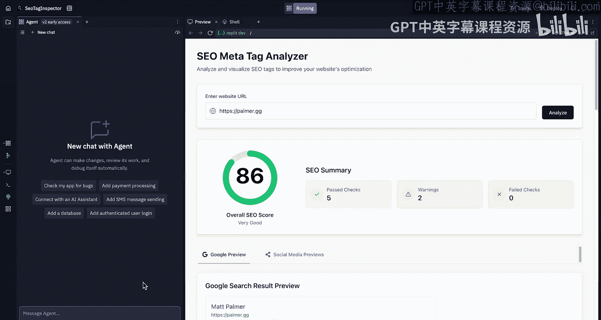

## 增强应用功能

上一节我们构建了基本的SEO分析器。本节中，我们将开始为已构建的内容添加更多功能，使其更具视觉吸引力。

首先，我将创建一个新的Agent对话以清除上下文。我们将要求Agent使应用程序更具视觉吸引力。目前，我们拥有关于网站和标签的所有数据，但唯一的视觉总结是一个整体的SEO分数。我们需要一个能更好捕捉这些标签整体情况的功能，例如提供图像摘要、标题和描述摘要以及高级信息。

我们将把这些需求整合到一个提示中，并要求Agent对用户界面进行更多优化。

以下是给Agent的提示要点：
*   为每个元标签类别创建摘要，并以视觉方式展示给用户，类似于整体分数。
*   使应用程序整体上更具视觉吸引力。
*   允许用户一眼就能获得SEO结果的摘要。
*   帮助使应用程序对SEO新手来说更直观、更友好，以便他们能快速了解页面实施情况。

同时，我们需要明确告诉Agent，**不要移除任何现有功能**，只需让高级摘要更容易查看，或让细节更容易深入。

现在，我们让Agent运行并实现这些功能，稍后再查看结果。

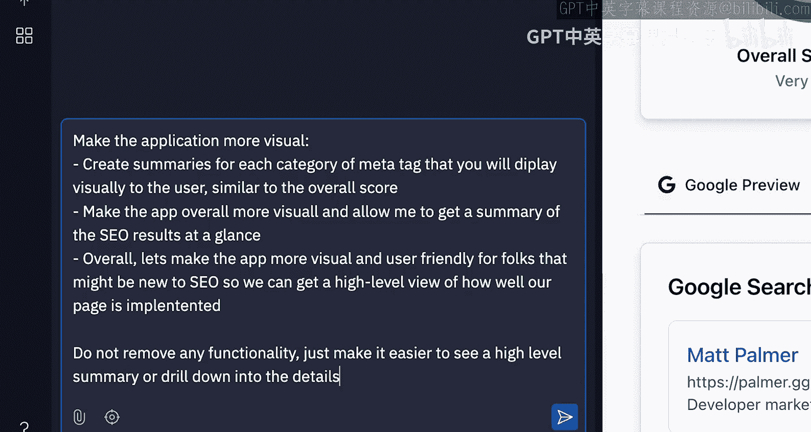

---

## 查看并评估改进

好的，编辑轮次已完成，让我们看看得到了什么。

我们使用之前的示例进行分析。现在，我们获得了更直观的检查结果展示。界面上生成了关键发现，列出了好的方面（如存在元关键词）和需要注意的方面，以及一些优先建议（如优化标题标签和改进描述）。

我们还获得了一些分类细分，例如SEO和社交媒体优化。系统正在检查标题以及内容在社交媒体上的显示方式。它检查机器人如何索引我们的网站（通常由robots.txt决定），并检查开放图谱标签和Twitter卡片。

我们仍然可以深入查看技术细节，并获得Google搜索预览，这很好。同样，社交媒体预览（Facebook和Twitter）的展示也更清晰、更美观。

如果我们想深入了解SEO建议，会得到一个更具描述性的视图。我们仍然可以看到原始标签，并且有一些不错的悬停效果。

经过三到四个提示，我们得到了一个本质上更完善的应用程序。当然，仍有一些不完美的地方，例如某些间距不理想。但总体而言，我们有了一个更精致的基础。

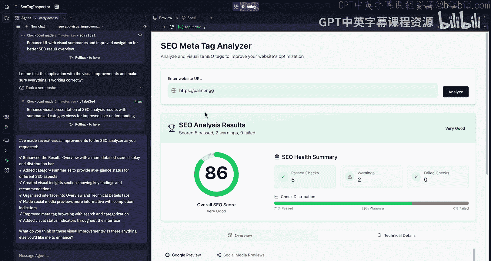

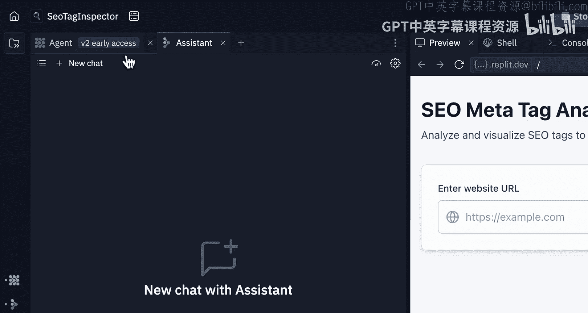

---

## 切换到Assistant进行精细调整

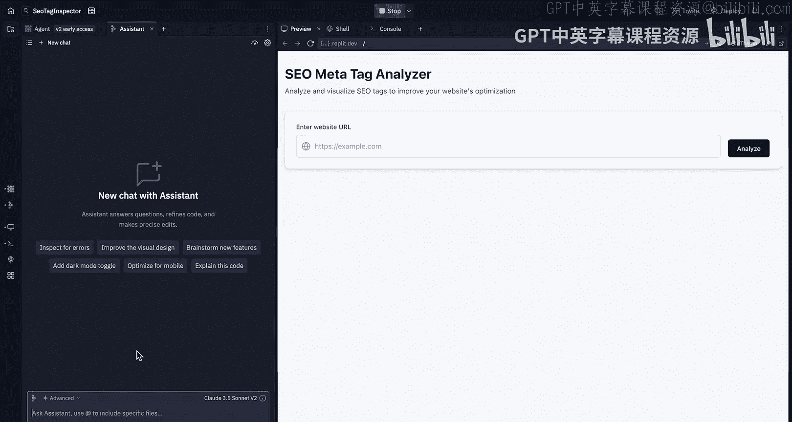

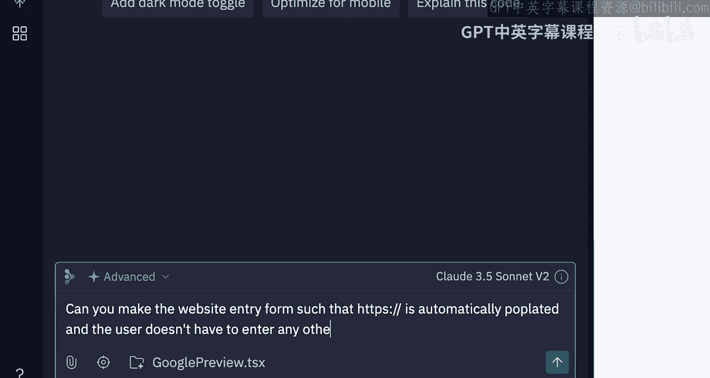

现在还有一些细节需要处理。我们将打开Assistant，对我们刚刚构建的内容进行更精细的调整。当你打开Assistant时，可能会注意到应用程序重启或刷新，这是因为我们正在“离开”Agent模式。

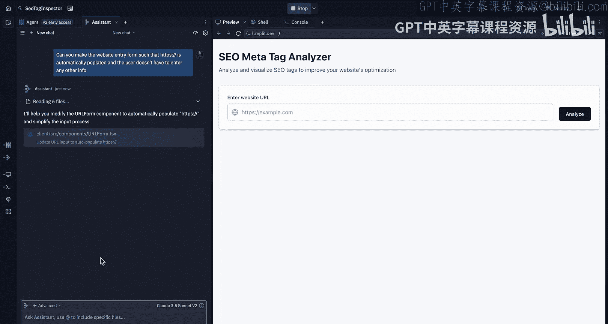

我记得我不喜欢必须手动输入“HTTPS”。因此，我将告诉Assistant（它实际上拥有与Agent相同的应用程序上下文）：**能否修改网站输入表单，使其自动填充“HTTPS://”，用户无需输入其他信息？**

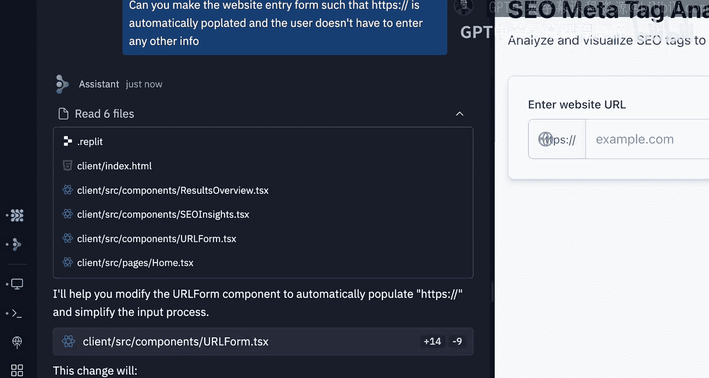

因为Assistant是一个更轻量级的工具，你会注意到响应速度更快。它将读取相关文件，做出更改，并创建一个检查点。

更改完成后，理论上“HTTPS://”应该被自动添加为前缀。让我们测试一下，输入“deeplearning.ai”并获取结果。

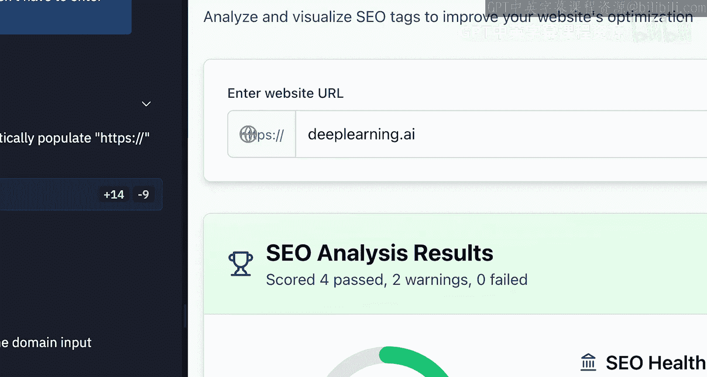

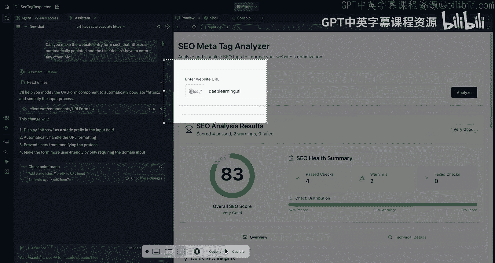

你可能会注意到，地球图标覆盖了“HTTPS://”文本。为了向Assistant提供上下文，我将使用截图工具截取这个问题，然后粘贴截图并说：**现在地球图标与“HTTPS://”重叠了，你能修复它吗？**

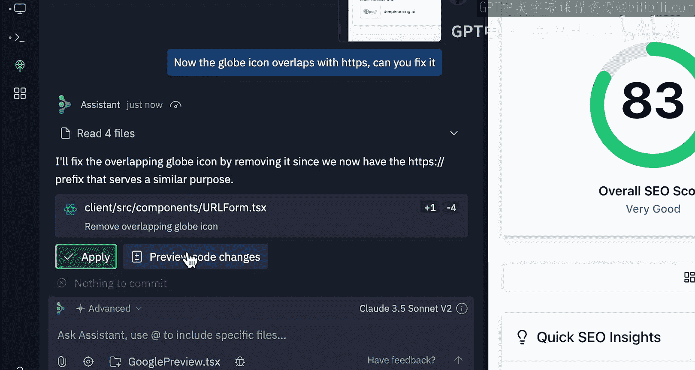

当我们讨论上下文时，我们提到要向AI提供额外细节，给予它修复错误所需的信息。这正是我们现在所做的。现在Assistant可以看到重叠问题，它将提出解决方案并询问我们是否要应用这些更改。

看起来我们遇到了一点错误。让我们预览一下发生了什么。实际上，它似乎只是移除了地球图标，但提交没有完全成功。没关系，有时会发生这种情况。我只需重新粘贴代码并再次运行即可。

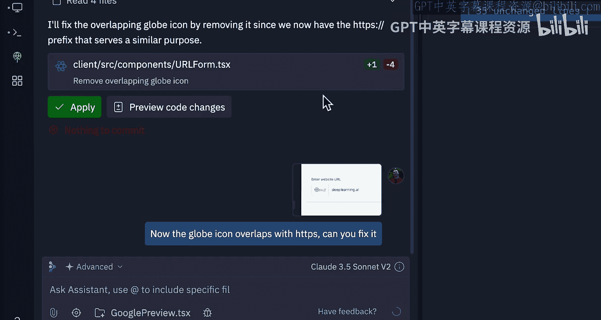

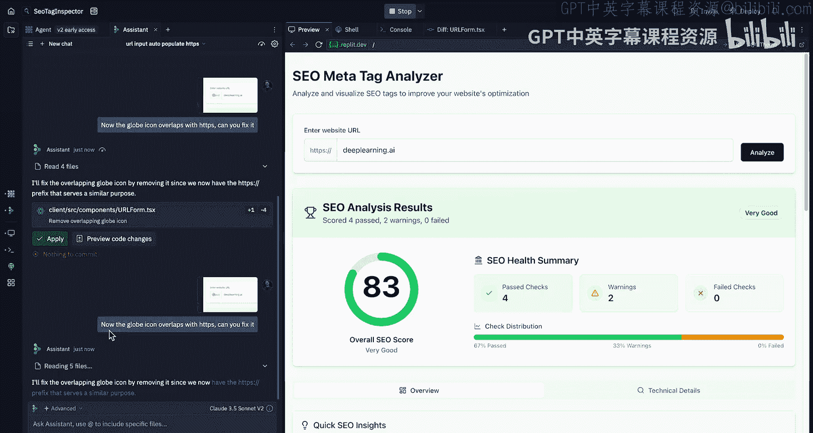

当系统创建一个新的检查点时，它会重启我们的应用。现在，我们的应用已经更新，我可以直接输入“deeplearning.ai”并点击分析。就这样，我们切换到了Assistant，并完成了一些更轻量级的细节调整。这基本上就是我们想要为应用程序构建的样子。

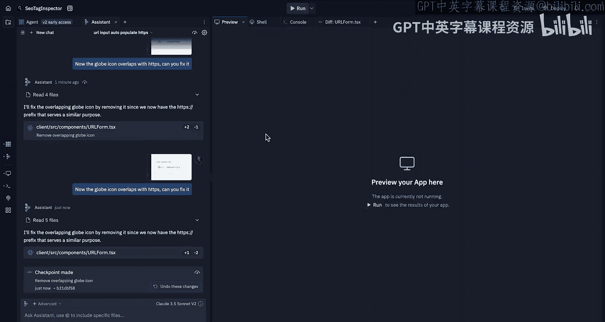

---

## 部署应用程序

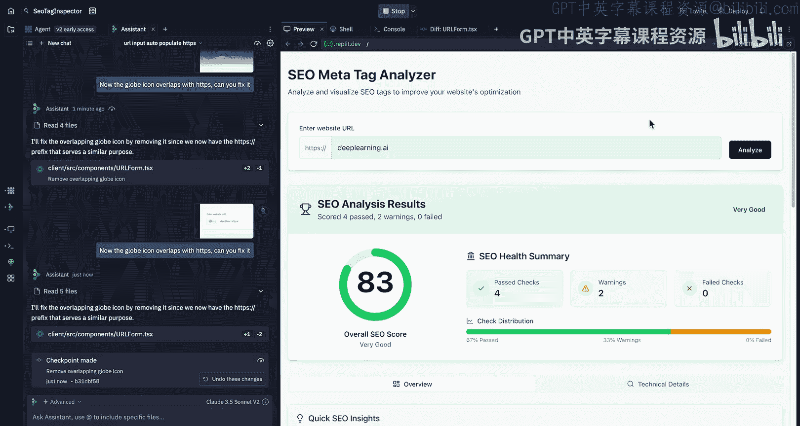

接下来，我们将介绍部署模式。这是我们为两个应用程序都会做的步骤。请注意，部署功能仅限于Replit核心用户，因此你可能看不到此体验。但你可以随时订阅或升级以进行部署。

点击“部署”，系统将为你配置构建，你无需担心这些细节，甚至无需了解“自动扩展”的含义。我们将改进和配置设置，然后为应用程序命名。我将我的应用命名为“SEO Tag Inspector”。

请注意，我们正在配置构建命令和运行命令。我完全不需要担心这些，AI会为我处理。点击“部署”。

需要说明的是，这个过程通常需要两到三分钟。我们正在将这个应用程序打包，将我们与Agent一起构建的整个环境放到云端。你无需担心其中的技术复杂性、细微差别或细节。你只需要知道，你刚刚构建的一切在我们将要部署的网页上看起来是一样的。

如果你之后回去做了更多更改，这些更改不会自动生效，你必须点击“重新部署”。本节课我们进行得稍慢一些，这是因为我们希望涵盖所有基础知识并理解其工作原理。

当我们构建应用程序并点击部署时，我们正在为与Agent和Assistant一起构建的所有内容、添加的所有功能创建一个快照，然后将它们推送到我们刚刚定义的独立网页上。如果你想了解更多关于不同类型的部署、部署工作原理或任何技术细节，可以查阅我们的文档或观看我在YouTube上制作的一些深度内容视频。

总的来说，系统将为你选择合适的部署类型，并且我们可以非常有信心这是正确的部署类型。同时，你可以观看这个很酷的加载屏幕。所有部署都附带日志，因此你可以准确查看部署中发生的情况。它们还附带分析功能，因此你将能够看到谁访问了你的部署、有多少用户，以及其他一些可以深入查看的设置。这些将在部署完成后可见。

---

## 部署完成与总结

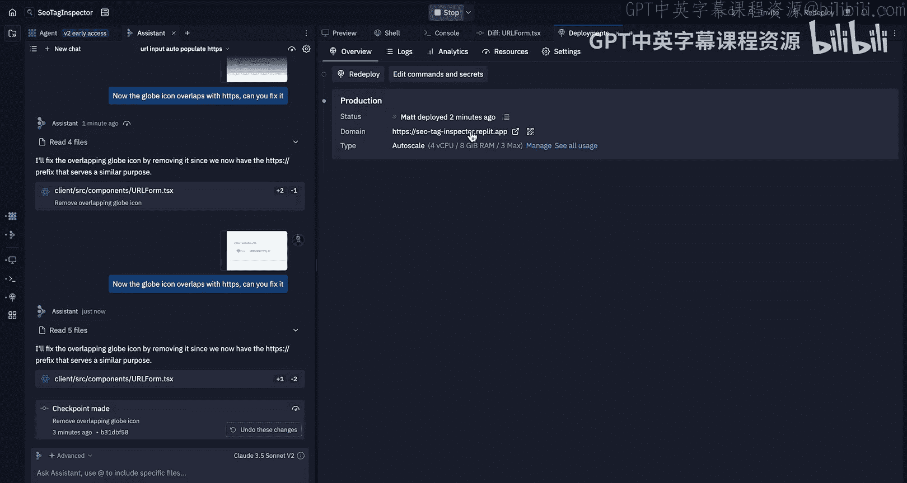

我们回来了。部署大约花了两分钟，这很棒。系统将提供你刚刚部署到的域名。如果我访问这个URL，我们将看到相同的应用程序。它现在已部署在互联网上，拥有自己的URL。

我可以输入一个网站地址，表单会自动为我移除“HTTPS://”，这非常好。点击分析，它的工作方式将与之前完全相同。

**总结**：本节课，我们使用Agent和Assistant端到端地构建了一个应用程序。该应用程序可以抓取网页，对网页进行分析，告诉我们是否有可以改进或优化的地方（例如针对SEO、Google结果或社交媒体帖子），然后将其部署。我们完全构建了一个可供他人和你自己使用的工具。过程就是如此简单。

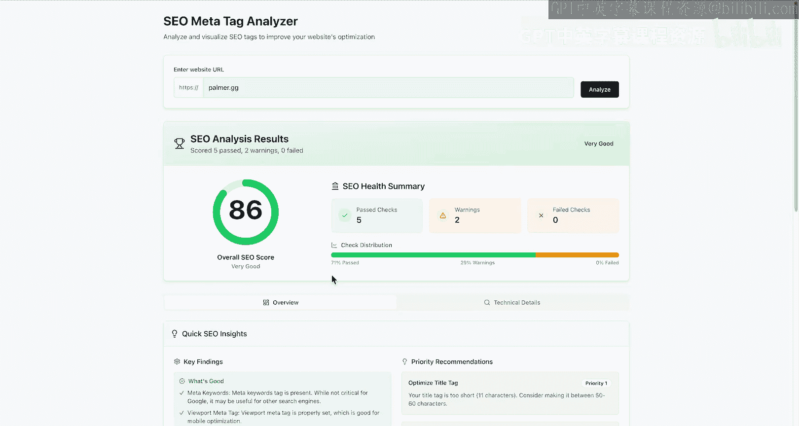

本节课的重点是完善应用程序并切换到Assistant。在下一课中，由于我们已经涵盖了基础知识，我们将能够更快地推进，并进入更复杂的主题。期待在下一课与你相见。