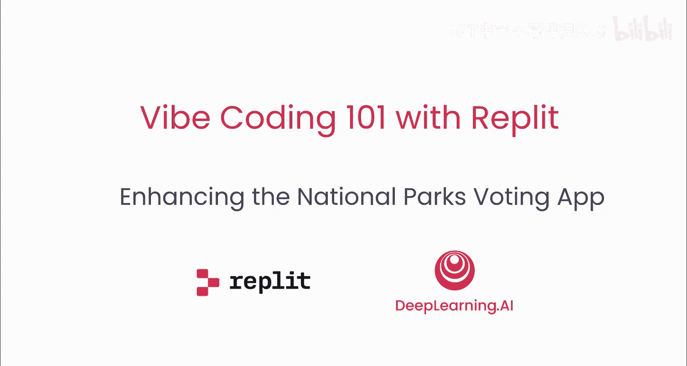
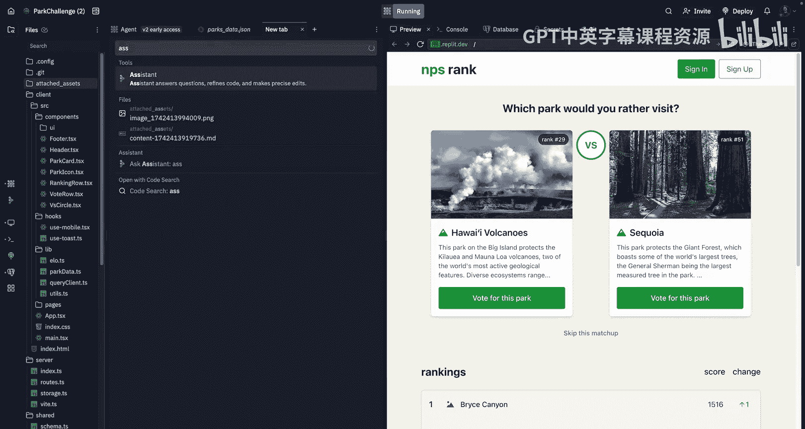
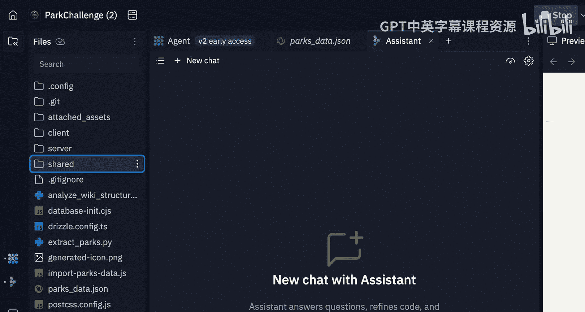
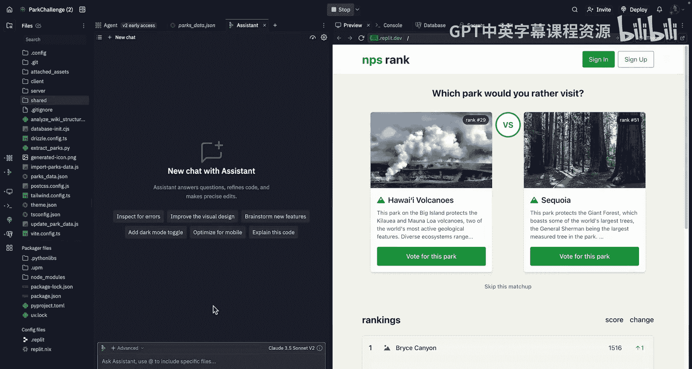
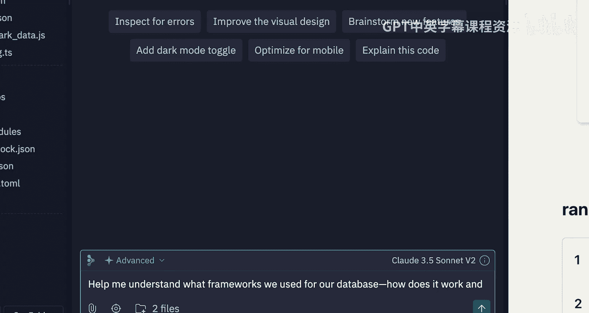
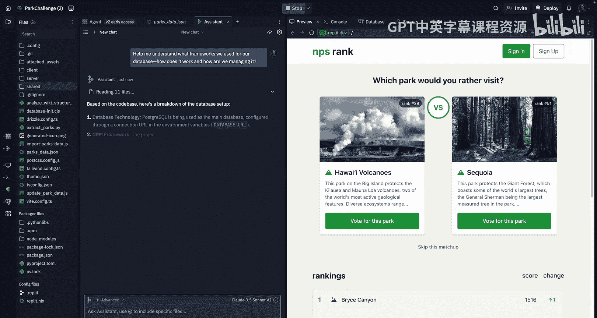
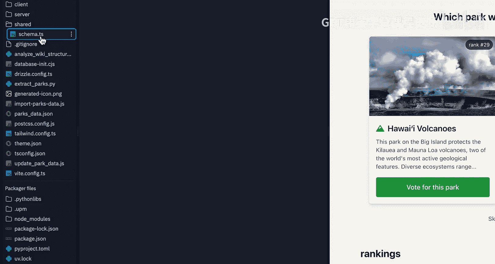
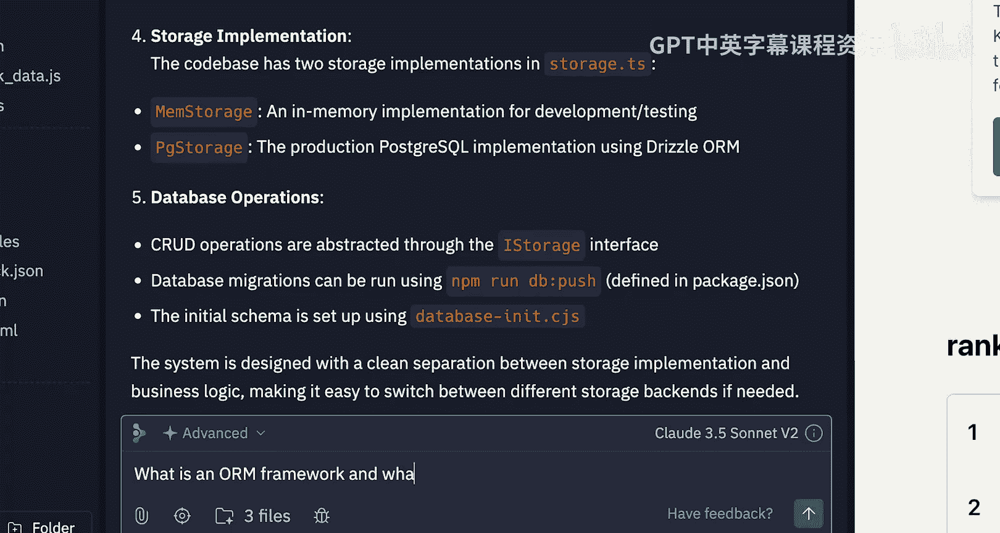
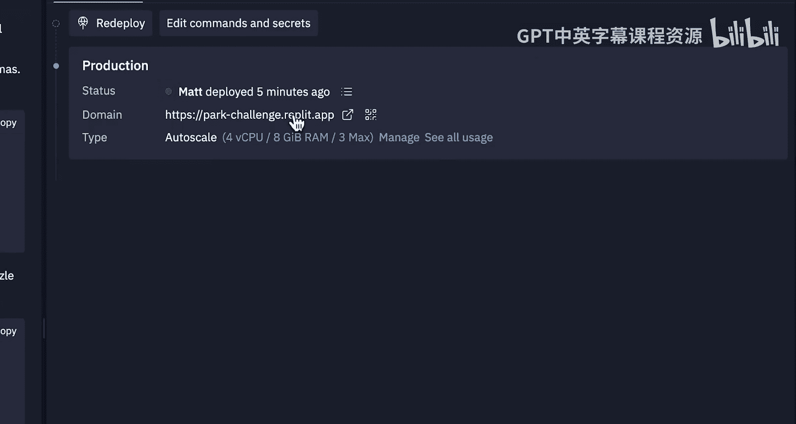
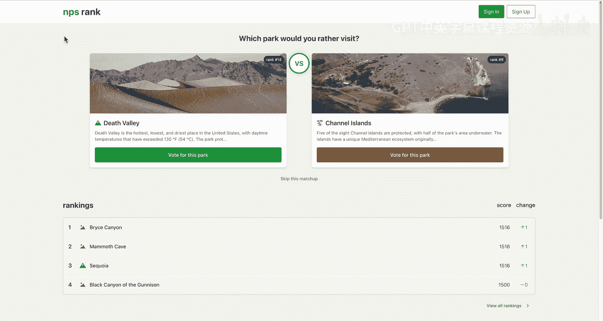

# 006：增强国家公园投票应用 🏞️

在本节课中，我们将通过集成完整的数据集来完善我们的国家公园投票应用。我们还将利用智能体和助手添加最终功能，确保一切正常运行。最后，我们将部署应用程序供公众使用。

## 回顾与理解现有项目

上一节课，我们构建了公园排名和投票应用的核心功能。我们实现了所有功能，将公园数据存储在数据库中，并创建了一个漂亮的排名表，同时将最近的投票记录存储在Postgres数据库中。

现在，我们将添加一些额外的功能。但在开始之前，我们需要理解当前项目是如何工作的。在上次智能体构建时，我可能有些分心，因此我需要回顾一下具体的实现细节。

接下来，我们将切换到助手模式，请求它帮助我们理解项目的运作方式。

以下是向助手提出的问题：
> 我们为数据库使用了什么框架？它是如何工作的？我们是如何管理它的？

理解我们使用的框架非常重要，这也是我在整个课程中一直强调的。理解我们构建的内容至关重要，因为当我们遇到调试问题时，我们需要知道如何解决这些问题，以及事物的工作原理才能找到解决方案。

助手基本上复述了智能体构建的所有内容。我们使用了Postgres作为主数据库，通过环境变量中的连接URL进行配置。我们使用了一个名为Drizzle ORM的ORM框架，这是一个TypeScript优先的ORM。我们还进行了一些模式管理。

我可以查看 `shared/schema.ts` 文件来了解具体的表结构定义。它定义了公园表和投票表。代码库中有两种存储实现：内存实现（旧的开发实现）和数据库实现。这是一个很好的说明，解释了这些组件是如何工作的。

## 深入理解ORM框架

然而，我还不完全清楚什么是ORM框架。因此，我继续向助手提问：
> 什么是ORM框架？为什么我要使用Drizzle？

这正是我学习编码、使用AI构建以及今天向你们展示的一切的方式。我只是提出一堆问题，助手利用最新的模型来回答，帮助我们理解正在发生的事情。

助手将告诉我们ORM（对象关系映射）是什么。它是一个框架，允许你使用编程语言中的对象与数据库交互，而不是编写原始的SQL查询。因此，我们使用对象而不是编写SQL（一种与数据库交互的语言）。它还告诉我们使用ORM的一些好处，例如类型安全、模式管理、查询构建和模式验证。

也许我还不完全理解这些概念的具体含义，但我可以继续深入研究。这里的真正目标是帮助你理解：我实际上不知道这个东西是什么，我不太清楚发生了什么，但我可以学习，我可以询问AI，并以此作为巩固我正在构建的内容并持续迭代的一种方式。

就这样，助手帮助我们理解了应用程序的工作原理，甚至可能让我们学到了一些关于Drizzle、Postgres以及我们正在使用的工具的知识。

## 应用功能与部署准备

我对目前的成果印象深刻。我们拥有一个可以投票给公园的应用程序，公园数据被记录在数据库中，并且我们得到了排名系统。这正是我想要的，而且它非常酷且具有交互性。我们实际上从维基百科提取了数据和这些图片。所以，这是一个涉及数据操作、可视化的相当复杂的应用程序，有点像ETL（提取、转换、加载）类型的工作。

现在，我们将继续部署这个应用程序。就像上次一样，我们将使用自动扩展部署，并批准相关设置。这次你会注意到，我们为数据库设置了密钥。如果我们要部署带有API或外部服务的应用，我们也需要传递这些密钥。

我们将把这个部署命名为 `park-challenge`。然后，我们将启动部署过程。就像上次一样，Replit将构建这个部署，配置一切，并将其推送到我们的生产环境。我们基本上不需要担心太多，因为我们已经构建了整个应用。

在开发过程中，通常很难不仅在云端重建你的环境，还要添加那些外部服务、添加数据库并在独立环境中管理这些数据库，或者做一堆其他事情。而我们在这里拥有的是一个直接集成到环境中的数据库。正如之前讨论的，我们的应用为我们安装了一堆东西，运行了一些Python脚本来导入数据。智能体配置了这个嵌入到我们应用程序中的数据库，我们不需要去任何其他地方，不需要打开另一个标签页，不需要设置另一个账户或输入API密钥。我们只是在Replit中编写代码就完成了一切。

因此，使用智能体和助手构建的力量在于，我们能够创建这些全栈应用程序，它们拥有数据库、前端和后端，并且真正从一个界面构建复杂的工具。这就是氛围编码。我们做了很多规划，讨论了很多关于工具和框架的内容。但在很大程度上，这与传统的编码或构建方式有很大不同。这里有很多“感觉”，我们只是凭感觉进行调试，凭感觉管理上下文。

我将让这个部署过程完成。完成后，我们会回来检查，确保我们的应用程序正常工作，然后继续前进。

## 部署完成与功能验证

很好，我们的应用程序已经部署完成，我们获得了一个URL，并且再次以自动扩展部署的形式上线。如果你想了解更多关于自动扩展的信息，可以查看我们的视频或文档。

打开应用程序，我们得到了和之前完全一样的内容。我可以为猛犸洞国家公园投票。值得注意的是，之前的分数被保留了下来，这是因为我们使用了同一个数据库。因此，我们拥有了投票系统、一些最近的投票记录以及存储在数据库中的持久化排名。

正如我之前提到的，这就是Replit的强大之处。我们刚刚将这个应用部署到了互联网上，任何人都可以访问。如果你想与家人或朋友分享，完全可以做到。是的，这是一个端到端的全栈应用程序，具有持久化存储，全程氛围编码完成。

在下一节课中，我们将讨论后续步骤，探讨你从这里可以走向何方。感谢你的参与，感谢一起构建这些很酷的应用程序。让我们圆满结束这节课。