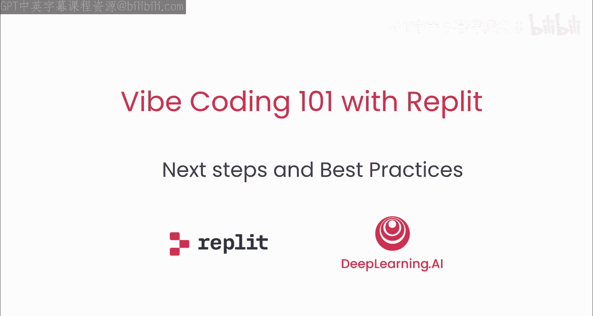
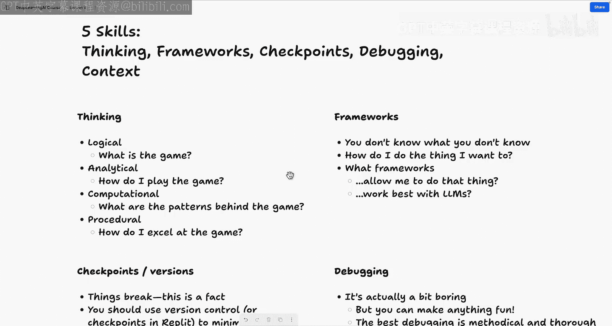
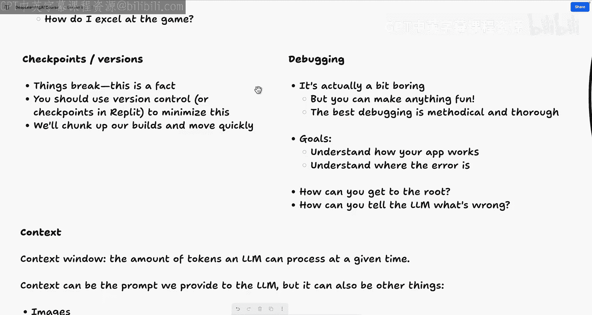
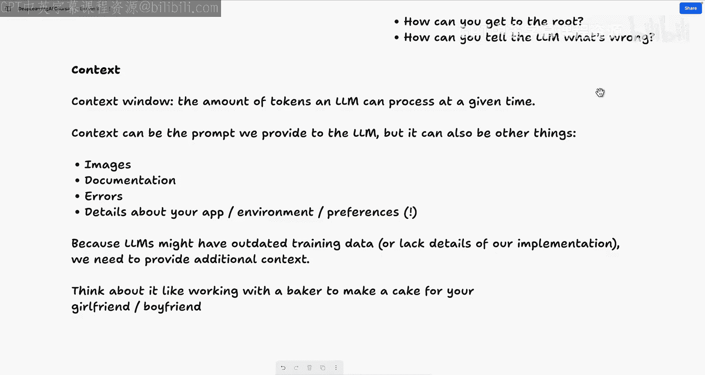
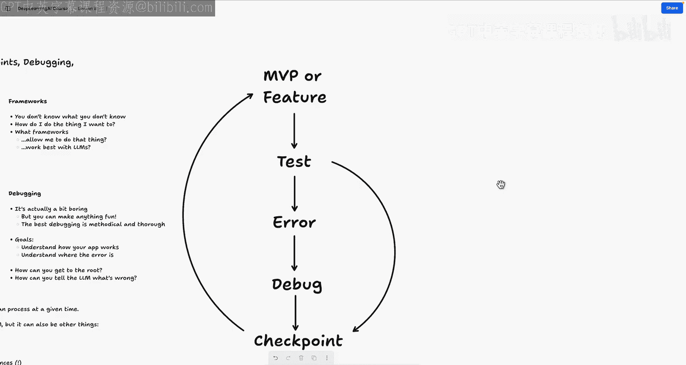

# 007：后续步骤与最佳实践

在本节课中，我们将回顾整个课程中构建的内容，讨论最佳实践，并探索如何继续你的氛围编码学习之旅。

课程到此结束。恭喜你完成本课程。

我们刚刚构建了一些相当出色的应用程序，而整个过程几乎没有编写任何代码。我们所做之事的惊人之处在于，我们构建了两个可用于生产环境的应用程序，而不仅仅是玩具演示。这些应用是全栈的，具有持久化存储，并部署到了专属URL，可供任何人访问。我们再次强调，我们编写了很少甚至几乎没有代码。整个过程都是逻辑和我们在课程开始时讨论的那些概念。

那么，这些概念是什么呢？它们与思考、框架、调试、检查点和上下文有关。在继续探讨氛围编码之旅的后续步骤之前，让我们快速回顾一下所学的一切。

## 🧠 核心概念回顾

上一节我们介绍了课程的整体目标，本节我们来详细回顾一下构成氛围编码的五个核心技能。

在我们的第一课中，我们讨论了五项技能：**思考**、**框架**、**检查点**、**调试**和**上下文**。

*   **思考**：我们讨论了一种逻辑化的思考层次结构。这包括从**逻辑思考**（例如，如果我们在下国际象棋，要问“我正在玩什么游戏？”）到**程序性思考**（例如，“我如何精通这个游戏？”以及“我如何实现功能或指导计算机精通这个游戏？”）。这正是我们构建应用时所做的：我们问自己，SEO是什么？我们试图实现哪些功能？我们的国家公园系统排名应用试图做什么？我们要实现什么？

*   **框架**：这一切始于理解我们不知道什么，并试图弄清楚我们想要的东西，理解哪些框架能让我们最好地完成那件事并与大语言模型协同工作。在某些情况下，这意味着向我们的工具（如Agent助手）提问来学习。

*   **检查点**：即使在我们构建的过程中，东西会出错，我们对此早有预期。但我们使用了**检查点**和**版本控制**来最小化构建过程的影响。最棒的是，Agent和助手内置了这些检查点和版本控制功能。这意味着我们可以将构建过程分解为**最小可行产品**和功能模块，从而快速推进。

*   **调试**：我们进行了相当多的调试。这个过程很有趣，但我们是有条不紊、细致入微的。我们理解应用的工作原理，有时会询问助手。我们追根溯源，解决了问题。

*   **上下文**：显然，上下文非常重要，这是我在整个课程中一直强调的。我们通过提供图像、提供我们正在构建内容的链接，以及在一种情况下，通过向网页提供实际数据来获取上下文。因为我们提供了上下文，因为我们向Agent详细解释了我们要做什么，它实际上能够提取这些数据并将其实现到我们的应用程序中。当Agent在实现我们的数据库时出错，我们提供了额外的上下文（即关于我们应用的更多细节）来绕过这个问题。请记住，始终要考虑你向大语言模型提供或未提供的上下文。

最后，我们使用我们的框架进行**迭代构建**，即迭代式的氛围编码。你可以称之为用AI创建功能、测试这些功能、发现错误（或可能根本不是错误）、调试该错误以达到一个检查点，然后继续下一个功能。在这个过程中，我们构建了两个可运行的应用程序。如果你遵循这个模式，你将能够构建更高级、更酷的应用程序。

## 🚀 后续步骤建议

回顾了核心概念后，你可能想知道接下来该做什么。本节将为你提供一些实用的后续步骤。

如果你刚接触氛围编码，或者这是你旅程的起点，我认为最重要的一步就是**持续构建**。我发现通过实践学习效果最好。我鼓励你也这样做，最重要的是，保持乐趣。

以下是一些具体的建议：

1.  **持续实践**：通过寻找生活中的常见问题，或者寻找你想要尝试自动化、重建或改进的事情，然后运用我们刚刚一起实践的技能来实现。
2.  **社交媒体互动**：你可以在社交媒体上关注动态，可以联系Replit，也可以联系我。我很乐意看到你构建的东西，并在我们的Replit账户上展示它们。
3.  **加入社区**：如果你是Replit核心会员，我们有一个Replit社区。一旦你加入核心会员，就有资格加入我们的社区，在那里你可以发帖并与其他成员互动。

## 📝 课程总结

本节课中，我们一起学习了氛围编码课程的总结与展望。我们回顾了构建两个生产级应用的过程，重温了**思考、框架、检查点、调试、上下文**这五项核心技能，并理解了**迭代构建**的模式。最后，我们探讨了持续学习的最佳途径：通过实践解决问题、保持乐趣、参与社区互动。

我是Replit开发者关系团队的Matt。以上就是Replit上的氛围编码101课程。感谢你的参与。