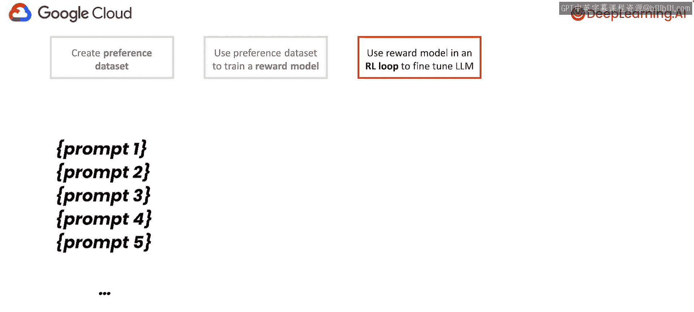
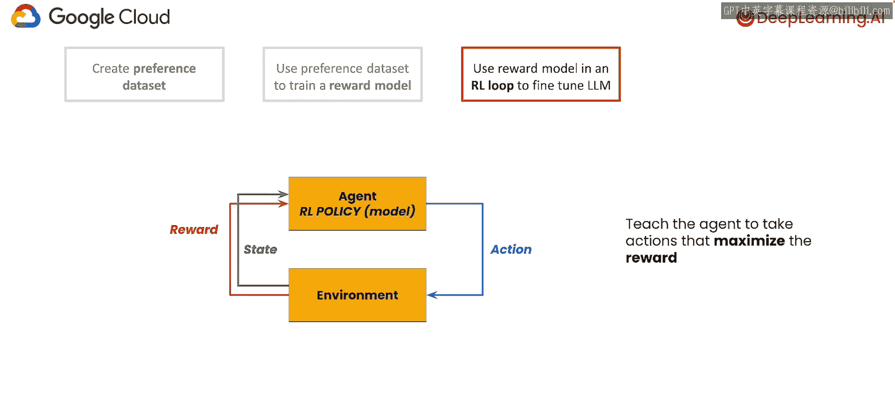
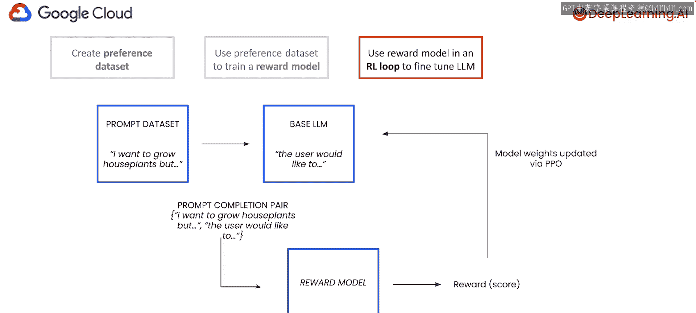
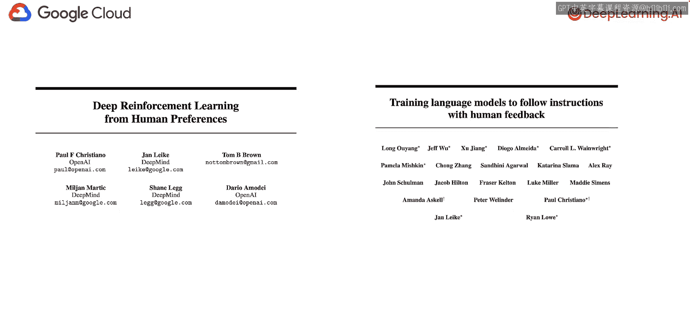
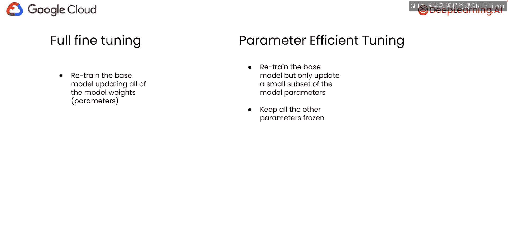

# 002：RLHF工作原理概述 🧠

在本节课中，我们将学习**从人类反馈中进行强化学习**的基本概念。这是一种用于使大型语言模型的输出更符合用户意图和偏好的技术。我们将通过一个总结任务的例子，逐步拆解RLHF的三个核心阶段。

---

## 概述

RLHF旨在解决一个问题：对于许多自然语言任务，不存在唯一的“正确答案”，而是存在多种符合人类偏好的有效回答。因此，我们不再训练模型寻找单一答案，而是通过收集人类对模型输出的偏好，并利用这些偏好数据来引导模型学习。

上一节我们介绍了RLHF的目标，本节中我们来看看其具体的工作流程。

---

## RLHF的三个阶段 🚀

RLHF主要包含三个步骤：
1.  创建偏好数据集。
2.  使用偏好数据集训练奖励模型。
3.  在强化学习循环中使用奖励模型来微调基础大语言模型。

---

### 第一阶段：创建偏好数据集

我们从一个希望微调的基础大语言模型开始。首先，我们使用这个基础模型为一系列提示生成多个不同的补全（回答）。

例如，对于提示“总结以下文本：我想开始园艺，但是……”，模型可能会生成多个总结版本。

接下来，关键的一步是让人类标注员对这些生成的回答进行评价。直接让标注员给每个回答打分效果并不理想，因为评分标准主观且因人而异。

一个更有效的方法是进行**成对比较**。以下是具体做法：
*   向人类标注员展示针对同一提示的两个不同模型输出。
*   要求标注员选出他们更偏好的那一个。
*   这种数据被称为**偏好数据**，它记录了人类在特定输入下对两个可能输出的选择。

需要注意的是，这个数据集反映的是具体标注员的偏好，而非广义的“人类”偏好。创建高质量的偏好数据集是RLHF中最具挑战性的环节之一，因为它要求明确定义“对齐”的标准（例如，是让模型更有用、更无害，还是更积极）。

一旦我们收集了足够的偏好数据，第一阶段就完成了。

---

### 第二阶段：训练奖励模型

接下来，我们利用上一步收集的偏好数据来训练一个**奖励模型**。在RLHF中，奖励模型本身通常也是一个语言模型。

在推理时，奖励模型接收一个**提示**和一个**补全**，并输出一个标量分数，用以表示该补全对于给定提示的“好坏”程度。因此，奖励模型本质上是一个回归模型。

以下是训练奖励模型的核心思想：
*   训练数据是三元组：`(提示, 获胜补全, 失败补全)`。
*   对于每个候选补全，模型会生成一个分数。
*   损失函数的设计旨在**最大化获胜补全与失败补全之间的分数差**。

训练完成后，我们就可以将任何提示-补全对输入奖励模型，并获得一个分数。分数越高，代表该补全越符合标注数据所体现的人类偏好。

---

### 第三阶段：强化学习微调

现在，我们进入RLHF中的“RL”部分。我们的目标是微调基础大语言模型，使其生成的补全能够**最大化从奖励模型获得的奖励**。

为此，我们需要引入第二个数据集：**提示数据集**。顾名思义，它只包含一系列提示，没有对应的补全。

在深入如何使用这个数据集之前，我们先快速了解一下强化学习的基本框架。

#### 强化学习快速入门

强化学习适用于训练模型完成具有复杂、开放目标的任务。智能体通过与环境交互来学习：
*   **状态**：环境的当前情况（例如，游戏棋盘局面）。
*   **动作**：智能体可以采取的操作（例如，移动棋子）。
*   **奖励**：环境对智能体动作的反馈（正分或负分）。
*   **策略**：一个函数，它根据当前状态决定智能体应采取哪个动作。策略的学习目标就是最大化累积奖励。

#### 在RLHF中的应用

在RLHF场景中，这些概念对应如下：
*   **策略**：我们要微调的**基础大语言模型**。
*   **状态**：当前的上下文，即**提示**加上已生成的文本。
*   **动作**：生成下一个**词元**。
*   **奖励**：由**奖励模型**为生成的完整补全给出的分数。

因此，学习最大化奖励的策略，就等于得到一个能生成高奖励分数补全的大语言模型。这个策略通常通过**近端策略优化**算法进行更新。

以下是每一步的具体流程：
1.  从提示数据集中采样一个提示。
2.  将提示传递给基础大语言模型（策略），生成一个补全。
3.  将“提示-补全”对输入奖励模型，获得奖励分数。
4.  使用PPO算法，根据该奖励分数更新基础大语言模型（策略）的权重。

每次更新后，策略（即模型）在生成符合偏好的文本方面应该会有所改进。实践中，通常会添加一个惩罚项，以防止微调后的模型偏离原始基础模型太远。

---

## 参数高效微调 ⚙️

微调神经网络时，更新全部权重的方式称为**全参数微调**。但对于参数量巨大的大语言模型，这非常耗时耗力。

**参数高效微调**是一种旨在缓解此问题的技术，它只训练模型参数的一小部分。这些参数可以是原有参数的子集，也可以是新增的参数。这样做的好处包括：
*   大幅减少训练时间和计算资源。
*   部署更简单：可以共享一个基础模型，仅为不同任务或用户加载不同的、轻量的微调参数集。

在本课程中，我们对Llama 2模型的微调将采用参数高效微调的实现。

---

## 总结

本节课中我们一起学习了RLHF的工作原理。我们了解到，RLHF通过以下三个主要步骤使大语言模型与人类偏好对齐：
1.  **创建偏好数据集**：通过人类对模型输出的成对比较，收集偏好数据。
2.  **训练奖励模型**：利用偏好数据训练一个能对补全质量打分的模型。
3.  **强化学习微调**：将基础大语言模型作为策略，在奖励模型的指导下，通过PPO等算法进行微调，以生成能获得高奖励（即更符合人类偏好）的文本。

此外，我们还介绍了**参数高效微调**的概念，它是实际应用中用于降低大模型微调成本的关键技术。现在，你已经掌握了RLHF的基本原理，接下来可以进入实践环节了。