# 003：RL训练数据集准备 📊


在本节课中，我们将学习为RLHF训练准备数据。RLHF需要两个关键数据集：**偏好数据集**和**提示数据集**。我们将以在Reddit帖子摘要任务上微调OSS Llama2模型为例，具体了解这两个数据集的构成和内容。

## 概述

在微调大型语言模型之前，数据准备是至关重要的第一步。RLHF流程依赖于两个核心数据集：用于训练奖励模型的**偏好数据集**，以及用于强化学习循环的**提示数据集**。本节我们将详细探索这两个数据集的结构和内容。

## 探索偏好数据集

首先，我们来看看偏好数据集。这个数据集用于训练奖励模型，通常是RLHF中最棘手的部分之一，因为它包含了人类标注的偏好，而不同的人可能有不同的判断标准。

以下是加载和查看偏好数据集的步骤：

1.  **导入JSON库并加载数据**：我们首先导入必要的库，并定义一个空列表来存储数据。
    ```python
    import json
    preference_data = []
    ```

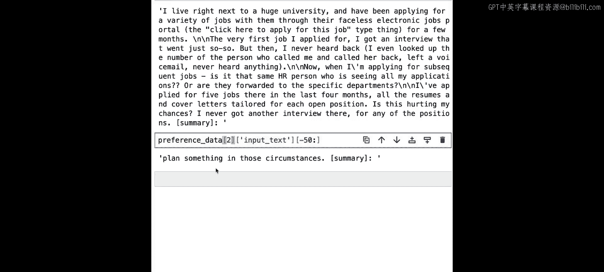

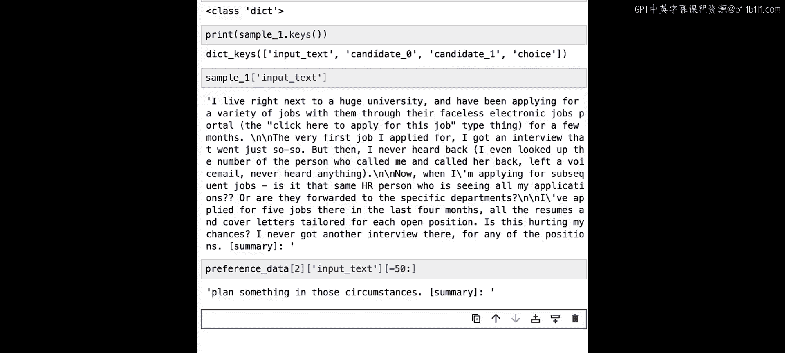

2.  **读取数据文件**：我们将循环读取一个名为 `sample_preference.jsonl` 的JSONL格式文件，并将每一行数据添加到列表中。
    ```python
    with open('sample_preference.jsonl', 'r') as f:
        for line in f:
            preference_data.append(json.loads(line))
    ```

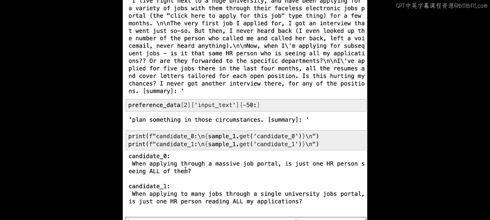

3.  **查看数据结构**：加载完成后，我们可以查看数据的具体内容。每个数据样本都是一个字典。
    ```python
    sample_one = preference_data[0]
    print(type(sample_one))  # 输出: <class 'dict'>
    print(sample_one.keys()) # 输出: dict_keys(['input_text', 'candidate_0', 'candidate_1', 'choice'])
    ```

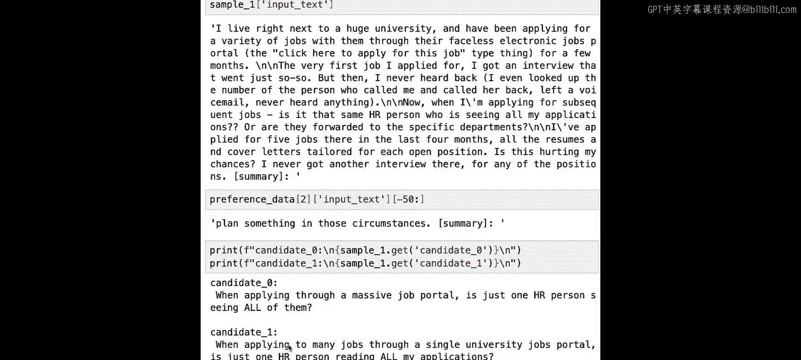

字典包含四个键：
*   **`input_text`**：这是提示（prompt），即需要被总结的Reddit帖子原文。所有提示都以特定的指令结尾，例如 `[总结]:`。保持训练和推理时提示格式的一致性非常重要，这样模型才能识别出任务模式。
*   **`candidate_0`** 和 **`candidate_1`**：这是针对同一个 `input_text` 生成的两种可能的摘要（completion）。
*   **`choice`**：这是人类标注者的偏好选择，其值（例如 `1`）表示标注者认为 `candidate_1` 是优于 `candidate_0` 的摘要。我们称被选中的为 **获胜候选**，另一个为 **失败候选**。

奖励模型将基于 `(input_text, 获胜候选, 失败候选)` 这样的三元组进行训练，学习为更好的摘要输出更高的标量分数。

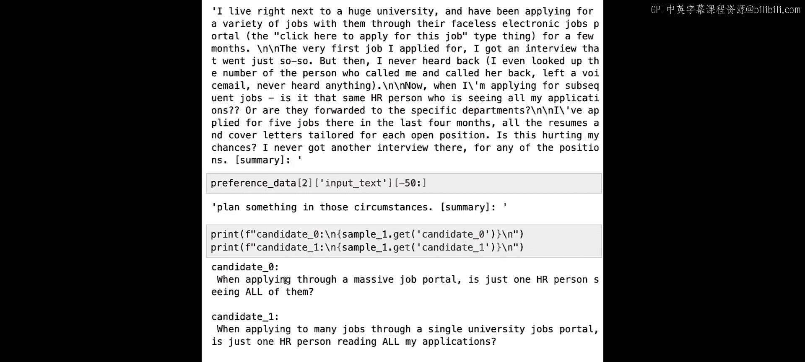

## 探索提示数据集

上一节我们介绍了偏好数据集，本节中我们来看看第二个关键数据集——提示数据集。在奖励模型训练完成后，我们将使用它在强化学习循环中微调基础大语言模型。这个过程需要一个仅包含样本提示的数据集。

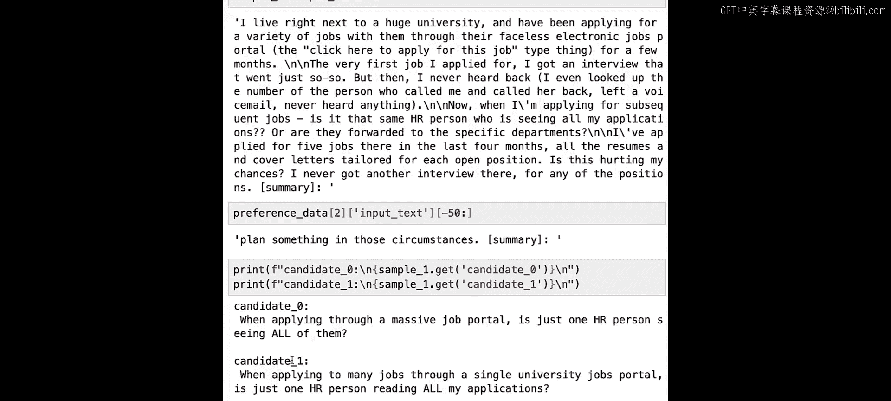

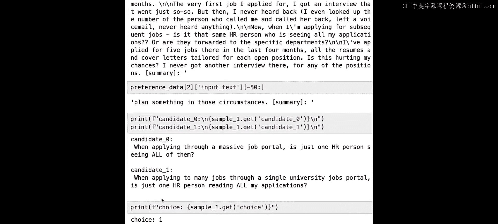

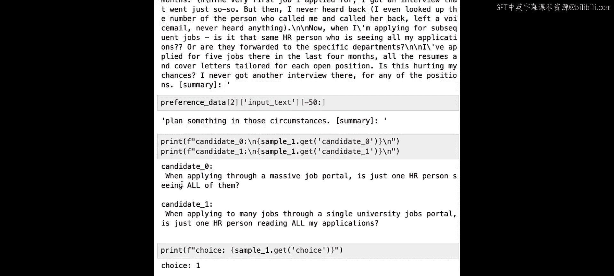

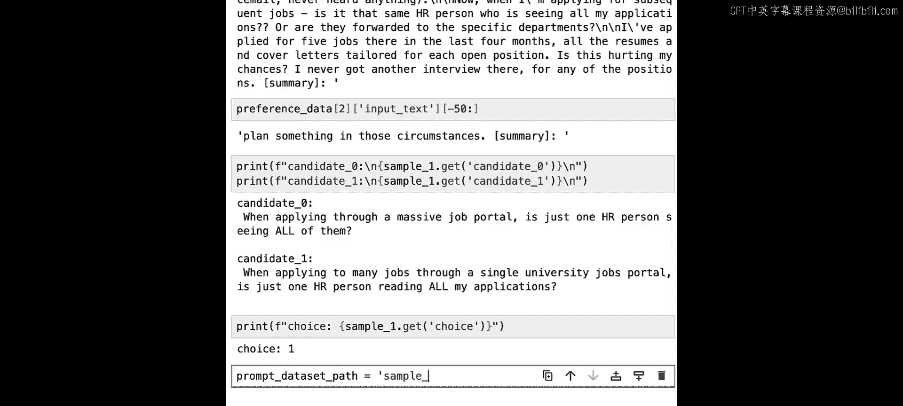

以下是加载和查看提示数据集的步骤：

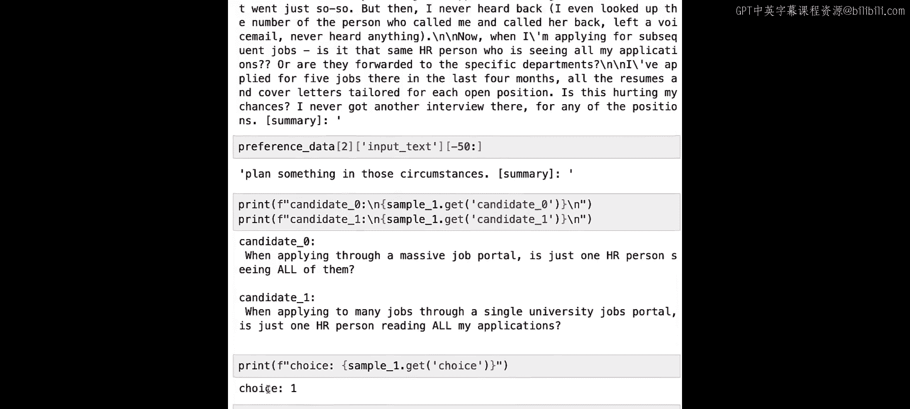

1.  **加载数据**：与之前类似，我们从一个名为 `sample_prompt.jsonl` 的小文件中加载数据。
    ```python
    prompt_data = []
    with open('sample_prompt.jsonl', 'r') as f:
        for line in f:
            prompt_data.append(json.loads(line))
    ```

2.  **查看数据结构**：提示数据集的结构更简单。我们可以定义一个辅助函数来清晰地打印字典内容。
    ```python
    def print_d(dictionary):
        for key, value in dictionary.items():
            print(f"{key}: {value}")
    ```

3.  **检查数据样本**：使用这个函数查看数据。
    ```python
    print_d(prompt_data[0])
    # 输出示例:
    # input_text: I noticed this the very first day... [总结]:
    ```
    可以看到，每个样本只有一个 `input_text` 键，其值就是一个提示文本。这些提示同样来自Reddit帖子，并且以相同的 `[总结]:` 指令结尾。

**一个重要提示**：偏好数据集和提示数据集中的提示必须来自相同的分布。在本例中，它们都源自Reddit帖子数据集，因此满足这个条件。

## 总结

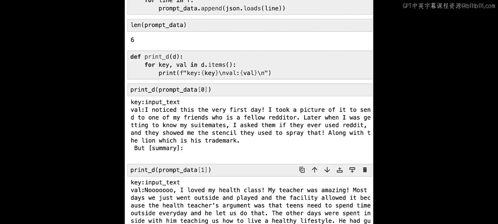

本节课中我们一起学习了RLHF训练所需的两个核心数据集。**偏好数据集**包含提示、两个候选摘要以及人类偏好选择，用于训练奖励模型区分摘要质量。**提示数据集**则仅包含一系列提示，用于在强化学习阶段微调基础语言模型。理解这两个数据集的结构和关系，是成功实施RLHF的关键第一步。在下一课中，我们将实际使用这些数据集来微调我们的模型。