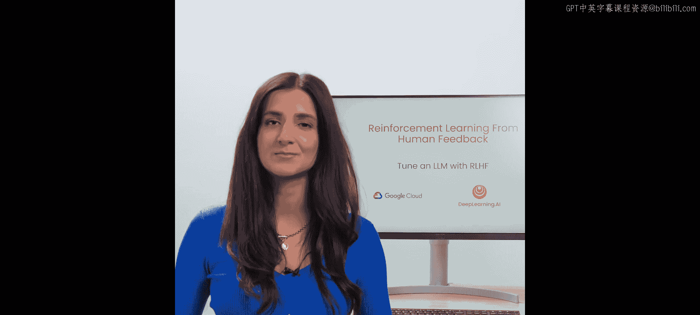
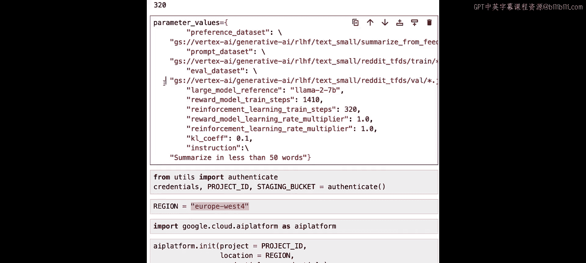
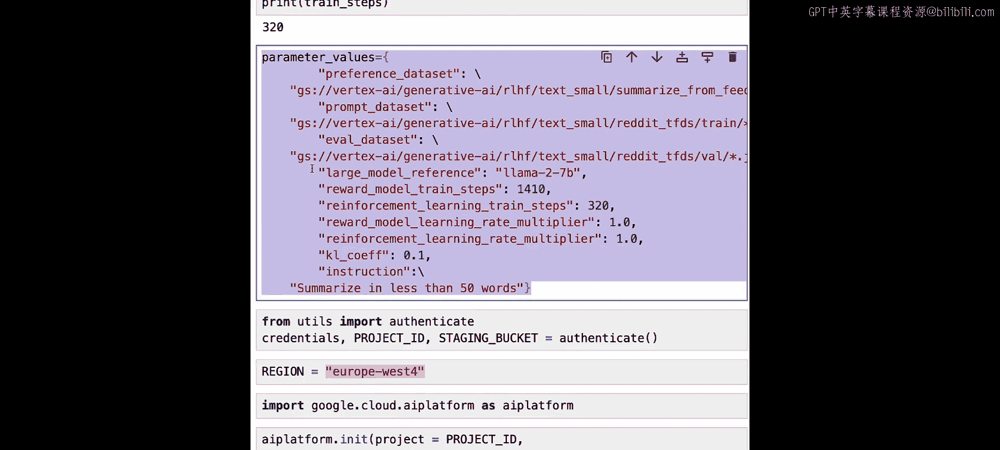
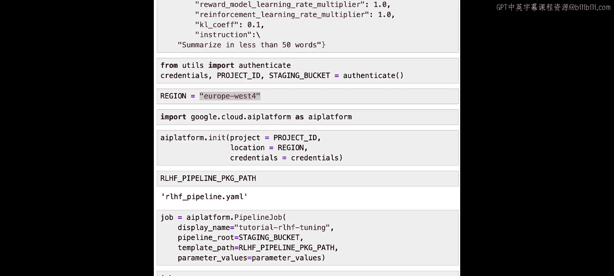

# 004：使用 RLHF 微调大语言模型 🚀



在本节课中，我们将学习如何启动完整的 RLHF 工作流，使用 Google Cloud 的 Vertex AI 平台来微调一个大语言模型。我们将介绍如何利用 Vertex AI 管道来封装和自动化 RLHF 的多个复杂步骤，并详细讲解配置和启动一个 RLHF 调优任务所需的各项参数。

---

## 概述：理解 Vertex AI 管道

上一节我们介绍了 RLHF 的基本概念和数据准备。本节中，我们来看看如何将这些组件整合到一个可执行的工作流中。

在 Vertex AI 上，RLHF 调优任务以 **Vertex AI 管道** 的形式运行。机器学习管道是基于容器的、可移植且可扩展的工作流。你的工作流中的每一步，例如准备数据集、训练模型、评估模型，都是管道中的一个组件。

正如我们讨论过的，RLHF 由许多不同的步骤组成，涉及多个数据集和模型。管道是一种将这些步骤封装到单个对象中的便捷方式，有助于自动化和复现你的机器学习工作流。

你不需要自己编写管道，我们将使用一个现成的管道。为了更具体地理解，下图展示了一个基础的机器学习管道：


*   **橙色方框** 是你的机器学习工作流中的组件或步骤，这里会执行一些代码。
*   **蓝色方框** 是这些组件产生的 **工件**。工件指的是在机器学习工作流步骤中创建的任何东西，例如数据、训练好的模型和一些评估指标。

运行这个管道时，首先执行“创建数据”步骤，产生数据（深蓝色框）。然后这些数据被用于“训练模型”步骤，输出一个训练好的模型和一些评估其性能的指标。

一个 RLHF 管道则更为复杂，可能如下图所示：



我们首先创建一个偏好数据集。该数据集用于训练奖励模型。然后，奖励模型与提示数据一起，通过强化学习来微调基础大语言模型。最终，我们得到一个微调后的大语言模型和一些输出的训练曲线。

实际上，我们将要执行的管道包含更多步骤。这个 RLHF 管道存在于 Google Cloud 管道组件开源库中。要运行它，你需要先导入、编译，然后执行。

---

## 准备环境与导入管道

首先，我们需要确保安装了必要的库。在你的环境中，你需要运行：
```bash
pip install google-cloud-pipeline-components
```
同时确保安装了 Kubeflow Pipelines 库 (`kfp`)。本课程环境已为你预先安装好。

以下是导入和编译管道的步骤：

1.  **导入管道**：我们从 `google_cloud_pipeline_components` 库中导入 RLHF 管道。请注意，RLHF 目前处于预览阶段，因此管道位于 `preview` 文件夹下。
    ```python
    from google_cloud_pipeline_components.preview.llm import rlhf_pipeline
    ```

2.  **导入编译器**：该管道使用 Kubeflow Pipelines 库编写，因此我们需要导入其编译器。
    ```python
    from kfp import compiler
    ```

3.  **编译管道为 YAML 文件**：编译过程会创建一个 YAML 文件，其中包含了执行管道所需的所有信息。
    ```python
    # 定义 YAML 文件路径
    rlhf_pipeline_package_path = “rlhf_pipeline.yaml”
    # 编译管道
    compiler.Compiler().compile(
        pipeline_func=rlhf_pipeline,
        package_path=rlhf_pipeline_package_path
    )
    ```
    生成的 YAML 文件非常长，它用自然语言详细描述了整个管道，包括名称、描述和所有输入参数。

---

## 探索 RLHF 管道结构

Vertex AI 提供了一个可视化工具来查看管道的所有组件。我们将要执行的 RLHF 管道结构如下图所示（整体视图可能较复杂）：



我们可以放大管道的特定部分（例如右侧），其结构如下：



*   **组件**：带有蓝色立方体的方框，代表执行代码的步骤。例如，“奖励模型训练器”组件负责训练奖励模型，“强化器”组件是微调基础大语言模型的强化学习循环。
*   **工件**：带有黄色三角形的方框，代表管道运行产生的任何输出。例如，“奖励模型训练器”组件会输出一些指标，保存在“TensorBoard 指标”工件中。

这个管道看起来相当复杂，但它已经由 Vertex AI 团队编写并针对平台和 RLHF 进行了优化。YAML 文件是自动生成的，你通常不需要编辑它，直接使用即可。

---

## 配置 RLHF 管道参数

现在我们已经有了 YAML 文件，可以定义一个 Vertex AI 管道作业了。这需要传入 YAML 文件以及针对我们具体用例的所有参数。

首先，我们创建一个参数字典 `parameter_values`。以下是需要逐一查看的关键参数：

### 1. 数据集路径
以下是三个数据集的路径参数。所有数据都必须存储在 **Google Cloud Storage** 中，并且是 **JSON Lines 格式**。路径以 `gs://` 开头。
*   `preference_dataset_uri`: 偏好数据集的路径。
*   `prompt_dataset_uri`: 提示数据集的路径。
*   `evaluation_dataset_uri`: （可选）评估数据集的路径。调优完成后，将使用此数据执行批量推理任务。

Cloud Storage 使用 **存储桶** 来组织数据。在本例中，数据已预先上传到一个公开可访问的存储桶中。对于你自己的项目，你需要将数据上传到自己的存储桶。

### 2. 基础模型选择
*   `large_model_reference`: 指定要微调的基础大语言模型。本例中使用开源的 **Llama 2** 模型 (`“llama-2-7b”`)。其他支持的模型包括 `“text-bison”` 和 T5x 系列模型。

### 3. 训练步数
*   `reward_model_train_steps`: 训练奖励模型的步数。这取决于你的偏好数据集大小。根据实验，模型最好在偏好数据上训练约 **20 到 30 个周期** 以获得最佳结果。
*   `reinforcement_learning_train_steps`: 执行强化学习微调的步数。这取决于你的提示数据集大小。根据实验，模型最好在提示数据上训练约 **10 到 20 个周期**。

**注意**：参数接收的是步数，而非周期数。以下是一个将周期转换为步数的实用启发式方法：
```python
import math

# 假设你的数据集大小和批次大小
data_size = 128  # 可以是偏好数据或提示数据的大小
batch_size = 64   # RLHF on Vertex AI 使用固定的批次大小

# 计算每个周期的步数
steps_per_epoch = math.ceil(data_size / batch_size)  # 例如：128 / 64 = 2

# 设定你想训练的周期数
num_epochs = 10

# 计算所需的总训练步数
total_training_steps = steps_per_epoch * num_epochs  # 例如：2 * 10 = 20
```
你可以根据自己数据集的大小，使用上述方法计算 `reward_model_train_steps` 和 `reinforcement_learning_train_steps`。

### 4. 学习率与 KL 系数
这些是更高级的参数，初次尝试时可以使用默认值。
*   `reward_model_learning_rate_multiplier` 和 `reinforcement_learning_rate_multiplier`: 用于在训练奖励模型或强化学习循环时调整基础学习率的常数。默认值为 `1.0`。
    *   乘以大于 1 的数会增加每次训练步骤中梯度更新的幅度。
    *   乘以小于 1 的数会减小更新的幅度。
*   `kl_coeff`: **KL 散度系数**，是一个正则化项，有助于防止 **奖励黑客** 问题。默认值为 `0.1`。
    *   奖励黑客是指模型学会生成能获得奖励模型高分、但对人类无意义的输出（例如堆砌正面词汇）。
    *   KL 系数通过惩罚微调模型与原始基础模型分布差异过大的情况来防止这一点。
    *   系数设为 `0` 表示没有惩罚。系数越大，对偏离原始模型的惩罚越重。

### 5. 任务指令
*   `instruction`: 让模型知道需要执行什么任务的文本。例如，`“Summarize in less than 50 words”`。
    *   此文本将被预置到你的数据集（偏好和提示数据集）中的每个提示前。
    *   **仅当** 你的数据集中尚未包含指令时才需要设置此参数。

---

## 认证、初始化与运行作业

配置好所有参数后，我们准备创建并运行管道作业。这意味着 RLHF 管道将在 Vertex AI 的云端服务器上执行，而不是在本地笔记本中。

1.  **认证与初始化**：首先需要向 Google Cloud 认证并初始化 Vertex AI Python SDK。本课程已为你完成设置。
    ```python
    # 导入自定义认证函数（课程环境已提供）
    from utils import authenticate
    credentials, PROJECT_ID, STAGING_BUCKET = authenticate()
    REGION = “europe-west4”  # RLHF 管道在此区域可用
    ```
2.  **初始化 AI Platform**：
    ```python
    import vertexai
    vertexai.init(project=PROJECT_ID, location=REGION, credentials=credentials)
    ```
3.  **创建管道作业**：
    ```python
    from google.cloud import aiplatform
    job = aiplatform.PipelineJob(
        display_name=“tutorial_rlhf_tuning”,  # 作业显示名称
        template_path=rlhf_pipeline_package_path,  # 之前编译的 YAML 文件路径
        parameter_values=parameter_values,  # 我们定义的参数字典
        pipeline_root=STAGING_BUCKET  # 存储管道输出工件的存储桶
    )
    ```
4.  **运行作业**：
    ```python
    job.run()
    ```
    **请注意**：运行此作业需要数小时甚至更长时间，并消耗大量计算资源。出于在线课堂的考虑，我们不会实际运行它。在下一课中，我们将查看一个已执行完毕的管道的结果。

---

## 总结


本节课中，我们一起学习了如何配置和启动一个完整的 RLHF 微调管道。我们介绍了 Vertex AI 管道如何封装复杂的多步骤工作流，详细讲解了配置管道所需的关键参数，包括数据集路径、模型选择、训练步数、学习率调整、KL 系数以及任务指令。最后，我们了解了如何通过 Vertex AI SDK 认证、初始化和提交管道作业。虽然实际运行作业耗时较长，但下一课我们将分析一个已完成作业的输出结果，以评估 RLHF 微调的效果。